# LeetCode 刷题笔记

@Aiken 2021;

汇总LeetCode刷题以及刷《剑指offer》过程中遇到的一些不会做的题或者启发性很强的题目等等；内容主要以以下几个方面为主：

- 题目-题解-相关注释；
  - 相关难点分析；
- 相关知识点索引
  同时copy到数据结构或者c++的文档中）

## 《Fuck Algorithm》

针对各个专题指向性的去刷一些Leetcode中的题目，通过对这些题目进行分析整合来对巩固各个知识点，这一部分的代码整合到/leecode文件夹中，但是主要可能整合在md中；

- 这里可以顺便把git的内容整理一下，本地的git操作流程
- 最近先把数据结构刷了，变刷变看后面的搜索等等的内容，一部分一部分的往后看
- 第一课中回溯和其他规划的题还没看，后续再看看
- 思考C++中多返回值的设计

### 数据结构的存储方式

[**数据结构的存储方式**](https://labuladong.github.io/algo/%E7%AE%97%E6%B3%95%E6%80%9D%E7%BB%B4%E7%B3%BB%E5%88%97/%E5%AD%A6%E4%B9%A0%E6%95%B0%E6%8D%AE%E7%BB%93%E6%9E%84%E5%92%8C%E7%AE%97%E6%B3%95%E7%9A%84%E9%AB%98%E6%95%88%E6%96%B9%E6%B3%95.html)（物理层面的存储方式）：数组（顺序存储）和链表（链式存储）。
最底层的存储架构上基本上只有这两种实现的方式，更高维的才是：栈、队列、堆、树、图这些高层结构；

而这些实现的高层实现上，分别使用量中架构有啥优缺点：

> 综上，数据结构种类很多，甚至你也可以发明自己的数据结构，但是底层存储无非数组或者链表，**二者的优缺点如下**：
>
> **数组**由于是紧凑连续存储,可以随机访问，通过索引快速找到对应元素，而且相对节约存储空间。但正因为连续存储，内存空间必须一次性分配够，所以说数组如果要扩容，需要重新分配一块更大的空间，再把数据全部复制过去，时间复杂度 O(N)；而且你如果想在数组中间进行插入和删除，每次必须搬移后面的所有数据以保持连续，时间复杂度 O(N)。
>
> **链表**因为元素不连续，而是靠指针指向下一个元素的位置，所以不存在数组的扩容问题；如果知道某一元素的前驱和后驱，操作指针即可删除该元素或者插入新元素，时间复杂度 O(1)。但是正因为存储空间不连续，你无法根据一个索引算出对应元素的地址，所以不能随机访问；而且由于每个元素必须存储指向前后元素位置的指针，会消耗相对更多的储存空间。

### 二分查找专题

由于我经常写错二分查找的边界判断条件，所以这里进行一个整理操作：

[二分查找总结专题](https://mp.weixin.qq.com/s?__biz=MzAxODQxMDM0Mw==&mid=2247485044&idx=1&sn=e6b95782141c17abe206bfe2323a4226&chksm=9bd7f87caca0716aa5add0ddddce0bfe06f1f878aafb35113644ebf0cf0bfe51659da1c1b733&scene=21#wechat_redirect)  后续整理的时候在进行阅读一下，加深一下理解

其中需要注意的是：

- 我们使用 left+(right-left) /2 来代替 (l+r)/2 ,因为这样的话可以防止right和left太大溢出的操作；
- mid +- 1 以及最终的返回条件 <= 还是小于

我们分情况来讨论：

求的是特定值，求的是左右的边界值的时候，

```cpp
int binary_search(int[] nums, int target) {
    int left = 0, right = nums.length - 1; 
    while(left <= right) {
        int mid = left + (right - left) / 2;
        if (nums[mid] < target) {
            left = mid + 1;
        } else if (nums[mid] > target) {
            right = mid - 1; 
        } else if(nums[mid] == target) {
            // 直接返回
            return mid;
        }
    }
    // 直接返回
    return -1;
}

int left_bound(int[] nums, int target) {
    int left = 0, right = nums.length - 1;
    while (left <= right) {
        int mid = left + (right - left) / 2;
        if (nums[mid] < target) {
            left = mid + 1;
        } else if (nums[mid] > target) {
            right = mid - 1;
        } else if (nums[mid] == target) {
            // 别返回，锁定左侧边界
            right = mid - 1;
        }
    }
    // 最后要检查 left 越界的情况
    if (left >= nums.length || nums[left] != target)
        return -1;
    return left;
}


int right_bound(int[] nums, int target) {
    int left = 0, right = nums.length - 1;
    while (left <= right) {
        int mid = left + (right - left) / 2;
        if (nums[mid] < target) {
            left = mid + 1;
        } else if (nums[mid] > target) {
            right = mid - 1;
        } else if (nums[mid] == target) {
            // 别返回，锁定右侧边界
            left = mid + 1;
        }
    }
    // 最后要检查 right 越界的情况
    if (right < 0 || nums[right] != target)
        return -1;
    return right;
}
```


### 数据结构的基本操作

所有数据结构的基本操作一般都局限在 **遍历+访问**，更具体一点就是：**增删改查**；

数据结构存在的目的就在于尽可能快的**增删改查**：

遍历的基本操作一般来说也就两种形式：**线性**和**非线性**情况，基本的遍历框架可以总结为

#### 线性遍历：

线性就是 for/while 迭代为代表，经典的就是数组遍历框架；

```c++
void traverse(cosnt int[]& arr){
    for(int i=0;i<arr.length;i++)
        // visit();
}
```

#### 非线性遍历：

链表遍历框架，兼具迭代和递归框架；

```c++
/* 基本的单链表节点 */
class ListNode {
    int val;
    ListNode next;
}

void traverse(ListNode head) {
    for (ListNode p = head; p != null; p = p.next) {
        // 迭代访问 p.val：迭代需要写出我们每个的具体操作
    }
}
// 两种不同的遍历写法👆 👇，具体思路上的区别
void traverse(ListNode head) {
    // 递归访问 head.val
    // 递归是基于我们的n-1假设，只需要实现n-1 到n的转变就行
    traverse(head.next);
}
```

二叉树的情况的话，实际上就是链表的递归情况，然后要针对两侧进行递归就可以了，在多几个分支也是一样的；而也可以拓展成图的遍历，针对图可能出现环的情况就使用flag标记一下就可以了。

```c++
/* 基本的二叉树节点 */
class TreeNode {
    int val;
    TreeNode left, right;
}

void traverse(TreeNode root) {
    // oprtator 前序遍历
    traverse(root.left);
    // oprtator 中序遍历
    traverse(root.right);
    // oprtator 后序遍历
}
```

### 更好的理解数据类型的作用

#### 设计twitter 335

从题目需求出发，更好的理解各种数据结构的使用情景：

- 不需要时序，需要快速搜索的关注列表：Hashset，set，...

- 需要发表的时序，同时需要多个用户推文发表的时间顺序，也涉及到顺序的整合：有序链表

  > 同时考虑一个全局的时间戳来进行比对。（合并k个有序链表）

- 合并k个有序链表：借助优先级队列，设定好优先级队列的优先关系（timestamp），它能够实现自动排序，然后我们讲k个链表插进去，就行。

面向对象设计，针对每个对象的需求来定制需要的数据类型和方法；当然也要考虑基类和子类之间的关系，还有private 和 static的关系。

具体的代码实现后面还是要看一下的，这种比较复杂的类型设计题目。

#### 单调栈模板

实际上就是栈，利用了一些巧妙的规则，使得新元素入栈后，栈内的元素都保持有序（单增或者单减）。Purpose：如何设计这样一个数据结构，同时如何利用这样的数据结构来解题。

##### **496 下一个更大的元素**

**反向写更好，不要执着了，学起来就完事了**

这题我对题意的理解是错误的，下一个更大的元素，不是按照大小排列的，而是按照原本在数组中的顺序排列的，所以我们实际上可以用一个hash映射来做这样的题目，官方题解中队单调栈的讲解更清晰一点，

这个是网址中写的，这样的方法是倒着完成的，基本的概念是差不多的，也就是遍历的顺序和判定的条件稍微变换了一下：

```cpp
vector<int> nextGreaterElement(vector<int>& nums) {
    vector<int> res(nums.size()); // 存放答案的数组
    stack<int> s;
    // 倒着往栈里放
    for (int i = nums.size() - 1; i >= 0; i--) {
        // 判定个子高矮
        while (!s.empty() && s.top() <= nums[i]) {
            // 矮个起开，反正也被挡着了。。。
            s.pop();
        }
        // nums[i] 身后的 next great number
        res[i] = s.empty() ? -1 : s.top();
        // 
        s.push(nums[i]);
    }
    return res;
}
```

下面这个是我写的，我是正向执行的。

```cpp
class Solution {
public:
    vector<int> nextGreaterElement(vector<int>& nums1, vector<int>& nums2) {
        int n = nums2.size();
        unordered_map<int,int>orderh; // 这个没有长度初始化这种说法的
        stack<int> temps;
        vector<int> res; // 只初始化长度的话，会初始化为0；
        temps.push(nums2[0]);
        // 当遇到比原本的大的时候，我们就直接弹出，直到里面的都比他大
        for(int i =1; i<n; i++){
            while(!temps.empty() && nums2[i]>temps.top()){
                orderh[temps.top()] = nums2[i];
                temps.pop();
            }
            temps.push(nums2[i]);
        }
        // 对于剩下来的哪些元素，就赋值为-1
        while(!temps.empty()){
            orderh[temps.top()] = -1;
            temps.pop();
        }
        // 添加进最终的结果。
        for(int num: nums1){
            res.push_back(orderh[num]);
        }
        return res;

    }
};
```

##### 问题变形，1118等待多少天

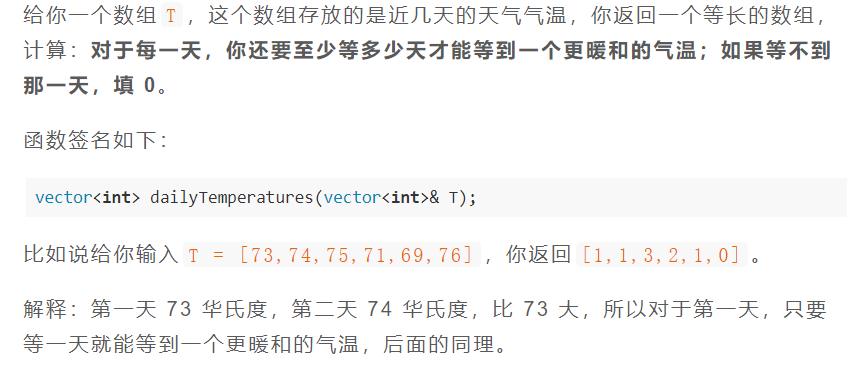

这一题，求间隔，我们就讲放入stack的值变成相应的index，然后根据index去索引值来对比，然后通过，相似的操作去求解，但是我们当然也可以反向的进行操作，因为我们现在的num1和num2是相等的，我们就没必要建立hash去索引求解，只需要直接输出答案即可。

- 可以像上一题我的写法一样，只需要修改存入stack的值就可以；
- 也可以反向进行，如下：

```cpp
vector<int> dailyTemperatures(vector<int>& T) {
    vector<int> res(T.size());
    // 这里放元素索引，而不是元素
    stack<int> s; 
    /* 单调栈模板 */
    for (int i = T.size() - 1; i >= 0; i--) {
        while (!s.empty() && T[s.top()] <= T[i]) {
            s.pop();
        }
        // 得到索引间距
        res[i] = s.empty() ? 0 : (s.top() - i); 
        // 将索引入栈，而不是元素
        s.push(i); 
    }
    return res;
}
```

反正基本思想都是让stack里存放的值从大到小，如果违反了就pop到符合位置。

##### 503 下一个更大的元素2

如何处理环形数组：也就是他能绕一圈的，进行操作的。

- 使用**取余**来得到相应的环形特性，但是我们其中已经存在的答案怎么fix呢？

- 也可以使用**双倍长度**的解法,构建或者不构建新数组。

一般的通过取余获得环形特效的代码模板：

```cpp
int[] arr = {1,2,3,4,5};
int n = arr.length, index = 0;
while (true) {
    print(arr[index % n]);
    index++;
}
```

具体实现：通过取余来模拟双倍长度，但是这样的作法，实际上还是进行了重复的计算吧？正向的写也没问题

```cpp
class Solution {
public:
    vector<int> nextGreaterElements(vector<int>& nums) {
        int n = nums.size();
        vector<int> res(n);
        stack<int> s;
        // 假装这个数组长度翻倍了
        for (int i = 2 * n - 1; i >= 0; i--) {
            // 索引要求模，其他的和模板一样
            while (!s.empty() && s.top() <= nums[i % n])
                s.pop();
            res[i % n] = s.empty() ? -1 : s.top();
            s.push(nums[i % n]);
        }
        return res;
    }
};
```

##### 删除数组中的重复元素316 1081

这一题实际上还是用单调栈的思路，让里面的顺序尽量是按照从小到大排，就是增加了约束，也就是：

- 里面已经有的我们就直接过；
- 后面没有再出现的情况我们也直接过；
- 如果是比里面的大就直接加进去，如果是比里面的小，我们就pop到直接过的时候再加
- 需要两个辅助的存放判断的辅助情况

```cpp
class Solution {
public:
    string removeDuplicateLetters(string s) {
        if(s.empty()) return {};
        // 初始化需要的存储数据结构
        vector<int> countAl(256,0); 
        vector<bool> countSt(256,false);
        stack<int> store;
        // 初始化count数组
        for(auto t: s){
            countAl[t]++;
        }
        for(char c: s){
            countAl[c]--;
            if(countSt[c]) continue;
            while(!store.empty() && store.top()>c){
                // 如果top后面没有了
                if(countAl[store.top()]==0)
                    break;
                // 如果还有就pop
                countSt[store.top()] = false;
                store.pop();
            }
            store.push(c);
            countSt[c] = true;
        }
        // 对stack中的字符进行反转然后输出
        string res;
        stack<char> temp;
        while(!store.empty()){
            temp.push(store.top());
            store.pop();
        }
        while(!temp.empty()){
            res.push_back(temp.top());
            temp.pop();
        }
        return res;
    }
};
```


#### 单调队列

存进index，然后根据index取值来做判断

实际上就是和上面一样的思路，剑指offer的队列中的最大值，用一个deque双向队列实现，刚好是剑指offer59题。维护一个头部是最大值的队列，后续的加入的时候，将前边比他小的都pop出去，再push，然后每次移动要把头pop出去。

[FA讲解的，结合offer理解更妙](https://mp.weixin.qq.com/s?__biz=MzAxODQxMDM0Mw==&mid=2247488087&idx=1&sn=673aa4e8deb942b951948650928c336e&chksm=9bd7ec5faca06549ba6176540fef04f93c1c9f55b303106688b894a2029e00b8cce1a9ba57a4&scene=21#wechat_redirect)

#### 二叉堆实现优先队列

实际上就是用数组维护的一个类似的二叉树，然后要保有最大堆或者最小堆的性质，数组的子节点可以很容易的通过*2来获取：
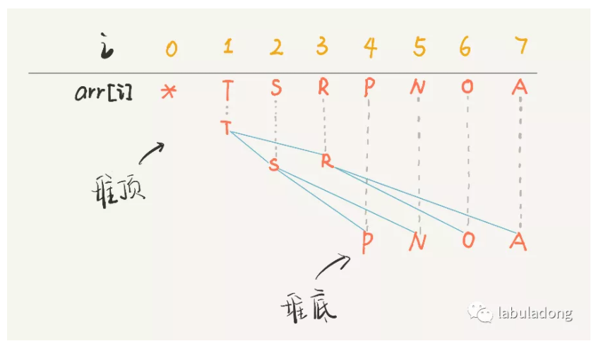

然后为了维护最大堆或者最小堆的操作，我们需要有一个`上浮``下沉`两个操作来维护最大堆的性质，实际上也比较简单。就是

- 上浮：当父节点小于当前节点的时候就不断向上换
- 下沉：下面更大的哪个和父节点换。

通过这两个操作来实现删除和添加的维护：

- insert：添加到底部不断上浮即可
- delete：将堆顶元素和堆底元素互换，（1，N）然后将堆顶的元素不断的下沉到正确的地方即可

这些操作都是二分的时间复杂度。

#### hash和数组实现O(1)插入删除和随机数

通常理解的情况下我们需要依靠hash来实现O(1)的搜索和插入删除，但是，这样的话，我们没法等概率的取出随机数，我们认为需要借助index，产生一个随机的数字来索引，但是这样，我们就需要借助vector，那如何通过底层的vector来进行删除？

使用hash来存储index，然后通过swap和pop来O(1)的删除，然后调用rand()和%来产生随机数即可。

```cpp
class RandomizedSet {
public:
    // 存储元素的值
    vector<int> nums;
    // 记录每个元素对应在 nums 中的索引
    unordered_map<int,int> valToIndex;

    bool insert(int val) {
        // 若 val 已存在，不用再插入
        if (valToIndex.count(val)) {
            return false;
        }
        // 若 val 不存在，插入到 nums 尾部，
        // 并记录 val 对应的索引值
        valToIndex[val] = nums.size();
        nums.push_back(val);
        return true;
    }

    bool remove(int val) {
        // 若 val 不存在，不用再删除
        if (!valToIndex.count(val)) {
            return false;
        }
        // 先拿到 val 的索引
        int index = valToIndex[val];
        // 将最后一个元素对应的索引修改为 index
        valToIndex[nums.back()] = index;
        // 交换 val 和最后一个元素
        swap(nums[index], nums.back());
        // 在数组中删除元素 val
        nums.pop_back();
        // 删除元素 val 对应的索引
        valToIndex.erase(val);
        return true;
    }

    int getRandom() {
        // 随机获取 nums 中的一个元素
        return nums[rand() % nums.size()];
    }
};
```

**进阶问题**

排除黑名单数字来产生随机数，这样我们只需要将黑名单里的数字移动到数组的末尾再产生随机数就可以了，但是有两个需要注意的地方：

- 黑名单里的数字本来就在末尾
- 交换的时候黑名单的数字和黑名单里的数字交换了，（实际上他通过限定次数的交换是没有问题的，按顺序还过去就好）

```cpp
 跳过尾部的黑名单缩影的问题
int last = N - 1;
        for (int b : blacklist) {
            // 如果 b 已经在区间 [sz, N)
            // 可以直接忽略
            if (b >= sz) {
                continue;
            }
            while (mapping.count(last)) {
                last--;
            }
            mapping[b] = last;
            last--;
        }
```


### 链表刷题

主要还是和二叉树一样，熟悉一个递归实现的问题；

一些总结：双边约束的情况下好像使用迭代写起来比递归好写多了；

**反转链表（206）：**

:stadium:迭代的分析思路：基于n-1的假设，我们可以将n-1已完成的情况，当前在n的情况画出来，或者想象出来来分析怎么解题。

> 1. 注意对head非空的判断要在head next的前面
> 2. 不要临时临时变量，先把题做出来在做简化，（双指针指示法，一个指向前一个一个指向当前一个）

进阶一点的问题：

#### 递归反转链表的一部分（92）

铺垫任务：反转链表的前N个节点

具体的区别：

1. 1 base case 变为 `n == 1`，反转一个元素，就是它本身，同时**要记录后驱节点**。

2. 刚才我们直接把 `head.next` 设置为 null，因为整个链表反转后原来的 `head` 变成了整个链表的最后一个节点。但现在 `head` 节点在递归反转之后不一定是最后一个节点了，所以要记录后驱 `successor`（第 n + 1 个节点），反转之后将 `head` 连接上

   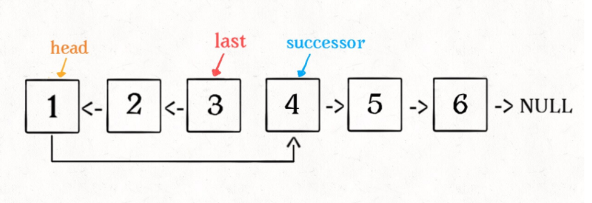

3. 注意这里tail的设置，理解透

```c++
ListNode successor = null; // 后驱节点

// 反转以 head 为起点的 n 个节点，返回新的头结点
ListNode reverseN(ListNode head, int n) {
    if (n == 1) { 
        // 记录第 n + 1 个节点
        successor = head.next;
        return head;  // 这里也很重要！只有一个的时候return啥。
    }
    // 以 head.next 为起点，需要反转前 n - 1 个节点
    ListNode last = reverseN(head.next, n - 1);

    head.next.next = head;
    // 让反转之后的 head 节点和后面的节点连起来
    head.next = successor;
    return last;
}
```

**最终实现部分：**

:question: 但是这样的方法最终的实现效率并不高有时间的话可以去看看题解中的其他的迭代思想方式；时不时回来刷一刷这两三道题，来加强一下对于递归思想的理解。

```c++
 */
class Solution 
{
private:
    ListNode* last = nullptr;
public:
    ListNode* reverseBetween(ListNode* head, int m, int n) {
        if (m == 1)
        {
            return reverseN(head, n);
        }
        head->next = reverseBetween(head->next, m - 1, n - 1);
        // 这里，return head和递归之间的关系要掌握好，从变换的阈值开始分析，比较传入值和return值就知道了
        return head;
    }
    ListNode* reverseN(ListNode* head, int n)
    {
        if (n == 1)
        {
            last = head->next;
            return head;
        }
        ListNode* tail = reverseN(head->next, n - 1);
        head->next->next = head;
        head->next = last;
        return tail;
    }
};
```

#### 如何k个一组反转链表（25）

使用迭代+递归的方式编写，迭代进行反转，递归进行组合排序（外层架构）,**这种双边约束的好像使用迭代的方式比递归更好写一些**，而且这样的时间复杂度好像甚至更低把。和上面的对比一下就知道了。

```c++
class Solution {
public:
    ListNode* reverseKGroup(ListNode* head, int k) {
        ListNode* start, *end;
        start = end = head;
        for (int i = 0; i<k;i++)
        {
            if(end == nullptr)
                return head;
            end = end->next;
        }
        ListNode* newH = reversek(start,end);
        start->next = reverseKGroup(end,k);
        return newH;
    }
    ListNode* reversek(ListNode* start, ListNode* end)
    {
        ListNode* curr = start; 
        ListNode* prev = nullptr; //最后的赋值再下一行，哪个start.net
        while(curr!=end)
        {
            ListNode* temp = curr;
            curr = curr->next;
            temp->next= prev;
            // curr.next= temp; 多做了一部，我们只做到当前curr指向的点就行
            prev = temp; 
        }
        return prev;
    }
};
```

#### 判断回文链表（234）

判断是不是回文数的话，首先需要考虑两种基本情况：

1. 数值的回文数考虑奇数偶数长度的问题（**中心节点不统一**）；

2. string类型的回文数的情况，考虑的是正着读和反着读是一样的，不考虑中心节点好像；（使用**双指针技巧**，正向和反向遍历，这实际上也算是一种reverse的问题把）

   > 不考虑中心节点实际上是从两侧同时逼近的话，只要在left<right的时候执行判断就可以了，这样的话，无论中心是一个数字还是两个数字都会被考虑进去，所以这种**中心逼近的思想**应该还更好一点

寻找回文数的基本中心思想是：**从中心向两端拓展**（反过来就是递归思想）

而对于链表问题：链表是一个**单向索引的**数据结构，这种情况下怎么使用双指针的办法？

1. 遍历的同时存储一个反转副本，然后判断两个链表是否相同？

2. 使用**二叉树的后序遍历**的思想，也能倒序的遍历链表，来进行回文数判断

   > 实际上就是基本的递归思想把；同时我们知道树结构其实也就是依托于LISTNode的高层实现，每个树的节点都是链表的节点来着。但是这样的方法目前来看算法的效率不是特别的高。

```c++
时间和空间复杂度都是O（n）
    后续需要对这个方法进行优化
使用后续遍历的迭代思想进行的例子;
实现上的核心问题：我们虽然可以通过后序遍历来首先取到链表的tail;
但是我们如何让最底层的取到的也是最前面的head呢？（需要另一一个共有head）;
class Solution {
public:
    ListNode* head;
    bool isPalindrome(ListNode* head) {
        this->head = head;
        return reverseJ(head);
    }
    bool reverseJ(ListNode* tail){
        // 我们虽然可以通过后序遍历来首先取到链表的tail
        // 但是我们如何让最底层的取到的也是最前面的head呢？（需要另一一个共有head）
        if (tail == nullptr)
            return true;
        bool ans = reverseJ(tail->next);
        ans = ans && (this->head->val == tail->val);
        this->head = this->head->next;
        return ans;
    }
};

```

如何优化上面的这个算法，减少这个不必要的入栈的空间复杂度，这就涉及到了如何用两个指针来模拟反向遍历的问题：这是一个特别的算法，我们放到下面一个小专题中来详细讲：

#### 快慢指针技巧优化空间复杂度

双指针技巧1：快慢指针**找到链表的中点**，原理如图所示，

这个方法的时间复杂度是O（n），空间复杂度是O（1）；

Keypoint->找到链表的中点。

```c++
ListNode* slow, *fast;
slow = fast = head;
while (fast != nullptr && fast->next != nullptr) {
    slow = slow->next;
    fast = fast->next->next;
}
if (fast != nullptr)
    slow = slow->next;
// slow 指针现在指向链表中点
```

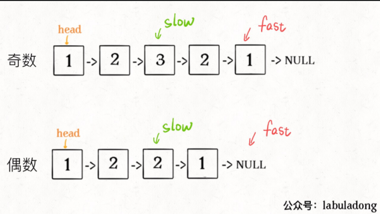

- 如果fast不是nullptr，说明链表的长度为奇数，slow还需要往后进行一步，现在是卡在中间的地方

  ```c++
  if(fast != nullptr)
  	slow = slow->next;
  ```

- 接下来就不需要多说了把，直接递归进行后续的链表反转，然后正向运行JUDGE就可以了

  ```c++
  class Solution {
  public:
      ListNode* reverseList(ListNode* head) {
          ListNode* prev = nullptr;
          ListNode* curr = head;
          while (curr)
          {
              ListNode* temp = curr;
              curr = curr->next;
              temp->next = prev;
              prev = temp;
          }
          return prev;
      }
  };
  ```

- JUDGE:

  ```c++
  ListNode* left = head;
  ListNode* right = reverse(slow);
  
  while (right != nullptr) {
      if (left->val != right->val)
          return false;
      left = left->next;
      right = right->next;
  }
  return true;
  ```

  

### 二叉树刷题

- 很多二叉树的问题实际上就是上述总结的二叉树遍历的问题，可以套用以上的框架解决。

- 而且二叉树实际上和很多重要的算法都有关系：比如说**快速排序就是二叉树的前序遍历**；**归并排序就是二叉树的后续遍历**。


#### 二叉树中的最大路径和（142）

路径 被定义为一条从树中任意节点出发，沿父节点-子节点连接，达到任意节点的序列。该路径 至少包含一个 节点，且不一定经过根节点。

路径和 是路径中各节点值的总和。

给你一个二叉树的根节点 root ，返回其 最大路径和 。

**解题的思路：**

- 注意区分return和最终结果值的区别
- 由于考虑到节点为negative的情况，这种情况下就需要设定两个值：
  - 一个是经过当前节点的话，最多能得到多少（动态规划，从后往前）
    - 用max来考虑当前节点接不接如（用0来代替）
  - 另一个是最终的最大值
- 对于每个节点
  - return：**这个节点，后面能取得得最大值**；
  - ans：**结合这个节点的左右child**，能取得的最大值？，为什么一定要加入当前节点的值？因为不加入当前节点的值的话，就是看哪个子节点最大了（子节点已经考虑了0的情况，也就是用max做了处理。）
- 这实际上还是递归遍历的框架，最重要的在于问题归纳，怎么对左右节点进行处理和怎么对中间节点进行是否引入的判断；

```c++
//* Definition for a binary tree node.
class Solution {
private:
    int ans = INT_MIN;
public:
    int maxPathSum(TreeNode* root) {
        helpSum(root);
        return ans;
    }
    int helpSum(TreeNode* root)
    {
        if (root == nullptr)
            return 0;
        // 考虑negative的情况；用0来判断是否要输入
        int rightG = max(helpSum(root->right), 0);
        int leftG = max(helpSum(root->left), 0);
        // 不经过该节点的情况已经在子节点的地方输出了，不需要我自己画蛇添足的在这里进行政府的判断；
        // 从最低层节点开始分析你就知道了，已经包含在ans中了
        int temp = root->val + rightG + leftG;
        ans = max(temp,ans);
        // 最终都是复数的情况？可能还要考虑temp和val哪个更小的问题
        return max(rightG,leftG) + root->val;
    }
};
```

#### 基于前序和中序重建二叉树（105）

和剑指的题目冲突了，06，看书即可；后续和前序的应该关系差不多

基于前序找到中间切分点，然后根据中间接分店找到左子树和右子树的数目，从前序和中序中抠出子树来。

```c++
class Solution 
{
public:
    TreeNode* buildTree(vector<int>& preorder, vector<int>& inorder) 
    {
        // int tempre[preorder.size()];
        // 函数，返回一个迭代器
        return helpbuild(preorder.begin(),preorder.end(),inorder.begin(),inorder.end());
    }
    // 学，给老子学，怎么在c++中实现动态数组的划分传入，如果是python可太爽了；
    TreeNode* helpbuild(vector<int>::iterator preb, vector<int>:: prend, \
        vector<int>::iterator inob, vector<int>::iterator inoe)
    {
        if(inob == inoe)
            return nullptr;
        TreeNode* cur = new TreeNode(*preb);
        // 记住这个函数find，返回的是一个迭代器，迭代器本身就是一个指针，指针的+1会随着类型的不同而变化
        auto root = std::find(inob,inoe,*preb);
        cur->left = helpbuild(preb+1,preb+(root-inob)+1,inob,root);
        cur->right = helpbuild(preb+(root-inob)+1,prend,root+1,inoe);

        return cur;
    }
};
```

基于FA中的算法复原一下？等下思想好像是一样的就是一个前序遍历的过程。

#### 基于中序和后序重建二叉树（106）

和上一题基本的实现思想采用了一样的思路，但是这样的方法的空间复杂度好像和网友们查了很多我也不知道具体是为啥，看看fA中间的解法把，以下先post我的思路；

```c++
class Solution {
public:
    TreeNode* buildTree(vector<int>& inorder, vector<int>& postorder) {
        return helpbuild(inorder.begin(),inorder.end(),postorder.begin(),postorder.end());

    }
    TreeNode* helpbuild(vector<int>::iterator ins,vector<int>::iterator ine,
                        vector<int>::iterator pos, vector<int>::iterator poe)
    {
        if(poe == pos)
            return nullptr;
        // 这里要注意的是end是有值的下一项
        // iterator 之间的加减和index之间的加减的关系的转化也要清楚到底是怎么回事
        poe--;
        TreeNode* cur = new TreeNode(*poe);
        auto root = find(ins,ine,*poe);
        cur->left = helpbuild(ins,root,pos,poe-(ine-root-1));
        cur->right = helpbuild(root+1,ine,poe-(ine-root-1),poe);
        return cur;

    }
};
```

下面是[FA的实现思路](https://mp.weixin.qq.com/s?__biz=MzAxODQxMDM0Mw==&mid=2247487270&idx=1&sn=2f7ad74aabc88b53d94012ceccbe51be&chksm=9bd7f12eaca078384733168971147866c140496cb257946f8170f05e46d16099f3eef98d39d9&scene=21#wechat_redirect)：(need to change cpp version)实际上没什么区别，但是就是在++--这块好像确实直接用下标索引会好一点，在找找把。

```c++
TreeNode build(int[] inorder, int inStart, int inEnd,
               int[] postorder, int postStart, int postEnd) {

    if (inStart > inEnd) {
        return null;
    }
    // root 节点对应的值就是后序遍历数组的最后一个元素
    int rootVal = postorder[postEnd];
    // rootVal 在中序遍历数组中的索引
    int index = 0;
    for (int i = inStart; i <= inEnd; i++) {
        if (inorder[i] == rootVal) {
            index = i;
            break;
        }
    }
    // 左子树的节点个数
    int leftSize = index - inStart;
    TreeNode root = new TreeNode(rootVal);
    // 递归构造左右子树
    root.left = build(inorder, inStart, index - 1,
                        postorder, postStart, postStart + leftSize - 1);

    root.right = build(inorder, index + 1, inEnd,
                        postorder, postStart + leftSize, postEnd - 1);
    return root;
}
```


#### 翻转二叉树（226）

这题白送的，都不需要再多说什么。

```c++
class Solution {
public:
    TreeNode* invertTree(TreeNode* root) {
        if(root == nullptr)
            return nullptr;
        TreeNode* Temp = root->right;
        root->right = root-> left;
        root->left = Temp;
        invertTree(root->right);
        invertTree(root->left);
        return root;
    }
};
```

#### 填充二叉树节点的右侧指针（116）

这一题也是比较考虑**迭代和递归思想**的，同时也考研**完全二叉树节点的构造特点**知识（从左到右建立起来，全满的）

**我的解决方法**：每次从最左侧节点开始，给下一层赋予连接，然后通过这样的设定迭代的完成这样的任务。

**需要注意的地方**：几个设置为空的判断，包括对于left为空的判断是需要的。

```c++
class Solution {
public:
    Node* connect(Node* root) 
    {
        if(!root)
            return nullptr;
        else
        {
            Node* temptr = root;
            while(root != nullptr){
                // 这一步特别重要也容易忽略
                if(!root->left)
                    return temptr;
                root->left->next = root->right;
                root->right->next = root->next?root->next->left:nullptr;
                root = root->next;
            }
            connect(temptr->left);
            return temptr;
        }
    }
};
```

**FA写的方法**：没有我写的快，但是其实更好理解一点，他是通过辅助函数把传入的两个节点串起来。但是这样调用的消耗也太大了。

模拟的就是第一个节点的情况，把分开的分开处理，然后跨树的节点相连。

这样其实理解起来还难一点，但是主要是一个**无死角覆盖**的问题，和一个跨树的处理的问题，全部归化成第二到第三层的问题。

```c++
class Solution {
public:
    // 主函数
    Node* connect(Node* root) {
        if (root == nullptr) 
            return nullptr;
        connectTwoNode(root->left, root->right);
        return root;
    }

    // 辅助函数
    void connectTwoNode(Node* node1, Node* node2) {
        if (node1 == nullptr || node2 == nullptr) {
            return;
        }
        /**** 前序遍历位置 ****/
        // 将传入的两个节点连接
        node1->next = node2;

        // 连接相同父节点的两个子节点
        connectTwoNode(node1->left, node1->right);
        connectTwoNode(node2->left, node2->right);
        // 连接跨越父节点的两个子节点
        connectTwoNode(node1->right, node2->left);
    }
};
```

#### 二叉树展开为链表（114）

我自己的解法beat 100 99

要注意的是要全部收敛到右侧，解题思路写在下面的代码中，拜读一下自己。

```c++
class Solution {
public:
    void flatten(TreeNode* root) {
        helpflat(root);
    }
    TreeNode* helpflat(TreeNode* root){
        // 递归的终点以及空值判断
        if(!root)
            return nullptr;
        //n-1假设：flaten后续的节点并变到左侧，同时由于后续的接入需求，我们需要return最后一个有值的节点
        TreeNode* lefte = helpflat(root->left);
        TreeNode* righte = helpflat(root->right);
        //加入最后左右都是0的话，我们就return当前节点而不是下一个节点（因为我们需要最后一个元素的索引），这其实也是终值判断
        if(!lefte && !righte)
            return root;
        // 如果只有右边无序处理，算是已经摊开好了
        else if(righte && !lefte)
        {
        }
        //两边都有或者只有左边的情况下，就是把左边的最后一个的下一个接到当前节点的右侧那一路，然后将改节点转移到右侧，最后将左节点清空。返回尾巴，无论是左边还是右边。
        else
        {
            lefte->right = root->right;
            root->right = root->left;

        }
        root->left = nullptr;
        // 返回尾巴，如果有右侧尾巴的话，他就在最后，否则就是左侧尾巴是最后
        return righte?righte:lefte;
    }
};
```

FA的解法和思想：(实际上基本是差不多的)

```c++
// 定义：将以 root 为根的树拉平为链表
void flatten(TreeNode root) {
    // base case
    if (root == null) return;

    flatten(root.left);
    flatten(root.right);

    /**** 后序遍历位置 ****/
    // 1、左右子树已经被拉平成一条链表
    TreeNode left = root.left;
    TreeNode right = root.right;

    // 2、将左子树作为右子树
    root.left = null;
    root.right = left;

    // 3、将原先的右子树接到当前右子树的末端
    TreeNode p = root;
    while (p.right != null) {
        p = p.right;
    }
    p.right = right;
}
```

#### 构建最大二叉树（654）

这里理解上没啥问题，但是实现上有一些奇怪的问题需要分析，后续解决把

- 一个就是最后那个+1，没有弄的话会导致溢出等很严重的问题
- 第二是lvalue的问题还有一个就是为什么使用iterator在这里不太行，后续修改一下试试。
- 还有一个要注意的就是记得用new关键词来构造新的节点，不然return的那个东西最后本身都不存在了还return个几把。

```c++
// FIXME:为什么在这里使用迭代器的方法会出现很多问题，无法进行实现，正确的写法应该是怎么杨的？
// lvalue来初始化一个node我知道不行，但是为什么会是左值呢。
// class Solution {
// public:
//     TreeNode* constructMaximumBinaryTree(vector<int>& nums) {
//         TreeNode* root = helpbuild(nums.begin(),nums.end());
//         return root;
//     }
//     TreeNode* helpbuild(vector){
//         int max= *begin;
//         for(vector<int>::iterator it=begin; it!=end; it++){
//             if(*it>max)
//                 max = *it;
//         }
//         cout<<max<<endl;
//         TreeNode* inner; 
//         inner->val = max;
//         auto next = find(begin,end,max);
//         inner->left = helpbuild(begin,next);
//         inner->right = helpbuild(next+1,end);
//         return inner;

//     }
// };
class Solution{
public:
    TreeNode* constructMaximumBinaryTree(vector<int>& nums) {
        return helpbuild(nums,0,nums.size());
    }
    TreeNode* helpbuild(vector<int>& nums, int begin, int end){
        if(nums.empty() || begin==end)
            return nullptr;
        int maxindex = -1, maxval = INT_MIN;
        for(int i=begin;i<end;i++){
            if (nums[i]>=maxval)
            {
                maxindex = i;
                maxval = nums[i];
            }
        }
        // inner的生存周期问题
        TreeNode* inner = new TreeNode(maxval);
        inner->left = helpbuild(nums,begin,maxindex);
        // 下面这里没有+1的画，会导致一个机器严重的问题，但是我不知道为啥，是溢出了把，永远无法到达终点？
        inner->right = helpbuild(nums,maxindex+1,end);
        return inner;
    }
};
```

#### :star: 寻找重复的子树（652）

[LINK](https://mp.weixin.qq.com/s?__biz=MzAxODQxMDM0Mw==&mid=2247487527&idx=1&sn=9cf2b0d8608ba26ea7c6a5c9b41d05a1&chksm=9bd7ee2faca0673916bf075539bf6fc3c01f3dcc0b298b3f507047692ef5c850ed9cfe82e4e6&scene=21#wechat_redirect) FA参考链接，

这一题的解题思路还是比较有意思的，解题过程中也出现了比较多的问题，还有一些有待解决的问题需要分析。

- 用**后序遍历的序列来表征子树**:可以观察特点，就知道只有后续遍历保留了子树的结构，其他的方式都有一部分是Top-Down的，就不符合子树的要求
- String的方式来寻找重复子树
- int变量如何转换到string，为啥出现了很多问题，还有网友的解决方法对比
- 现在的时空复杂度结果都不太好到网上找一下更好的解决思路和解决的方案；

下面给出一个基本的解法，后续需要进行优化和补充。

```c++
// TODO:这题可以讨论一下python的解法，应该会更简单一点。
// FIXME：这题目前这样的结果十分的差，后序看看其他方法的改进，但是这题的解题思路还是很不错
#include <unordered_map> 
#include <string>
class Solution {
public:
    unordered_map<string,int> memo;
    vector<TreeNode*> res;
    vector<TreeNode*> findDuplicateSubtrees(TreeNode* root) {
        if(!root)
            return {}; // 这个返回值要记得
        traverse(root);
        return res;
    }
    string traverse(TreeNode* root){
        if(!root)
            return "#";
        string left = traverse(root->left);
        string right = traverse(root->right);
        // 得到一个后序遍历的序列，（但是基于这样的序列怎么判断子树一致呢？）
        // FIXME int到string的转换到底怎么做，好疑惑啊。
        char temp = root->val +'0';
        string resstr = left + "," + right+"," + temp;
        // 压入hashmap，通过数值判断重复的root；通过数值判断就知道有没有重复了
        if(memo.count(resstr))
            memo[resstr]++;
        if (memo[resstr]==1)
            res.push_back(root);
        return resstr;
    }
};
```

#### :question: :star:  二叉树的序列化和反序列化（297）

[这题](https://mp.weixin.qq.com/s?__biz=MzAxODQxMDM0Mw==&mid=2247485871&idx=1&sn=bcb24ea8927995b585629a8b9caeed01&chksm=9bd7f7a7aca07eb1b4c330382a4e0b916ef5a82ca48db28908ab16563e28a376b5ca6805bec2&scene=21#wechat_redirect)在解题过程中出现了很多问题和值得探讨的点，**后续一定要进行归纳总结以及二刷。**

**二刷TODO:**

- 层级遍历的思路设计总结
- 各种遍历方式的可行性分析(实现)
- 遍历与数据结构的相对应分析

**问题归纳：**

1. 需要总结一下各种数据类型的空值return方式（也就是空值的表达）

   > string : "" {}
   >
   
2. 相关的各种常见类型之间的转化；

   > string to int : stoi()
   >
   > int to string : to_string()  (需要include)

3. 各个类别中的迭代器实现和类别;

4. 连续append的实现: (`.append().append()`);

5. 切分字符串split方法的实现(思路),以及为什么这里在前序遍历的时候需要选用Queue;

6. 什么类别,什么情况下需要先调用new再执行后续的复制操作(为啥定义的时候不需要,但是这里要new)

7. 有时候append不行但是push_back可以,这是为什么?这个区别是string特有的还是通用的?

8. 编程的format实现,要全部写在类里还是类外.(分析易读性)

**前序遍历的代码实现**

```c++
class Codec {
public:
    // 实际上该问题还是突出一个三种遍历方式的问题；
    // Encodes a tree to a single string.
    string serialize(TreeNode* root) {
        string BTString;
        string SEP = ",";
        string ENDS = "#";
        if(!root){
            BTString.append(ENDS).append(SEP);
            return BTString;
        }
        
        // 前序遍历位置
        // TODO：连续append的表示形式

        BTString.append(to_string(root->val)).append(SEP);
        BTString.append(serialize(root->left)); 
        BTString.append(serialize(root->right)); 
        return BTString;
    }

    // Decodes your encoded data to tree.
    TreeNode* deserialize(string data) {
        // 切分字符串方法 find & substr?
        // 我们在这里需要的是一个先进先出的情况，所以实际上是一个Quene的类别
        // 但是好像实际上for循环也能满足这个问题，但是如果我试图使用递归的话，那我应该还是要用队列
        // 长度不固定的问题
        // FIXME:String的空值的情况
        if(data=="")
            return nullptr;
        // NOTE: 通过循环将布不恒等的数值压入队列
        queue<string> q;
        string Tmpstr;
        for(int i = 0; i<data.length();i++){
            if(data[i]==','){
                q.push(Tmpstr);
                Tmpstr.clear();
            }
            else{
                // FIXME：append就不行但是push_back就可以，为什么？
                Tmpstr.push_back(data[i]);
            }
        }
        return helprebuild(q);
    }
    TreeNode* helprebuild(queue<string>& que);
};
TreeNode* Codec::helprebuild(queue<string>& que)
{
    TreeNode* root;
    // if (que.empty())
    //     return nullptr;
    string str = que.front();
    if(str == "#")
    {
        que.pop();
        return nullptr;
    }
    // FIXME：还没有给这个类别建立一个存储空间
    root = new TreeNode();
    root->val = stoi(str);
    que.pop();
    root->left = helprebuild(que);
    root->right = helprebuild(que);
    return root;
}
```

#### 完全二叉树的节点计算

完全二叉树和满二叉树有很多不同的定义方式，本文中针对的完全二叉树计算是如下的这种情况：

**每一层都是紧凑靠左排列的**

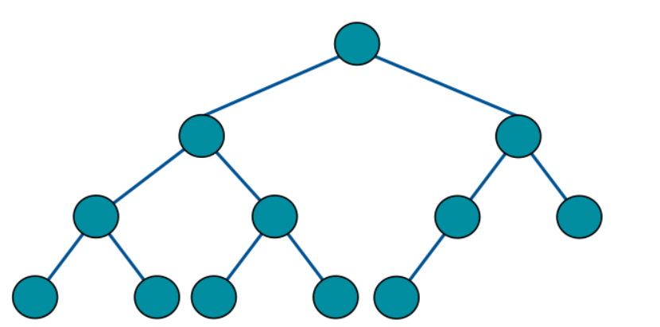

首先这种节点情况进行计算的话，最优的时间复杂度应该是$O(logN * logN)$ ?

首先普通二叉树的话直接就是O（N）遍历就完事了；

如果是全部填满的满完全二叉树架构的话，就直接$O(logN)$指数计算就好了。

那么完全二叉树的话，应该是前两者结合，<u>也就是当左右的深度相同的话，就不需要计算，只需要在左右深度不同的情况下进行遍历的操作</u>就可以了，但是这个思想的实现，对于计算复杂度的实现是相当巧妙的，好好分析一下。

```c++
public int countNodes(TreeNode root) {
    TreeNode l = root, r = root;
    // 记录左、右子树的高度
    int hl = 0, hr = 0;
    while (l != null) {
        l = l.left;
        hl++;
    }
    while (r != null) {
        r = r.right;
        hr++;
    }
    // 如果左右子树的高度相同，则是一棵满二叉树
    if (hl == hr) {
        return (int)Math.pow(2, hl) - 1;
    }
    // 如果左右高度不同，则按照普通二叉树的逻辑计算
    // 这里两边都是null的情况就会回归1，不需要额外的判断
    return 1 + countNodes(root.left) + countNodes(root.right);
}
```

**复杂度分析**

**一棵完全二叉树的两棵子树，至少有一棵是满二叉树**：所以不断切分迭代的话，我们就知道每次的while是$O(logN)$ 需要迭代$O(logN)$的深度，所以就是上面分析的复杂度。

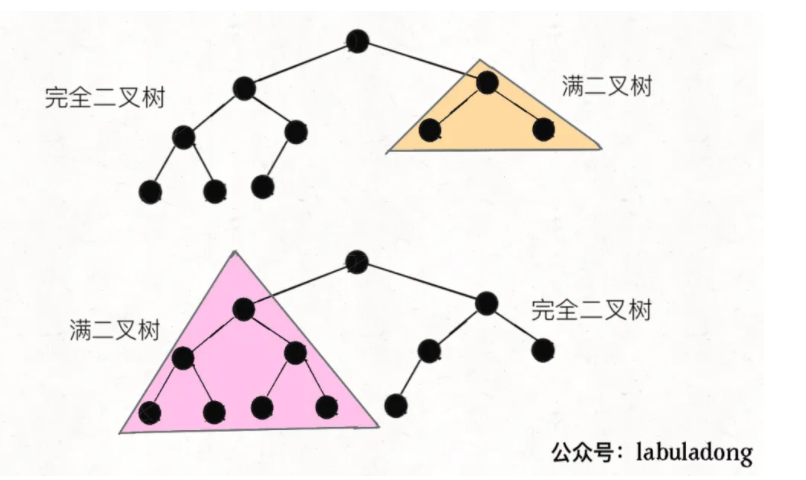

#### :star: 二叉树的最近公共祖先（236）二刷

这个[设计思路](https://mp.weixin.qq.com/s?__biz=MzAxODQxMDM0Mw==&mid=2247485561&idx=1&sn=a394ba978283819da1eb34a256f6915b&chksm=9bd7f671aca07f6722f0bc1e946ca771a0a40fd8173cc1227a7e0eabfe4e2fcc57b9ba464547&scene=21#wechat_redirect)还挺有意思 ，虽然代码不长但是思路还比较复杂；可以参考一下这个代码的设计思路，实际上还是逃不脱二叉树的几种框架：

**根据我们需要首先访问的值来决定我们的遍历框架。**

这题首先需要我们找到最底部的值（`后序遍历`），然后一层一层的往外找，然后找到最底层的哪个公共root（再往上肯定就都是公共的了）；

1. 如果只有其中一个值就返回那个值的指针，如果root的两侧包含了两个，就返回root。
2. 由于如果Node1的左右包含了p，q；那么Node的父节点的左右肯定另一侧是无效值，可以用这个来设计内层覆盖外层返回值的逻辑。

```c++
class Solution {
public:
    TreeNode* lowestCommonAncestor(TreeNode* root, TreeNode* p, TreeNode* q) {
        // 用来判断是否两个点都存在在以如今的root所在的树中，如果存在的话就返回True
        // 设计的主要原则：
        // 1. 出现在了后面节点的左边和右边的话，就不可能出现在父节点的左边和右边
        // 2. 再叶节点找到相应的两个指，需要从后面遍历起来，先找到两个节点的位置，然后一级一级的并上来。
        if(!root)
            return nullptr;
        if(root == q || root == p)
            return root;

        TreeNode* left = lowestCommonAncestor(root->left,p,q);
        TreeNode* right = lowestCommonAncestor(root->right,p,q);

        if (left && right)
            return root;
        if (!left && !right)
            return nullptr; 
            
        return left?left:right;
    }
    // bool comexit(TreeNode* root, TreeNode* p, TreeNode* q);
};
```

#### 扁平化嵌套列表迭代器（341）

这一题主要要好好的看提示和题目，

这题的关键在于辅助空间的建立和相应的（迭代和循环的）嵌套，还有就是理解题目，但是这种简单的实现方式，实际上并不能达到一个比较好的时间和空间复杂度。

**我的解法（初始）：**我的方法也可以改成用栈来实现，原理是一样的。

```c++
class NestedIterator {
private:
    int lens;
    int index;
    vector<int> NestIt; // 关键点在于额外辅助数组的构建，但是是否能够预先建立一个比较长的数组
    // FIXME：通过初始化函数，建立一个比较合适的数组长度，从而减少需要额外分配内存的时间代价。
    // Vector的重新初始化方式。

public:
    // TODO:迭代器的表示形式应该怎么写
    // NOTE：这种题目的阅读逻辑应该怎么分析
    NestedIterator(vector<NestedInteger> &nestedList):index(0) {
        helpBuildVec(nestedList);
    }

    void helpBuildVec(vector<NestedInteger> & nestedList){
        for(int i =0;i<nestedList.size();i++)
        {
            if(nestedList[i].isInteger())
                NestIt.push_back(nestedList[i].getInteger()); // 记得要调用取值的函数
            else
                helpBuildVec(nestedList[i].getList());
        }
        lens = NestIt.size();
    }
    
    int next() {
        return NestIt[index++];
    }
    
    bool hasNext() {
        return index < lens; 
    }
};
```

实际上迭代器应该根据需要来进行数值的导入，没有必要一开始就将全部的数据读取出来，这样的效率在一些特殊的情况下可能是不好的

**改进1：惰性存放**

- **Vector反向迭代** `rbegin` `rend`
- 利用栈，其实用队列然后正向迭代也是可以的
- 初步就是先**把外层存**进去，在实际调用的时候再解包的方法。
- 实际上需要关注的地方就是hasnext用来解包的过程。

```c++
class NestedIterator {
private:
  stack<NestedInteger> st;
public:
  NestedIterator(vector<NestedInteger> &nestedList) {
    for (auto iter = nestedList.rbegin(); iter != nestedList.rend(); iter++) {
      st.push(*iter);
    }
  }

  int next() {
    auto t = st.top();
    st.pop();
    return t.getInteger();
  }

  bool hasNext() {
    while (!st.empty()) {
      auto cur = st.top();
      if (cur.isInteger()) return true;
      st.pop();
      auto curList = cur.getList();
      for (auto iter = curList.rbegin(); iter != curList.rend(); iter++) {
        st.push(*iter);
      }
    }
    return false;
  }
};
```


### 二叉搜索树

#### BST中的搜索（700）

利用大小的特性进行遍历就好了

```c++
class Solution {
public:
    TreeNode* searchBST(TreeNode* root, int val) {
        if(!root)
            return nullptr;
        if(root->val == val)
            return root;
        if(val > root->val)
            return searchBST(root->right,val);
        if(val < root->val)
            return searchBST(root->left,val);
        return nullptr;
    }
};
```


#### BST第k小的元素（230）

**“从做算法题的角度来看 BST，除了它的定义，还有一个重要的性质：BST 的中序遍历结果是有序的（升序）”**。

上面这个是最关键的一点，同时我们也很容易理解这点，根据BST本身的性质来说，所以这道题实际上很简单，我们只需要进行一个中序遍历就可以完成这样的问题了，然后在后续的位置进行累计。

- 还有就是熟悉迭代到底会从头开始输出还是从尾开始输出，这点逻辑要搞清楚，好像除了前序遍历的话，其他的都是会从尾巴开始的把。
- 文中提到的优化思路，其实是如何将算法优化到（logn），那就需要知道k和一个数是第几的这个关系，这样的话，实际上是需要树本身存放额外信息的（以自己为root的树有多少节点，这样就能分析出来自己顺位，从而和k对比）。
- 红黑树这种改良的自平衡BST，增删查改都是O（logN）的复杂度。（后续掌握）

```c++
class Solution {
private:
    int count = 0;
    int res = INT_MIN;
public:
    int kthSmallest(TreeNode* root, int k) {
        traverr(root,k);
        return res;
    }
    void traverr(TreeNode* root, int k){
        if (!root)
            return;
        traverr(root->left,k);
        count++;
        if(count==k)
            res = root->val;
        traverr(root->right,k);
    }
};
```

#### BST转化为累加树（538，1038）

分析题目，实际上也是一个遍历的问题，由于找的是**比自己大的所有数**

:star: 所以累加的方向：是从**大数累计到小数**，而同时BST的**中序遍历是有序**的，所以我们改变中序遍历的方式，进行一个从大到小的遍历，用一个默认值来进行累计值的统计。

- :question: 为什么NULL的方法会失效
- 由于Int的上限的问题，需要使用long不然会出问题

```c++
// FIXME:为什么使用NULL的方法会失效。
// LONG的使用情景，
// 试着用迭代的方式去写（中序遍历）
class Solution {
public:
    bool isValidBST(TreeNode* root) {
        return helpJudge(root,LONG_MAX,LONG_MIN);
    }
    bool helpJudge(TreeNode* root, long int max,long int min){
        if(!root)
            return true;
        // 这个大于等于等于号不能丢掉。
        if(root->val >= max) return false;
        if(root->val <= min) return false;
        // 根据节点往下迭代的情况，更新最小值和最大值，因为右侧的最小值是不断增长的
        // 而左侧的最大值是在不断的变小的。这一点是这个问题最关键的地方
        return helpJudge(root->right,max,root->val) && helpJudge(root->left,root->val,min);
    }
};
```

#### BST的节点有效性（98）

也就是左侧的子树都要小于中间然后小于右侧的子树，这点，如果简单的对于所有的节点对左右判断的话，没办法维持子树全体的大小关系的特性，所以需要额外的记录一个值来保持这个特性：

1. root的值是左边的最大值，是右边的最小值；
2. 或者从有序规则来统计一个最大最小值来进行判断，（swap==0）

```c++
boolean isValidBST(TreeNode root) {
    return isValidBST(root, null, null);
}

/* 限定以 root 为根的子树节点必须满足 max.val > root.val > min.val */
boolean isValidBST(TreeNode root, TreeNode min, TreeNode max) {
    // base case
    if (root == null) return true;
    // 若 root.val 不符合 max 和 min 的限制，说明不是合法 BST
    if (min != null && root.val <= min.val) return false;
    if (max != null && root.val >= max.val) return false;
    // 限定左子树的最大值是 root.val，右子树的最小值是 root.val
    return isValidBST(root.left, min, root) 
        && isValidBST(root.right, root, max);
}
```

#### BST插入数值（701）

对比判断左右就行了，就是加入了判断的遍历。下面是FA给出的框架

```c++
TreeNode insertIntoBST(TreeNode root, int val) {
    // 找到空位置插入新节点
    if (root == null) return new TreeNode(val);
    // if (root.val == val)
    //     BST 中一般不会插入已存在元素
    if (root.val < val) 
        root.right = insertIntoBST(root.right, val);
    if (root.val > val) 
        root.left = insertIntoBST(root.left, val);
    return root;
}
```

我的解题方法：实际上就是基于遍历的思想，然后在需要的地方执行完操作再往后继续遍历就好了。实际上实现的效果非常的好。

```c++
class Solution {
public:
    TreeNode* insertIntoBST(TreeNode* root, int val) {
        if(!root){
            TreeNode* curr = new TreeNode(val);
            return curr;
        }
        if (val > root->val)
        {
            if (!root->right)
            {
                TreeNode* curr = new TreeNode(val);
                root->right = curr;
                return root;
            }
            insertIntoBST(root->right,val);
        }
        else
        {
            if(!root->left)
            {
                TreeNode* curr = new TreeNode(val);
                root->left = curr;
                return root;
            }
            insertIntoBST(root->left,val);
        }
        return root;
    }
};
```


#### :star: BST删除（450）

下面这个的思路其实和我们想的是一样的，但是这种书写的方式留意一下，用delete来做就好。

```c++
class Solution {
public:
    TreeNode* deleteNode(TreeNode* root, int key) {
        if(root == nullptr) return root;//第一种情况：没找到删除的节点，遍历到空节点直接返回
        if(root->val == key)
        {
            //第二种情况：左右孩子都为空（叶子节点），直接删除节点，返回NULL为根节点
            //第三种情况：其左孩子为空，右孩子不为空，删除节点，右孩子补位，返回右孩子为根节点
            if(root->left == nullptr) return root->right;
            //第四种情况：其右孩子为空，左孩子不为空，删除节点，左孩子补位，返回左孩子为根节点
            else if(root->right == nullptr) return root->left;
            //第五种情况：左右孩子节点都不为空，则将删除节点的左子树放到删除节点的右子树的最左面节点的左孩子的位置
            //并返回删除节点右孩子为新的根节点
            else{
                TreeNode* cur = root->right;//找右子树最左面的节点
                while(cur->left != NULL)
                {
                    cur = cur->left;
                }
                cur->left = root->left;//把要删除的节点左子树放在cur的左孩子的位置
                TreeNode* tmp = root;  //把root节点保存一下，下面来删除
                root = root->right;    //返回旧root的右孩子作为新root
                delete tmp;            //释放节点内存
                return root;
            }
        }
        if(root->val > key) root->left = deleteNode(root->left, key);
        if(root->val < key) root->right = deleteNode(root->right, key);
        return root;
    }
};

```

先找到，**然后改，**主要是不能破坏BST的数值结构.先写出基本的框架

```c++
TreeNode deleteNode(TreeNode root, int key) {
    if (root.val == key) {
        // 找到啦，进行删除
    } else if (root.val > key) {
        // 去左子树找
        root.left = deleteNode(root.left, key);
    } else if (root.val < key) {
        // 去右子树找
        root.right = deleteNode(root.right, key);
    }
    return root;
}
```

**情况 1**：`A`恰好是末端节点，两个子节点都为空，那么它可以当场去世了。

```c++
if (root.left == null && root.right == null)
    return null;
```

**情况 2**：`A`只有一个非空子节点，那么它要让这个孩子接替自己的位置。

```c++
// 排除了情况 1 之后
if (root.left == null) return root.right;
if (root.right == null) return root.left;
```

**情况 3**：`A`有两个子节点，麻烦了，为了不破坏 BST 的性质，`A`**必须找到左子树中最大的那个节点，或者右子树中最小的那个节点来接替自己。**我们以第二种方式讲解。

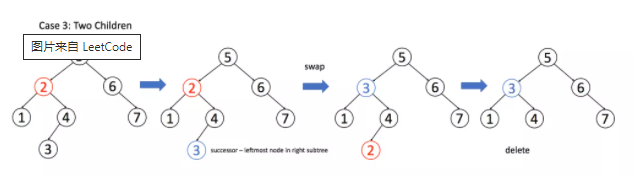

```c++
if (root.left != null && root.right != null) {
    // 找到右子树的最小节点
    TreeNode minNode = getMin(root.right);
    // 把 root 改成 minNode
    root.val = minNode.val;
    // 转而去删除 minNode
    root.right = deleteNode(root.right, minNode.val);
}
```

综上所述：但是我们通常不会通过val交换值来交换节点，而是通过链表操作来处理，暂时把框架和思路描写成这样，后续进行修改。

```c++
TreeNode deleteNode(TreeNode root, int key) {
    if (root == null) return null;
    if (root.val == key) {
        // 这两个 if 把情况 1 和 2 都正确处理了
        if (root.left == null) return root.right;
        if (root.right == null) return root.left;
        // 处理情况 3
        TreeNode minNode = getMin(root.right);
        root.val = minNode.val;
        root.right = deleteNode(root.right, minNode.val);
    } else if (root.val > key) {
        root.left = deleteNode(root.left, key);
    } else if (root.val < key) {
        root.right = deleteNode(root.right, key);
    }
    return root;
}

TreeNode getMin(TreeNode node) {
    // BST 最左边的就是最小的
    while (node.left != null) node = node.left;
    return node;
} 
```

**我的解题过程**

遇到的问题：

1. 删除的话不是之前的链表那种用nullptr替代，好像是直接用delete去做的逻辑，这样的话，编写的难度其实就不太一样了，我们可以找一个替代指针来进行删除。
2. 分析清楚总共有几种情况，一些特殊的情况下直接进行一个值的替换可以吗。（不行）
3. 这里有好几种解题思路，主要用的是一个替换的思想，这里后面要重新看看多捋捋。（这些算法实际上都涉及到内存泄露把，就很离谱）
4. 但是还有一个典型的就是只要我们最后return的ptr的树，是我们的目标树来着。这里给出的方法实际上是直接整个把左子树接到右子树的后面去了，如果删除的是中间节点的话，学习一下。

### 动态规划方法

首先是动态规划的基本思路（适用条件）（剑指有提到讲的还挺好）：本质上是一种穷举的搜索方法

1. 求解的是最值问题
2. 最优解可以依赖于子序列的最优解（**最优子结构**）
3. 大问题可以分解为小问题，小问题还有**重叠的**更小的子问题；
4. 从上到下分析问题，从下到上的求解问题（避免重复计算）（需要额外的存储空间）

最关键的点在于正确的状态转移方程。（实际上也就是二叉树中多种遍历之间要执行的那个操作）：

**明确[状态] -> 定义dp动态规划表中的数组或者函数的含义（子最优状态）-》明确选择-》明确base case就是起始状态**

[可以看一下其中的硬币问题](https://mp.weixin.qq.com/s?__biz=MzAxODQxMDM0Mw==&mid=2247484731&idx=1&sn=f1db6dee2c8e70c42240aead9fd224e6&chksm=9bd7fb33aca07225bee0b23a911c30295e0b90f393af75eca377caa4598ffb203549e1768336&scene=21#wechat_redirect) 实际上很多情况下可以使用这样的解题策略：

- Bottom-up （Vector，或者用hashtab之类的D-P table 存储）
- 双指针Bottom-up

其中设计迭代的一些准则：

1. 遍历的过程中需要的状态必须是已经算出来的
2. 遍历的重点是我们要存储结果的那个位置。

存储表和DP-TABLE不是一个意思

#### 动态规划的状态压缩方法

主要用于我们需要有二维的存储空间的时候，怎么压缩成一维的这种情况。

[理解如下](https://mp.weixin.qq.com/s?__biz=MzAxODQxMDM0Mw==&mid=2247485824&idx=1&sn=09caa56172729cf8cf1b53089e8dee55&chksm=9bd7f788aca07e9e4149f384ec5e279adadec75a2828a76066c56b4789209fb1cd54f9e63f9d&scene=21#wechat_redirect)：

1. 初始状态直接向下压成1维度，去掉i维度

2. 通过内外层循环的不同更新特性，来逐渐的覆盖之前的值。

   > 用一个pre和temp来保留上一层的i 和上一层的j
   >
   > 然后基于先后的更新顺序取更新问题。

3. 实际上就是利用更新的延后性去压缩空间，实际上只要保留一个temp和一个pre就可以了、

TODO： 

- 二刷的时候考虑更新之前的动态规划算法
- 在做后续题目的时候也考虑执行压缩的策略。

#### :question:正则表达式问题：

永远的苦主，事实上我应该意识到，这样移动序列的问题，完全可以转化成，递归或者说是动态规划的问题来做，通过一个设想的匹配函数和一个相应的状态转移方程来进行，由于其中的*号带来的多种重复可能性，<u>所以可能需要像动态规划那样建立一个索引表来防止重复计算，这个我们也要重新进行分析一下看看。</u>（我觉得好像是不用的把。）

实我还没get为什么这一个问题属于正则表达式的问题。研究一下FA中的说法把，

通过剑指offer中的递归的思想，倒是能够解决这道题，但是问题就在于，这样的话，虽然空间复杂度好了，但是时间复杂度拉跨的不行，这就说明是存在着重复运算的动态规划的情况把，所以我们使用FA中的思路建立一个memo表

```c++
class Solution {
public:

    bool isMatch(string& s, string& p) {
        // 空值测试
        if(p.empty()) return s.empty();
        return findMatch(s,p,0,0);
        
    }

    bool findMatch(const string& s , const string& p,int si, int pi);
};
bool Solution::findMatch(const string& s, const string& p, int si, int pi) {
    // if(p.empty()) return s.empty();
    int s_ize = s.size(), p_size = p.size();
    if (pi>=p_size && si<s_ize) return false;
    if (pi>=p_size && si>=s_ize) return true;
    // 第二种，匹配到了*号的情况
    // 由于关键的*的个数，实际上是一种不确定的情况，而只要有一种情况符合就只要当True即可
    // 所以用递归的方法去做还是挺合适的
    if(p[pi+1]=='*')
    {
        if(p[pi]==s[si] || (p[pi] == '.'&&si<s_ize))
        {
            //实际上三者其中一个的最优就对了
            return findMatch(s,p,si+1,pi+2) || findMatch(s,p,si+1,pi) || findMatch(s,p,si,pi+2);
        }
        else
        {
            return findMatch(s,p,si,pi+2);
        }
    }
    // 三种可能性，首先先判断最简单的清康 .或者相等的情况
    if(s[si]==p[pi] || p[pi]=='.' && si<s_ize)
    {
        return findMatch(s,p,si+1,pi+1);
    }

    return false;
    
}
```

建立递归表的方式，这里是参考的官方的减法，但是这里的加和减，和上面的区别就是，

这里建表的假设是前面的几项是否相同（True or False），以及我们是往后面迭代，他是从前面开始迭代，我们跌打到后边界，他迭代到前边界。所以实际上还是和我们的方法一样的，然后就是通过dp的框架就行。

[这个思路我还是写不好，DP表建立的不好，改天找一天耍一天动态规划](https://leetcode-cn.com/problems/zheng-ze-biao-da-shi-pi-pei-lcof/solution/jian-zhi-offer-19-zheng-ze-biao-da-shi-pi-pei-dong/)

```c++
class Solution {
public:
    bool isMatch(string s, string p) {
        int m = s.size() + 1, n = p.size() + 1;
        vector<vector<bool>> dp(m, vector<bool>(n, false));
        dp[0][0] = true;
        for(int j = 2; j < n; j += 2)
            dp[0][j] = dp[0][j - 2] && p[j - 1] == '*';
        for(int i = 1; i < m; i++) {
            for(int j = 1; j < n; j++) {
                dp[i][j] = p[j - 1] == '*' ?
                    dp[i][j - 1] || dp[i][j - 2] || dp[i - 1][j] && (s[i - 1] == p[j - 2] || p[j - 2] == '.'):
                    dp[i - 1][j - 1] && (p[j - 1] == '.' || s[i - 1] == p[j - 1]);
            }
        }
        return dp[m - 1][n - 1];
    }
};


```


#### :star: 编辑距离（着重用于思路理解）

**解决两个字符串的动态规划问题，一般都是用两个指针`i,j`分别指向两个字符串的最后，然后一步步往前走，缩小问题的规模**

这一题的关键在于，如何将这样的问题抽象成状态转移方程，如何抽象成一个动态的规划问题。[Fuck Algorithm解析](https://mp.weixin.qq.com/s?__biz=MzAxODQxMDM0Mw==&mid=2247484731&idx=3&sn=aa642cbf670feee73e20428775dff0b5&chksm=9bd7fb33aca0722568ab71ead8d23e3a9422515800f0587ff7c6ef93ad45b91b9e9920d8728e&scene=21#wechat_redirect)。

- 后续通过第一串代码和最后的正确代码进行分析，但是这样的方法实际上效率也还不够高
- 我们也可以用new生成普通数组的方式去做，此外，如果我们要存储具体的操作，我们可以定义一个简单的NODE structure去实现这个功能，存放val和opp；
- TODO：空间效率优化：将二维空间压缩成一维的情况分析。

结合之前的硬币问题，我们可以把三种操作当成三种状态转移操作。然后将两个字符串的长度，看成矩阵的两个维度，然后通过状态转移操作进行坐标上的变换，由于我们需要的是最短距离；我们就假设我们的函数是从A->B的最短距离的转移函数；

分析问题的时候**给定**两个确定的case去分析：1.起始状态 2.状态转移；

此外：我们**不要去分析最优**应该是什么样的，**遍历求最值**，就是能做的操作都做，使用动态规划的方式降维而已。

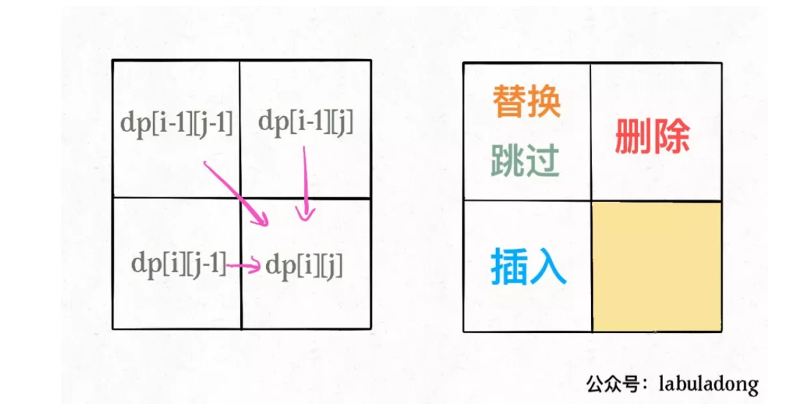

**基本的实现思路如下（需要集成存储思路）** 

✔：动态规划的方法实际上还是Bottom-up更好，无论是从空间还是时间上来说 (但是实际上实现效率还是没有提高，为什么呢？)

```c++
class Solution {
public:
    int minDistance(string word1, string word2) {
        // 实现将word1 变成 word2
        // auto w1_it = word1.rbegin();
        // auto w2_it = word2.rbegin();
        // 首先使用递归的方式实现一下这个问题，然后再用迭代的方式做
        int w2_idx = word2.size();
        int w1_idx = word1.size();
        // 存储表实现：vector 长度初始化学起来(主要需要存储一个空值所以记得后面的index要加1)
        vector<vector<int>> memo(w1_idx+1,vector<int>(w2_idx+1,0));
        // 初始状态初始化
        for(int i =0; i<memo.size();i++)
            memo[i][0] = i;
        for(int j =0; j<memo[0].size();j++)
            memo[0][j] = j;
        // 正向迭代 bottom-up
        // 实际上从A-》B的变换和从b——》A的变换是对称的，不用太纠结方向的问题
        for(int i =1;i<memo.size();i++)
        {
            for(int j=1;j<memo[0].size();j++)
            {
                // FIXME：操作是存在象征意义的，所以不是都在最后才+1的
                // memo[i][j] = min(memo[i][j-1],memo[i-1][j]);
                // memo[i][j] = min(memo[i][j],memo[i][j-1]);
                int minv = 500;
                if(word1[i-1] == word2[j-1])
                {
                    minv = memo[i-1][j-1];
                    // memo[i][j] = memo[i-1][j-1];
                }
                // TODO:减少对数组的操作实际上运行时间会减少。
                minv = min(minv,memo[i-1][j-1]+1);
                minv = min(minv,memo[i-1][j]+1);
                memo[i][j] = min(minv,memo[i][j-1]+1);
                // memo[i][j] = min(memo[i][j],memo[i-1][j]+1);
                // memo[i][j] = min(memo[i][j],memo[i-1][j-1]+1);
                // memo[i][j] = min(memo[i][j],memo[i][j-1]+1);
            }
        }
        return memo[w1_idx][w2_idx];
    }
};
```

#### 子序列问题

**关键的解题思想：**

- 一维的DP数组：这种子序列问题（子序列不同于子串），需要的一般都是以i为结尾的情况下，取得的最值，这样才符合我们需要归纳 的条件。

  > ```c++
  > // 基础的算法模板如下
  > int n = array.length;
  > int[] dp = new int[n];
  > 
  > for (int i = 1; i < n; i++) {
  >     for (int j = 0; j < i; j++) {
  >         dp[i] = 最值(dp[i], dp[j] + ...)
  >     }
  > }
  > ```
  >
  > **在子数组`array[0..i]`中，以\**`array[i]`\**结尾的目标子序列（最长递增子序列）的长度是`dp[i]`**。

- 二维的DP数组:这种思路其实用的更多，尤其是涉及到数组，两个字符串这样的问题的情况下，这种思路实际上涵盖了，包含一个字符串和两个字符串的情况

  - ```c++
    int n = arr.length;
    int[][] dp = new dp[n][n];
    
    for (int i = 0; i < n; i++) {
        for (int j = 1; j < n; j++) {
            if (arr[i] == arr[j]) 
                dp[i][j] = dp[i][j] + ...
            else
                dp[i][j] = 最值(...)
        }
    }
    ```

  - **涉及两个字符串/数组时**（比如最长公共子序列），dp 数组的含义如下：

    > **在子数组`arr1[0..i]`和子数组`arr2[0..j]`中，我们要求的子序列（最长公共子序列）长度为`dp[i][j]`**。
    >
    > 可以参考的是编辑距离和最长公共子序列两个文章

  - **只涉及一个字符串/数组时**（比如本文要讲的最长回文子序列），dp 数组的含义如下：

    > **在子数组`array[i..j]`中，我们要求的子序列（最长回文子序列）的长度为`dp[i][j]`**。


##### 最长递增子序列（300）

我的思路（排雷）：

- 首先找到长长度为一的所有子序列，然后从这个子序列的尾巴出发，找到后续的长度+1的子序列

  > 覆盖，清楚，（O(2N)的空间） （O（n^3））太差了，正常动态规划应该怎么去做。
  >
  > 实际上正确的修改能得到二分查找N*logN的最佳时间复杂度的方法。

- 为什么不能用以每个结尾的子串中的最长子序列来做动态规划

  > 因为最大值不可控，而且主要是这个玩意没办法重复利用。还是需要从重复寻找子序列。

###### :star: N*logN的改进二分查找加贪心算法

修改前面的假设的方法：我们要以**当前值作为前面那个最长子序列的结尾（不是一次搜索完，而是只搜索到当前元素）**，然后维护一个长度的结尾值最小的算法。[官方解答](https://leetcode-cn.com/problems/longest-increasing-subsequence/solution/zui-chang-shang-sheng-zi-xu-lie-by-leetcode-soluti/)

**这里要学习一下二分查找的思路理念**

这题实际上不就是单调栈模板的二分优化嘛，这种情况

1. 通过一个-1来错开同时并减少多余计算。
2. 用二分查找来找到第一个大于的值的位置（的思想）分析这种情况，从最后的区间开始分析。（我们要找的是第一个比他小的数，所以最后要加一）

```c++
class Solution {
public:
    int lengthOfLIS(vector<int>& nums) {
        // 基于二分查找和贪心的算法
        vector<int>DpT(nums.size()+1,0); // 这里好像没考虑到负数的情况吧,便于比较和加入所以+1
        int lens = 1;
        DpT[lens] = nums[0];
        for(int i=1;i<nums.size();i++)
        {
            if(nums[i]>DpT[lens]){
                DpT[++lens] = nums[i];
            }
            else{
                // 二分查找大型现场。
                int left = 1, cur=0, right = lens;
                while(left <= right){
                    int mid =(left+right)>>1;
                    if(nums[i]>DpT[mid]){
                        // 这里为什么要+1，避免重复搜索同时做种错开吗？
                        left = mid+1;
                        cur = mid;
                    }
                    else{
                        right = mid-1;
                    }
                }
                DpT[cur+1] = nums[i];
            }
        }
        return lens;
    }
};
```

###### **动态规划**

**dp[i] 表示以 nums[i] 这个数结尾的最长递增子序列的长度**

在迭代搜索的过程中，只需要找比当前值更小的前序子序列+1取最大值就行，最终返回值是dp中的最大值，复杂度O(n^2). 

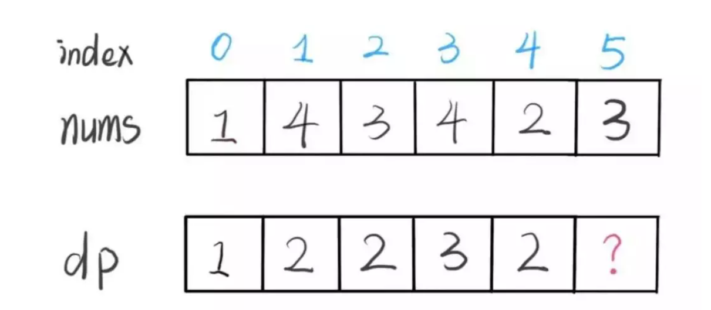

空间复杂度还行，时间复杂度依旧拉跨。如何将算法的复杂度降低到O(n*long(n))

```c++
class Solution {
public:
    int lengthOfLIS(vector<int>& nums) {
        // 建立dptable，每个存放以当前值为结尾的最长子序列长度
        // 在迭代搜索的过程中，只需要找比当前值更小的前序子序列+1取最大值就行
        // 最终返回值是dp中的最大值，复杂度O(n^2)
        vector<int> DPtable(nums.size(),1);
        // bottom-up 循环
        for (int i=1;i<nums.size();i++)
        {
            for(int j =0; j<i;j++)
            {
                if(nums[i]>nums[j])
                    DPtable[i] = max(DPtable[i],DPtable[j]+1);
            }
        }
        // 找到最大值返回
        int res =1;
        for(int& v_dp: DPtable)
        {
            if(v_dp>res)
                res = v_dp;
        }
        return res;
    }
};
```

这里降低到n*logn的方法还比较猎奇。通过新建立堆的方法来实现，但是这种方法为什么的

##### 俄罗斯套娃信封问题(354)

这个问题是个很有意思的问题，实际上关键在于通过合理的排序操作来给问题降维

- 同个宽度的信封无法互相嵌套，那么如何在通过最长递增子序列的搜寻来排除掉同个高度的多个选择呢？（高度之间逆序排列，那么其中的两个无论如何都无法是递增的这样就能达到我们的唯一性和递增的目的了）
- 一个维度升序一个维度降序，然后进行最终的最长子序列的搜索即可。

**通过排序（一正一逆来给问题降维成一个最长递增子序列的问题）**主要的实现难点应该就在快速排序和嵌套排序中。（这里肯定要使用快速排序把，这也是时间复杂度的重要标准来着。）

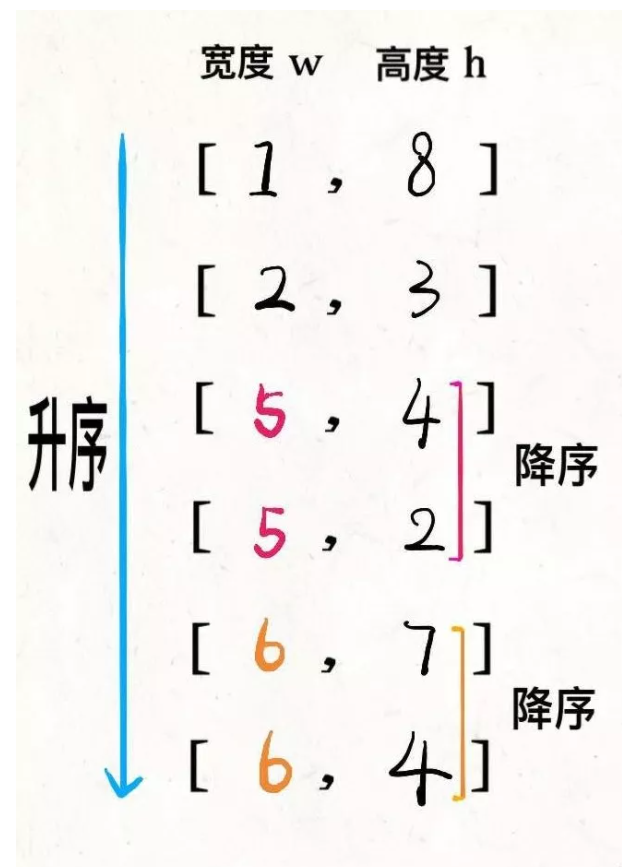

```c++
二分查找的change位置放错了，找了半天
/*
 * @lc app=leetcode.cn id=354 lang=cpp
 *
 * [354] 俄罗斯套娃信封问题
 */

// @lc code=start
#include<vector>
#include<algorithm>
using namespace std;
class Solution {
public:
    int maxEnvelopes(vector<vector<int>>& envelopes) {
        if(envelopes.empty())
            return 0;
        // 使用匿名函数编写排序算法，sort采用的是快排的基本方法
        sort(envelopes.begin(), envelopes.end(),
            [](const vector<int> & A , const vector<int> & B){
                return A[0]<B[0] || (A[0]==B[0] && A[1]>B[1]);
            });
        // 接着使用二分查找结合动态规划来搜索最长递增子序列
        vector<int> dpt (envelopes.size()+1, 0);
        // HYPER 
        int len = 1;
        dpt[len] = envelopes[0][1];
        for (int i = 1;i<envelopes.size();i++)
        {
            // 如果比原本的大，就直接放到后面去，如果没比前面的大，就放到第一个比他大的下面，修改他的值
            // 但是如果比第一个值还小的话，就会被放到最前面（第一个好像这样是搜不到0的）去，最后多长的话，是不是就说不准了？
            if(envelopes[i][1]>dpt[len]){
                len = len + 1;
                dpt[len] = envelopes[i][1];

            }
            else{
                //TODO:lower_boundry的使用
                // FIXME:不知道这个二分查找的问题在哪，非常疑惑 change的位置放错了
                int l = 1, r = len, cur = 0;
                while(l<=r){
                    int mid = (l+r)>>1;
                    if (envelopes[i][1]>dpt[mid]){
                        l = mid+1;
                        cur = mid;  // 最终就会是小于的最后一个
                    }
                    else{
                        r = mid ;
                    }
                    

                }

                dpt[cur+1] = envelopes[i][1];
            }
        }
        return len;
        
    }
};
// @lc code=end
```


##### 最长回文子序列（516）

这一题的分析里面主要可以通过上面的假设和绘2维图来辅助分析，考虑到常规情况下的回文判断是对两侧的拓展实现的，如果不是两侧相同的画，两边不可能同时对子串发生回文增益；这句话中就隐含了一个操作和两个状态变换。

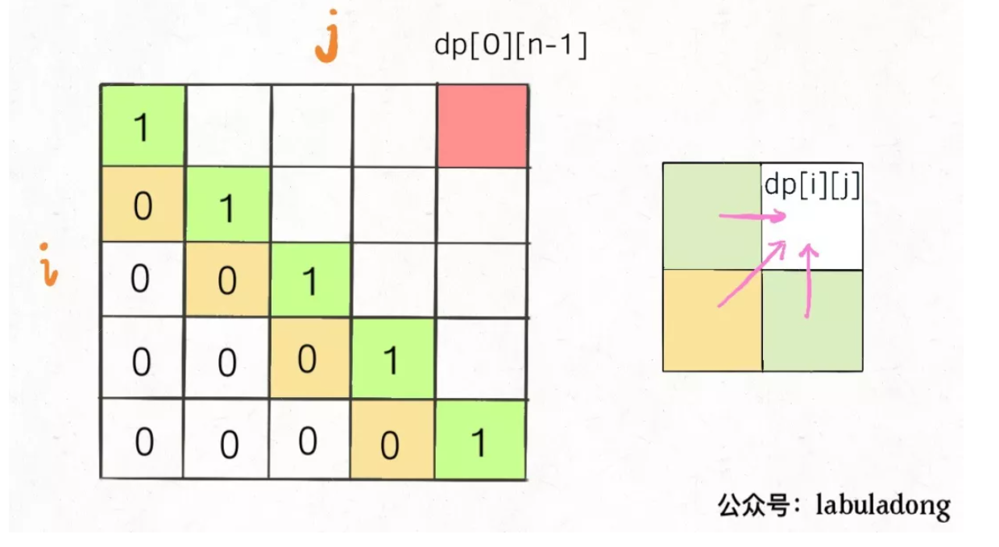

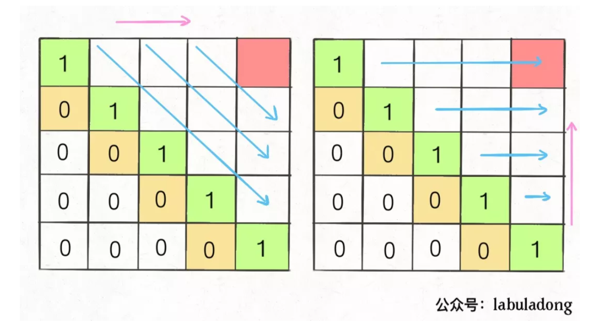

代码实现。

```c++
class Solution {
public:
    int longestPalindromeSubseq(string s) {
        // 画那种二维图能够帮助分析是真的，
        // 考虑到我们常规情况下的回文判断是通过两侧拓展实现的
        // 我们在这里也执行增加的两侧相等时进行判断，其他时候借助于状态转移
        // if (s.size()==0) return 0;
        int n = s.size();
        int res = 1;
        // 初始化DP Table 显然子序列的长度应该是大于0的，至少得有一个，所以
        vector<vector<int>> DpTable(n,vector<int>(n,0));
        for (int i=0;i<n;i++)
        {
            DpTable[i][i] =1;
        }
        // NOTE：这里为了确保下面和旁边都有值，需要更改一下迭代的方向
        for(int i=n-2;i>=0;i--)
        {
            for (int j=i+1;j<n;j++)
            {
                // 由于我们给越界值添加了0，所以不用考虑越界的情况
                if(s[i]==s[j])
                    DpTable[i][j]=DpTable[i+1][j-1] + 2;
                else 
                    DpTable[i][j] = max(DpTable[i+1][j],DpTable[i][j-1]);
            }
        }
        return DpTable[0][n-1];
    }
};
// 将很多词调用的size用n表示，同时初始化操作用在构造函数中，此外尽量的减少不必要的操作，还有循环方向不要搞错了。
```

##### 最大子数组和（53）

实际上也是动态规划的问题，每个表存储着**以当前节点为结尾的最大子数组和**，这个思路其实很简单，因为需要是连续的，所以只有两种选择，要么时自身开始，要么和前面合并；那就做一个max就性了，这样的画实际上只需要3个值来做中间变量就可以了。

这可能就是压缩的思路，后需要好好看看怎么压缩的，

```c++
class Solution {
public:
    int maxSubArray(vector<int>& nums) {
        int res = nums[0];
        int pre = nums[0];
        int cur = nums[0];
        for (int i = 1; i < nums.size(); i++) {
            // 当之前的综合>0 无脑加上
            if (pre > 0) cur = pre + nums[i];
            else cur = nums[i];
            // 修改到上个数字为止的总和
            pre = cur;
            // 验证一下最大值
            res = max(res, cur);
        }
        return res;
    }
};
```

##### 最长公共子序列（1143）

这题实际上和编辑距离的思考逻辑有点像，从上面的框架出发，我们很容易考虑到，实际上就是存放到，ij的最最长公共子序列。

那么我在思考的时候出现了一定的盲区（实际上画图很容易考虑到），在这里分析一下：

因为如果他们不等，他们是没办法共同产生增益的，也就是一个在末尾的话，另一个就不能在末尾了。所以实际上也是两种转移状态中的max情况。那么就可以开始写了。

```c++
class Solution {
public:
    int longestCommonSubsequence(string text1, string text2) {
        // 分析一下basecase
        // bottom-up 等下写一下递归的框架
        int m = text1.size(), n = text2.size();
        // 我们分析可以知道，我们按照3个方向进行搜索的话，一开始会存在溢出，所以
        // 我们不妨牺牲一点点空间来换取每一步都需要判断的 不必要的运算时间
        vector<vector<int>> dpTable (m+1,vector<int>(n+1,0));
        // TODO: 存储空间压缩
        for (int i = 1;i<=m;i++){
            for(int j = 1;j<=n;j++){
                if(text1[i-1]==text2[j-1])
                    dpTable[i][j] = 1+ dpTable[i-1][j-1];
                else
                    dpTable[i][j] = max(dpTable[i-1][j], dpTable[i][j-1]);
            }
        }
        return dpTable[m][n];
    }
};
// 状态压缩后的结果
class Solution {
public:
    int longestCommonSubsequence(string text1, string text2) {
        if (text1.empty() || text2.empty()) return {};
        int m = text1.size(); int n = text2.size();
        // 建立dp，basecases
        vector<int> dp(n + 1, 0);
        // dp和text的index 对应关系有1的offset记得
        for (int i = 1; i <= m; i++) {
            int pre = 0; // 最关键的状态压缩在这，我们需要找到每一个j开始的时候这个值是什么
            for (int j = 1; j <= n; j++) {
                int temp = dp[j]; // 状态压缩的值，在更新当前值之前的保存，然后在下一次使用的时候就可以了。
                if (text1[i - 1] == text2[j - 1]) {
                    dp[j] = pre + 1;
                }
                else {
                    dp[j] = max(dp[j], dp[j - 1]);
                }
                pre = temp; // 然后再这里给每个状态进行一次更新，
            }
        }
        return dp[n];
    }
};
// 需要做的还有矩阵压缩没有考虑。写一下递归的框架（时间效益太差了，但是没错）
class Solution {
public:
    int longestCommonSubsequence(string text1, string text2) {
        int m = text1.size(), n = text2.size();
        vector<vector<int>> dpTable (m,vector<int>(n,-1));
        return dp(text1,m-1,text2,n-1,dpTable);
    }
    
    int dp(string s1, int i, string s2, int j, vector<vector<int>>& dpTable ){
        if (i == -1 ||j == -1)
        {
            return 0;
        }
        if(dpTable[i][j] != -1)
            return dpTable[i][j];
        if(s1[i] == s2[j])
            dpTable[i][j] = dp(s1,i-1,s2,j-1,dpTable) +1;
        else
            dpTable[i][j] = max(dp(s1,i,s2,j-1,dpTable),dp(s1,i-1,s2,j,dpTable));
        return dpTable[i][j];
    }
};
```

实际上 **两个字符串的删除操作（583）**也是公共子序列的问题，稍微修改一下就好了

```c++
return  -2*dpTable[m][n] + m + n ;
```

实际上**两个字符串的最小ASCII删除和（712）**也是公共子序列的问题，也是稍微修改一下：

- char直接赋值给int就是ASCII
- 把中间存储的是相等的（个数）改成 Ascii和；（毕竟求的是最小的ASCII）,求得最大的重叠ascii码就行了、

```c++
class Solution {
public:
    int minimumDeleteSum(string s1, string s2) {
        int m = s1.length(), n = s2.length();
        vector<vector<int>> dpTable (m+1, vector<int>(n+1, 0));
        for (int i =1;i<=m;i++)
        {
            for (int j = 1; j<=n;j++)
            {
                if(s1[i-1] == s2[j-1])
                    dpTable[i][j] = dpTable[i-1][j-1] + (char)s1[i-1];
                else
                    dpTable[i][j] = max(dpTable[i-1][j], dpTable[i][j-1]);
            }
        }
        int sum = 0;
        for (char& ch: s1)
            sum += ch;
        for (char& ch: s2)
            sum += ch;
        return  -2*dpTable[m][n] + sum ;
    }
};
```

#### :star:背包问题

首先阐述一下《0-1背包问题》的题目：

> 给你一个可装载重量为`W`的背包和`N`个物品，每个物品有重量和价值两个属性。其中第`i`个物品的重量为`wt[i]`，价值为`val[i]`，现在让你用这个背包装物品，最多能装的价值是多少？

类似动态规划问题的**实现框架**：

```c++
for 状态1 in 状态1的所有取值：
    for 状态2 in 状态2的所有取值：
        for ...
            dp[状态1][状态2][...] = 择优(选择1，选择2...)
```

题目具体分析：

我们很容易基于动态规划的思想画出一个简单的转移图（VAL=价值），但是问题在于转移图中的两个索引我们打算如何去定义他。实际上最根本的一个想法就是重量和次序，但是这样就有几种设计的情况了，**重量**：1. 剩余空间，2，已装入的空间；**次序**：1. 已装入的文件个数 2. <u>可选择的物品个数（也就是逐步的遍历所有物品）</u>（第二中实际上我不太想得到，和我的思路不太一样，但是我们需要学习这种思考的的方式。）

那么如何选择呢？

首先重量的话，我觉得应该是都可以实现的，最后也不会用剩余重量来进行索引，那我们如果这样的话，我们如果用已经装入文件的个数来进行索引的话，我们没办法去选择出一个最后的状态，但是如果我们使用可选的物品个数，对其选择装入与否的话，就是一个最终的状态了。

其实换句话来理解的话：

**重量是State，价值是Vale，而每一步是一个0-1选择的问题**：很显然这样做的话，我们每步的传递判断，状态转移判断，都会有一个比较底的遍历选择范围，同时最终也有一个清晰的结尾。而且，最关键的是：已装入的个数，实际上很难作为一个指导的状态，因为我们不知道后面的选择范围到底会变成什么样子的。

```c++
最终的框架就会是：
int dp[N+1][W+1]
dp[0][..] = 0
dp[..][0] = 0

for i in [1..N]:
    for w in [1..W]:
        dp[i][w] = max(
            把物品 i 装进背包,
            不把物品 i 装进背包
        )
return dp[N][W]
```

而如果实现的

```c++
int knapsack(int W, int N, vector<int>& wt, vector<int>& val) {
    // vector 全填入 0，base case 已初始化
    vector<vector<int>> dp(N + 1, vector<int>(W + 1, 0));
    for (int i = 1; i <= N; i++) {
        for (int w = 1; w <= W; w++) {
            if (w - wt[i-1] < 0) {
                // 当前背包容量装不下，只能选择不装入背包
                dp[i][w] = dp[i - 1][w];
            } else {
                // 装入或者不装入背包，择优
                dp[i][w] = max(dp[i - 1][w - wt[i-1]] + val[i-1], 
                               dp[i - 1][w]);
            }
        }
    }

    return dp[N][W];
}
```

##### 分割等和子集（416）

通过求和将问题转化为背包问题，基本思想完全不变，j为当前的总状态，i为考虑的第i-1g个物品，然后也是求最大的值和，这样的话，最后判断值和是否能传递到最后（是否相等即可）

- 但是我们还是需要灵活一点，这题实际上可以转化为bool类型去做，实际上状态的传递，用与或非即可实现，bool的转移
- 同时这里涉及到2维度模型的压缩，基于上面的思路，我们可以通过循环的参数去优化，（最好还是从概念上理解这个优化，这样写起来才能一步到位。）

```c++
class Solution {
public:
    // 首先进行求和，然后将sum/2作为背包的容量，那么实际上就是一个背包问题
    // 只要对最终的情况进行判断是否为相等就行。
    // FIXME：但是这一题的最终重要的问题在于模型压缩，我们如何实现状态转移中的压缩。
    bool canPartition(vector<int>& nums) 
    {
        // 求和
        int sum = 0;
        for (int& num: nums) sum += num;
        // 背包问题求解
        if(sum%2 != 0) return false;
        sum = sum/2;
        vector<vector<int>> bapack (nums.size()+1,vector<int>(sum+1,0));
        // i 对第i个物体进行判断 j 当前已装入的重量总数；好好分析
        for (int i = 1;i<= nums.size();i++){
            for(int j = 1;j<=sum;j++){
                if (j<nums[i-1]) bapack[i][j]= bapack[i-1][j];
                else{ // 这个else 不能省略
                    bapack[i][j] = max(bapack[i-1][j], bapack[i-1][j-nums[i-1]]+nums[i-1]);
                }
            }
        }
        return bapack[nums.size()][sum] == sum;

    }
};
```

**基于bool方式的改进**

```c++
bool canPartition(vector<int>& nums) 
{
    // 求和
    int sum = 0;
    for (int& num: nums) sum += num;
    // 背包问题求解
    if(sum%2 != 0) return false;
    sum = sum/2;
    vector<vector<bool>> bapack (nums.size()+1,vector<bool>(sum+1,false));
    for(int i =0;i<bapack.size();i++)
        bapack[i][0] = true;
    // i 对第i个物体进行判断 j 当前已装入的重量总数；好好分析
    for (int i = 1;i<= nums.size();i++){
        for(int j = 1;j<=sum;j++){
            if (j<nums[i-1]) bapack[i][j] = bapack[i-1][j];
            else{ // 这个else 不能省略
                // 只要其中有一个是true就是true，很直接的说法
                bapack[i][j] = bapack[i-1][j] || bapack[i-1][j-nums[i-1]];
            }
        }
    }
    return bapack[nums.size()][sum];

}
```

将算法压缩到一维的情况

```c++
class Solution {
public:
    // 首先进行求和，然后将sum/2作为背包的容量，那么实际上就是一个背包问题
    // 只要对最终的情况进行判断是否为相等就行。
    // FIXME：但是这一题的最终重要的问题在于模型压缩，我们如何实现状态转移中的压缩。
    // 还有运算时间的优化，这题可以换成bool来做。思考一下。
    // 用bool的方式去做实际上就是一个状态的集成，所有的j=0都是true。,然后逐步进行状态的转移和传递即可
    bool canPartition(vector<int>& nums) 
    {
        // 求和
        int sum = 0;
        for (int& num: nums) sum += num;
        // 背包问题求解
        if(sum%2 != 0) return false;
        sum = sum/2;
        vector<bool> bapack (sum+1,false);
        bapack[0] = true;
        // i 对第i个物体进行判断 j 当前已装入的重量总数；好好分析
        for (int i = 1;i<= nums.size();i++){
            for(int j = sum;j>=0;j--){
                // 很明显需要保存的就是上一轮的结果 i-1的情况，别的没啥好说的了
                if (j<nums[i-1]);
                else{ // 这个else 不能省略
                    // 只要其中有一个是true就是true，很直接的说法
                    bapack[j] = bapack[j] || bapack[j-nums[i-1]]; // TODO:需要注意这里不要覆盖了更新，所以，要反着来
                }
            }
        }
        return bapack[sum];

    }
};
```

##### :star:完全背包问题

基于零钱兑换问题解决一下所完全背包的问题，找一下有没有别的完全背包问题需要做。基本的思路看零钱兑换问题上的实现。

###### 零钱兑换Ⅱ（518）

这一题的主要思路在于状态转移的情况，我们怎么样排除重复，同时针对这种对于排列不重要只看重组合的情况下（每个items有无数种的完全背包问题，我们应该如何去做）

实际上基本的思路应该是对所有的items作为一个维度来考量，这个items用没用到作为一个维度来把握，这样的话，然后用一个状态转移值取代替这样的解答。

- 注意该算法在压缩时候的特殊性 i的区别(未压缩的已经注释掉了
- )
- 时间复杂度为啥高也没搞清楚，看看更快的方法把，但实际上这个顶多也就N*amount感觉不高了

```c++
class Solution {
public:
    // 完全背包问题，看看官方的解说，对于单题来说解决的挺好的，但是我们要分析这样分析的原因
    // 这题是真的狗，到底怎么去构建这个动态增长的最优过程，也就是状态和状态转移，是最难的地方
    // 最难的思考点在于到底是怎么排除掉重复计算可能性的情况？
    // FIXME：主要在于第二个分支，他一定用到了新增进来的这个值，所以和上面的情况不可能出现重复
    // 而基于假设就是所有的情况这种情况，就能将所有的列举额出来，给老子细细品味这个
    int change(int amount, vector<int>& coins) {
        if(!amount) return 1;
        int n = coins.size();
        // 初始化
        // vector<vector<int>> DP (n+1, vector<int>(amount+1,0));
        // for (int i = 0;i<=n;i++) DP[0][i] = 0;
        // for (int i = 0;i<=n;i++) DP[i][0] = 1;
        vector<int> DP (amount+1,0);
        DP[0] =1;
        // 进行迭代操作（后续进行压缩简化）
        for (int i = 1; i<=n;i++){
            for(int j = 1;j<=amount;j++){
                // if(j<coins[i-1]) DP[i][j] = DP[i-1][j];
                if(j>=coins[i-1]) DP[j] = DP[j] + DP[j-coins[i-1]];
                //if(j<coins[i-1]) DP[j] = DP[j];
                //else
                //    DP[j] = DP[j] + DP[j-coins[i-1]];
                    // 核心点所在，但是这种情况为什么会遍历到所有的情况要自己搞明白。
                    // 实际上还是递归的n-1的假设，假设n-1的情况能够被完全的数出来。
            }
        }
        return DP[amount];
    }
};
```

#### :star:高楼扔鸡蛋问题

这一题就连看懂题目都很折磨了，他要的是我们求出最优方案最少需要几步能解决这样的问题，他没有一个实际的解，要求的是这样一种，**最坏情况下**的**最优**。

- [ ] 后续可以参考FA->官方题解，学习进阶的思想和思路，

**基本假设：Value：K（State）和楼层N（state）得到的最少次数**

1. 怎么定义这种情况下的状态转移方程

   > 这个理解起来比较容易，但是我们要知道，实现的时候，由于表是不断递归减小的，也就是上线N，所以实际上是一个**三重循环**，我卡牛角尖卡在这里。

2. 怎么定义最坏情况。

   > 由于没给出实际的结果，所以我们并不知道到底鸡蛋在哪一层碎掉，所以这个鸡蛋**碎不碎的状态转移条件**就通过MAX函数来模拟这个最差的情况。
   >
   > 然后用最内层MIN循环得到最好的解。 切分块

3. 但是时间复杂度肉眼可见的高，所以我们最好分析一下，最坏情况下的最好是什么情况，我们可以知道二分法能解决这样的问题。

   > 知道是三重循环的话，就能写出Bottom-Up的写法了。

**基本状态转移方程思路**

```c++
class Solution {
public:
    int superEggDrop(int K, int N) {
        if(!K || !N) return 0;
        if(K==1) return N;
        if(N==1) return 1;
        int minstep = N+1;
        // 这个思想我是理解了，如果不使用dp tabble的思路的话，还是很清晰的，但是时间复杂度无法减小。
        // 主要就是，他的那个外层在不断的变小，也就是那个表的上界N在不断的迭代，如果我们bottom-up的话，

        for (int i =0;i<=N;i++)
            minstep = min(minstep,max(superEggDrop(K-1,N-1), superEggDrop(K,N-i))+1);
        // mindrop[K][N] = minstep;
        return minstep;
    }
};
```

**使用DP-TABLE和BOTTOM-UP的方法进行求解**

实现三重循环进行迭代。但是还是存在runtime error的问题，超出了时间的限制。

```c++
class Solution {
private:
    // bool isdefined = false;
    // vector<vector<int>> mindrop;
public:
    int superEggDrop(int K, int N) {
        if(!N) return 1;
        if(K==1) return N;
        vector<vector<int>> DP (K, vector<int> (N+1,N+1));
        // 要记住鸡蛋的个数要和序号有-1的关系
        // 状态初始化，如果只有一个鸡蛋的话，就需要从头到尾遍历
        for(int i =0;i<N+1;i++) DP[0][i] = i; // 刚刚这里写错了
        for(int i =0;i<K;i++) DP[i][0] = 0;
        for(int i =0;i<K;i++) DP[i][1] = 1;
        // 进入状态转移的循环阶段，Bottom-UP
        for(int i =1;i<K;i++)
        {
            for(int j=1;j<N+1;j++)
            {
                // runtime limit， so we must optimal it .
                for(int iner=1; iner<=j;iner++)
                {
                    // 最内层循环进行最优先的迭代，也就是模拟上限变化的过程
                    // max是计算出最差情况下的状态转移方程 min是指最优选择
                    DP[i][j] = min(DP[i][j], 1+max(DP[i-1][iner-1],DP[i][j-iner]));
                }
                
            }
        }
        return DP[K-1][N];
    }
};
```

**基于二分假设进行进一步的优化**

我们很容易知道随着楼层的递增，需要的步数一定是增加的，这点毫无疑问，根据这样的特性，我们怎么找出最坏情况下的最好呢？实际上可以转化成上述代码中的

**内层循环中MAX的最小值**

可以发现其中的索引是反向的关系，那么就能给出如下图所示的搜索策略结论

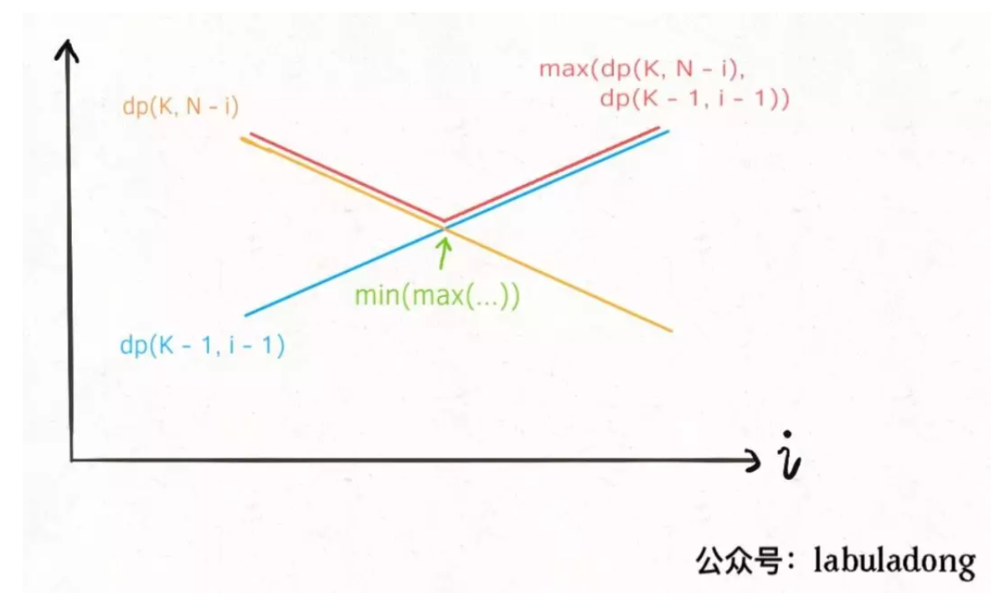

这样就可以简单的基于二分法来求解这样的优化过程，需要注意的是：

**递增递减，但是不是线性的递增递减，所以不能直接找中间序号要用二分查找傻逼**

```c++
class Solution {
private:
    // bool isdefined = false;
    // vector<vector<int>> mindrop;
public:
    int superEggDrop(int K, int N) {
        if(!N) return 1;
        if(K==1) return N;
        vector<vector<int>> DP (K, vector<int> (N+1,N+1));
        // 要记住鸡蛋的个数要和序号有-1的关系
        // 状态初始化，如果只有一个鸡蛋的话，就需要从头到尾遍历
        for(int i =0;i<N+1;i++) DP[0][i] = i; // 刚刚这里写错了
        for(int i =0;i<K;i++) DP[i][0] = 0;
        for(int i =0;i<K;i++) DP[i][1] = 1;
        // 进入状态转移的循环阶段，Bottom-UP
        for(int i =1;i<K;i++)
        {
            for(int j=1;j<N+1;j++)
            {
                // 进行二分法优化。

                // // runtime limit， so we must optimal it .
                // for(int iner=1; iner<=j;iner++)
                // {
                //     // 最内层循环进行最优先的迭代，也就是模拟上限变化的过程
                //     // max是计算出最差情况下的状态转移方程 min是指最优选择
                //     DP[i][j] = min(DP[i][j], 1+max(DP[i-1][iner-1],DP[i][j-iner]));
                // }
                int l=1, r=j;
                int iner;
                while(l<=r)
                {
                    iner = (l+r)>>1;
                    if (DP[i-1][iner-1]<= DP[i][j-iner]) {
                        l = iner+1;
                    }else{
                        r = iner-1;
                    }
                }
                iner = r;
                DP[i][j] = min(DP[i][j], 1+max(DP[i-1][iner-1],DP[i][j-iner]));
                
            }
        }
        return DP[K-1][N];
    }
};
```

##### 戳气球问题（312）

也是个动态规划的问题，遍历所有情况选取最优，但是我觉得其实还能有别的解法，也就是从小到大选数，但是边界值还是要特殊处理，后续看看这种想法能不能写吧。动态规划的方法在我的GoodNote中写了，时间效率一般，看看别人的解答

**首先给出动态规划情况下的思路和解答**

```c++
class Solution {
public:
    int maxCoins(vector<int>& nums) {        
        if(nums.empty()) return 0;
        // 首尾不包含
        nums.insert(nums.begin(),1);
        nums.push_back(1);
        int n = nums.size();
        // 加了两个之后的size
        vector<vector<int>> DP(n,vector<int>(n,0));
        // 从下往上遍历，从左往右遍历
        for(int i = n-2; i>=0;i--)
        {
            for(int j =i+1; j<n; j++)
            {
                for(int k =i+1;k<j;k++)
                {
                    DP[i][j] = max(DP[i][j], nums[k]*nums[i]*nums[j]+DP[i][k]+DP[k][j]);
                }

            }
        }
        return DP[0][n-1];
    }
};
```

#### 博奕问题

**博弈类问题的套路都差不多，下文举例讲解，其核心思路是在二维 dp 的基础上使用元组分别存储两个人的博弈结果。**下面引入一个例题

**PAIR**

将石头问题改的根据被一般性：

> 石头的堆数可以是任意正整数，石头的总数也可以是任意正整数，这样就能打破先手必胜的局面了。比如有三堆石头 `piles = [1,100,3]`，先手不管拿 1 还是 3，能够决定胜负的 100 都会被后手拿走，后手会获胜。
>
> **假设两人都很聪明**，请你设计一个算法，返回先手和后手的最后得分（石头总数）之差。比如上面那个例子，先手能获得 4 分，后手会获得 100 分，你的算法应该返回 -96。

实际上还是和上面的一样，没什么区别，就是，要用元组**（Pair）in CPP**，然后选取单步最优吧，后面的最优交给后面的去搜索得到。动态规划吗唔。实际上就还是遍历所有的解法。所以我们不用考虑搜索的策略。

#### 四键键盘问题

[第二种思路很有参考意义，第一种方法比较常规但是实际上反而没那么容易想到，效果也比较拉跨，不推荐学习。](https://mp.weixin.qq.com/s?__biz=MzAxODQxMDM0Mw==&mid=2247484469&idx=1&sn=e8d321c8ad62483874a997e9dd72da8f&chksm=9bd7fa3daca0732b316aa0afa58e70357e1cb7ab1fe0855d06bc4a852abb1b434c01c7dd19d6&scene=21#wechat_redirect)

#### :star:股票问题

根据FA中的讲解，这一部分我们对股票问题的分析分为两步，第一步是实现基本的动态规划解题框架；第二步是学习一下针对这类问题进阶的**状态机解法**的问题；

首先LeetCode中的第一题股票问题就很简单，没什么好多说的，实际上分析问题是一个单次遍历求解最优值的过程；（问题分析能大大的减少复杂度）；

然后我们可以从第二题引出我们的**动态规划解法的框架**：

第二题实际上也给出了我们对于动态规划应用情景的更好理解: 也就是那种分段式的结构，只是把i,j从i到j修改成了买入和卖出而已。这就是股票问题的一个框架把。

> 给定一个数组，它的第 *i* 个元素是一支给定股票第 *i* 天的价格。
>
> 设计一个算法来计算你所能获取的最大利润。你可以尽可能地完成更多的交易（多次买卖一支股票）。
>
> **注意：**你不能同时参与多笔交易（你必须在再次购买前出售掉之前的股票）。

框架的具体实现（伪代码）：

```python
def maxProfit(prices):
	res = 0;
	for buy in range(len(prices)):
		for sell in range(buy+1, len(prices)):
			res = max(res, maxprofit(prices[sell+1:])+prices[sell]-prices[buy])
	return res
```

第二题算法问题具体实现（第一题在代码中）

这题使用这样递归的动态规划方法的话，确实是很简单，但是如果想要Bottom-Up去写好像还是比较麻烦的，也可能是这个定义不够好。

> 初始的动态规划的思路，一维数组，存储的是从今天开始的买入卖出的最优解，但是这样的话，状态转移方程实际上是不好列的;（我们无法确定状态转移房方程）（可能还要多加一层循环把。）
>
> 同样如果我们设置为是从今天开始买入的最优解，这样我写的状态转移方程会导致一个问题，就是后续的sell和buy绑定了，就会没有遍历到所有情况。（:x:）（可能还要多加一层循环才能实现）

:star:**官方的具体解法(考虑到现在手上是否持有股票)这应该就是C++情况下最合理的动态框架了**

> 考虑到「不能同时参与多笔交易」，因此每天交易结束后只可能存在手里有一支股票或者没有股票的状态。然后根据有没有股票来进行四种状态转移。
>
> 定义状态 表示第 ii 天交易完后手里没有股票的最大利润， 表示第 ii 天交易完后手里持有一支股票的最大利润（ii 从 00 开始）。
>

```c++
class Solution {
public:
    int maxProfit(vector<int>& prices) {
        int n = prices.size();
        int dp[n][2];
        dp[0][0] = 0, dp[0][1] = -prices[0];
        for (int i = 1; i < n; ++i) {
            dp[i][0] = max(dp[i - 1][0], dp[i - 1][1] + prices[i]);
            dp[i][1] = max(dp[i - 1][1], dp[i - 1][0] - prices[i]);
        }
        return dp[n - 1][0];
    }
};
```

可以将其中的空间复杂度优化为如下形式：

```c++
class Solution {
public:
    int maxProfit(vector<int>& prices) {
        int n = prices.size();
        int dp0 = 0, dp1 = -prices[0];
        for (int i = 1; i < n; ++i) {
            int newDp0 = max(dp0, dp1 + prices[i]);
            int newDp1 = max(dp1, dp0 - prices[i]);
            dp0 = newDp0;
            dp1 = newDp1;
        }
        return dp0;
    }
};
```

还有一种解法就是下面的贪心算法，只要是正数我们就加的办法，下一个比上一个大，我们就卖，很简单。

```c++
int res = 0;
for(int i =0; i<prices.size()-1; i++)
{
    if(prices[i+1]>prices[i]) res += (prices[i+1]- prices[i]);
}
return res;
```

##### 问题的变体：

第三题，和第四题，都是限定了交易次数：如果使用的是递归的框架的话，就直接添加一个次数约束就可以了。上面的动态规划解法的话，给Dp添加一个次数的约束，然后在进行传递就可以了，后面自己修改一下写上来。

第五题，资金要冻结一天，也就是要加一天才开始交易，稍微改一下就行了；

第六题，每次卖出需要手续费，我们只需要在+price的时候把手续费扣除就可以了。

##### :small_red_triangle: 状态机解法：

状态机解法实际上就是基于官方解法的一种写法，也就是通过这个题目中的状态的转移来列DP方程把。然后基于这种分析方式的话，对于这道题来说，是一个通用的列方程的思路把。

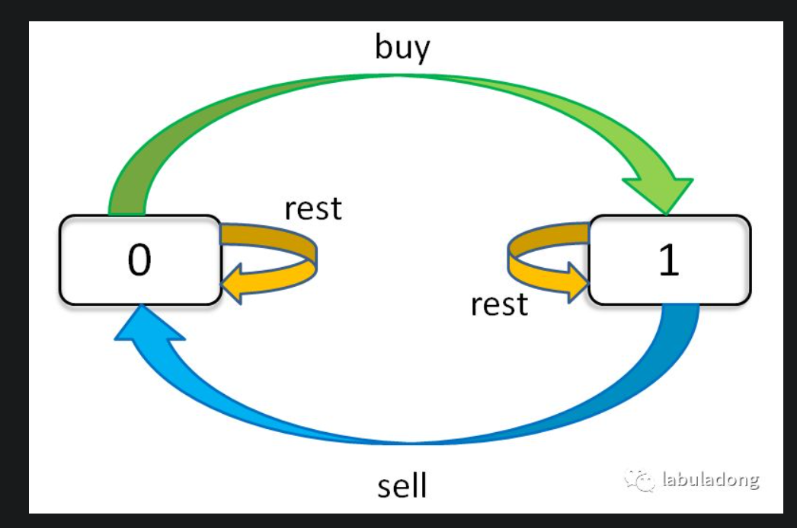

实际上总结一下这些状态转移就是

```c++
base case:
dp[-1][k][0] = dp[i][0][0] = 0;
dp[-1][k][1] = dp[i][0][1] = -INT_MAX;
Transfer:
dp[i][k][1] = max(dp[i-1][k][1], dp[i-1][k][0] - prices[i]);
dp[i][k][0] = max(dp[i-1][k][0], dp[i-1][k][1] + prices[i]);
```

按照这个框架去进行遍历就完事了，6题都可以按照这个框架去写，真的就是通用解，但是时间效率好像也不是特别高，但是需要注意的是，当k是无穷我们就不用特别的去约束，但是当k是有限值的时候，我们就记得要对k进行遍历，内层循环。

1. 还有更为关键的点是（唯一的Hard，买卖的最佳时期的第三题）也就是只有两种k的时候，我们实际上可以重新分析这个状态转移，也就是，重新构筑这个状态表，改变一下原本的迭代形式。
2. 另一点就是，我实在是不想用new，怎么用vector来建立这样一个3元组呢？到时候看看有没有示例代码；（pair？tuple？or something else？）**官方直接用两个向量来表示了**

> 由于我们最多可以完成两笔交易，因此在任意一天结束之后，我们会处于以下五个状态中的一种：
> 1.未进行过任何操作；
> 2.只进行过一次买操作；
> 3.进行了一次买操作和一次卖操作，即完成了一笔交易；
> 4.在完成了一笔交易的前提下，进行了第二次买操作；
> 5.完成了全部两笔交易。

```c++
class Solution {
public:
    int maxProfit(vector<int>& prices) {
        if(prices.empty()) return 0;
        int n = prices.size();
        int s1 = -prices[0]; int s2 = 0; //我可以不买，所以一定是0不是int——min
        int s3 = INT_MIN; int s4 = 0; 
        for(int i =1;i<n;i++){
            s1 = max(s1, -prices[i]); //第一次买入可以任何时候
            s2 = max(s2, s1+prices[i]); // 在此刻第一次卖出
            s3 = max(s3, s2-prices[i]); // 第二次 买入
            s4 = max(s4, s3+prices[i]);
        }
        return s4;
    }
};
```

限制了K次的情况,这里实现的时候有很多的细节，但是我觉得基于k的哪个东西有点不合理，所以我们试着用FA中的思路后面重写一下这个框架，其实要改的地方也不是特别多，稍微改几个象征值就可以了。

```c++
class Solution {
public:
    int maxProfit(int k, vector<int>& prices) {
        if(prices.empty()) return 0;
        int n = prices.size();
        // BUY 表示已经持有股票的情况
        // SELL 表示手上啥都没有的情况
        k = min(k,n/2);
        vector<vector<int>> DPBuy(n,vector<int>(k+1));
        vector<vector<int>> DPSell(n,vector<int>(k+1,0));
        // basecase;

        DPBuy[0][0] = -prices[0];
        for(int i = 1;i<=k;i++){
            DPBuy[0][i] = DPSell[0][i] = INT_MIN/2; // 由于我们还要减去一些值，所以这里小但是也不要小的太过分
        }
        // ++ i 和i++ 在for循环里面是一样的，但是性能上在大量使用的时候++更好一些。
        for(int i = 1;i<n;i++)
        {
            // 为什么这个时候要用作-price[I]
            DPBuy[i][0] = max(DPBuy[i-1][0],-prices[i]);
            for(int j = 1;j<=k;j++)
            {
                // 只在购买添加操作数，不在卖出添加炒作书
                DPBuy[i][j] = max(DPBuy[i-1][j], DPSell[i-1][j]-prices[i]);
                DPSell[i][j] = max(DPSell[i-1][j],DPBuy[i-1][j-1]+prices[i]);
            }
        }
        return *max_element(DPSell[n-1].begin(),DPSell[n-1].end());
    }
};
```

加税的方法的话，就是要记得如果是在buy的时候扣税，记得在初始化的那次也要扣。在购买的时候扣就不用了。

#### 打家劫舍问题

实际上是动态规划的问题，以及一些约束情况下的变体，我们要掌握到其中的精髓，进行分析；

- 首先对动态规划的问题进行分析的时候我们都要好好的想一下到底是要用一维的表还是用二维的表；（不要使用冗余的操作）
- 然后还是一样的进行存储空间的压缩就行；

**打家劫舍1（198）**

这一题的分析很容易可以知道是这样的情况：（我们可以反向分析，这样的话，就不需要修改Loop的方向了）

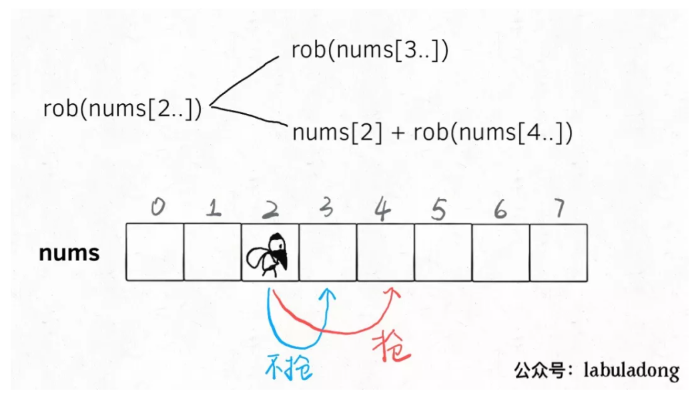

具体的代码实现和相应的空间优化后的结果如下：（100 98）

```c++
int rob(vector<int>& nums) {
    if(nums.empty()) return 0;
    // 两个相邻的房屋无法取到实际上就是一个简单的状态转移的问题；
    int n = nums.size();
    // vector<int> DP(n+1,0);
    // 实际上就是一个单项的偷盗图
    // BaseCases
    // DP[0] = 0;
    // DP[1] =nums[0]; 
    // for(int i=2;i<=n;i++){
    //     DP[i] = max(nums[i-1]+ DP[i-2], DP[i-1]); 
    // }
    // return DP[n];
    // 基于参数的特性进行存储空间优化
    int d0 = 0; int d1 = nums[0];

    for(int i =1;i<n;i++){
        int temp = d1;
        d1 = max(d0 + nums[i], d1);
        d0 = temp;
    }
    return d1;
}
```

**打家劫舍Ⅱ**  第二题和第一题的区别就在于，这个房子是围成一圈的，所以就是，首尾相连的序列，（这应该会使得边界条件更加的复杂，或者引入新的约束）

问题分析：这题仔细分析以后实际上可以发现就是要么是不包含头，要么是不包含尾（为0），两个取最大值就好了。稍微修改

**打家劫舍Ⅲ** 这一题的特点在于房屋的分布是二叉树，最基本的思想还是这样就是，不买就跳下一级，买就跳两级，DP存储就行；

但是这一题还有一个更加精妙的解法，就是像股票那样，存储该节点购买和不购买的两种情况，通过这种情况进行转移函数就行，这题的话参考官方解法的写法更清楚，而且还有后续优化的结果。

常规解法（my）

```c++
class Solution {
private:
    unordered_map<TreeNode*, int> DP;
public:
    int rob(TreeNode* root) {
        if(!root) return 0;
        if(DP.find(root)!= DP.end()) return DP[root];
        // if(DP.contains(root)) return DP[root];
        int robres = rob(root->left)+ rob(root->right);
        int unrobres = root->val;
        unrobres += !root->left? 0: (rob(root->left->left) +rob(root->left->right));
        unrobres += !root->right? 0: (rob(root->right->left) + rob(root->right->right));
        int res = max(robres, unrobres);
        DP[root] = res;
        return res;
    }
};
```


```c++
1. 结合了后续遍历框架：因为我们要知道后续的值才能对前序的值进行处理，所以我们需要先遍历后面的
我们可以用 f(o) 表示选择 o 节点的情况下，o 节点的子树上被选择的节点的最大权值和；g(o) 表示不选择 o 节点的情况下，o 节点的子树上被选择的节点的最大权值和；l 和 r 代表 o 的左右孩子。

class Solution {
public:
    unordered_map <TreeNode*, int> f, g;

    void dfs(TreeNode* node) {
        if (!node) {
            return;
        }
        dfs(node->left);
        dfs(node->right);
        f[node] = node->val + g[node->left] + g[node->right];
        g[node] = max(f[node->left], g[node->left]) + max(f[node->right], g[node->right]);
    }

    int rob(TreeNode* root) {
        dfs(root);
        return max(f[root], g[root]);
    }
};
```

**这题的优化写法十分的值得参考，我们如何利用我们自己创造的数据结构**,实际上和股票的是一样的也就是传输之前的买和没买的问题

```c++
struct SubtreeStatus {
    int selected;
    int notSelected;
};

class Solution {
public:
    SubtreeStatus dfs(TreeNode* node) {
        if (!node) {
            return {0, 0};
        }
        auto l = dfs(node->left);
        auto r = dfs(node->right);
        int selected = node->val + l.notSelected + r.notSelected;
        int notSelected = max(l.selected, l.notSelected) + max(r.selected, r.notSelected);
        return {selected, notSelected};
    }

    int rob(TreeNode* root) {
        auto rootStatus = dfs(root);
        return max(rootStatus.selected, rootStatus.notSelected);
    }
};

```

#### 回文问题终结版：最小代价构造回文串（1312）

是一个非常典型的动态规划的问题，这种子串的问题通常就是基于二维的DP Table去做，那么实现上就是，存储的就是从i,j的字符，构造成回文串的最少次数。

但是这一题有个陷阱，通常来说，我们分析回文串的问题都是从中间向两端拓展的，但是如果我们每次拓展都直接判断两端的拓展是否相等的话，（+2）这样对于数组完全相等，只需要加1的情况就缺乏了考虑。

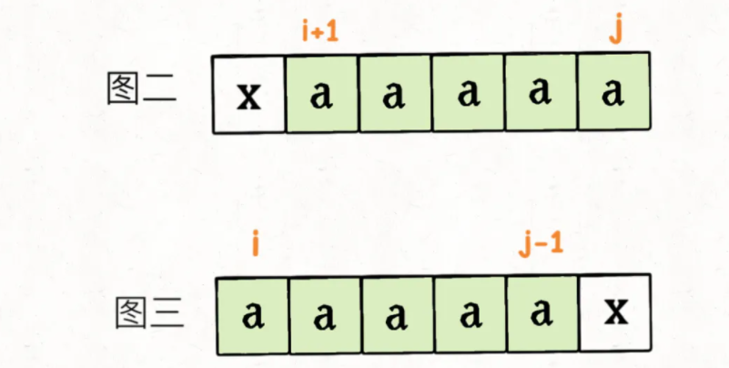

**解决的方式** 我们只需要一边一边的加就可以了 状态转移方程 = max 左或右 +1；

基本的解决方法(可以在算法的基础上进行空间压缩，只需要一个向量

```c++
class Solution {
public:
    int minInsertions(string s) {
        if(s.empty()) return 0;
        int n = s.size();
        // 建立存储表和初始化参数（单个或者是边界都是0）
        vector<vector<int>> DP(n,vector<int>(n,0));
        // 遍历方向，从从下到上，从左到右
        for(int i=n-2; i>=0; i--){
            for(int j=i+1; j<n; j++){
                // 搜先判断延拓的情况是是否是相等的
                if(s[i] == s[j]) DP[i][j] = DP[i+1][j-1];
                else DP[i][j] = min(DP[i+1][j], DP[i][j-1]) +1;
            }
        }
        return DP[0][n-1];
    }
};
```

数据压缩后的结果，这个压缩方案实际上比较常见，用代码取解读的话也比较好解读

```c++
if(s.empty()) return 0;
int n = s.size();
vector<int> DP(n,0);
for(int i=n-2; i>=0; i--){
    int pre = 0;
    for(int j=i+1; j<n; j++){
        // 搜先判断延拓的情况是是否是相等的
        int temp = DP[j]; // 到下一轮编程i+1 j-1的值 ，在本轮是i+1，j的值（未更新）
        if(s[i] == s[j]) DP[j] = pre;
        else DP[j] = min(DP[j], DP[j-1])+1;
        pre = temp; // 经典压缩策略
    }
}
return DP[n-1];
```


### 贪心算法：动态规划的特例

[FA中对贪心算法的简单讲解](https://mp.weixin.qq.com/s?__biz=MzAxODQxMDM0Mw==&mid=2247484493&idx=1&sn=1615b8a875b770f25875dab54b7f0f6f&chksm=9bd7fa45aca07353a347b7267aaab78b81502cf7eb60d0510ca9109d3b9c0a1d9dda10d99f50&scene=21#wechat_redirect)

贪心算法实际上是动态规划中每一步都取最优结果的特例，实际上满足这种条件的问题并不是太多，但是这种情况下的效率是更高的。但是想博弈问题这种就不能使用贪心算法。

举个例子，典型的贪心算法：

> 本文解决一个很经典的贪心算法问题 Interval Scheduling（区间调度问题）。给你很多形如`[start,end]`的闭区间，请你设计一个算法，**算出这些区间中最多有几个互不相交的区间**。

也许我们可以每次选择可选区间中开始最早的那个？但是可能存在某些区间开始很早，但是很长，使得我们错误地错过了一些短的区间。

或者我们每次选择可选区间中最短的那个？或者选择出现冲突最少的那个区间？这些方案都能很容易举出反例，不是正确的方案。

**正确的思路**（怎么去贪）其实很简单，可以分为以下三步：

1. 从区间集合 intvs 中选择一个区间 x，这个 x 是在当前所有区间中**结束最早的**（end 最小）。
2. 把所有与 x 区间相交的区间从区间集合 intvs 中删除。
3. 重复步骤 1 和 2，直到 intvs 为空为止。之前选出的那些 x 就是最大不相交子集。

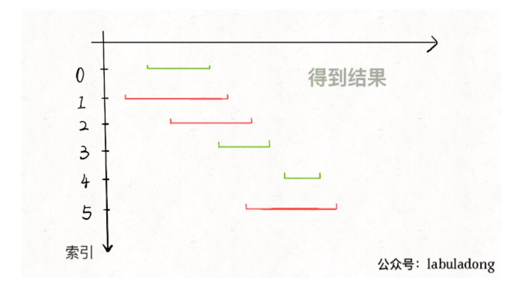

```c++
// 代码的具体实现大致如下：
sort (array1, [](const int& A, const int& B){return B[1]>A[1];});
//然后遍历通过尾巴来选就行了。
```

##### 无重叠区间（435）

实际上和上面的分析是一模一样的情况，就是return的计数值不一样而已。 无需多言

```c++
class Solution {
public:
    int eraseOverlapIntervals(vector<vector<int>>& intervals) {
        if(intervals.empty()) return 0;
        sort(intervals.begin(),intervals.end(),\
            [](const auto& A,const auto& B){return A[1]<B[1];});
        int eol = intervals[0][1];
        int count = 1;
        for(auto& list : intervals){
            if(list[0]>=eol){
                eol = list[1];
                count++;
            }
        }
        return intervals.size() - count;
    }
};
```

##### 用最少数量的箭社保气球（452）

实际上和上一题一摸一样，就是题目描述不一样罢了，同时边界擦伤的条件也不一样，改个下小于等于就行了。

```c++
class Solution {
public:
    int findMinArrowShots(vector<vector<int>>& points) {
        if(points.empty()) return 0;
        sort(points.begin(),points.end(),\
            [](const auto& A,const auto& B){return A[1]<B[1];});
        int eol = points[0][1];
        int count = 1;
        for(auto& list : points){
            if(list[0]>eol){
                eol = list[1];
                count++;
            }
        }
        return count;
    }
};
```

##### JUMP GAME(55)

很简单的动态规划的思路，需要注意的只要那个break不能直接return，考虑[0]的情况。

1.这题主要需要我们脑子清醒，很明晰那，《最远距离的就是我们的所有可达点（就算有0也会被绕过。）， 
2.除非我们可达点无法再前进了（我们能走到的地方《=当前战力的位置），我们才false，不然我们就能一直前进到终点

```c++
class Solution {
public:
    bool canJump(vector<int>& nums) {
        int n  = nums.size();
        int farthest = 0;
        for (int i=0;i<n;i++)
        {
            farthest = max(farthest,i+nums[i]);
            if (farthest<=i) break;
        }
        return farthest>=(n-1);
    }
};
```

这实际上还是动态规划，实际的贪心算法在后面的进阶版。

##### JUMP GAME2（45）

这一题如果用基本的动态规划思想的话，自底向上和自顶向下都比较好些，就是存储，到当前格子需要的最少步数就可以了。

我的自底向上的思路：

```c++
class Solution {
public:
    int jump(vector<int>& nums) {
        // 后续可以尝试一下自顶向下的写法，这种写法比较傻逼，但是也可以尝试掌握
        // 这题不用贪心算法的话，后面有个很恶心的东西不让做
        // 下面这是基本的自底向上的方法，
        vector<int> DP (nums.size(),INT_MAX);
        DP[0]=0;
        // DP 存储到到这里需要多少步
        for(int i =0; i<nums.size();i++){
            int step = nums[i];
            for (int j =1;j<= step;j++){
                if(i+j<nums.size())
                    DP[i+j] = min(DP[i+j],DP[i]+1);
            }
        }
        // for(int&data : DP)
        //     cout<<data<<endl;
        return DP[nums.size()-1];
        // 测试一下自顶向下
        
    }
};
```

自顶向下的思路：

```c++
从尾到头，走到尾巴需要多少步。深度有限遍历把，实际上是一种递归的解法、传统的递归分析方法，回顾一下递归的思路。
class Solution {
public:
    vector<int> memo;
    int jump(vector<int>& nums) {
        int n = nums.size();
        // 备忘录都初始化为 n，相当于 INT_MAX
        // 因为从 0 调到 n - 1 最多 n - 1 步
        memo = vector<int>(n, n);
        return dp(nums, 0);
    }

    int dp(vector<int>& nums, int p) {
        int n = nums.size();
        // base case
        if (p >= n - 1) {
            return 0;
        }
        // 子问题已经计算过
        if (memo[p] != n) {
            return memo[p];
        }
        int steps = nums[p];
        // 你可以选择跳 1 步，2 步...
        for (int i = 1; i <= steps; i++) {
            // 穷举每一个选择
            // 计算每一个子问题的结果
            int subProblem = dp(nums, p + i);
            // 取其中最小的作为最终结果
            memo[p] = min(memo[p], subProblem + 1);
        }
        return memo[p];
    }
};
```

上面两种方法虽然都可以事项，但是时间复杂度上出了问题，没办法再有效的时间内解决这个，往往会超出时间闲置。所以实际上是需要贪心算法的。

怎么实现贪心的思路呢？

> 但是，真的需要「递归地」计算出每一个子问题的结果，然后求最值吗？**直观地想一想，似乎不需要递归，只需要判断哪一个选择最具有「潜力」即可**：
>
> 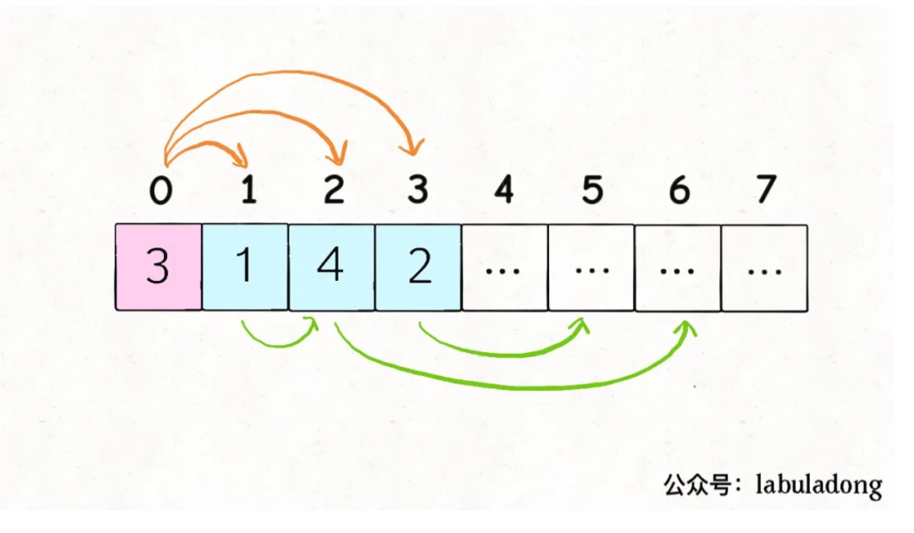

我们完全可以跳过那些被包含的情况，所以YOU KNOW

**具体实现：（学）**

这里主要是我们怎么去递增那个end可以学一下，其他的没啥，很容易想到这个贪心的思路

```c++
class Solution {
public:
    int jump(vector<int>& nums) {
        // 后续可以尝试一下自顶向下的写法，这种写法比较傻逼，但是也可以尝试掌握
        // 这题不用贪心算法的话，后面有个很恶心的东西不让做
        // 下面这是基本的自底向上的方法，
        int n = nums.size();
        int end = 0, farthest = 0;
        int jumps = 0;
        for (int i = 0; i < n - 1; i++) {
            //提前更新一次，达到几次这种最远点，就+几次，
            farthest = max(nums[i] + i, farthest);
            if (end == i) {
                jumps++;
                end = farthest;
            }
        }
        return jumps;

    }
};
```

### KMP算法：动态规划下属

**著名的字符串匹配算法** 效率很高，但是确实比较[复杂](https://mp.weixin.qq.com/s?__biz=MzAxODQxMDM0Mw==&mid=2247484731&idx=2&sn=d9d6b24c7f94d5e43e08666e82251984&chksm=9bd7fb33aca0722548580dd27eb49880dc126ef87aeefedc33aa0f754f54691af6b09b41f45f&scene=21#wechat_redirect)；

> **先在开头约定，本文用`pat`表示模式串，长度为`M`，`txt`表示文本串，长度为`N`。KMP 算法是在`txt`中查找子串`pat`，如果存在，返回这个子串的起始索引，否则返回 -1**。

这个题目时要匹配完全一致的，也就是顺序不能打乱或者跳过的那种子串

遍历的解法如下所示：（伪代码）

```cpp
int search(String pat, String txt) {
    int M = pat.length;
    int N = txt.length;
    for (int i = 0; i <= N - M; i++) {
        int j;
        for (j = 0; j < M; j++) {
            if (pat[j] != txt[i+j])
                break;
        }
        // pat 全都匹配了
        if (j == M) return i;
    }
    // txt 中不存在 pat 子串
    return -1;
}
```

但是这样就有很多完全不需要考虑的不可能的情况的计算无法跳过了，所以我们希望使用一些存储空间来辅助算法的进行。

**KMP特点**永不回退指针i，不走回头路，也就是不会对txt进行重复的多次扫描，会利用DP数组中的信息将pat移到正确的位置来继续匹配。

那么这个数组如何构建呢？（**确定有限状态自动机**）

**这个DP只与pat相关，与Txt没有任何关系**

实际上就是构建状态转移图，然后根据状态转移图来跳转：（这里省略了到0）

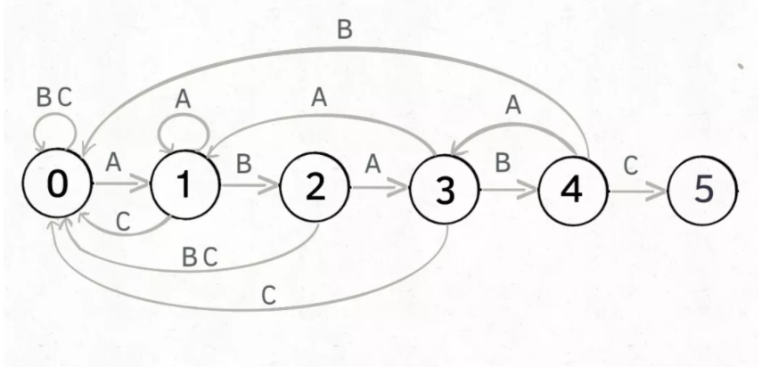

这个DP数组的定义方式：

```cpp
dp[j][c] = next
0 <= j < M，代表当前的状态
0 <= c < 256，代表遇到的字符（ASCII 码）
0 <= next <= M，代表下一个状态

dp[4]['A'] = 3 表示：
当前是状态 4，如果遇到字符 A，
pat 应该转移到状态 3

dp[1]['B'] = 2 表示：
当前是状态 1，如果遇到字符 B，
pat 应该转移到状态 2
```

根据上面的数组可以构建出这样的状态转移过程

```cpp
public int search(String txt) {
    int M = pat.length();
    int N = txt.length();
    // pat 的初始态为 0
    int j = 0;
    for (int i = 0; i < N; i++) {
        // 当前是状态 j，遇到字符 txt[i]，
        // pat 应该转移到哪个状态？
        j = dp[j][txt.charAt(i)];
        // 如果达到终止态，返回匹配开头的索引
        if (j == M) return i - M + 1;
    }
    // 没到达终止态，匹配失败
    return -1;
}
```

所以整个DP数组的构建状态：

```cpp
for 0 <= j < M: # 状态
    for 0 <= c < 256: # 字符
        dp[j][c] = next;
```

实际上就是一种匹配和另一种回退的状态变迁，但是这种状态回退该怎么设置，**影子状态**的思想：

<u>和当前的状态具有相同的前缀的状态就是影子状态（类似双指针算法用来辅助）</u>那么具体怎么实现呢？前缀的长度？

就可以改进上面的代码如下：

```cpp
int X # 影子状态
for 0 <= j < M:
    for 0 <= c < 256:
        if c == pat[j]:
            # 状态推进
            dp[j][c] = j + 1;
        else: 
            # 状态重启
            # 委托 X 计算重启位置
            dp[j][c] = dp[X][c];
```

**完整的最终代码如下**

```cpp
public class KMP {
    private int[][] dp;
    private String pat;

    public KMP(String pat) {
        this.pat = pat;
        int M = pat.length();
        // dp[状态][字符] = 下个状态
        dp = new int[M][256];
        // base case，也就是遇到了第一个字符才能转移到1
        dp[0][pat.charAt(0)] = 1;
        // 影子状态 X 初始为 0
        int X = 0;
        // 当前状态 j 从 1 开始
        for (int j = 1; j < M; j++) {
            for (int c = 0; c < 256; c++) {
                if (pat.charAt(j) == c) 
                    dp[j][c] = j + 1;
                else 
                    dp[j][c] = dp[X][c];
            }
            // 更新影子状态 影子状态的更新，是随着j的更新而更新的
            X = dp[X][pat.charAt(j)];
        }
    }

    public int search(String txt) {...}
}
```

这里解释一下影子的更新具体是如何做到，这里从文章中抄一下

```cpp
这里的状态如下：
int X = 0;
for (int j = 1; j < M; j++) {
    ...
    // 更新影子状态
    // 当前是状态 X，遇到字符 pat[j]，
    // pat 应该转移到哪个状态？
    X = dp[X][pat.charAt(j)];
}
而搜索过程中：
int j = 0;
for (int i = 0; i < N; i++) {
    // 当前是状态 j，遇到字符 txt[i]，
    // pat 应该转移到哪个状态？
    j = dp[j][txt.charAt(i)];
    ...
}
```

**其中的原理非常微妙**，注意代码中 for 循环的变量初始值，可以这样理解：后者是在`txt`中匹配`pat`，前者是在`pat`中匹配`pat[1:]`，状态`X`总是落后状态`j`一个状态，与`j`具有最长的相同前缀。所以我把`X`比喻为影子状态，似乎也有一点贴切。

另外，构建 dp 数组是根据 base case`dp[0][..]`向后推演。这就是我认为 KMP 算法就是一种动态规划算法的原因。

:star: 下面来看一下状态转移图的完整构造过程，你就能理解状态`X`作用之精妙了：

```cpp
public class KMP {
    private int[][] dp;
    private String pat;

    public KMP(String pat) {
        this.pat = pat;
        int M = pat.length();
        // dp[状态][字符] = 下个状态
        dp = new int[M][256];
        // base case
        dp[0][pat.charAt(0)] = 1;
        // 影子状态 X 初始为 0
        int X = 0;
        // 构建状态转移图（稍改的更紧凑了）
        for (int j = 1; j < M; j++) {
            for (int c = 0; c < 256; c++)
                dp[j][c] = dp[X][c];
            dp[j][pat.charAt(j)] = j + 1;
            // 更新影子状态,因为一开始落后一步，然后后面是完全一样的更新，所以只有当
            // 又到达重复状态的时候，才会需要进行X的更新。
            X = dp[X][pat.charAt(j)];
        }
    }

    public int search(String txt) {
        int M = pat.length();
        int N = txt.length();
        // pat 的初始态为 0
        int j = 0;
        for (int i = 0; i < N; i++) {
            // 计算 pat 的下一个状态
            j = dp[j][txt.charAt(i)];
            // 到达终止态，返回结果
            if (j == M) return i - M + 1;
        }
        // 没到达终止态，匹配失败
        return -1;
    }
}
```

### 回溯算法详解

我们的目标是“[没有蛀牙](https://mp.weixin.qq.com/s?__biz=MzAxODQxMDM0Mw==&mid=2247484709&idx=1&sn=1c24a5c41a5a255000532e83f38f2ce4&chksm=9bd7fb2daca0723be888b30345e2c5e64649fc31a00b05c27a0843f349e2dd9363338d0dac61&scene=21#wechat_redirect)”，框架化回溯算法：实际上我好像也做了很多和回溯相关的题目了，和这里的思路对照一下；

**解决一个回溯问题，实际上就是一个决策树的遍历过程**。只需要考虑三个问题

**1、路径**：也就是已经做出的选择。

**2、选择列表**：也就是你当前可以做的选择。

**3、结束条件**：也就是到达决策树底层，无法再做选择的条件。

具体代码框架：**其核心就是 for 循环里面的递归，在递归调用之前「做选择」，在递归调用之后「撤销选择」** 我觉得这里应该就是存储一个中间结果来做把。通过具体的代码来看看

```cpp
result = []
def backtrack(路径, 选择列表):
    if 满足结束条件:
        result.add(路径)
        return

    for 选择 in 选择列表:
        做选择
        backtrack(路径, 选择列表)
        撤销选择
```

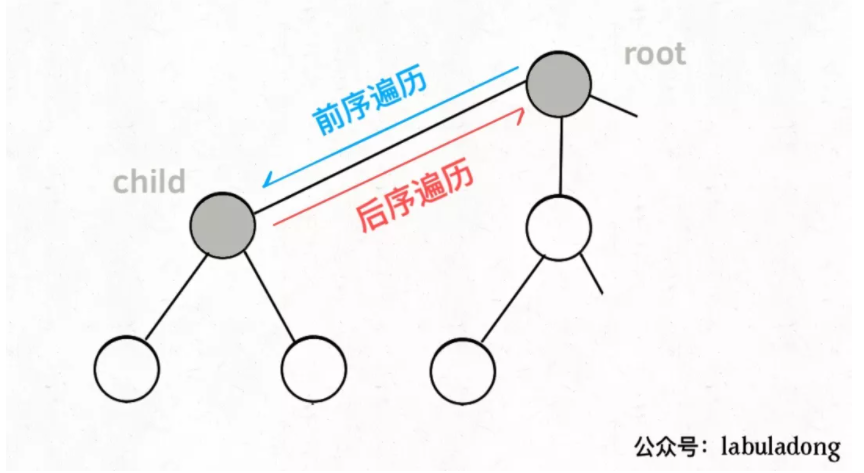

#### 全排列问题： 

**我们只要在递归之前做出选择，在递归之后撤销刚才的选择**，就能正确得到每个节点的选择列表和路径。（实际上这种通常和DFS并在一起用，先遍历了某个选择下的所有可能，然后回到之前的这个节点）

但是`vector`没有find之类的函数，所以我们可以通过index 和 swap操作区是实现这样的假装删除，

```cpp
class Solution {
public:
    void backtrack(vector<vector<int>>& res, vector<int>& output, int first, int len){
        // 所有数都填完了
        if (first == len) {
            res.emplace_back(output);
            return;
        }
        for (int i = first; i < len; ++i) {
            // 动态维护数组
            swap(output[i], output[first]);
            // 继续递归填下一个数
            backtrack(res, output, first + 1, len);
            // 撤销操作
            swap(output[i], output[first]);
        }
    }
    vector<vector<int>> permute(vector<int>& nums) {
        vector<vector<int> > res;
        backtrack(res, nums, 0, (int)nums.size());
        return res;
    }
};
```

#### N皇后问题：

实际上是一种特殊的全排列问题，我采取的方式是从上到下进行构建，这样的话判断valid以及遍历过程会清晰一些，同时我们每次只需要做一个单行的loop就行了，实际上就是一个典型的回溯问题，其中有一些需要注意的点

**数据类型**的使用，**边界条件的约束**，还有就是，数据变量的生存周期；

```c++
class Solution {
private:
    vector<vector<string>> res;
public:
    vector<vector<string>> solveNQueens(int n) {
        // 实际上就是全排列啊，不满足再取消就行了。
        // 问题在于怎么设置判断和返回条件。
        
        // 棋盘初始化，我们一列一列的开始遍历。
        vector<string>board(n, string(n,'.'));
        backtrack(board,0);
        return res;
    }
    void backtrack(vector<string>& board, int row){
        int n = board.size();
        if(row>=n) return;
        for(int j=0;j<n;j++){
            // 假如某行的每一个都不合法，那就说明之前的摆法已经没救了。
            if(!isValid(board, row, j)) 
            {
                // cout<<row<<"  "<<j<<endl;
                continue; 
            }
            // cout<<row<<"&"<<j<<"="<<"Q";
            board[row][j] = 'Q';
            if(row == n-1) {
                res.emplace_back(board);
                // cout<<endl;
                // 这里进行复原很容易忘记，这里需要注意一下，同时这个可以编程n，然后放到最前面去，效率可能会更高?
                board[row][j] = '.';
                continue;
            }
            backtrack(board, row+1);
            board[row][j] = '.';
        }
        return;
    }
    bool isValid(vector<string>& board, int row, int col){
        /* 对三种情况进行判断，上方，左前方和右前方
        由于我们是从上往下添加的，所以下方的情况暂时不用考虑 */

        int n = board.size();
        // situation1
        for(int i = row; i>=0; i--){
            if(board[i][col] == 'Q') return false;
        }
        // situation2 左上角
        int offset = 0;
        for(int i = row; i>=0; i--){
            if(col-offset<0) break;
            if(board[i][col-offset] == 'Q') return false;
            offset++;
        }
        // situation3 右上角
        offset = 0;
        for(int i = row; i>=0; i--){
            if(col+offset>=n) break;
            if(board[i][col+offset] == 'Q') return false;
            offset++;
        }
        return true;
    }
};
```

#### 子集问题

通过回溯或者迭代的方式来搜索子集，是一个典型但是实际上难度不是特别大的题目，可以用作基本的思路回顾。

```c++
class Solution {
private:
    vector<vector<int>> res;
public:
    vector<vector<int>> subsets(vector<int>& nums) {
        /* 实际上这题可以使用2.5种不同的思路去解决 
        1. 递归法：由于重叠子问题的存在和特殊性，（子问题的每一项加上新加入的一项）
        2. 回溯法：前序，也就是不断后移动start，然后逐个加入
        后续，使用pop出来的值来用（不是特别贴切）还是前一种好*/
        
        // 递归法
        // if(nums.empty()) return {{}};
        // int n = nums.back();
        // nums.pop_back();
        // vector<vector<int>> res = subsets(nums);
        // int size = res.size();
        // for(int i = 0; i <size; i++)
        // {
        //     res.emplace_back(res[i]);
        //     res.back().push_back(n);
        // }
        // return res;
        
        // 回溯法
        vector<int> tempv;
        int start = 0;
        backtrack(nums,tempv,0);
        return res;
        
    }
    void backtrack(vector<int>& nums,vector<int>& tempv, int start){
        res.push_back(tempv);
        int n = nums.size();
        for(int i=start; i<n; ++i){
            tempv.push_back(nums[i]);
            backtrack(nums,tempv,i+1);
            tempv.pop_back();
        }
        return ;

    }
};
```

#### 组合问题

实际上也就是典型的回溯框架，由于我们的[1,2]和[2,1]算是重复的两种情况，所以我们和上面一样用start来进行约束就可以了。就能避免重复组合的情况发生，还是在上面的框架上稍微改改.

这题实际上和上面的排列问题是一对，可以对照着看，看看两个方法编写上的**不同之处和相同之处**，实际上就是同个框架下的不同写法。

```c++
#include<vector>
using namespace std;

class Solution {
private:
    vector<vector<int>> res;
public:
    vector<vector<int>> combine(int n, int k) {
        if (k<=0 || n<=0) return res;
        vector<int> tempv;
        backtrack(n,k,0 ,tempv);
        return res;
    }
    void backtrack(int n, int k, int start,vector<int> tempv){
        if(tempv.size() == k) 
        {
            res.emplace_back(tempv);
            return;
        }
        for(int i =start; i<n;i++){
            tempv.push_back(i+1);
            backtrack(n,k,i+1,tempv);
            tempv.pop_back();
        }
    }
};
```

#### 解数独：

整体上，我非常的不同意这个作者写的代码，因为我觉得她的两个循环实际上是多余的，他的状态转移是有问题的。

由于一开始有是否有值的判断，所以那个for循环勉强还是可以的把，但是我觉得我的写法更好一些，这一题的主要问题在于。

- 如何终止搜索过程！，如何在找到一个解后就安然离去！！仔细思考。
- 还有那个else为什么很重要！！，没有这个else我们可能会讲原值给改了。

```cpp
#include<vector>
using namespace std;

class Solution {
public:
    void solveSudoku(vector<vector<char>>& board) {
        backtrack(board,0,0);
    }
    bool backtrack(vector<vector<char>>& board, int r, int c){
        // 这里的这个逻辑我有点没搞清楚，为什么要全进行m-n的遍历，我觉得是多余的
        // 首先继续宁测试，如果不对再说
        if(r==9) 
            return true;
        // 判断下一个位置：
        int nextr = r, nextc =c;
        nextc++;
        if(nextc>=9) {
            nextr++; 
            nextc=0;}

        // 判断返回值
        if(board[r][c]!='.') {
            // 
            if(backtrack(board,nextr,nextc))
                return true;
            else
                return false;
        }

        for(char ch = '1'; ch<='9'; ch++){
            if(!isValid(board, r, c, ch)) continue;
            
            board[r][c] = ch;
            if(backtrack(board,nextr,nextc)) return true;
            // 问题应该是出在，找到了解以后没有返回的问题
            board[r][c] = '.';
            
        }
        return false;

    }
    bool isValid(vector<vector<char>>& board, int r, int c, char ch){
        // 从上到下填，但是我们还是需要搜索整张棋盘，
        for (int i = 0; i<9; i++) {
            if(board[r][i] == ch) return false;
            if(board[i][c] == ch) return false;
            if(board[(r/3)*3+i/3][(c/3)*3 +i%3]==ch) return false;
        }
        return true;
    }
};
```

#### 合法括号生成：（22）回溯算法最佳实践

实际上的关键还是在于问题分析的部分：

**1、一个「合法」括号组合的左括号数量一定等于右括号数量，这个显而易见**。

**2、对于一个「合法」的括号字符串组合`p`，必然对于任何`0 <= i < len(p)`都有：子串`p[0..i]`中左括号的数量都大于或等于右括号的数量**。

然后就可以使用 回溯的基本框架来完成代码了。

- 结束的技巧和之前稍微有点不同可以学一下。

```c++
class Solution {
public:
    vector<string> generateParenthesis(int n) {
        if (n == 0) return {};
        // 记录所有合法的括号组合
        vector<string> res;
        // 回溯过程中的路径
        string track;
        // 可用的左括号和右括号数量初始化为 n
        backtrack(n, n, track, res);
        return res;
    }

    // 可用的左括号数量为 left 个，可用的右括号数量为 rgiht 个
    void backtrack(int left, int right, 
                    string& track, vector<string>& res) {
        // 若左括号剩下的多，说明不合法
        if (right < left) return;
        // 数量小于 0 肯定是不合法的
        if (left < 0 || right < 0) return;
        // 当所有括号都恰好用完时，得到一个合法的括号组合
        if (left == 0 && right == 0) {
            res.push_back(track);
            return;
        }

        // 尝试放一个左括号
        track.push_back('('); // 选择
        backtrack(left - 1, right, track, res);
        track.pop_back(); // 撤消选择

        // 尝试放一个右括号
        track.push_back(')'); // 选择
        backtrack(left, right - 1, track, res);
        track.pop_back(); // 撤消选择
    }
};
```

### BFS算法详解

BFS和DFS框架，实际上DFS在回溯算法中写了很多了，这实际上就是一回事，NOW我们来学习一下BFS。

>  *BFS 的核心思想应该不难理解的，就是把一些问题抽象成图，从一个点开始，向四周开始扩散。一般来说，我们写 BFS 算法都是用「队列」这种数据结构，每次将一个节点周围的所有节点加入队列。*
>
> ***BFS 相对 DFS 的最主要的区别是：**BFS 找到的路径一定是最短的，但代价就是空间复杂度比 DFS 大很多***。

问题的本质（广义描述）是：

**在一幅「图」中找到从起点`start`到终点`target`的最近距离，这个例子听起来很枯燥，但是 BFS 算法问题其实都是在干这个事儿。**

> 比如走迷宫，有的格子是围墙不能走，从起点到终点的最短距离是多少？如果这个迷宫带「传送门」可以瞬间传送呢？
>
> 再比如说两个单词，要求你通过某些替换，把其中一个变成另一个，每次只能替换一个字符，最少要替换几次？
>
> 再比如说连连看游戏，两个方块消除的条件不仅仅是图案相同，还得保证两个方块之间的最短连线不能多于两个拐点。你玩连连看，点击两个坐标，游戏是如何判断它俩的最短连线有几个拐点的？

**实现框架伪代码**

这个框架后面我们后面需要修正一下，便于贴切现在的版本，用我们自己的形式重新总结一下体系架构。

```cpp
// 计算从起点 start 到终点 target 的最近距离
int BFS(Node start, Node target) {
    Queue<Node> q; // 核心数据结构
    Set<Node> visited; // 避免走回头路

    q.offer(start); // 将起点加入队列
    visited.add(start);
    int step = 0; // 记录扩散的步数

    while (q not empty) {
        int sz = q.size();
        /* 将当前队列中的所有节点向四周扩散 */
        for (int i = 0; i < sz; i++) {
            Node cur = q.poll(); // 访问队列中的当前节点
            /* 划重点：这里判断是否到达终点 */
            if (cur is target)
                return step;
            /* 将 cur 的相邻节点加入队列 */
            for (Node x : cur.adj())
                if (x not in visited) {
                    q.offer(x);
                    visited.add(x);
                }
        }
        /* 划重点：更新步数在这里 */
        step++;
    }
}
```

其中adj：相邻节点；visited：不会走回头路，比如说二叉树之类的，就不需要这种结构。

#### 二叉树的最小高度（111）

首先这题实际上使用二叉树的普通遍历框架就已经能解决了，我们先给出一个常规解法的答案在这,然后我们便开始正经探讨到底要怎么解决这个问题，使用BFS的框架，我们现在使用的实际上仍然是DFS。

用这题来对DFS和BFS两种框架的解题思路进行比对和分析。

```cpp
class Solution {
private:
    int res = INT_MAX;
public:
    int minDepth(TreeNode* root) {
        if(!root) return 0;
        helpFind(root,0);
        return res;
    }
    void helpFind(TreeNode* root, int step){
        // 是没有子节点的节点，也就是左右节点都没有要注意区分
        if(!root){return;}
        step++;
        if(!root->left && !root->right)
        {
            if(step<res) res = step;
            return;
        }
        helpFind(root->right,step);
        helpFind(root->left,step);
    }
};
```

**BFS解题框架**

深度优先搜索，就是我之前希望的搜索思路，这样能够更快的结束这样的搜索过程，就能取得更高的时间和空间效率，在这里我们也对原本的解题框架，进行了一个修正。 

1. 利用patr 来取代depth的设置。
2. 原本框架中的循环好像是么必要的把。（必要的情况分析：如果需要一层一层的做的话，也就是深度+1在层次之外？）oh 不，就是利用pair就能解决这个问题，不需要这样一个循环了，也就是我们要明确深度+1的过程在哪里执行，当然他那样好像会更节省空间吧，

```cpp
class Solution {
private:
    // int res = INT_MAX;
public:
    int minDepth(TreeNode* root) {
        if(!root) return 0;
        queue<pair<TreeNode *, int>> q;
        // 初始化队列起点
        q.emplace(root,1);
        while(!q.empty()){
            // int sz = q.size();
            // for(int i=0;i<sz;i++){
            TreeNode *temp = q.front().first;
            int depth = q.front().second;
            if(!temp->right && !temp->left)
                return depth;
            if(temp->left != nullptr)
                q.emplace(temp->left, depth+1);
            if(temp->right != nullptr)
                q.emplace(temp->right,depth+1);
            q.pop();
            // }
        }
        return 0;
    }
};
```

#### 打开转盘锁（752）

这一题我觉得是可以使用回溯算法来做，但是好像标准的解法就是使用BFS的方法去做，这样做的话，我按照原本的框架写出了如下的代码，但是这样的代码的时间复杂度超过了题目要求的水准，所以是算法的优化还能提升还是说是其他写法的BFS问题呢？

可以优化：通过Unorder_set 来优化搜索的过程。具体的改进已经写进代码里了。

- 实际上就是看成一张图，然后同个时刻能做出的选择有8个，4个转盘分别从两边转，然后我们就看成是图传播，在解决一下重复和deadends就行了。

```cpp
class Solution {
public:
    int openLock(vector<string>& deadends, string target) {
        // 使用回溯法遍历所有的可能性,同时做出特殊的终结判断
        // 同时维护一个最小值,然后最终返回.

        // 正确理解题目的意思(每次只能转动单个转盘,而且只能移动一格)
        // 为什么使用BFS,最短路径,找到了就提前终止,同时是路径问题
        
        if (target.empty()) return -1; // 非法情况约束
        //初始化搜索队列
        // FIXME: 不走回头路这点怎么实现。hash_set?
        queue<pair<string, int>> que;
        unordered_set<string> visited;
        unordered_set<string> dead(deadends.begin(),deadends.end());
        que.emplace("0000", 0);
        // visited.insert("0000");

        while (!que.empty()) {
            //基于多个方向搜索。
            // FIXME: deadends 还没有建立排除的机制。
            string temp = que.front().first;
            
            int depth = que.front().second;
            if (temp == target) return depth;
            que.pop();
            if (visited.find(temp) != visited.end()) continue;
            //if (containsDeadend(temp, deadends)) continue;
            if(dead.find(temp) != dead.end()) continue;
            visited.insert(temp);
            for (int i = -4; i < 0; i++) {
                auto next = moveLock(temp, i);
                que.emplace(next,depth+1);
            }
            for (int i = 1; i < 5; i++) {
                auto next = moveLock(temp, i);
                que.emplace(next,depth+1);
            }
        }
        return -1;
    }
    string moveLock(string s1, int posandPN) {
        //由于实际上是涉及到生存周期的问题，但是实际上好像empalce不用考虑这个
        if (posandPN > 0 && posandPN <= 4)
        {
            if (s1[posandPN-1] == '9') s1[posandPN-1] = '0';
            else
                s1[posandPN-1] += 1;
        }
            
        else if (posandPN < 0 && posandPN >= -4) {
            if (s1[-posandPN-1] == '0') s1[-posandPN-1] = '9';
            else
                s1[-posandPN-1] -= 1;
        }
            
        return s1;
    }
    // bool containsDeadend(const string& s1, vector<string>& deadends) {
    //     for (string temp : deadends) {
    //         if (s1 == temp) return true;
    //     }
    //     return false;
    // }
};
```

#### 双向BFS优化

当我们**知道target所在的位置**(基本的前提)的时候，我们可以使用双向的BFS策略，也就是target搜索begin，begin搜索starget同时进行，这样的方式在时间效率上会快的，原因如下：

**传统的 BFS 框架就是从起点开始向四周扩散，遇到终点时停止；而双向 BFS 则是从起点和终点同时开始扩散，当两边有交集的时候停止**。

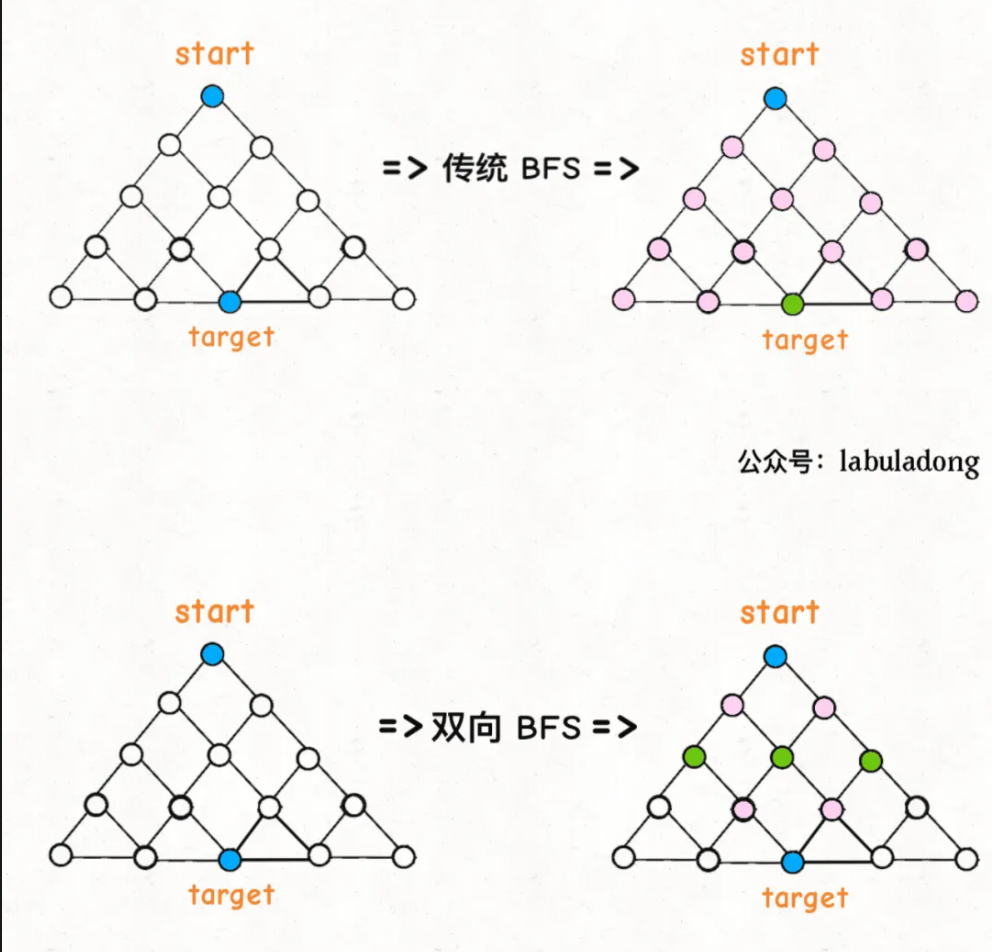

综上所述，这样的算法只能在打开转盘锁的时候使用，因为我们知道终点在哪里，但是这样就设计到一个问题，就是我们好像不能再使用队列了，我们需要用set来判断我们是否产生了交集？

- 使用unorder_set结构
- 交替更新，但是这里的方法没有delete，我感觉还是多少有泄露的可能性，感觉还是要修改后再使用，但是基本思路还是比较清楚的。应该把new改成clear，然后再换把。

基本的框架如下：

```c++
int openLock(String[] deadends, String target) {
    Set<String> deads = new HashSet<>();
    for (String s : deadends) deads.add(s);
    // 用集合不用队列，可以快速判断元素是否存在
    Set<String> q1 = new HashSet<>();
    Set<String> q2 = new HashSet<>();
    Set<String> visited = new HashSet<>();

    int step = 0;
    q1.add("0000");
    q2.add(target);

    while (!q1.isEmpty() && !q2.isEmpty()) {
        // 哈希集合在遍历的过程中不能修改，用 temp 存储扩散结果
        Set<String> temp = new HashSet<>();

        /* 将 q1 中的所有节点向周围扩散 */
        for (String cur : q1) {
            /* 判断是否到达终点 */
            if (deads.contains(cur))
                continue;
            if (q2.contains(cur))
                return step;
            visited.add(cur); // 实际上原节点都可以不用加，第一次重叠一定是在扩散之后的值和另一个集有重叠的时候把。

            /* 将一个节点的未遍历相邻节点加入集合 */
            for (int j = 0; j < 4; j++) {
                String up = plusOne(cur, j);
                if (!visited.contains(up))
                    temp.add(up);
                String down = minusOne(cur, j);
                if (!visited.contains(down))
                    temp.add(down);
            }
        }
        /* 在这里增加步数 */
        step++;
        // temp 相当于 q1
        // 这里交换 q1 q2，下一轮 while 就是扩散 q2
        q1 = q2;
        q2 = temp;
    }
    return -1;
}
```

对于双向的BFS，还有一个优化是，我们下一次的扩散方向是根据现在集合比较小的那个来扩散的。

#### 滑动谜题

利用BFS来进行暴力穷举，我们只需要每次找到0的位置，然后和上面一样，列出0能做的所有单步决策就行了，然后用队列和防止重复的方法来解决他，但是其中有一些小技巧值得我们学习：

- 直接列出所有情况下可选择的邻居来加快算法的速度
- 将2维降维到1维，用string或者其他的一维向量去做会更方便一点。

```c++
int slidingPuzzle(vector<vector<int>>& board) {
    int m = 2, n = 3;
    string start = "";
    string target = "123450";
    // 将 2x3 的数组转化成字符串
    for (int i = 0; i < m; i++) {
        for (int j = 0; j < n; j++) {
            start.push_back(board[i][j] + '0');
        }
    }
    // 记录一维字符串的相邻索引
    vector<vector<int>> neighbor = {
        { 1, 3 },
        { 0, 4, 2 },
        { 1, 5 },
        { 0, 4 },
        { 3, 1, 5 },
        { 4, 2 }
    };

    /******* BFS 算法框架开始 *******/
    queue<string> q;
    unordered_set<string> visited;
    q.push(start);
    visited.insert(start);

    int step = 0;
    while (!q.empty()) {
        int sz = q.size();
        for (int i = 0; i < sz; i++) {
            string cur = q.front(); q.pop();
            // 判断是否达到目标局面
            if (target == cur) {
                return step;
            }
            // 找到数字 0 的索引
            int idx = 0;
            for (; cur[idx] != '0'; idx++);
            // 将数字 0 和相邻的数字交换位置
            for (int adj : neighbor[idx]) {
                string new_board = cur; // 使用一个新的表也是一个比较重要的策略
                swap(new_board[adj], new_board[idx]);
                // 防止走回头路
                if (!visited.count(new_board)) {
                    q.push(new_board);
                    visited.insert(new_board);
                }
            }
        }
        step++;
    }
    return -1;
    /******* BFS 算法框架结束 *******/
}
```

### 双指针使用技巧总结

[双指针技巧使用汇总帖](https://mp.weixin.qq.com/s?__biz=MzAxODQxMDM0Mw==&mid=2247484505&idx=1&sn=0e9517f7c4021df0e6146c6b2b0c4aba&chksm=9bd7fa51aca07347009c591c403b3228f41617806429e738165bd58d60220bf8f15f92ff8a2e&scene=21#wechat_redirect)

#### 快慢指针的用法和用途：

1. 是否有环：相遇可以判定有环；
2. 找到环的起始点：相遇后，把一个调到头，同速前进，再次相遇即是起始点。（或者先停下一个，然后让另一个从头开始走）
3. 链表的中点：快慢指针，快指针到达终点。
   延申问题：对链表进行归并排序，通过快慢指针实现二分的操作，合并两个有序链表。
4. 起始点偏差：先让一个指针走k步，另一个指针再出发，寻找链表的倒数第k个元素

#### 快慢指针的常用算法：

1. 二分查找算法，没啥好说的
2. 子数组之和：只要**数组有序**，就要想到双指针技巧。通过调节left和right来调整sum的大小。找到对应的区间
3. 反转数组：从前或从后出发，然后直接互换。
4. 下面讲的滑动窗口

#### 双指针技巧例题：

26 & 83有序数组链表去重

使用快慢指针，遇到不一样的时候往下一个赋值就可以了，链表的话就是修改一下赋值操作，没什么太大的区别。

27  移除元素

使用双指针技巧，从两端向内，找到不是val的和val交换即可。

```cpp
class Solution {
public:
    int removeElement(vector<int>& nums, int val) {
        if(nums.empty()) return {};
        int n = nums.size();
        int be = 0, en =n-1;
        // 使用双指针法解决这个问题，也就是不一样的时候进行交换
        while(be<=en){
            if(nums[be]!=val){
                ++be;
            }
            else if(nums[en]==val){
                --en;
            }
            else{
                swap(nums[be],nums[en]);
            }
        }
        return en+1;
    }
};
```

移动0：283 

这题要注意是进行删除，然后再后面添加0，和之前的交换不一样，交换会破坏顺序。

```cpp
class Solution {
public:
    void moveZeroes(vector<int>& nums) {
        if(nums.empty()) return ;
        int n = nums.size();
        int slow=0, fast =0;
        // 使用双指针法解决这个问题，也就是不一样的时候进行交换
        while(fast<n){
            if(nums[fast]!=0){
                nums[slow] = nums[fast];
                if(slow != fast) nums[fast] =0;
                ++slow;
            }
            fast++;
        }
    }
};

```


### 滑动窗口算法

#### 思路总结

[链表子串数组题](https://mp.weixin.qq.com/s?__biz=MzAxODQxMDM0Mw==&mid=2247485141&idx=1&sn=0e4583ad935e76e9a3f6793792e60734&chksm=9bd7f8ddaca071cbb7570b2433290e5e2628d20473022a5517271de6d6e50783961bebc3dd3b&scene=21#wechat_redirect)：就直接考虑双指针的方法去做，双指针基本可以总结成以下的3中类型。

1. **快慢指针**：链表操作，归并排序找中点，链表成环搞判定；
2. **左右指针**：反转数组，二分搜索
3. **滑动窗口**：字串问题，左右指针滑动，前后并进

#### 滑动窗口的基本框架

***1、***我们在字符串`S`中使用双指针中的左右指针技巧，初始化`left = right = 0`，**把索引左闭右开区间`[left, right)`称为一个「窗口」**。

***2、***我们先不断地增加`right`指针扩大窗口`[left, right)`，直到窗口中的字符串符合要求（包含了`T`中的所有字符）。

***3、***此时，我们停止增加`right`，转而不断增加`left`指针缩小窗口`[left, right)`，直到窗口中的字符串不再符合要求（不包含`T`中的所有字符了）。同时，每次增加`left`，我们都要更新一轮结果。

***4、***重复第 2 和第 3 步，直到`right`到达字符串`S`的尽头。

理解向：思想很简单，但是主要是逻辑上容易出现一些bug和问题：1. 如何添加缩小，2.在哪更新结果

```c++
int left = 0, right = 0;

while (right < s.size()) {
    // 增大窗口
    window.add(s[right]);
    right++;

    while (window needs shrink) {
        // 缩小窗口
        window.remove(s[left]);
        left++;
    }
}
```

实现向：具体实现的框架，考虑了边界问题的方法，实际上也没什么说嘛，就是更具体一点，输入操作的位置肯定是这样啊，没什么好说的。

```c++
/* 滑动窗口算法框架 */
void slidingWindow(string s, string t) {
    unordered_map<char, int> need, window;
    for (char c : t) need[c]++; // 初始化状态，便于搜索

    int left = 0, right = 0;
    int valid = 0;  // 统计满足情况的数有多少，和需要的匹配时更新答案
    while (right < s.size()) {
        // c 是将移入窗口的字符
        char c = s[right];
        // 右移窗口
        right++;
        // 进行窗口内数据的一系列更新
        ...

        /*** debug 输出的位置 ***/
        printf("window: [%d, %d)\n", left, right);
        /********************/

        // 判断左侧窗口是否要收缩
        while (window needs shrink) {
            // d 是将移出窗口的字符
            char d = s[left];
            // 左移窗口
            left++;
            // 进行窗口内数据的一系列更新
            ...
        }
    }
}
```

#### 典型例题1：76

最小覆盖子串问题，思路分析：

1. 不断的右移扩大窗口，当满足条件以后左指针右移，优化结果，直到第一次不满足，每次移动左指针都更新答案。
2. 直到右指针超出边缘以后结束。

实现上由于是第一题，给出代码，但是后面的题就到相应的代码文件中去找吧：

```cpp
class Solution {
public:
    string minWindow(string s, string t) {
        if(s.empty() || s.size()<t.size()) return {};
        unordered_map<char,int> need,windows; 
        for(char temp: t) need[temp]++; //存储所有需要的字符
        
        // 初始化双指针和判断指针
        int right=0, left=0;
        int valid =0; int n = need.size(); 
        // 存放结果
        int len = INT_MAX; int s_index = 0;
        
        while(right<s.size()){
            char c = s[right];
            right++;
            if(need.count(c)){
                windows[c]++;
                // 考虑到重复数值的出现
                if(windows[c] == need[c])
                    valid++;
            }
            while(valid == need.size()){
                if(right-left<len){
                    s_index = left;
                    len = right-left;
                }
                char d = s[left];
                left++;
                if(need.count(d)){
                    // 考虑到有多个对应元素，而我们pop的时候只有当临界值需要修改状态
                    if(windows[d]== need[d])
                        valid--;
                    windows[d]--;
                }
            }
        }
        return len==INT_MAX?"":s.substr(s_index,len);

    }
};
```

#### 典型例题：567字符串排列

这题和上面一题的区别就在于“**只**包含需要的所有元素” ，并且计数一致（因为是存在排列，所以中间不能有其他的元素）

这题我的思路是直接不断移动right，然后当right遍历到不同的元素的时候，或者需要元素的count不同的时候，直接--，但是这样实际上还是有一定的问题的，比如对于windows中的元素--实际上并不好操作。但是这个思路的计算和遍历思路实际上比框架的快，也不一定，因为要遍历--；

FA：右侧递进实际上还是一样的，但是左侧应该是当size不同的时候，要一直遍历到相等。因为是排列，所以长度要想等

**因为这里用的是小于等于的时候都要进入循环，所以第一次发生判断的时候只可能是长度相等的时候。**

#### 典型例题：438所有的字母yiweici排列

和上一题一样，只是要存储所有的start，所以判断的热res修改一下就好了。

#### 典型例题：3 最小不重复子串

实际上就是终止条件（left），每个字符的count都只有1，不然就left一直++；

然后更新就行maxlen就行。

### 分治算法详解

FA的作者认为可以将回溯，分治和动态规划放到一起，实际上都是一种特殊的递归。

>回溯算法就一种简单粗暴的算法技巧，说白了就是一个暴力穷举算法，比如让你 用回溯算法求[子集、全排列、组合](http://mp.weixin.qq.com/s?__biz=MzAxODQxMDM0Mw==&mid=2247485007&idx=1&sn=ceb42ba2f341af34953d158358c61f7c&chksm=9bd7f847aca071517fe0889d2679ead78b40caf6978ebc1d3d8355d6693acc7ec3aca60823f0&scene=21#wechat_redirect)，你就穷举呗，就考你会不会漏掉或者多算某些情况。 
>
>动态规划是一类算法问题，肯定是让你求最值的。因为动态规划问题拥有 [最优子结构](http://mp.weixin.qq.com/s?__biz=MzAxODQxMDM0Mw==&mid=2247484832&idx=1&sn=44ad2505ac5c276bf36eea1c503b78c3&chksm=9bd7fba8aca072be32f66e6c39d76ef4e91bdbf4ef993014d4fee82896687ad61da4f4fc4eda&scene=21#wechat_redirect)，可以通过状态转移方程从小规模的子问题最优解推导出大规模问题的最优解。
>
>分治算法呢，可以认为是一种算法思想，通过将原问题分解成小规模的子问题，然后根据子问题的结果构造出原问题的答案。这里有点类似动态规划，所以说运用分治算法也需要满足一些条件，你的原问题结果应该可以通过合并子问题结果来计算。

最经典的分支框架，归并排序：

```cpp
void sort(int[] nums, int lo, int hi) {
    int mid = (lo + hi) / 2;
    /****** 分 ******/
    // 对数组的两部分分别排序
    sort(nums, lo, mid);
    sort(nums, mid + 1, hi);
    /****** 治 ******/
    // 合并两个排好序的子数组
    merge(nums, lo, mid, hi);
}
```

#### 为运算表达式设计优先级241

实际上就是考虑所有可能的添加括号的方式，还要考虑括号的合法性和计算的优先级问题；

实际上没有我们考虑的那么复杂，当我们只加一个括号的时候，我们只需要针对单一的运算符号进行分割就好了，其他的情况都是可以被归化的，

实际上也没什么特殊的操作，就是通过分和治两部分进行，用分划分成子问题，然后对当前的问题进行解决，这实际上也就是递归做的事情啊，感觉没什么区别，对于特殊的问题实际上也可以使用备忘录来简化操作。

下面这个我写的代码，值得品一品好吧。

```cpp
class Solution {
public:
    vector<int> diffWaysToCompute(string input) {
        vector<int> res;
        int n = input.size();
        vector<int>a; vector<int>b;
        for(int i = 0; i<n;i++){
            char c = input[i];
            if(c=='*' || c=='+' || c=='-'){
                a = diffWaysToCompute(input.substr(0,i));
                b = diffWaysToCompute(input.substr(i+1,n-i-1));
                // 由于我们已经有了c所以我们通过这个定义一个运算
                for(int nums1:a){
                    for(int nums2:b){
                        int temp = calculate(nums1,nums2,c);
                        res.emplace_back(temp);
                    }
                }
            }
            
        }
        // basecase!!! 当我们发现里面没有运算符的时候，就说明这是一个单纯的数字
        if(res.empty()){
            res.emplace_back(stoi(input));
        }
        return res;

    }
    int calculate(const int& num1, const int& num2, char& op){
        if(op=='+'){
            return num1+num2;
        }else if(op=='-'){
            return num1-num2;
        }else if(op=='*'){
            return num1*num2;
        }
        return {};
    }
};
```


### 区间问题

所谓区间问题也就是线段问题，合并所有的线段，找出线段的交集等等。主要有两个技巧

- 排序：常见的有，按照起点升序排序，若起点相同，则按照终点降序排序。
- 画图：不要偷懒。

#### 典型例题 1288 删除被覆盖区间

这题有个问题我比较疑惑，就是区间竟然还能合并的嘛，fine。解决思路就是，通过起点升序，末端降序，然后首先排除覆盖，遇到区间合并的情况，就更新边界点（left，right），遇到完全不相交的情况，就重新（left，right）；

实际上有类似的问题涉及到贪心的算法选择。

下面这个是我的写法

```cpp
class Solution {
public:
    int removeCoveredIntervals(vector<vector<int>>& intervals) {
        if (intervals.empty()) return 0;
        // 按照第一维度的升序和第二个维度的降序来排列
        sort(intervals.begin(), intervals.end(), [](vector<int>& a, vector<int>& b)
            {
                if (a[0] != b[0]) return a[0] < b[0];
                else return a[1] > b[1];
            });
        int res = 1;
        // 指定当前的边界
        vector<int> cur = intervals[0];
        for (int i = 1; i < intervals.size(); i++) {
            // 当第二个维度比当前大的时候就更新
            if (intervals[i][1] > cur[1]) {
                res++; cur = intervals[i];
            }
        }
        return res;
    }
};
```

FA中的傻逼写法？

```cpp
int removeCoveredIntervals(int[][] intvs) {
    // 按照起点升序排列，起点相同时降序排列
    Arrays.sort(intvs, (a, b) -> {
        if (a[0] == b[0]) {
            return b[1] - a[1];
        }
        return a[0] - b[0]; 
    });

    // 记录合并区间的起点和终点
    int left = intvs[0][0];
    int right = intvs[0][1];

    int res = 0;
    for (int i = 1; i < intvs.length; i++) {
        int[] intv = intvs[i];
        // 情况一，找到覆盖区间
        if (left <= intv[0] && right >= intv[1]) {
            res++;
        }
        // 情况二，找到相交区间，合并
        if (right >= intv[0] && right <= intv[1]) {
            right = intv[1];
        }
        // 情况三，完全不相交，更新起点和终点
        if (right < intv[0]) {
            left = intv[0];
            right = intv[1];
        }
    }

    return intvs.length - res;
}
```

#### 典型题 56 区间合并

和上一题是一样的

实际上也是按照开始的节点升序排列，后面其实升序降序都可以，按照start和现有的end的关系，看到底是要修改end还是push_back。即可。

我写的代码

```cpp
class Solution {
public:
    vector<vector<int>> merge(vector<vector<int>>& intervals) {
        if (intervals.empty()) return {};
        // 按照第一维度的升序和第二个维度的降序来排列
        sort(intervals.begin(), intervals.end(), [](vector<int>& a, vector<int>& b)
            {
                if (a[0] != b[0]) return a[0] < b[0];
                else return a[1] > b[1];
            });
        vector<vector<int>> res;
        vector<int> temp = intervals[0];
        // 考虑需要合并的情况分三种情况，覆盖（无需合并） 重叠 ， 更新
        for (auto interval:intervals) {
            //覆盖的可以直接掠过，通过尾部来进行重叠或者更新的判断；
            if (interval[1] > temp[1]) {
                // 判断是重叠的情况还是 更新的情况
                if (interval[0] > temp[1]) {
                    res.emplace_back(temp);
                    temp = interval;
                }
                else 
                {
                    temp[1] = interval[1];
                }
            }
        }
        // 还剩下最后一个没有加入更新
        res.emplace_back(temp);
        return res;
    }
};
```


```cpp
# intervals 形如 [[1,3],[2,6]...]
def merge(intervals):
    if not intervals: return []
    # 按区间的 start 升序排列
    intervals.sort(key=lambda intv: intv[0])
    res = []
    res.append(intervals[0])

    for i in range(1, len(intervals)):
        curr = intervals[i]
        # res 中最后一个元素的引用
        last = res[-1]
        if curr[0] <= last[1]:
            # 找到最大的 end
            last[1] = max(last[1], curr[1])
        else:
            # 处理下一个待合并区间
            res.append(curr)
    return res
```

#### 典型题 986 区间交集问题

实际上画图很容易找到解决的方案，交集就是max （left） min（right），然后哪个的right小，哪个的index就++，没有别的了。

```cpp
# A, B 形如 [[0,2],[5,10]...]
def intervalIntersection(A, B):
    i, j = 0, 0 # 双指针
    res = []
    while i < len(A) and j < len(B):
        a1, a2 = A[i][0], A[i][1]
        b1, b2 = B[j][0], B[j][1]
        # 两个区间存在交集
        if b2 >= a1 and a2 >= b1:
            # 计算出交集，加入 res
            res.append([max(a1, b1), min(a2, b2)])
        # 指针前进
        if b2 < a2: j += 1
        else:       i += 1
    return res
```


### 排序算法

排序算法最少最少也要nlogn （平均和最差）

最终要对各个 排序算法都要写一下，不管是基本框架还是具体实现，找找对应的题，没有的话再说。

```c++
boolean isValidBST(TreeNode root) {
    return isValidBST(root, null, null);
}

/* 限定以 root 为根的子树节点必须满足 max.val > root.val > min.val */
boolean isValidBST(TreeNode root, TreeNode min, TreeNode max) {
    // base case
    if (root == null) return true;
    // 若 root.val 不符合 max 和 min 的限制，说明不是合法 BST
    if (min != null && root.val <= min.val) return false;
    if (max != null && root.val >= max.val) return false;
    // 限定左子树的最大值是 root.val，右子树的最小值是 root.val
    return isValidBST(root.left, min, root) 
        && isValidBST(root.right, root, max);
}
```

#### 复杂度分析汇总

**排序算法一般在最差情况的下时间复杂度为Ω（n log n）;**

**书上P151页的表**到时候重新扫描一下；

前三种Θ（n^2）的算法：这种算法的瓶颈就在于只比较相邻的元素，因此比较和移动只能一步步进行。交换相邻记录称为一次交换

| 排序算法 | 时间复杂度 | 空间复杂度 |
| -------- | ---------- | ---------- |
| 插入排序 |            |            |
| 冒泡排序 |            |            |
| 选择排序 |            |            |

**插入排序：**

一个一个输入后面的空位，然后逐步和前面的已经输入的n-1比，“冒泡”合适的位置，逐个进行比较和swap。

**冒泡排序：**

内层将该轮的最值冒出去，最外层就是冒泡n次就是了。

**选择排序：**

实际上就是冒泡排序的从最小值开始，但是不是每次都交换，而是固定每个内循环只交换一次，就是先找值后交换而已。

---

一些好一点的算法：

#### Shell 排序：缩小增量排序

选择适当的增量序列可以使得Shell排序比其他的排序都更有效率；但是选择这个序列是很难的，一般来说选择（1，4，13..）增量每次÷3。Shell不加证明的认为Θ（n^1.5），确实比前面的三种都要快，当n中等规模的时候，也和下面的那些有的比。

基本思想：利用插入排序的最佳时间代价的特性，试图将待排序序列变成近似有序的，然后再利用插入排序来最后排序；

实现逻辑：把序列分成多个子序列，然后分别对子序列进行排序，最后把子序列组合起来。

#### 快速排序：实际上就是二叉树的前序遍历

快速排序的逻辑是，若要对 `nums[lo..hi]` 进行排序，我们先找一个分界点 `p`，通过交换元素使得 `nums[lo..p-1]` 都小于等于 `nums[p]`，且 `nums[p+1..hi]` 都大于 `nums[p]`，然后递归地去 `nums[lo..p-1]` 和 `nums[p+1..hi]` 中寻找新的分界点，最后整个数组就被排序了。

执行关键在于partiton划分过程，算法效率在于怎么找到划分节点，最差n^2，平均和最佳都是nlogn

```c++
// 代码框架，（不是具体实现）
/* 快速排序主函数 */
void sort(int[] nums) {
    // 一般要在这用洗牌算法将 nums 数组打乱，
    // 以保证较高的效率，我们暂时省略这个细节
    sort(nums, 0, nums.length - 1);
}

/* 快速排序核心逻辑 */
void sort(int[] nums, int lo, int hi) {
    /****** 前序遍历位置 ******/
    // 通过交换元素构建分界点 p
    int p = partition(nums, lo, hi);
    /************************/

    sort(nums, lo, p - 1);
    sort(nums, p + 1, hi);
}
先构造分界点，然后去左右子数组构造分界点，你看这不就是一个二叉树的前序遍历吗？
    
int partition(int[] nums, int lo, int hi) {
    if (lo == hi) return lo;
    // 将 nums[lo] 作为默认分界点 pivot
    int pivot = nums[lo];
    // j = hi + 1 因为 while 中会先执行 --
    int i = lo, j = hi + 1;
    while (true) {
        // 保证 nums[lo..i] 都小于 pivot
        while (nums[++i] < pivot) {
            if (i == hi) break;
        }
        // 保证 nums[j..hi] 都大于 pivot
        while (nums[--j] > pivot) {
            if (j == lo) break;
        }
        if (i >= j) break;
        // 如果走到这里，一定有：
        // nums[i] > pivot && nums[j] < pivot
        // 所以需要交换 nums[i] 和 nums[j]，
        // 保证 nums[lo..i] < pivot < nums[j..hi]
        swap(nums, i, j);
    }
    // 将 pivot 值交换到正确的位置
    swap(nums, j, lo);
    // 现在 nums[lo..j-1] < nums[j] < nums[j+1..hi]
    return j;
}

// 交换数组中的两个元素
void swap(int[] nums, int i, int j) {
    int temp = nums[i];
    nums[i] = nums[j];
    nums[j] = temp;
}
```

#### 归并排序：实际上就是二叉树的后序遍历

再说说归并排序的逻辑，若要对 `nums[lo..hi]` 进行排序，我们先对 `nums[lo..mid]` 排序，再对 `nums[mid+1..hi]` 排序，最后把这两个有序的子数组合并，整个数组就排好序了。

归并排序的代码框架如下：

```c++
void sort(int[] nums, int lo, int hi) {
    int mid = (lo + hi) / 2;
    sort(nums, lo, mid);
    sort(nums, mid + 1, hi);

    /****** 后序遍历位置 ******/
    // 合并两个排好序的子数组
    // 逐渐的比较两个sort的最小值就行了，应该算是O（n）把，遍历一遍就好
    merge(nums, lo, mid, hi);
    /************************/
}
```

先对左右子数组排序，然后合并（类似合并有序链表的逻辑），你看这是不是二叉树的后序遍历框架？另外，这不就是传说中的分治算法嘛，不过如此呀。

#### 堆排序：

所有情况都是nlogn.

实现的思想：建堆取中心节点，直至堆空；主要就在于建堆和removefirst；

#### 分配排序和基数排序

看书，上网找描述，书上能理解但是描述不清楚。

### 题型：数组

#### 用二分查找来解决数组题目

实际上二分查找法的关键就在这一个查找，针对查找问题的这些情况，我们都可以用二分法去做，有一些题目虽然会写的比较隐晦，但是我们看到类似如下的暴力搜索框架的时候，就可以考虑使用二分查找法来优化

```cpp
for (int i = 0; i < n; i++)
    if (isOK(i))
        return answer;
```

例题：koko吃香蕉；货物运输

我对于二分查找的框架的写法实际上还是没有太清楚，到底是应该+1-1还是怎么去约束，我还是要想清楚再写，看看FA的二分查找框架。


### Two Sum 到N Sum问题

two sum实际上就是教我们使用hash-table之类的数据结构去解决这样的需要穷举的问题，或者排序后再使用双指针的问题。我们当然也可以在自定义数据结构，每次添加数字，旧纪录当前所有可能的和，然后再O1进行索引就行了。

简单的TWO-SUM就不再多说了，这里提一下如何实现到NSUM的泛化

#### N Sum拓展：

首先基于思路还是用sort首先排完序后再用双指针法去做的，实际上更偏向于其中的滑动窗口算法。

```cpp
# two sum的基本情况
vector<vector<int>> twoSumTarget(vector<int>& nums, int target) {
    // nums 数组必须有序
    sort(nums.begin(), nums.end());
    int lo = 0, hi = nums.size() - 1;
    vector<vector<int>> res;
    while (lo < hi) {
        int sum = nums[lo] + nums[hi];
        int left = nums[lo], right = nums[hi];
        if (sum < target) {
            while (lo < hi && nums[lo] == left) lo++;
        } else if (sum > target) {
            while (lo < hi && nums[hi] == right) hi--;
        } else {
            res.push_back({left, right});
            while (lo < hi && nums[lo] == left) lo++;
            while (lo < hi && nums[hi] == right) hi--;
        }
    }
    return res;
}
```

#### 直接 3sum-4sum问题：

简单的思路：穷举，然后判断即可；结合的思路，遍历所有的第一个，然后就转化为2Sum的问题了，为了使得结果不重复，我们需要由于我们的2 sum算法中有避免重复，所以我们就只要保证第一个遍历的数字不要重复即可。

但是这样加入让我们求100 sum的话，我们可以根据上面的方式，总结出一个通用的方程：

```cpp
/* 注意：调用这个函数之前一定要先给 nums 排序 */
vector<vector<int>> nSumTarget(
    vector<int>& nums, int n, int start, int target) {

    int sz = nums.size();
    vector<vector<int>> res;
    // 至少是 2Sum，且数组大小不应该小于 n
    if (n < 2 || sz < n) return res;
    // 2Sum 是 base case
    if (n == 2) {
        // 双指针那一套操作
        int lo = start, hi = sz - 1;
        while (lo < hi) {
            int sum = nums[lo] + nums[hi];
            int left = nums[lo], right = nums[hi];
            if (sum < target) {
                while (lo < hi && nums[lo] == left) lo++;
            } else if (sum > target) {
                while (lo < hi && nums[hi] == right) hi--;
            } else {
                res.push_back({left, right});
                while (lo < hi && nums[lo] == left) lo++;
                while (lo < hi && nums[hi] == right) hi--;
            }
        }
    } else {
        // n > 2 时，递归计算 (n-1)Sum 的结果
        for (int i = start; i < sz; i++) {
            vector<vector<int>> 
                sub = nSumTarget(nums, n - 1, i + 1, target - nums[i]);
            for (vector<int>& arr : sub) {
                // (n-1)Sum 加上 nums[i] 就是 nSum
                arr.push_back(nums[i]);
                res.push_back(arr);
            }
            while (i < sz - 1 && nums[i] == nums[i + 1]) i++;
        }
    }
    return res;
}
```

### Union-Find并查算法

#### 理论基础

解决的是图论中的动态连通性问题，也就是逐渐建立图的连通关系（自反性，传递性，对称性）的时候，以下几种API的实现（参考后面提到的数据结构）。

- 联通性判断：父节点是否相同。（parent （x）== x）
- 建立连接：将其中任意一个节点的根节点指向另一个节点的根节点上；
- 连通分量统计：每次建立连通性的时候--

使用的数据结构类型：**森林（若干树）**（每个节点指向其父节点，根节点指向自己）

> 通过父节点是否一致来进行判断，是否联通，如果根据这个原理的话，那么树的平衡，也就是深度就比较重要了。合理的设计能够降低树的深度，也就能降低搜索父节点的时间消耗：从而减少无论是建立联通还是连通性判断两个部分。

**平衡性优化**：如何避免Union中树的不平衡现象产生？每次**将小树接到大树后面**，而不是反过来。

那么我们在每个树种存储相应的size，也就是结点数目，这样在进行Union的时候进行判断就可以了。

```cpp
class UF {
    // 连通分量个数
    private int count;
    // 存储一棵树
    private int[] parent;
    // 记录树的“重量”
    private int[] size;

    public UF(int n) {
        this.count = n;
        parent = new int[n];
        size = new int[n];
        for (int i = 0; i < n; i++) {
            parent[i] = i;
            size[i] = 1;
        }
    }

    public void union(int p, int q) {
        int rootP = find(p);
        int rootQ = find(q);
        if (rootP == rootQ)
            return;

        // 小树接到大树下面，较平衡
        if (size[rootP] > size[rootQ]) {
            parent[rootQ] = rootP;
            size[rootP] += size[rootQ];
        } else {
            parent[rootP] = rootQ;
            size[rootQ] += size[rootP];
        }
        count--;
    }

    public boolean connected(int p, int q) {
        int rootP = find(p);
        int rootQ = find(q);
        return rootP == rootQ;
    }

    private int find(int x) {
        while (parent[x] != x) {
            // 进行路径压缩
            parent[x] = parent[parent[x]];
            x = parent[x];
        }
        return x;
    }
}
```

**常数级别路径压缩：**

对[find函数进行改进](https://mp.weixin.qq.com/s?__biz=MzAxODQxMDM0Mw==&mid=2247484751&idx=1&sn=a873c1f51d601bac17f5078c408cc3f6&chksm=9bd7fb47aca07251dd9146e745b4cc5cfdbc527abe93767691732dfba166dfc02fbb7237ddbf&scene=21#wechat_redirect)，每次在进行find的时候同时进行压缩，添加一行代码即可。所有的树高不会超过3，（union的时候树高可能达到3）
:question:在这种情况下平衡判断还重要吗，毕竟find压缩的复杂度已经是O(1)了。

可以不要，基本确实是O(1)但是确实能略微提高运算的效率就是了。 ​

```cpp
private int find(int x) {
    while (parent[x] != x) {
        // 进行路径压缩
        parent[x] = parent[parent[x]];
        x = parent[x];
    }
    return x;
}
```

#### 实际应用：

考虑到把原问题转化成图的动态连通性的关系，同时有一些小技巧：

- 将二维数组映射到一维数组；`uf.union(x * n + y, i * n + j);`
- 使用方向代码d来简化代码量！` **int**[][] d = **new** **int**[][]{{1,0}, {0,1}, {0,-1}, {-1,0}};`
- 很多复杂的DFS都可以使用Union-Find来进行解决

##### 应用1：130被围绕的区域

不那么贴切，也就是130题，围棋问题，完全被围住才能换成x所以边界上是安全的，所以，我们就首先找到和边界上的O联通的所有点，然后把其他的不与这种情况联通的O全部换成X即可。

> 传统方法，遍历边界，然后从这些O DFS出去。标记为#，然后将其余的O换成X，然后再将#换回来即可。

##### 应用2：判定合法算式

这题实际上就是典型的联通问题，根据等式去建立联通关系，然后根据字符翻译成是否联通即可。具体实现：

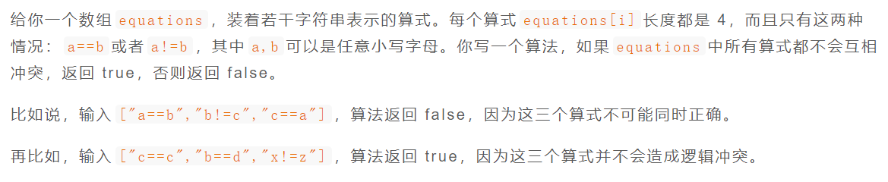

```cpp
boolean equationsPossible(String[] equations) {
    // 26 个英文字母
    UF uf = new UF(26);
    // 先让相等的字母形成连通分量
    for (String eq : equations) {
        if (eq.charAt(1) == '=') {
            char x = eq.charAt(0);
            char y = eq.charAt(3);
            uf.union(x - 'a', y - 'a');
        }
    }
    // 检查不等关系是否打破相等关系的连通性
    for (String eq : equations) {
        if (eq.charAt(1) == '!') {
            char x = eq.charAt(0);
            char y = eq.charAt(3);
            // 如果相等关系成立，就是逻辑冲突
            if (uf.connected(x - 'a', y - 'a'))
                return false;
        }
    }
    return true;
}
```

### 从LRU到LFU

LRU：Least recently used 最近使用的就是有用的；

LFU：Least frequently used 最频繁使用的是有用的；

#### LRU设计

我的思路如下：

> 怎么去设计这样一个数据结构，实际上是优先队列把？用一定的规则来设计这样的queue，但是为了要能在O(1) push 和get，我们可以使用hashmap，&存放使用的时序和val，以及一个step指向当前的操作数字，但是push中hashmap的删除涉及到find的操作，需要O（n）。**所以不行 **

正确使用的数据结构应该是：Hash（支持快速索引链表的位置）+双向链表（支持快速的插入和删除）在CPP中使用`unordered_map`和`自定义双向链表`来实现双向哈希链表。

Push 需要判断是否超出了边界。

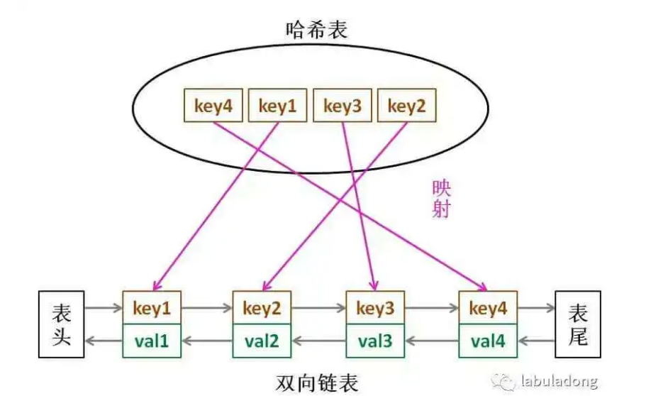

**具体代码实现如下：**

```cpp
// 这里的关键就在于带有额外头尾节点的双向链表，将删除，移动和乱七八糟的全部分离出来
struct Dlist{
    int val, key;
    Dlist* prev;
    Dlist* next;
    Dlist():key(0),val(0),prev(nullptr),next(nullptr){}
    Dlist(int k, int v):key(k),val(v),prev(nullptr),next(nullptr){}
};

class LRUCache {
private:
    int cap,size; 
    unordered_map<int,Dlist*> loc;
    // 双向链表，存个头尾不过分吧
    Dlist* head;
    Dlist* tail; // 指向最后一个的后一个

public:
    LRUCache(int capacity):cap(capacity),size(0) {
        head = new Dlist();
        tail = new Dlist();
        head->next = tail;
        tail->prev = head;
    }
    
    int get(int key) {
        if(!loc.count(key))
            return -1;
        // 最近使用，移到头部，删除原位
        Dlist* root = loc[key];
        movetohead(root);
        return root->val;
    }
    
    void put(int key, int value) {
        // 这里需要一个add和一个remove
        // 当cap不满的时候我们就直接加到List和Hash中，原值不存在
        if(!loc.count(key)){
            
            // 先创建新节点，然后判断cap
            Dlist* root = new Dlist(key,value);
            // 容易忘记在hash表中添加
            loc[key] = root;
            addHead(root);
            size++;
            if(size > cap){
                Dlist* temp = removeTail();
                loc.erase(temp->key);
                // 防止内存泄露
                delete temp;
                --size;
            }
        }else{
            Dlist* root = loc[key];
            root->val = value;
            movetohead(root);
        }
    }

    void movetohead(Dlist* root){
        // 实际上是删除炒作：上一个的下一个和下一个的上一个
        // 实际上也是put操作：然后接在头后面
        deleteNode(root);
        addHead(root);
    }
    // 在写移动算法的时候附加的操作
    void deleteNode(Dlist* root){
        root->prev->next = root->next;
        root->next->prev = root->prev;
    }
	// 在写移动算法的时候会归纳出来的操作
    void addHead(Dlist* root){
        root->next = head->next;
        root->prev = head;
        root->next->prev = root;
        head->next = root;
    }
    Dlist* removeTail(){
        // 由于tail指向的是最后一个的后一个，实际上我们只要调用delete就行了
        Dlist* temp = tail->prev;
        deleteNode(temp);
        // return是为了delete方便删除
        return temp;
    }
};
```

#### LFU设计

LFU相比于LRU来说设计上还是要复杂不少的，首先就是LFU除了维护一个优先队列以外，优先的判断和存储是比较难得，我们怎么样去存放一个决定优先级的freq的数据，然后能够很快的找到需要弹出的freq。这个freq还要能够很快的进行更新就是了。

- 维护一个freq的优先级，同时freq中也有时序的关系，最新最旧。
- 其他的和LRU还是挺像的。

这一题还是看看官方的题解把：这题的的两种解法一种set，考虑双哈希的解法；

画张图还是很容易理解的，也就是通过每个freq的一个双向链表，以及hash指向特定key的双结构去做，根据插入到尾部，就能维护到尾部。

[两种方法都很有参考价值](https://leetcode-cn.com/problems/lfu-cache/solution/lfuhuan-cun-by-leetcode-solution/)

### 一些其他的算法技巧

#### 接雨水

我的思路：记录变化点，然后减掉区域内的面积，就是雨水的面积，用两个flag可以实现，一个记录变化，一个记录是否成area。

FA解法

1. 暴力解法：对于每个i找到left的最高点，right的最高点，然后选低的哪个，减掉当前坐标即可。
2. 用备忘录优化：需要两个，从左到右的最大，和从右到左的最大，然后按图索骥就可以了
3. 双指针解法：实际上是上一个方法的改进，我们只要知道，无论距离多远，只要一段比较高，就能把低的那边的水给锁住，那么我们只需要一直移动比较低的那一侧就好了，写写看。

#### 判断完美矩形

原来不用自己组合，那有什么难的，面积加端点判断就好了，试着写一下：

- 断电判断：一个小矩形的端点，如果只有奇数个矩形接触，那就是一个额外的顶点，这样的顶点超过4个就不行
- 面积就是很简单了。

#### 翻转煎饼

和我想的没什么区别，找到最大的，翻到顶上，然后翻到底下，然后递归；

#### :star:考官调度885：

**但凡遇到在动态过程中取最值的要求，肯定要使用有序数据结构，我们常用的数据结构就是二叉堆和平衡二叉搜索树了**。

**如果将每两个相邻的考生看做线段的两端点，新安排考生就是找最长的线段，然后让该考生在中间把这个线段「二分」，中点就是给他分配的座位。`leave(p)`其实就是去除端点`p`，使得相邻两个线段合并为一个**。

也就是使用set来做


这是这题的思路，但是我们还是看看官方解答把

#### 实现一个计算器：

通过stack实现加减乘除（遇到符号将前面的数字入栈），遇到左括号进入递归，遇到右括号跳出递归，遇到空格进行处理。

[参考链接](https://mp.weixin.qq.com/s?__biz=MzAxODQxMDM0Mw==&mid=2247484903&idx=1&sn=184beaad36a71c9a8dd93c41a8ba74ac&chksm=9bd7fbefaca072f9beccff92a715d92ee90f46c297277eec10c322bc5ccd053460da6afb76c2&scene=21#wechat_redirect)

#### 反直觉概率：

##### 生男生女都一样

男女这个我持保留态度，性别不应该用年龄来划分空间，这种歧义

##### 生日问题

应该转化为计算每个人的生日都不同。就可以大概计算出来。

##### 三门问题

应该转化为概率浓缩来理解，换门相当于选择了后面两扇门的概率。

#### 随机算法：水塘抽样算法

如何在不知道总数的时候产生均匀的随机数？

这篇文章的启发性很好，实际上就是我们通过将1/n 换成1/i ，然后再获取到下一个index的时候，做一个保留还是变换的决定.

可以证明，保留的概率为1/i，变换的概率是(i-1)/i;

> **同理，如果要随机选择`k`个数，只要在第`i`个元素处以`k/i`的概率选择该元素，以`1 - k/i`的概率保持原有选择即可**。代码如下：

```cpp
/* 返回链表中一个随机节点的值 */
int getRandom(ListNode head) {
    Random r = new Random();
    int i = 0, res = 0;
    ListNode p = head;
    // while 循环遍历链表
    while (p != null) {
        // 生成一个 [0, i) 之间的整数
        // 这个整数等于 0 的概率就是 1/i
        if (r.nextInt(++i) == 0) {
            res = p.val;
        }
        p = p.next;
    }
    return res;
}
```

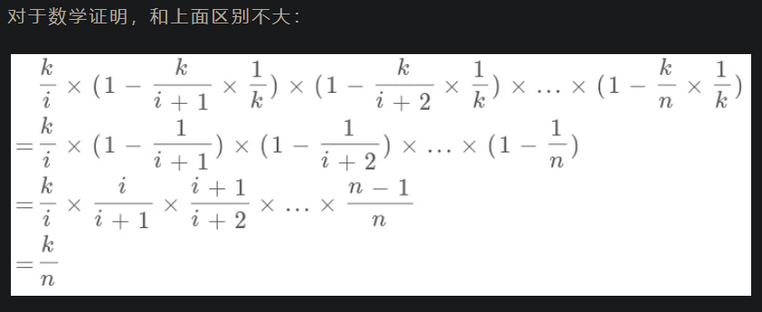

拓展延伸：

> 以上的抽样算法时间复杂度是 O(n)，但不是最优的方法，更优化的算法基于几何分布（geometric distribution），时间复杂度为 O(k + klog(n/k))。由于涉及的数学知识比较多，这里就不列出了，有兴趣的读者可以自行搜索一下。
>
> 还有一种思路是基于 [Fisher–Yates 洗牌算法](http://mp.weixin.qq.com/s?__biz=MzAxODQxMDM0Mw==&mid=2247484503&idx=1&sn=e30ef74eb16ad385c16681cd6dfe15cf&chksm=9bd7fa5faca07349c6877bc69f9a27e13585f2c5ed2237ad37ac5b272611039391acc1dcd33d&scene=21#wechat_redirect) 的。随机抽取`k`个元素，等价于对所有元素洗牌，然后选取前`k`个。只不过，洗牌算法需要对元素的随机访问，所以只能对数组这类支持随机存储的数据结构有效。
>
> 另外有一种思路也比较有启发意义：给每一个元素关联一个随机数，然后把每个元素插入一个容量为`k`的二叉堆（优先级队列）按照配对的随机数进行排序，最后剩下的`k`个元素也是随机的。

#### 差分数组、前缀和  1109航班预定统计

首先分别介绍一下前缀和和差分数组的定义和作用：

**前缀和**

简单来说定义为如下形式：便于计算区间内的累加和之类的操作
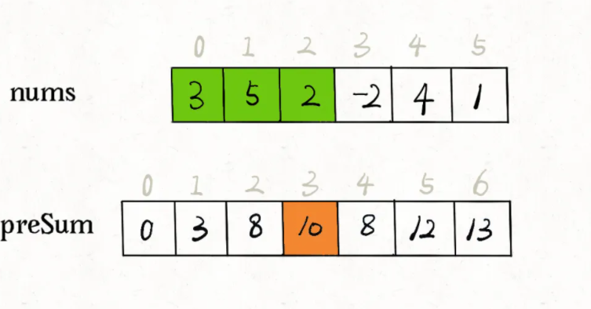

**差分数组**

主要使用于对区间内的一定元素进行统一的加减运算；
***差分数组的主要适用场景是频繁对原始数组的某个区间的元素进行增减**。*

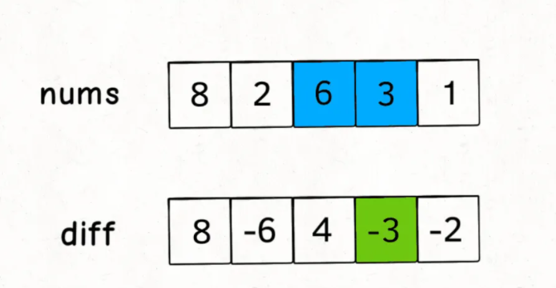

**这样构造差分数组`diff`，就可以快速进行区间增减的操作**，如果你想对区间`nums[i..j]`的元素全部加 3，那么只需要让`diff[i] += 3`，然后再让`diff[j+1] -= 3`即可：

最后再又差分数组反推出最终的值就可以了。

具体应用：机票预定

```cpp
vector<int> corpFlightBookings(vector<vector<int>>& bookings, int n) {
        // 初始化结果数组
        vector<int> res(n,0);
        if(bookings.empty()) return res;
        // 构建差分数组,初始就全是0，没问题的
        vector<int> diff(n,0);
        
        // 差分求解
        for(auto book: bookings){
            int i = book[0]-1;
            int j = book[1]-1;
            int val = book[2];
            diff[i]+= val;
            if(j+1<n) diff[j+1]-=val;
            
        }
       
        // 数组还原
        res[0] = diff[0];
        for(int i =1;i<n;i++){
            // cout<<diff[i]<<" ";
            res[i] = diff[i]+res[i-1];
        }
        return res;
    }
```

#### 快排亲兄弟：快速选择算法215

经典问题**数组中第k个最大元素**

1. 使用二叉堆（优先队列）的解法：显然就是一个针对这种数据结构的问题，我们甚至可以自己写一下这种结构，但是确实是比较麻烦来着。、
2. 使用快速排序的解法：

```cpp
// 优先队列的方法
class Solution {
public:
    int findKthLargest(vector<int>& nums, int k) {
        // 使用优先队列的方法进行问题的求解
        if(nums.empty() || nums.size()<k) return {};
        priority_queue<int,vector<int>,greater<int>> pq;
        for(auto num:nums){
            pq.push(num);
            if(pq.size()>k) 
                pq.pop();
        }
        return pq.top();
    }
};
```


##### 快速排序的方法和思路

实际上就是不完全的快速排序，使用二分的策略叠在快速排序上，当我们排序到K的时候，就直接return就行，但是为了使得算法不是每次都取到极端情况，我们每次首先将数组进行一次随机的打乱策略。

```cpp
class Solution {
public:
    int findKthLargest(vector<int>& nums, int k) {
        if(nums.empty()||nums.size()<k) return {};
        // 首先打乱数组避免极端情况产生
        random_shuffle(nums.begin(),nums.end());
        // 使用二分查找的方法来找到真实的坐标
        int n = nums.size();
        int lo = 0; int hi = n-1;
        int resindex = n-k;
        while(lo<=hi){
            int p = partition(nums,lo, hi);
            if(p>resindex){
                hi = p-1;
            }else if(p<resindex){
                lo = p+1;
            }else{
                return nums[p];
            }
        }
        return -1;
        
    }
    int partition(vector<int>& nums, int lo, int hi){
        // 快排的划分,初始化为lo
        if(lo==hi) return lo;
        int i = lo; int j = hi+1;
        int privot = nums[lo];
        while(true){
            while(nums[++i]<privot){
                if(i>=hi) break;
            }
            while(nums[--j]>privot){
                if(j<=lo) break;
            }
            if(i>=j) break; 
            swap(nums[i],nums[j]);
        }
        swap(nums[lo],nums[j]);
        return j;
    }
};
```

#### 快速计算素数的个数

通过是否是素数的一个个判断的效率没有我们从下网上填充false快，同时填充的时候注意内层循环和外层循环都能通过sqrt进行优化，外层是因为只需要到sqrt就可以了，内层是平方前面的都是重复的。

```
直接看写好的代码文件。
```

#### super pow 模幂运算

实际上计算的关键就是如下的公式：(用AK+B)之类的假设很容易证明
$$
（a*b)\% k = (a\%k)(b\%k)\%k;
$$
然后再根据幂运算的乘积性质就很容易了，然后用递归的去做，（分奇偶）
$$
a^{M+N} = a^M * a^N \\
A^{MN} = A^{M^N}
$$
再进一步的优化得到快速幂算法,证明还是基于上面的假设
$$
a^b \%c == (a\%c)^b
$$
这里给出两种，一种是每次去最尾巴那一位，一个是**快速幂算法**

```cpp
快速幂算法
int base = 1337;

int mypow(int a, int k) {
    if (k == 0) return 1;
    a %= base; // 这里和直观的理解上是有所偏差的，
    // 我如果将这里注释掉，转移到下面的两个a中，还是正确的，但是效率差了点

    if (k % 2 == 1) {
        // k 是奇数
        return (a * mypow(a, k - 1)) % base;
    } else {
        // k 是偶数
        int sub = mypow(a, k / 2);
        return (sub * sub) % base;
    }
}
```

每次取基底，和其余数组的10次方相乘

```cpp
int base = 1337;
// 计算 a 的 k 次方然后与 base 求模的结果
int mypow(int a, int k) {
    // 对因子求模
    a %= base;
    int res = 1;
    for (int _ = 0; _ < k; _++) {
        // 这里有乘法，是潜在的溢出点
        res *= a;
        // 对乘法结果求模
        res %= base;
    }
    return res;
}

int superPow(int a, vector<int>& b) {
    if (b.empty()) return 1;
    int last = b.back();
    b.pop_back();

    int part1 = mypow(a, last);
    int part2 = mypow(superPow(a, b), 10);
    // 每次乘法都要求模
    return (part1 * part2) % base;
}
```

#### 寻找缺失元素：

1. 排序 ×
2. hash ×
3. 按index异或
4. 等差数列求和-当前和：防止溢出边加边减

#### 寻找缺失和重复元素（同时出现）

对于这种数组问题，**关键点在于元素和索引是成对儿出现的，常用的方法是排序、异或、映射**。

这里介绍的是映射的方法，

```
val-> index -> nums[index] = -nums[index];
```

这样当我们发现其中的有个数是正数的时候，对应的index就是缺失元素，发现有个数要变换的时候已经是负数的时候就是重复元素。

#### 字符串乘法：

由于字符串做乘法，就很直观的就是大数相乘的问题，所以就是不能直接转成整形去做，我们直接模仿手乘画图就行，这里的关键在于将我们的乘法拆解的更加的底层

[图不好放，看网站上的，写的特别清楚](https://mp.weixin.qq.com/s?__biz=MzAxODQxMDM0Mw==&mid=2247484466&idx=1&sn=0281340cc1f41230e4512e905b9d27dd&chksm=9bd7fa3aaca0732c95d25c637d42ad8d9b80f8165098ded837f83791c673b5d6a71721c738a3&scene=21#wechat_redirect) 

主要的问题在一个坐标的转换，但是仔细观察的话问题也不大

#### 判断括号的合法性：

1. 单种括号，我们只需要（++ ）--进行判断就可以了，最终==0

2. 多种括号，需要增加存储的信息：使用STACK，遇到左括号就入栈，右括号就出栈，出栈的时候进行匹配。

3. 如果带通配符的：双向进行查找，左到右的时候把\*当成++ 右到左的时候也把\*当成++,在遍历过程中只要小于0了就直接失效
   这题实际上也可以使用DP，但是怎么做呢

   > 状态转移：
   >
   > 算法：
   > 如果且仅当间隔 s[i], s[i+1], ..., s[j] 能组成有效的括号时，dp[i][j]为 true。只有在下列情况下，dp[i][j] 才为 true：
   >
   > s[i] 是 '*' 号, 且在 s[i+1], s[i+2], ..., s[j] 这个范围能够组成有效的括号
   > 或者，s[i] 为 '('，并且在 [i+1，j] 中有一些 k，使得 s[k] 为 ')'，且(s[i+1:k] 和 s[k+1:j+1])截断的两个间隔可以构成有效的括号；

#### 判定子序列

很简单的解法：利用双指针直接求解：

```cpp
bool isSubsequence(string s, string t) {
    int i = 0, j = 0;
    while (i < s.size() && j < t.size()) {
        if (s[i] == t[j]) i++;
        j++;
    }
    return i == s.size();
}
```

**如果有一系列字符串s1,s2,s....和t做匹配的时候怎么做呢？**

可以按照现在的方法加入for 循环，但是如果使用二分法，可O(N)减低到O(M)(N),但是实际上我们也不追求这个，

- 统计t中每一个字符出现的位置，创建这样一个数组
- 然后遍历再每个字母的数组中进行二分搜索就行了。


## 《剑指offer》

在这一部分里面实际上书上和具体实现是存在一定版本上的差异的，我们可以从书上得到解题的那种基本思路，但是实际上并不一定适用于现在的情况，所以我们其实可以基于现在的实现来结合书上的笔记进行整理。在这个文档中主要集中于现今情况下的解题分析；

### 基本知识点

#### 重要知识点

书上记录一些比较重要的知识点，后续多次复习或者是重新整理；

- [ ] 树的3重遍历（*2 循环+递归）= 6种实现；

- [ ] 红黑树

  

#### SIZEOF

Sizeof(Empty Class) = 1 ; 加入构造和析构函数 =1；将析构函数标记为virtual， = 4（32位的机器） =8（64位的机器） （会生成虚函数表，并为该类型的所有实例中添加一个指向虚函数表的指针。） 

也就是说指针在32位上是4字节 在64位上是8字节。

#### Singleton

分析书上的C#代码中的代码和我们笔记中的C++情况的异同，然后根据C#中提出的哪些要求来进一步改进C++中的这个单例的实现方式。

```c++
// final version of C++ singleton 
// 不会产生复制构造函数，只会声明一次实例的生成，同时也简化了调用的步骤
public:
	Random(const Random&) = delete;
	
	static Random& Get()
	{
		static Random instance;
		return instance;
	}
	
	static float Float() {return Get().IFloat();}
private:
	float IFloat() {return m_RandomGenerator;}
	Random(){}
	float m_RandomGenerator = o.5f
```

### 数据结构

#### 重建二叉树

还是一个基于n-1假设完成的递归思想：递归记得要有初始状态，前序/后序 && 中序，实际上前序和后序的变换没有什么差别，只是顺序颠倒了一下，这里需要注意的就是怎么样推导出这样的一个重建过程是比较重要的。

### 算法和数据操作

对重要的算法理念进行整理和分析，便于后续对这些方法进行复习的时候有个脉络。

1. 递归和循环的思想
2. 查找和排序的思想（这里需要对排序的算法进行进一步的整理）
3. 回溯法
4. 动态规划与贪婪算法
5. 位运算

#### 递归和循环：斐波那契数列

相关的分析还有一些重要的点：

1. 迭代由于大量的重复项，所以回导致算法的时间和计算复杂度急剧上升（这个问题应该在各类递归过程中分析，是否会导致递归爆炸栈溢出的问题）
2. 第二个问题在于，int等各个类型的取值范围，需要注意最大能取到哪个数字，从而进行规划
3. **取余的操作应该在哪一步执行**，在计算加和的中间就需要执行取余，实际上就是一个移位操作把，把溢出值移位移掉。（是否能够使用移位的手法来进行处理。）
4. 青蛙跳台阶要记得初始情况是不同的记得分析一下就可以了。

```c++
class Solution {
public:
    int fib(int n) {
        // type 1 stupid answer : 大量重复计算问题的发生
        int prea = 0;
        int preb = 1;
        if (n < 2)
            return n > 0 ? n : 0;
        for (int i = 0; i < n - 1; i++)
        {
            int temp = preb;
            preb += prea;
            // FIXME：需要注意的事情在于这个取余是要在中间执行的。
            preb = preb % (int)(1e9 + 7);
            prea = temp;
        }
        return preb;
    }
};
```

#### 查找和排序：旋转数组的最小数字（11）

解题思路：遍历到第一个比前数小的数，就直接break，有一个想法就是对第一个数进行特殊的判断，但是对于这种大部分都是旋转的情况，这个判断带来的收益远小于负面影响，所以还是不做额外判断。

```c++
100% 99.81%
class Solution {
public:
    int minArray(vector<int>& numbers) {
        if(numbers[0]<numbers[numbers.size()-1])
            return numbers[0];
        for (int i=1; i<numbers.size();i++)
        {
            if(numbers[i]<numbers[i-1])
                return numbers[i];
        }
        return numbers[0];
    }
};
```

#### 回溯法：矩阵中的路径（12）

这一题我的解题思路实际上还是基于递归的解法，虽然需要四个方向，但是通常情况下，由于false就会退出，实际上复杂度并不会增加太多，但是这个解法的效率还是太低了。具体的解决思路如下。但是这题好像代表的一种新的算法，后续要看一下。

- **越界的两种情况的判断顺序**
- **'\0'的情况**

```c++
34 42
class Solution {
public:
    bool exist(vector<vector<char>>& board, string word) {
        // 实现的问题：判断的就是相应的邻格中有没有相应的元素
        // 怎么判断是否重复，切换成一个无表示的值？NULL行不行？
        // 总结一下：第一步find，第二部search（4 blocks），第三步替换成NULL，第四步移动格子。
        // find start (但是这样有个问题就是起始节点不是单一的，有可能有重复的起始节点。)
        int s_index = 0, s_jndex = 0;
        bool res = false;
        for(int i=0;i<board.size();i++){
            for (int j=0;j<board[i].size();j++){
                if (board[i][j] == word[0]){
                    s_index = i; s_jndex=j;
                    res = helpsearch(board, word, i,j,0);
                    if(res)
                        return true;
                    // board[i][j] = NULL; //只能临时控制，不然会导致后续出问题
                }
            }
        }
        return false;
    }
    bool helpsearch(vector<vector<char>>& board,string word, int idex, int jdex, int kdex){
        // 前面的方法遍历所有可能的起始点，但是这样的话，修改重复数组就完蛋了（用迭代的方法来实现临时的赋值）
        // 迭代搜索
        // 这个顺序要在下面的越界判断之前。
        if(kdex == word.size())
            return true;
            
        if(idex<0 || idex>=board.size() || jdex<0 || jdex >=board[0].size())
            return false;
        
        bool res = false;

        if (board[idex][jdex] == word[kdex]){
            //
            board[idex][jdex] = '\0';
            // 四种情况这里要体现一下，但是如果用递归的方式写入四个节点的话，好像复杂度有点问题
            
            bool temp = helpsearch(board, word, idex+1, jdex, kdex+1) || helpsearch(board, word, idex-1, jdex, kdex+1)\
                 || helpsearch(board, word, idex, jdex-1, kdex+1) || helpsearch(board, word, idex, jdex+1, kdex+1);
            
            res = true && temp;
            
            board[idex][jdex] = word[kdex];
        }
        return res;
    }
};
```

网站里有个一样的思路，时间和空间复杂度差不多，但是可以看一下是怎么简化代码的。

```c++
class Solution {
public:
    bool exist(vector<vector<char>>& board, string word) {
        rows = board.size();
        cols = board[0].size();
        for(int i = 0; i < rows; i++) {
            for(int j = 0; j < cols; j++) {
                if(dfs(board, word, i, j, 0)) return true;
            }
        }
        return false;
    }
private:
    int rows, cols;
    bool dfs(vector<vector<char>>& board, string word, int i, int j, int k) {
        if(i >= rows || i < 0 || j >= cols || j < 0 || board[i][j] != word[k]) return false;
        if(k == word.size() - 1) return true;
        board[i][j] = '\0';
        bool res = dfs(board, word, i + 1, j, k + 1) || dfs(board, word, i - 1, j, k + 1) || 
                      dfs(board, word, i, j + 1, k + 1) || dfs(board, word, i , j - 1, k + 1);
        board[i][j] = word[k];
        return res;
    }
};

```

**《回溯法》这个方法的思想比较重要，这边上图，实际上效果时间：87 61**是目前最好的但是我觉得还是不太行。

深度每增加一层，即说明匹配到了一个新的字符。使用迭代器指向word.begin()，深度每增加一层，令迭代器向前移动一个位置。如果该层找不到可行的路径，回溯到父节点，深度减小，迭代器也要后退一个位置，如果在搜索的过程中迭代器指向了word.end()，说明找到了可行路径，返回true，搜索结束。如果搜索了整个解空间树也没有找到可行路径，说明没有可行路径，返回false，搜索结束。

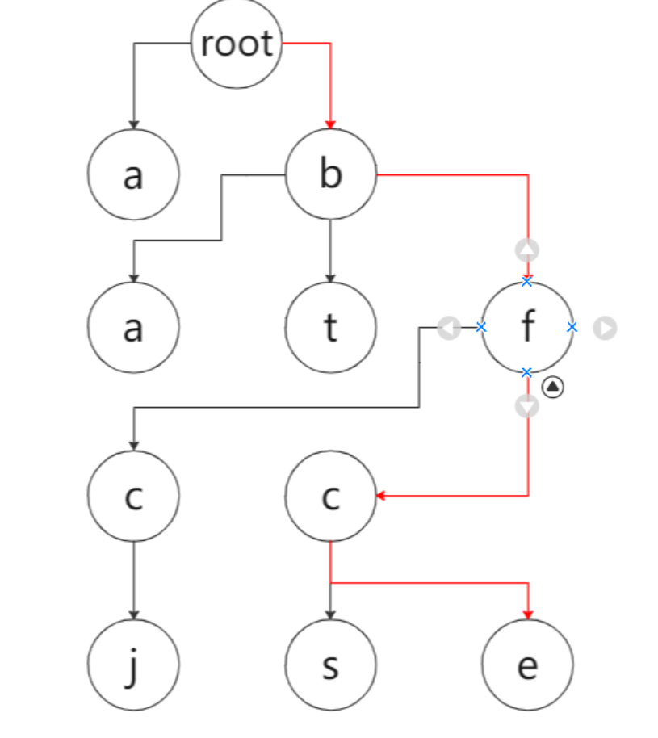

```c++
class Solution {
public:
bool findpath(const vector<vector<char>>& board, const string& word, vector<bool>& visited, int row, int column, string::iterator& itr)
{
	if (itr == word.end())  //到达字符末尾，匹配成功
		return true;
	if (row < 0 || row >= board.size() || column < 0 || column >= board[0].size())  //如果坐标不在矩阵范围内
		return false;  //返回false
	bool haspath = false;  //标记子节点是否含有下一个字符
	int columns = board[0].size();  //矩阵的列数
		//cout << row << " " << column << " " << *itr << endl;	//大家可以使用cout来查看每一步访问节点的位置，便于理解
	if (!visited[row * columns + column] && board[row][column] == *itr)  //当前位置未被访问，且当前位置可以和字符串匹配上
	{

		++itr;  //迭代器后移一个字符
		visited[row * columns + column] = true;  //标记为以访问，防止该节点的子节点再将该节点加入其子节点
		haspath = findpath(board, word, visited, row, column - 1, itr)  //左边是否有路径
			|| findpath(board, word, visited, row, column + 1, itr)   //右边是否有路径
			|| findpath(board, word, visited, row - 1, column, itr)   //上边是否有路径
			|| findpath(board, word, visited, row + 1, column, itr);  //下边是否有路径
		if (!haspath)  //如果子节点没有路径，则说明从当前节点不可能找到路径，回溯
		{
			--itr;  //迭代器回退
			visited[row * columns + column] = false;  //将该节点标记为未访问，方便其他节点再进行访问
		}
	}
	return haspath;  //返回结果
}

bool exist(vector<vector<char>>& board, string& word)
{
	if (!word.size())  //所给的word为空
		return true;
	//获得矩阵的行列数
	unsigned int rows = board.size(), columns = board[0].size();
	for (int i = 0; i < rows; ++i)
		for (int j = 0; j < columns; ++j)
		{
			if (board[i][j] == word[0])  //找到可行节点位置
			{
				auto itr = word.begin();
				vector<bool> visited(rows * columns, false);  //标记节点是否被访问
				if (findpath(board, word, visited, i, j, itr))  //从该节点出发寻找到了路径
					return true;
			}
		}
	return false;  //所有可能的路径都找了也没到找，返回false
}
};

```

#### 回溯法：机器人的行走路线（13）

问题：这题首先特别重要的一定要理解正确题目的意思，我首先就把题目搞错了，K指的并不是行走的步数，实际上只是一个相应的约束条件，理论上是制定了k但是机器人可以走无数步这样的情况。

1. DFS、BFS
2. 师兄说的循环数组我得想一下是为什么是，或者看下书。

```c++
class Solution
{
private:
	int subsum(int x)
	{
		// NOTE:这个写法要注意对for循环有一个好的理解，知道到底是象征什么意思。还有第一项空置的含义
		int res = 0;
		for (; x; x /= 10)
		{
			res += x % 10;
		}
		return res;
	}
public:
	int movingCount(int m, int n, int k)
	{
		// 整理思路重新出发
		//NOTE:定义vector的初始化长度，防止vector队内存的动态再分配来影响运行时间
		// (length, value)
		if (!k)
			return 1;
		vector<vector<bool>> visited(m, vector<bool>(n, 0));
		// 起始点初始化
		int ans = 1;
		visited[0][0] = 1;
		// 循环递推,中间需要嵌入是否满足条件的判断。
		for (int i = 0; i < m; i++)
		{
			for (int j = 0; j < n; j++)
			{
				// NOTE:排除边界和不可访问点。当已经访问过的时候直接,但是实际上能不能用跳出的处理呢
				if (i == 0 && j == 0 || subsum(i) + subsum(j) > k) continue;
				// 排除不可达的情况，由于我们是前向遍历，我们只需要考虑他的前一个或者上一个能到达，才行。
				// 这个理论可以好好的分析一下。这样的话，实际上还是有切断的处理的把。（前一个和上一个都就直接换行之类的？）
				if (i - 1 >= 0 && visited[i - 1][j]) {
					visited[i][j] = true;
					ans += 1;

				}
				else if (j - 1 >= 0 && visited[i][j - 1]) {
					visited[i][j] = true;
					ans += 1;
				}
				else
					continue;
			}
		}
		return ans;

	}
};
```

#### 动态规划与贪婪算法：剪绳子v1.v2(14/15)

**动态规划的基本解法**：将问题归化成更小的存在最优情况的子问题。

在解答问题的时候我们会发现一些重要的点：

- 初始的启动量怎么界定？（因为不是每一步都要迭代到底的，所以会出现一些特殊的情况）

  > 将问题归化到最底层，我们会发现有一些长度如果切分了，相应对乘积的贡献会小于不切分本身的贡献，这种值就是初始的启动量，他们不切分是最好的，在这道题中的体现就是0,1,2,3,4(特殊分界点，切分与否是一致的，)

- 初始的特殊情况直接输出

- 时间空间复杂度分析：从算法中很容易知道是n^2/2

我的算法实现（存在问题已解答）：

```c++
int cuttingRope(int n)
{
    // 这里是特殊的一些情况，
    if(n<2)
        return 0;
    else if(n == 2)
        return 1;
    else if (n==3)
        return 2;
    // 每一段的长度都需要是整数。
    // 初始化结果矩阵:要记得index和绳子的长度有加一的关系,先修改成直接对应的关系好了
    // FIXME: 有一点重要的在于，我们不是每一步都要迭代到底，切割本身就是一种分别情况。
    // TODO：这个初始值设置怎么界定？
    vector<int> maxarray(n+1, 0);
    maxarray[0] = 0;
    maxarray[1] = 1;
    maxarray[2] = 2;
    maxarray[3] = 3;
    // bottom-up的循环
    for (int i = 4; i <= n; i++)
    {
        int maxres = 1;
        // 每个数值的全部情况,由于是bottom-up的动态规划，不用担心下面迭代上来的情况没有值
        for (int j = 1; j <= i / 2; j++)
        {
            int tmp = maxarray[j]*maxarray[i=j];
            if(tmp >maxarray[i]){
                maxarray[i] = tmp;
            }
        }
    }
    return maxarray[n];

}
```

**使用贪婪的解法来解决这个问题**

从上面的分析我们知道，我们最好是将每一段都切分到2、3，4的情况，这样的话，能节省计算量

```c++
但是我们发现这样的算法的时间效率并没有变高，这是因为这个多重判断的时间复杂度的问题吗，不应该啊。
int cuttingRope(int n)
{
    if(n <= 3)  return n-1;
    int times;
    if (n%3==1)
    {
        times = n/3 -1;
        return pow(3,times)*4;
    }
    else if(n%3==2)
    {
        times = n/3;
        return pow(3,times)*2;
    }

    times = n/3;
    return pow(3,times);

}
而通过循环减的方法，我们发现时间复杂度突然小了很多，这是为啥，这是因为在普遍size的情况下，执行了过多的判断吗？
所以最终选用的方法还是下面这种把？
int cuttingRope(int n) {
    if(n <= 3)  return n-1;
    int res = 1;
    while(n > 4)
    {
        n    = n - 3;           //尽可能地多剪长度为3的绳子
        res  = res * 3;         
    }
    return res * n;
}
改进判断过多的情况：
int cuttingRope(int n)
{
if(n <= 3)  return n-1;
int times = n/3;
int remain = n-3*times;
if(remain == 1)
    return pow(3,times-1)*4;
return pow(3,times)* remain?pow(3,times)*remain:pow(3,times);
}
```

#### 位运算：二进制中的1的个数

在这里需要掌握所有二进制运算的基本概念，与或非以及移位操作，还有异或操作；

知道要掌握啥就可以了具体的接替思想的话后续看书就可以，实现代码如下。算法的时间效率貌似和网友还有一定的差距后续再慢慢看吧，我觉得这样已经差不多了，主要在于思想上的。

```c++
int hammingWeight(uint32_t n){
    // 三种写法，实际上1-2是一类，所以写两种就好了。
    // uint32_t i = 1;
    // int count = 0;
    // while(i){
    //     if (n&i)
    //         count++;
    //     i = i<<1; // 别忘了这个赋值
    // }
    // return count;

    // method 3 
    unsigned int count = 0;
    while(n){
        n = n & (n-1);
        ++count;
    }
    return count;
}
```

### 高质量的代码

#### 代码的完整性：数值的整数次方

这一题有一些特别需要注意的点：

- 当指数小于1的情况，（在这种情况下底数为0的情况）
- 使用指数的方法（2分）实现快速的指数计算
- -INTMIN的问题，因为0占了一位，所以int下界无法直接去abs，需要进行一个类型转换再进行取负

```c++
class Solution {
public:
    double myPow(double x, int n) {
        // FIXME：当指数小于等于0的时候
        // FIXME：当上述情况的时候底数为0的情况
        if(!x)
            return 0;
        else if(!n || x==1.0)
            return 1;
        else if (n<0){
            // 转化为正指数来做
            double tmpx = 1.0/x;
            // FIXME: INT_MIN 因为有个占位，所以取个反可能会越界，所以这里一定要是比int长的变量，而且不能在这里直接取反
            // 需要等到变换类型以后再取反
            unsigned int absExp = (unsigned int)(n);
            return normalPow(tmpx,-absExp);
        }
        else{
            return normalPow(x,n);
        }
        
    }
    double normalPow(double x, unsigned int n)
    {
        // 这是最简单的写法，但是实际上我们可以利用乘方的性质；
        // TODO: 可以通过指数型的来缩减计算量。（看看有没有必要把）
        // 有的，不考虑的话时间限制太离谱了。
        if(n == 1)
            return x;
        if(n == 0)
            return 0;
        
        double res = normalPow(x,n>>2);
        res *= res;
        if (1&n)
            res = res * x;
        return res;
    }
};
```

拓展一个网友的写法，虽然效果没有我的好，但是还是权当作一个参考

```c++
class Solution {
public:
    double myPow(double x, int n) {
        if(x == 1 || n == 0) return 1;
        double ans = 1;
        long num = n;
        if(n < 0){
            num = -num;
            x = 1/x;
        }
        while(num){ // 主要是这里的解题思路有点那什么意思
            if(num & 1) ans *= x;
            x *= x;
            num >>= 1;
        }
        return ans;
    }
};
```

### 解决面试题的思路

#### offer29 顺时针读取列表

这题主要看怎么分析问题的吧，我再这题里面的height 和width写反了，有心情的时候改一下，具体的思路如图所示：


```c++
class Solution {
public:
    vector<int> spiralOrder(vector<vector<int>>& matrix) {
        vector<int> res;
        if(matrix.empty()) return res;
        // 初始参数设置
        bool ishori = false; // 先执行水平的 height才是水平
        int offset_x=0,offset_y=0,xi=0,yi=-1;
        int width=matrix.size(), height=matrix[0].size();

        // 水平和垂直写反了，
        while(width-offset_x && height-offset_y){
            int step = 0;
            if(ishori){
                while(step<width-offset_x){
                    xi = offset_x%2!=0? xi+1: xi-1;  // 基于就奇偶判断给xi上偏移量
                    res.push_back(matrix[xi][yi]);
                    step++;
                }
                ishori = false; offset_y++;
                // 基于就奇偶判断给yi上偏移量
                // yi = offset_x%2==0? yi+1:yi-1;
            }else{
                while(step<height-offset_y){
                    yi = offset_y%2==0? yi+1: yi-1; // 基于就奇偶判断给yi上偏移量
                    res.push_back(matrix[xi][yi]);
                    step++;
                }
                ishori = true; offset_x++;
                // xi = offset_y%2!=0? xi-1:xi+1;
                // 基于就奇偶判断给xi上偏移量
            }
        }
        return res;
    }
};
```

#### 排序搜索统计算法（时间效率那一节）

#### offer 48滑动窗口算法解决，contain和index都需求的问题。

看看网友的解答，已经整理到代码文件中了。

## 《LeetCode》

刷题锻炼手感和了解题目设置和题库；

### 经典类型题（后续归纳）

#### 最长回文子串（了解一下马拉车）（5）

关键点都在代码块里 [cankao](https://mp.weixin.qq.com/s?__biz=MzAxODQxMDM0Mw==&mid=2247484471&idx=1&sn=7c26d04a1f035770920d31377a1ebd42&chksm=9bd7fa3faca07329189e9e8b51e1a665166946b66b8e8978299ba96d5f2c0d3eafa7db08b681&scene=21#wechat_redirect)

```c++
class Solution {
public:
    string longestPalindrome(string s) {
        // 这题实际上也能用动态规划来解答，但是这题的动态规划效果一般
        // TODO：我们也可以用马拉车算法解决学习一下
        // 我们python中写的是什么玩意，我有点没看懂，后面再看看是怎么做的,我觉得可以不用看，思路太傻逼了。但是可以分析测试样例。
        //使用简单的递归思想用双指针的方式来解决奇偶不同的情况
        string res;
        for(int i=0;i<s.size();i++)
        {
            string S1 = findPalindrome(s,i,i);
            string S2 = findPalindrome(s,i,i+1);
            res = res.size()>S1.size()?res:S1;
            res = res.size()>S2.size()?res:S2;
        }
        return res;
    }
    string findPalindrome(const string& s, int l, int r)
    {
        while(l>=0 && r<s.size() && s[l]==s[r])
        {
            l--;r++;
        }
        // substr 参数是起始点和长度
        return s.substr(l+1,r-1-l);
    }
};
```

#### 打印从1到n的最大的n位数（17）

这一题实际上的亮点在于考虑大数问题，显然n位数，这个就是一个很容易溢出的条件，n稍微大点就超出了int的边界范围。

首先不考虑的话（找工作的时候千万不要这么写）

```c++
class Solution {
public:
    vector<int> printNumbers(int n) {
        // 书上的方法我已经完全掌握了，但是问题在于这一题要返回整数列表，这就不太对进把，
        if (n <= 0) return vector<int>(0);
        int nums = 1;
        for (int i = 0; i < n; i++) {
            nums *= 10;
        }
        vector<int>res(nums-1, 0);
        for (int i = 0; i < nums-1; i++)
        {
            res[i] = i + 1;
        }
        return res;
    }
};
```

**大数问题**后面复习的时候来进行联手

实际上有两种解法，基本就是看书去实现一下，这里后面再来写就行了。

[LEETCODE](https://leetcode-cn.com/problems/da-yin-cong-1dao-zui-da-de-nwei-shu-lcof/solution/fei-zi-jie-ti-ku-jian-17-jian-dan-da-yin-cong-1dao/)

1. 用字符串模拟数组（+，-，输出问题）其中的print我觉得用stoi可能就可以轻松解决了，可能不需要重新编写
2. 全排列问题

#### 表示数值的字符串（20）

这一题简直恶心人，除了书上提到的那些东西，还有一些其他的恶心人的情况。比如

> " 0 " "3." "3. " "46.e3" ".e1"

最终的实现代码：

```c++
class Solution {
public:
    bool isNumber(string s) {
        // 实际上要考虑的特殊value只有 + - E e .
        // 经过 + - E的以后，还是能接受一样的类型，但是没办法进行同样的符号判断了，就是不能重复出现
        // FIXME：可以使用递进的方法，也就是将前面的数字一个个吞掉，这样就不用考虑到重复判断的问题了，只需要进行函数的调用
        // 但是经过.后，就什么符号都不能出现了，只能是纯整数。
        if(s.empty()) return false;
        int index = 0;
        bool cures;
        // 前面是' '的情况
        while(index<s.size()){
            if(s[index]==' ') index++;
            else break;
        }
        cures = isInteger(s,index);
        if(s[index] == '.')
        {
            // 以.开头的到底算不算呢？
            // 那以.结尾的呢？
            // .e 也算，那我tmd 不是白写了，我觉得这题有病。
            index++;
            if (index != s.size()){
                //".  "的情况
                if(s[index] == ' '){
                    while(index<s.size()){
                        if(s[index]==' ') index++;
                        else return false;
                    }
                }
                // .e（的情况）
                else if(s[index] == 'e' || s[index]== 'E')
                    cures = cures && isInteger(s,++index);
                // '.的普通情况'
                else
                    cures = isUnsignedInteger(s,index);
            }
            // ’.直接结束的情况‘
            else
                return cures; 
        }
        if(s[index] == 'e' || s[index] == 'E')
        {
            index ++;
            cures = cures && isInteger(s, index);
        }
        // 遍历完了才算完事儿
        // 后面是’ ‘的
        while(index<s.size()){
            if(s[index]==' ') index++;
            else break;
        }
        return cures && index == s.size();

    }
    bool isUnsignedInteger(string& s, int& index){
        // 判断是不是纯整数，用于.后的情况
        // 通过数值的ascii码，转化为数字的大小来进行比较,而且\0不会包含在string的size里面
        int begin = index;
        for (;index<s.size();index++){
            if(s[index]>='0' && s[index]<='9'){}
            else break; // 这里直接return好不好呢，因为后续的话还要加入额外的判断。
        }
        return index>begin;
    }
    bool isInteger(string& s, int& index){
        // 考虑包含 + - 符号
        if (s[index] == '+' || s[index] == '-') index++;
        return isUnsignedInteger(s,index);
    }
};
```


#### 拓展：char和int的转化关系

实际上我们可以通过 `i+'0'`将int之类的类型转换为char的数字，因为这实际上是对应的ASCII的加减，然后会执行隐式的类型变换，将其变换为char类型的值把。

#### 总结：链表删除的形式

1. 通常情况下内容覆盖这种操作应该是不被允许的把，但是it depends,比如18题就是这样去实现的
2. 到底是把原指针delete掉来作为删除的凭据，还是直接指向nullptr，在原本的一开始的题目中，好像都是指向了nullptr，但是又有遇到一些是需要delete的。后续总结一下


## 顺带GIT知识扩充（后续迁移）

### 基本的workflow


### 使用的一些KeyPoint


#### 用rebased 代替merge：

其实就是merge对分支的处理比较不友好，可能需要我们进行手动的删除，而rebased就是直接进行重构，具体的操作如下：

> **首先，找到这两条分支的最近公共祖先`LCA`，然后从`master`节点开始，重演`LCA`到`dev`几个`commit`的修改**，如果这些修改和`LCA`到`master`的`commit`有冲突，就会提示你手动解决冲突，最后的结果就是把`dev`的分支完全接到`master`上面。

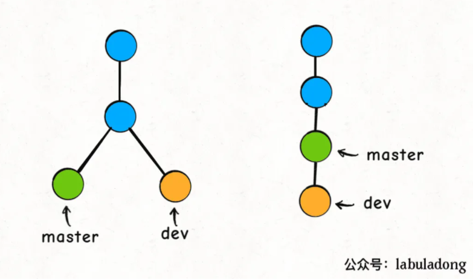

