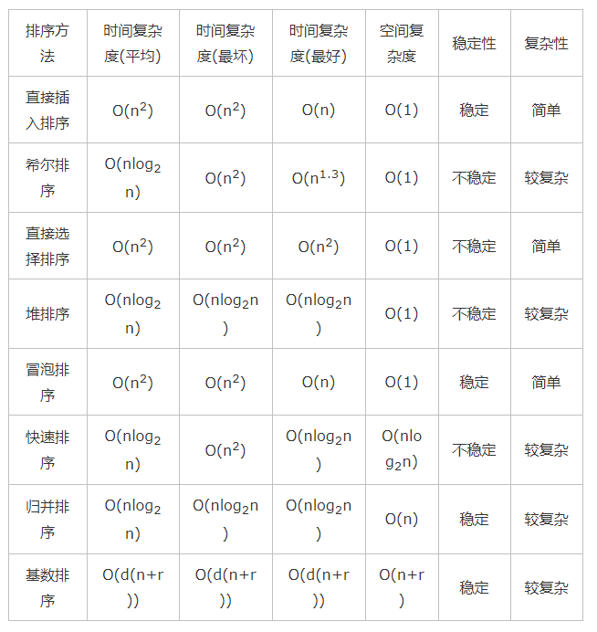

# 题型和框架代码总结

@Aiken 2021 简明的描述相应的框架和提醒分析，不输出冗余内容，结合笔记和跳转链接进行具体的复习，该文只作为大纲使用。

- 适用的情况分析
- 算法的具体框架和思路
- 特殊情况描述
- 怎么读取命令行的输入，在笔试的时候可能会需要

## C++笔试读取输入的操作

待整理：

[Link1](https://blog.csdn.net/e01528/article/details/99206024)；[Link2](https://blog.csdn.net/weixin_41506062/article/details/106888825?utm_medium=distribute.pc_relevant.none-task-blog-BlogCommendFromBaidu-1.control&dist_request_id=&depth_1-utm_source=distribute.pc_relevant.none-task-blog-BlogCommendFromBaidu-1.control)

输入通常使用while+cin>>来进行，这种方式也可以直接读入整行的string；

需要注意的是，这种方式的话，如果使用的是getline，当遇到换行符的时候cin会直接停止继续输入；

```cpp
while(cin>>a>>b);
// 主要是按照类型来进行cin，操作应该是通过空格来分割的。
// 按照我们执行的次数来进行指定次数的读取操作
以指定符号分割的字符串输入
char str[3][11]; 
cin.getline(str[0], 11, ',');  //接收最多10个字符 ,以‘，’作为结束符
cin.getline(str[1], 11, ',');
cin.getline(str[2], 11);     //默认结束符 enter


```


## 常见数据类型和特殊专题

经常在那种预设值出问题，导致不会更新后续的max or min

### 随机数问题

470：用rand7 实现rand10：

**拒绝采样** 实际上就是使用7进制来实现10，拒绝多余的选项，继续进行采样

```cpp
class Solution {
public:
    int rand10() {
        int col, row, idx;
        do {
            row = rand7();
            col = rand7();
            idx = (row-1) * 7 + col;
        } while (idx > 40);
        return 1 + idx % 10;
    }
};
```

### 环形问题：

- 涉及到环形的问题的时候，如果我们是需要进行遍历操作的话，可以考虑通过取余的方式去解决；
  
- 如果是进行是否是环的判断，我们可以考虑双指针的问题（快慢指针），然后让一个先行之类的策略。

### 单调栈模板

下一个更大的xxx的问题；同样，单调的队列也是一个意思(可能就是有窗口的长度约束之类的)

还有像什么字典序的排列，这一题值得一做，是一个比较灵活的情况

1. 是一种保持栈中的数据从大到小的结构，当下一个比当前的数据更大的值出现的时候，我们就需要**对数据进行记录**，然后进行重排。

2. 设计到环形的数据，也就是更大的下一个最终可能在前面的情况，我们考虑通过原长度的双倍长度去遍历，然后通过取余去取值即可

   ```
   index % n = new index;
   ```

3. 需要注意的是index和取值之间的关系也就是我们到底应该存index还是存值；

4. 窗口是K，那么index到k-1就需要开始判断了，也就是第k个，可能这个时候就需要进行弹出之类的（这种情况是否应该使用双端队列）

特殊取值问题，我们要考虑输入如果只有一个数字的情况下，还有两个size不等的情况下到底怎么做

### 链表问题

这里有两类题需要我自己再揣摩一下，一个是K个一组反转（使用迭代+递归的方式），还有一个是求回文链表的两种技巧（快慢指针同时能判断奇偶的特性）

- 其中典型的技巧就是双指针技巧和前序后续遍历技巧，以及快慢技巧
- 类通用的额外head来实现正向和后序遍历同时进行的过程。(比如判断回文链表)

### 二叉树问题

二叉树问题很多情况下表现为一个**遍历和递归的**问题，同时其中最重要的是3种遍历方式的特性：**前序、中序、后序**，典型的就是`重建二叉树`；下面这一题是比较有启发性的：

#### 二叉树中的最大路径和（142）

- return的值和中间进行判断，以及最终结果的统计值是不同的
- 所以维护一个全局的ans，来区分这个过程。

#### 经典难题 序列化和反序列化

这种用字符串来表示树的，一定要记得间隔和结尾是两个不同的符号来表征；

### 动态规划问题

WORKFLOW：**明确状态（DP表各个index对应的子状态含义）、明确状态转移的过程、通过状态转移判断迭代的方向、根据方向和题解确定base cases、根据状态的转移过程优化压缩dp表的空间**

题型方面实际上应该主要是下面的几类问题：

- 能分成子问题的最优解问题
- 序列匹配问题
- “逐步”的过程：博弈

难点：实际上就是动态转移方程的构建和dp表的建立，我们要明确这样一个状态转移的过程。

思路：和递归是一样的，假设子问题解决了，到新问题，

压缩：要注意我们在删除维度的时候是不是会导致新的数据覆盖掉了需要的数据（决定好迭代的方向）

****

#### 闫式DP分析法：

状态表示（把集合表现为数） & 状态计算 （化整为零，划分成若干个子集去做，）

属性：max，min，count；（题目问的是什么）

划分子集依据：寻找最后一个不同点

[LINK1](https://blog.csdn.net/weixin_44289697/article/details/105125613) ； [Link2](https://www.acwing.com/file_system/file/content/whole/index/content/406072/)

**选择问题：** **每一个维度是一个条件**

第一个维度：我只考虑前i个问题（物品），第二个维度一般都是限制，存放属性（也就是最大的xxx）

最后一个不同点：对最后一个物品i，做出的不同选择，来进行状态转移

#### 正则表达式问题：

永远的痛，我们怎么把他归化到小问题，也就是为什么我们最多只需要往回退一次

- 考虑当前组合：匹配并丢弃（往前规划的时候j-2） j-1
- 匹配不丢弃（往前归化的时候j不变） i-1 
- 不匹配。j-2

```cpp
class Solution {
public:
    bool isMatch(string s, string p) {
        // 考虑两种情况：普通的匹配和*号匹配
        // 建立DP-table 考虑初始情况
        int m = s.size() + 1; int n = p.size() + 1;
        vector<vector<bool>> DP(m, vector<bool>(n, false));
        DP[0][0] = true;
        // 下面这个可以转换成&&语句可能会更好看点
        for (int i = 2; i < n; i+=2) {
            if(p[i-1] == '*') DP[0][i] = DP[0][i-2];
        }
        // 下面开始状态转移
        for (int i = 1; i < m; i++) {
            for (int j = 1; j < n; j++) {
                if (p[j - 1] == '*') {
                    // 其实就是考虑两种情况: 最后的不同，第一个方式是我们抛弃前一个元素，第二个方式就是正常匹配，用了且过，第三个方式是我们用了且保留，那么就会出现一种情况，也就是在i的上一个时刻，已经和我们当前的*匹配了，但是我们还在继续匹配，这里要注意，这里不是和dp[i-1][j-1]比，和这个比的话，实际上就是正常的对比了，看下面的else，i-1 *中包含了i-2 * ，所以前面的我们就不需要再重复考虑了
                    DP[i][j] = DP[i][j - 1] || DP[i][j - 2]  || DP[i - 1][j] && (p[j - 2] == s[i - 1] || p[j - 2] == '.');
                    
                }
                else {
                    // 如果没有*号的特殊情况下的时候，考虑就是前面的相等以及当前的相等，或者说就是.
                    DP[i][j] = DP[i - 1][j - 1] && (p[j - 1] == s[i - 1] || p[j-1] == '.');
                }
            }
        }
        return DP[m - 1][n - 1];
    }
};
```

#### 编辑距离

这一题的二维很好写，也是一个帮助理解DP方法的一个很好的例子，但是在压缩成一维的时候有很多的细节这里要注意

1. 首先是初始化的问题，还有在内层循环要将第一个数的初始化在这里进行赋值，（第一行，和第n行的第一个需要被初始化）
2. 这里i-1，j-1的形式就比较老生常谈了；
3. 这里的if else 就变成必要的了！（所以能表达的更清楚的时候，大多数时候我们还是不要省略else，这样的话也能减少不必要的运算）（暂时还没搞清楚），同时这里的和自己进行min的方式就不能用了，因为我们原本是初始化成一个很大的数，但是在这里的象征意义就已经被改变了。

```cpp
class Solution {
public:
    int minDistance(string word1, string word2) {
        // 实际上这题已经很熟悉了，这里需要做的就是构建一个DP table，以及状态转移
        // 切分的状态就是string的index
        if(word1.empty()) return word2.size();
        if(word2.empty()) return word1.size();
        // 建立dp table
        size_t len1 = word1.size();
        size_t len2 = word2.size();
        vector<int> dp(len2+1);
        // 初始化base-case，当一个是空，另一个不是空的情况
        
        for(int i =0; i<=len2;i++) dp[i] = i;
        // 通过转移方程确定搜索的方向，从而确定遍历的方向，建立状态转移方程
        int prec, temp;
        for(int i =1; i<=len1;i++){
            prec = dp[0]; dp[0] = i;
            for(int j =1; j<=len2;j++){
                // dp i,j 象征着word1到i 变换到word2 需要的变换操作数，
                // 当当前的值相等的时候
                temp = dp[j];
                if(word1[i-1] == word2[j-1]) dp[j] = prec;
                else{
                    // 插入一个才能变道j
                    dp[j] = min(min(dp[j-1],dp[j]),prec)+1;
                }
                prec = temp;
            }
        }
        return dp[len2];
    }
};
```


#### 俄罗斯套娃：

这种两个维度，然后相互嵌套的问题，为了让其中的一个等大被抵消掉，所以一个逆序，另一个正序，然后寻找最长递增子序列。（找最长子序列的时候要找对搜索方向）

#### 子序列问题：

一维的DP数组：这种子序列问题（子序列不同于子串），需要的一般都是以i为结尾的情况下，取得的最值，这样才符合我们需要归纳 的条件。

> ```c++
> // 基础的算法模板如下
> int n = array.length;
> int[] dp = new int[n];
> 
> for (int i = 1; i < n; i++) {
>  for (int j = 0; j < i; j++) {
>      dp[i] = 最值(dp[i], dp[j] + ...)
>  }
> }
> ```
>
> **在子数组`array[0..i]`中，以\**`array[i]`\**结尾的目标子序列（最长递增子序列）的长度是`dp[i]`**。

二维的DP数组:这种思路其实用的更多，尤其是涉及到数组，两个字符串这样的问题的情况下，这种思路实际上涵盖了，包含一个字符串和两个字符串的情况

```c++
int n = arr.length;
int[][] dp = new dp[n][n];

for (int i = 0; i < n; i++) {
    for (int j = 1; j < n; j++) {
        if (arr[i] == arr[j]) 
            dp[i][j] = dp[i][j] + ...
        else
            dp[i][j] = 最值(...)
    }
}
```

- **涉及两个字符串/数组时**（比如最长公共子序列），dp 数组的含义如下：

  > **在子数组`arr1[0..i]`和子数组`arr2[0..j]`中，我们要求的子序列（最长公共子序列）长度为`dp[i][j]`**。
  >
  > 可以参考的是编辑距离和最长公共子序列两个文章

- **只涉及一个字符串/数组时**（比如本文要讲的最长回文子序列），dp 数组的含义如下：

  > **在子数组`array[i..j]`中，我们要求的子序列（最长回文子序列）的长度为`dp[i][j]`**。

**最长回文子序列**

假设i+1，j-1已经是最好的情况，当现在的两端不是相同，就没办法同时产生增益，也就是要么是左侧的最大值要么是右侧的最大值两种情况

**最长公共子序列**

实际上考虑下来和最长回文子序列是一样的问题，两边相同，同时产生增益，但是如果两边不同的话，就是两侧的其中一个max了。

**四键键盘问题**

实际上实现上和最长递增子序列稍微有点像，但是思路上的差别还是比较多的：要么就是一直按ａ，要么就是在某个地方开始ｃｖ所以我们存放的还是当前的最长值，然后通过一个内层循环，判断从哪开始cv就行。


#### 股票问题

简单的直接贪婪的计算正向差就完事了，或者通过迭代来计算前向的最大和；

动态规划方法的计算框架：定义两个维度，当天我们是否持有股票，然后进行状态的转移方程；（空间复杂度未优化的计算情况如下）（可以优化成4个值，实际上3个就好）

```c++
class Solution {
public:
    int maxProfit(vector<int>& prices) {
        int n = prices.size();
        // 根据受伤是否持有股票来进行运算，存放第i天能获取的最大利益；
        vector<vector<int>> dp(n, vector<int>(2, 0));
        // 可以先将购买消耗掉
        dp[0][1] = -prices[0];
        for (int i = 1; i < n; i++) {
            // 容易出错的就是买卖的最终价格计算
            dp[i][0] = max(dp[i - 1][1] + prices[i], dp[i - 1][0]);
            dp[i][1] = max(dp[i - 1][1], dp[i - 1][0] - prices[i]);
        }
        return dp[n - 1][0];
    }
};
```

限制交易次数（最通用的情况）： 使用动态规划的话，+次数约束：把pair分开，变成两个加了k约束的dptable；188题，可以再看看

资金冻结一天，就将交易时间稍微修改一下，卖出后的那个值变成i-2就行了

每次需要手续费，我们只需要在购买的时候扣除手续费就行。

**状态机解法**

实际上也就第三题只进行两次交易的情况好一些，也就是说，当我们只进行一次买入的时候是s1，然后我们进行一次买入一次卖出的时候是s2，以此类推，然后再上一个s的情况下进行状态的更新就性了没什么特殊的地方。

**打家劫舍问题**：

实际上像二叉树那样的题目可以和股票一样分成两个状态去做，也能够和之前是一摸一样的，用递归的方法加上备忘录去做，但是递归的方法实际上就是dfs，我们先递归到最底层然后加入备忘录然后进行计算，这样我们在递归的时候就要确定现在的这个值我们之前是不是已经计算过了。

#### 最坏情况下的最好

**高楼扔鸡蛋问题** : 通过碎或不碎来对问题切割成子问题，然后两个单调序列使用二分法查找；

#### **戳气球问题**

这题比较难就另外提出来说了：实际上思路就是假设i，j是戳破i，j这个开区间以后能够得到的最大的res，然后我们遍历每个k，其中的最大值就是i，j的最大值了。然后这就是个动态归化的问题，搜索方向其实也比较简单，写起来就没啥

#### KMS字符串匹配算法：

基本想要实现的就是让指针i不走回头路，不会进行重复的扫描，理论上这样需要一个影子指针去做。

实际上就是设计一个delay，然后同步进行状态的推进，然后base case就是当匹配到i个字符的时候进行加1，然后main遇到每个元素后要跳转到哪，全问delay，只有匹配的时候进行下一个状态的演变

### 博弈问题

实际上是一种特殊的动态规划问题，这里的技巧是使用pair，然后将dp中的值定义为first：先手能取到的最高总分； sec：后手能取到的最值总分；

然后我们就能通过先后手和当前的状态图来计算得到一个状态传递方程了


### 背包问题

实际上是动态规划的子问题，但是这里我们还是独立出来说一下

（核心）状态的选择：分别是重量、对应的item，存储当前的value，然后每次对item**做0，1选择**来做状态转移。

```c++
int knapsack(int W, int N, vector<int>& wt, vector<int>& val) {
    // vector 全填入 0，base case 已初始化
    vector<vector<int>> dp(N + 1, vector<int>(W + 1, 0));
    for (int i = 1; i <= N; i++) {
        for (int w = 1; w <= W; w++) {
            if (w - wt[i-1] < 0) {
                // 当前背包容量装不下，只能选择不装入背包
                dp[i][w] = dp[i - 1][w];
            } else {
                // 装入或者不装入背包，择优
                dp[i][w] = max(dp[i - 1][w - wt[i-1]] + val[i-1], 
                               dp[i - 1][w]);
            }
        }
    }

    return dp[N][W];
}
```

**分割等和子集**： 需要注意，当我们进行bool转化和压缩的时候，为了防止被更新覆盖掉，所以我们最好还是使用反向的迭代方式

**零钱兑换问题**：状态转移实际上还是和分割子集是一样的，就是如何将用不用这个item（因为可以是无数个），给归化出来。

> 用其他硬币到j 用所有硬币到[j-coint[i]]


### 贪心算法

实际上就是一种极端的思想，取各个最优的情况进行选择的这种思想：

- 最长上升子序列：让子序列的末尾尽可能的小：
  当我们大于数组的结尾的时候就给数组的结尾加长，不然就找到第一个比他小的数组后面那个数字给替换掉。在这里使用二分查找的思路。
- 区间重叠、破气球问题：按照区间结束得早来排序，最终归纳出重叠区间即可
- 跳跃游戏：没啥好说的就，贪，然后找到最远的地方，然后这个时候要注意一下，我们改如何去更新步数，就好（每一次的最远的边界更新一次距离即可）

### 回溯算法（backtrack）

**解决一个回溯问题，实际上就是一个决策树的遍历过程**。只需要考虑三个问题

**1、路径**：也就是已经做出的选择。

**2、选择列表**：也就是你当前可以做的选择。

**3、结束条件**：也就是到达决策树底层，无法再做选择的条件。

具体代码框架：**其核心就是 for 循环里面的递归，在递归调用之前「做选择」，在递归调用之后「撤销选择」** 我觉得这里应该就是存储一个中间结果来做把。通过具体的代码来看看

```cpp
result = []
def backtrack(路径, 选择列表):
    if 满足结束条件:
        result.add(路径)
        return

    for 选择 in 选择列表:
        做选择
        backtrack(路径, 选择列表)
        撤销选择
```

全排列问题、组合问题、n皇后问题、子集问题、数独（主要是棋盘格子中的坐标转换，其他的和n皇后没什么区别）、合成括号生成（也就是分别对左右进行回溯，然后其他的也没什么区别了）

```cpp
class Solution {
public:
    vector<vector<int>> permute(vector<int>& nums) {
        vector<vector<int>> res;
        backtrack(res, nums, 0, nums.size());
        return res;

    }
    void backtrack(vector<vector<int>>& res, vector<int>& output, int first, int len) {
        if (first == len) {
            res.emplace_back(output);
            return;
        }
        for (int i = first; i < len; i++) {
            swap(output[i], output[first]);
            backtrack(res, output, first + 1, len);
            swap(output[i], output[first]);
        }
    }
};
```

### BFS算法：

其他的也不多说了，实际上就一个重点，那就是要使用队列这个数据结构来做，BFS也有一个特点就是，找到的路径一般是最短的， 也就是和七点的最短距离，但是相应的我们会需要更多的空间复杂度。

在BFS需要深度的时候，我们可以

- 同时用pair来维护一个深度信息.
- 每次把queue中的数据清空再来size++

```cpp
// 计算从起点 start 到终点 target 的最近距离
int BFS(Node start, Node target) {
    Queue<Node> q; // 核心数据结构
    Set<Node> visited; // 避免走回头路

    q.offer(start); // 将起点加入队列
    visited.add(start);
    int step = 0; // 记录扩散的步数

    while (q not empty) {
        int sz = q.size();
        /* 将当前队列中的所有节点向四周扩散 */
        for (int i = 0; i < sz; i++) {
            Node cur = q.poll(); // 访问队列中的当前节点
            /* 划重点：这里判断是否到达终点 */
            if (cur is target)
                return step;
            /* 将 cur 的相邻节点加入队列 */
            for (Node x : cur.adj())
                if (x not in visited) {
                    q.offer(x);
                    visited.add(x);
                }
        }
        /* 划重点：更新步数在这里 */
        step++;
    }
}
```

**转盘锁问题** 实际上我们可以看成每个状态有8个可能的前进方向，然后用BFS就能优先遍历到。如果是回溯的话也差不多的写，但是问题是这样的搜索时间是一定需要遍历完所有的可能性的。实际上回溯就是我们每一步的变换+4就行了，基本的答题代码还是一致的。

用HASH来避免重复的遍历

双向的bfs优化：维护两个set（用来交替进行）和一个visited。

**滑动谜题**：实际上也能分析成是一个树一样的决策结构，然后我们希望找到最低的深度，这样的话，关键还是遍历还有一个避免重复。

Trick：转化为维度1来节省空间和时间，也可以直接将邻居列出来

```cpp
    // 记录一维字符串的相邻索引
    vector<vector<int>> neighbor = {
        { 1, 3 },
        { 0, 4, 2 },
        { 1, 5 },
        { 0, 4 },
        { 3, 1, 5 },
        { 4, 2 }
    };
```

### 分治算法

实际上和回溯，动态规划都是特殊的递归：

> 回溯算法就一种简单粗暴的算法技巧，说白了就是一个暴力穷举算法，比如让你 用回溯算法求[子集、全排列、组合](http://mp.weixin.qq.com/s?__biz=MzAxODQxMDM0Mw==&mid=2247485007&idx=1&sn=ceb42ba2f341af34953d158358c61f7c&chksm=9bd7f847aca071517fe0889d2679ead78b40caf6978ebc1d3d8355d6693acc7ec3aca60823f0&scene=21#wechat_redirect)，你就穷举呗，就考你会不会漏掉或者多算某些情况。 
>
> 动态规划是一类算法问题，肯定是让你求最值的。因为动态规划问题拥有 [最优子结构](http://mp.weixin.qq.com/s?__biz=MzAxODQxMDM0Mw==&mid=2247484832&idx=1&sn=44ad2505ac5c276bf36eea1c503b78c3&chksm=9bd7fba8aca072be32f66e6c39d76ef4e91bdbf4ef993014d4fee82896687ad61da4f4fc4eda&scene=21#wechat_redirect)，可以通过状态转移方程从小规模的子问题最优解推导出大规模问题的最优解。
>
> 分治算法呢，可以认为是一种算法思想，通过将原问题分解成小规模的子问题，然后根据子问题的结果构造出原问题的答案。这里有点类似动态规划，所以说运用分治算法也需要满足一些条件，你的原问题结果应该可以通过合并子问题结果来计算。

基本框架：

```c++
void sort(int[] nums, int lo, int hi) {
    int mid = (lo + hi) / 2;
    /****** 分 ******/
    // 对数组的两部分分别排序
    sort(nums, lo, mid);
    sort(nums, mid + 1, hi);
    /****** 治 ******/
    // 合并两个排好序的子数组
    merge(nums, lo, mid, hi);
}
```


### 双指针&&二分查找&&滑动窗口

**一些常见的用法：**（实际上要么就是两个方向，要么就是两个步调）

1. 是否有环：相遇可以判定有环；
2. 找到环的起始点：相遇后，把一个调到头，同速前进，再次相遇即是起始点。
3. 链表的中点：快慢指针，快指针到达终点。
   延申问题：对链表进行归并排序，通过快慢指针实现二分的操作，合并两个有序链表。
4. 起始点偏差：先让一个指针走k步，另一个指针再出发，寻找链表的倒数第k个元素

**类型题总结** 

1. **快慢指针**：链表操作，归并排序找中点，链表成环搞判定；
2. **左右指针**：反转数组，二分搜索
3. **滑动窗口**：字串问题，左右指针滑动，前后并进

**快慢指针的常见用法：**

1. 二分查找算法，没啥好说的
2. 子数组之和：只要**数组有序**，就要想到双指针技巧。通过调节left和right来调整sum的大小。找到对应的区间
3. 反转数组：从前或从后出发，然后直接互换。
4. 下面讲的滑动窗口

27.移除元素那一题，我原本写法的优越性，这里可以掌握一下，为啥用while的方式的话，效果反而不好呢

移除0 这个题还是有一些细节的，普通的写很容易出错

```cpp
class Solution {
public:
    void moveZeroes(vector<int>& nums) {
        if (nums.empty()) return;
        // 直接进行值的改变是不是好一点，然后在后面进行添加就好了
        int index1 = 0; int index2 = 0;
        while(index2 < nums.size()) {
            if (nums[index2] != 0) {
                nums[index1] = nums[index2];
                if (index1 != index2) nums[index2] = 0;
                index1++;
            }
            index2++;
        }
        return;
    }
};
```

#### 二分查找：(了解了，问题不大，晚上再来看下就好)

三种情况：找到值，左侧边界，右侧边界（）

找到值的方式就没什么好说的：我们直接当相等的时候返回就行，我们主要分析一下左侧边界和右侧边界的情况到底是什么含义：

- 左侧边界：满足某个条件的最左边（最小值），比如大于等于二的边界（最左边的那个2）；
- 右侧边界：满足某个条件的最右边（最大值），比如小于等于二的边界（最右边的那个2）；

结论1：**两侧的边界是对称的**：实际上画一下还是很容易分析出来的（**>=** / **<=**的direction）：

```c++
左侧边界： >=
<: l=mid+1 
>= : r = mid-1
检测左侧边界是否合理
return l；
```

```
右侧边界： <=
<=: l=mid+1 
> : r = mid-1
检测右侧边界是否合理
return r；
```

结论2：**>= 换成> :**或者小<=换成<:**只需要换一下相等**的情况即可：

```cpp
左侧边界：>
<=: l=mid+1 
> : r = mid-1
检测左侧边界是否合理
return l；
```


```cpp
右侧边界：<
<: l=mid+1 
>= : r = mid-1
检测右侧边界是否合理
return r；
```

**使用二分查找来解决数组的题目**

存在如下的遍历架构显然是使用**二分查找**的方法来优化的：koko吃香蕉，货物运输

```cpp
for (int i = 0; i < n; i++)
    if (isOK(i))
        return answer;
```

#### nsum问题

（2-sum）这种问题的关键在于，排序后指针双向而行的时候，怎么排除重复的元素（可以使用while直接跳过当前的指即可）

（3-4sum）首先取第一个值，然后对剩下的部分求n sum 穷举，（还是需要sort的）

#### 滑动窗口：

**基本的框架思想：**

1. 左闭右开称为窗口；
2. 先增大right到满足，再缩减left直到不满足，每次增加left都要更新一次结果；
3. 重复2，直到r->end;

具体的实现框架：

```cpp
/* 滑动窗口算法框架 */
void slidingWindow(string s, string t) {
    unordered_map<char, int> need, window;
    for (char c : t) need[c]++; // 初始化状态，便于搜索

    int left = 0, right = 0;
    int valid = 0;  // 统计满足情况的数有多少，和需要的匹配时更新答案
    while (right < s.size()) {
        // c 是将移入窗口的字符
        char c = s[right];
        // 右移窗口
        right++;
        // 进行窗口内数据的一系列更新
        ...

        /*** debug 输出的位置 ***/
        printf("window: [%d, %d)\n", left, right);
        /********************/

        // 判断左侧窗口是否要收缩
        while (window needs shrink) {
            // d 是将移出窗口的字符
            char d = s[left];
            // 左移窗口
            left++;
            // 进行窗口内数据的一系列更新
            ...
        }
    }
}
```

**典型例题（76）最小覆盖字串**：实现代码后续再做一次

```cpp
class Solution {
public:
    string minWindow(string s, string t) {
        if (s.empty() || t.empty()) return {};
        // 考虑到出现重复字符的情况，所以需要有一个int进行计数
        unordered_map<char, int> need, windows;
        int l = 0, r = 0, n = s.size();
        // 统计需要的每个字符的数量
        for (char c : t) need[c]++;

        int valid = 0, needv = need.size();
        int start = 0, lens = INT_MAX;
        
        while (r < n) {
            char temp = s[r];
            r++; // 每次就进行所有的缩减边界的行为
            if (need.count(temp)) {
                windows[temp]++;
                // 只在这里进行状态的变换，不进行判断
                if (windows[temp] == need[temp]) {
                    valid++;
                }
            }
            // cout<<r<<"now , l "<<l<<endl;
            // 左闭右开区间
            while (valid == needv &&l < r) {
                if (r - l < lens) {
                    start = l; lens = r - l;
                    cout<<lens<<endl;
                }

                char temp2 = s[l];
                if (need.count(temp2)) {
                    if (windows[temp2] == need[temp2]) valid--;
                    windows[temp2]--;
                }
                l++;
            }

        }
        return lens==INT_MAX?"":s.substr(start,lens);
    }
};
```

567题的实现细节要看懂：因为是排列，所以长度一定要相同，所以我们每一次递进right的时候同时收紧left就行

#### 盛水最多的容器

这一题的思路实际上还是典型的如何去缩减这样的问题规模上比较巧妙

也就是怎么去排除不可能的项，来确定我们的移动方向

### Union-Find 并查算法

**判断连通性的算法**：具体实现上，我们实际上就是通过父节点是否相同去判断的；这实际上是一种反向的链表，也就是我们的指针是parent而不是指向next的；

**指针指向父节点，根节点指向子集**

如果要通过这种方式去判断联通的话，那么树的平衡性就是特别重要的问题，也就是我们每次进行接入的时候，我们最好都对该森林进行指向性优化：

- 如果我们的parent有parent，我们就直接指向parent？is that right？
- 每次将小树接到大树后面，而不是反过来；

需要实现的方法：

find（par == self，在find的时候进行压缩）、 connect（是否联通）、 Union（链接，需要优化）

> 被围绕的区域130：实际上是一个DFS的题目，我们可以展开成一维去实现，同时在这种情况下使用UF也是可以的，需要注意到的是，每次的四个方向的边界判断。（这应该是这题的难点）

### 排序算法总结：

各类时间复杂度，思想，实现 （最后进行正合理和分析）

[参考链接1很直观](https://www.cnblogs.com/zwtgyh/p/10631760.html)；[参考链接2](https://www.nowcoder.com/discuss/85719?type=0&order=7&pos=25&page=1&source_id=discuss_center_0_nctrack&channel=1009)



#### 一、插入排序：

实现：实际上就是对index前面的数据进行从后往前的遍历，遍历过程>index的情况下直接后移，找到合适的位置的时候就将index->value 放到new index中

- 思想：每步将一个待排序的记录，按其顺序码大小插入到前面已经排序的字序列的合适位置，直到全部插入排序完为止。 
- 关键问题：在前面已经排好序的序列中找到合适的插入位置。 
- 方法： 直接插入排序、二分插入排序、希尔排序

##### 直接插入排序

- 插入排序的最好情况是数组已经有序，此时只需要进行n-1次比较，时间复杂度为O(n)

- 最坏情况是数组逆序排序，此时需要进行n(n-1)/2次比较以及n-1次赋值操作（插入）

- 平均来说插入排序算法的复杂度为O(n2)

- 空间复杂度上，直接插入法是就地排序，空间复杂度为(O(1))

  ##### 二分插入排序 ：实际上就是修改了前面的搜索过程

- 最坏情况：每次都在有序序列的起始位置插入，则整个有序序列的元素需要后移，时间复杂度为O(n2)

- 最好情况：待排序数组本身就是正序的，每个元素所在位置即为它的插入位置，此时时间复杂度仅为比较时的时间复杂度，为O(log2n)

- 平均情况：O(n2)，实际上就是将搜索的过程变成了logN

- 空间复杂度上，二分插入也是就地排序，空间复杂度为(O(1))。

##### 希尔排序：缩小增量排序

实际上就是根据一个增量序列将原数组切分成一个个子序列然后进行插入排序，然后增量越来越小，最后增量为一进行i一次整体的排序（利用的是直接插入排序在小数组上时间效率高的特点）

- 增量排序的时间复杂度依赖于所取增量序列的函数，但是到目前为止还没有一个最好的增量序列.有人在大量的实验后得出结论;当n在某个特定的范围后希尔排序的比较和移动次数减少至n^1.3 不管增量序列如何取值，都应该满足最后一个增量值为1。
- 有文献指出，当增量序列为d[k]=2^(t-k+1)^时，希尔排序的时间复杂度为O(n^1.5), 其中t为排序趟数。
- 空间复杂度上，SHELL插入也是就地排序，空间复杂度为(O(1))。

```cpp
// shell 排序
# include<vector>
using namespace std;
const int INCRGAP = 2;
void shellsort(vector<int>nums)
{
    int insertNum = 0;
    // 首先计算出各个GAP，然后基于GAP进行插入排序
    unsigned int gap = nums.size()/INCRGAP;
    // GAP>=1
    while(gap){
        // 实现插入排序；每一个树按照gap去找其前面的数
        for(unsigned int i = gap; i<nums.size();i++ ){
            int temp = nums[i];
            unsigned int j = i;
            while(j>=gap && nums[j-gap]>temp){
                nums[j] = nums[j-gap];
                j-=gap;
            }
            // 当数字到了最前面或者第一个比他小的时候，插入
            nums[j] = temp;
        }
        gap /= INCRGAP;
    }
    
}

int main(){
    vector<int> a = {1,3,41,23,5,23,53,123,1};
    shellsort(a);
    for(auto i:a)	cout<<i<<"  ";
    cout<<endl;
    return 0;
}
```

#### 二、选择排序：

##### 直接选择排序：

- 思想：每趟从待排序的记录序列中选择关键字最小的记录放置到已排序表的最后（tail）位置，直到全部排完。 
- 关键问题：在剩余的待排序记录序列中找到最小关键码记录。 

实际上很明（显就是遍历求最值，O（n^2）

##### 堆排序

由于堆我们知道可以通过VECTOR，然后下标`*2 \ *2+1`来索引树结构，然后我们把大顶堆和末尾的数字交换位置，并重新建堆，重复这样的过程即可。

时间复杂度主要来自：1. 建堆 2. 调整堆

- 堆排序的时间复杂度主要由两部分组成：初始化建堆和每次弹出堆顶元素后重新建堆的过程
- 初始化建堆过程的时间复杂度O(n)：假设堆的高度为k，则从倒数第二层右边的节点开始，这一层的节点都要进行子节点比较然后选择是否交换，倒数第三层类似，一直到第一层(即层数从k-1到1)；那么总的时间为$(2^{(i-1)})*(k-i)$，其中i表示第i层(范围是k-1到1)，2^(i-1)表示该层上有多少元素，(k-i)表示子树上要比较的次数，即$S = 2^{(k-2)}*1 + 2^{(k-3)}*2 + 2^{(k-4)}*3 + ... + 2^1*(k-2) + 2^0*(k-1)$，使用错位相减法(用常数2来辅助转换，两边都乘以2再减去原等式)得到S = 2^(K-1) + 2^(K-2) + 2^(K-3) + ... + 2 - (K-1)，忽略最后一项常数项就是等比数列，即$S=2^k-2-(k-1)=2^k-k-1$，又因为k为完全二叉树的深度，所以有 2^k <= n < 2^k-1，可以认为k = logn，综上所述S = n - logn -1，所以时间复杂度为O(n)
- 弹出堆顶元素后重建堆过程的时间复杂度O(nlogn)：循环n-1次，每次都从跟节点往下循环查找所以每一次时间都是logn，总时间为(n-1)*logn = nlogn - logn
- 故堆排序的时间复杂度为O(n) + O(nlogn) = O(nlogn)
- 堆排序是接地排序，所以空间复杂度为常数O(1)

```cpp
void abjust_heap(vector<int>& nums, int index, int lens) {
    // 根据二叉树的性质，索引到子节点的坐标
    // TODO:但是还要判断越不越界(这里由于我们不是堆，而是一个排序的过程，长度在变，所以需要这个参数的输入)
    int n = lens;
    int left = (2 * index) < n ? 2 * index : index, right = (2 * index + 1) < n ? (2 * index + 1) : index;
    // 如果越界就赋予原值，也就是不改变。

    int max_child = nums[left] > nums[right] ? left : right;
    // 和其中比较大的那个值互换，如果越界了是自己，和自己换
    if (nums[index] < nums[max_child]) {

        swap(nums[index], nums[max_child]);
        // FIXME: 如果位置变了，要对变换的位置进行继续的递归
        abjust_heap(nums, max_child, n);
    }
    return;
}

void heapsort(vector<int>& nums) {
    // 通过下标索引来建立堆
    // 由于二叉树的叶节点一定是总数的一半左右（len/2 or len/2+1）
    // 然后再根据数值和坐标的映射关系-1.可以知道非叶子节点的坐标是(len/2-1)
    int n = nums.size();
    // 首先进行建堆的过程
    for (int i = (n >> 1) - 1; i >= 0; i--) {
        // 从倒数第二层开始一个个的进行交换
        abjust_heap(nums, i,n);
    }
    // 然后依次弹出头部元素进行测试；
    for (int i = n - 1; i >= 0; i--) {
        swap(nums[0], nums[i]);
        abjust_heap(nums, 0, i);
    }
}
```

#### 三、交换排序：

##### 冒泡排序：

就是对相邻的两个数进行比较，然后将大数往后放，把小数放到前面，第一次冒泡到n-i，递减排序完就行。

- 最坏情况：冒泡排序要进行n-1轮排序循环，每轮排序循环中序列都是非正序的，则每轮排序循环中要进行n-i次比较(1<=i<=n-1)，即其外循环执行n-1次，内循环最多执行n次，最少执行1次，由于内循环执行次数是线性的，故内循环平均执行(n+1)/2次，时间复杂度计算为((n-1)(n+1))/2=(-1)/2 ，时间复杂度为O(n2)
- 最好情况：待排序数组本身就是正序的，一轮扫描即可完成排序，此时时间复杂度仅为比较时的时间复杂度，为O(n)
- 平均情况：O(n2)
- 空间复杂度就是在交换元素时那个临时变量所占的内存空间，最优的空间复杂度就是开始元素顺序已经排好了，则空间复杂度为0，最差的空间复杂度就是开始元素逆序排序了，则空间复杂度为O(n)，平均的空间复杂度为O(1) 

##### 快速排序：

**基本思想：**选择一个基准元素,通常选择第一个元素或者最后一个元素,通过一轮扫描，将待排序列分成两部分,一部分比基准元素小,一部分大于等于基准元素,此时基准元素在其排好序后的正确位置,然后再用同样的方法递归地排序划分的两部分，直到各区间只有一个数。

- 最好情况：是每轮划分都将待排序列正好分为两部分，那么每部分需要的时间为上一轮的1/2。如果排序n个元素的序列，其递归树深度为[logn]+1即仅需递归logn次，需要总时间为T(n)的话，第一次需要扫描整个序列，做n次比较，然后将序列一分为二，这两部分各自还需要T(n/2)的时间，依次划分下去：T(n) = 2*T(n/2)+n  T(n) = 2*(2*(T(n/4)+n/2)+n = 4*T(n/4)+2n 等等，且T(1) = 0，所以T(n) = n*T(1) + n*logn = O(nlogn)
- 最坏情况：当待排序列为有序序列(正序或倒序)，每次划分后得到的情况是一侧有1个元素，另一侧是其余元素，则最终要进行n-1轮循环，且第i次循环要进行n-i次比较，总比较次数为n-1 + n-2 + ... + 1 = n(n-1)/2，即时间复杂度为O(n2)
- 空间复杂度待补充。

```cpp
int quickSortPartition(vector<int>& s, int l, int r) {
    //Swap(s[l], s[(l + r) / 2]); //若以中间数为基准，则先将中间的这个数和第一个数交换即可
    int i = l, j = r, x = s[l]; //将最左元素记录到x中
    while (i < j)
    {
        // 从右向左找第一个<x的数
        // 无需考虑下标越界（有i的约束）
        while (i < j && s[j] >= x)
            j--;
        if (i < j) // 满足这个条件实际上就是说，已经找到了。不满足就是没找到、
            s[i++] = s[j]; //直接替换掉最左元素，如果没找到的话，就不需要换。因为上面有约束

        // 从左向右找第一个>x的数
        while (i < j && s[i] <= x)
            i++;
        if (i < j)
            //替换掉最右元素(已在最左元素中有备份）
            //最左元素一定被覆盖过，若没有，则表明右侧所有元素都>x，那么算法将终止
            s[j--] = s[i];
    }
    s[i] = x;  //i的位置放了x，所以其左侧都小于x，右侧y都大于x
    return i;
}

void quickSort(vector<int>& s, int l, int r)
{
    //数组左界<右界才有意义，否则说明都已排好，直接返回即可
    if (l >= r) {
        return;
    }

    // 划分，返回基准点位置
    int i = quickSortPartition(s, l, r);

    // 递归处理左右两部分，i处为分界点，不用管i了
    quickSort(s, l, i - 1);
    quickSort(s, i + 1, r);
}
```

```python
def QuickSort(list_):
    if len(list_) <= 1:
        return list_
    # 左边数组
    left = []
    # 右边数组
    right = []
    # 基准数
    base = list_.pop()
    # 对原数组进行划分
    for x in list_:
        if x < base:
            left.append(x)
        else:
            right.append(x)
    # 递归调用
    return QuickSort(left) + [base] + QuickSort(right)
```

```cpp
my version quicksort
int quickSortPartition(vector<int>& s, int l, int r) {
    //Swap(s[l], s[(l + r) / 2]); //若以中间数为基准，则先将中间的这个数和第一个数交换即可
    int i = l, j = r, x = s[l]; //将最左元素记录到x中
    while (i < j)
    {
        // 从右向左找第一个<x的数
        // 无需考虑下标越界（有i的约束）
        while (i < j && s[j] >= x)
            j--;
        // 从左向右找第一个>x的数
        while (i < j && s[i] <= x)
            i++;
        if (i < j) swap(s[i], s[j]);
    }
    swap(s[i],s[l]);  //i,j的位置放了x，所以其左侧都小于x，右侧y都大于x,可以分析，当前的地方存放的一定是小于base的数字，所以直接和base进行一个交换，然后返回当前的坐标即可
    return i;
}

void quickSort(vector<int>& s, int l, int r)
{
    //数组左界<右界才有意义，否则说明都已排好，直接返回即可
    if (l >= r) {
        return;
    }

    // 划分，返回基准点位置
    int i = quickSortPartition(s, l, r);

    // 递归处理左右两部分，i处为分界点，不用管i了
    quickSort(s, l, i - 1);
    quickSort(s, i + 1, r);
}
```


#### 四 归并排序

- 时间复杂度：归并排序主要分为拆分和对有序数组进行排序，拆分操作的时间复杂度为logn，排序的复杂度为n，所以归并排序的时间复杂度为O(nlogn)
- 归并排序的空间复杂度就是那个临时数组和递归时压如栈的数据占用的空间：n + logn，所以空间复杂度为O(n)

(1)基本思想:归并（Merge）排序法是将两个（或两个以上）有序表合并成一个新的有序表，即把待排序序列分为若干个子序列，每个子序列是有序的。然后再把有序子序列合并为整体有序序列。归并排序中第二步，对两个有序数组排序法则非常简单，同时对两个数组的第一个位置比较大小，将小的放入一个空数组，然后被放入空数组的那个位置的指针往后移一个，然后继续和另一个数组的上一个位置进行比较，以此类推。直到最后任何一个数组先出栈完，就将另外一个数组里的所有元素追加到新数组后面。

​    归并排序和快速排序有那么点异曲同工之妙，快速排序：是先把数组粗略的排序成两个子数组，然后递归再粗略分两个子数组，直到子数组里面只有一个元素，那么就自然排好序了，可以总结为先排序再递归；归并排序：先什么都不管，把数组分为两个子数组，一直递归把数组划分为两个子数组，直到数组里只有一个元素，这时候才开始排序，让两个数组间排好序，依次按照递归的返回来把两个数组进行排好序，到最后就可以把整个数组排好序。

```cpp
void _sort(int n,int a[],int l,int r){
    int mid = (l+r)/2;
    int tem[n];
    if(l == r)
        return;
    _sort(n,a,l,mid);
    _sort(n,a,mid+1,r);
    //归并，将l→mid 和 mid+1→r 两部分有序的数组归并成一个数组
    int la = l,lb = mid+1;int k=l;
    while(la<=mid && lb<=r){
        if(a[la]<a[lb]) { tem[k] = a[la];k++;la++;}
        else  { tem[k] = a[lb];k++;lb++;}
    }
    while(la>mid && lb<=r){ tem[k] = a[lb];k++;lb++;}
    while(lb>r && la<=mid){ tem[k] = a[la];k++;la++;}
    for(int i=l;i<=r;i++){
        a[i] = tem[i];
    }
}
————————————————
版权声明：本文为CSDN博主「驰骋光束」的原创文章，遵循CC 4.0 BY-SA版权协议，转载请附上原文出处链接及本声明。
原文链接：https://blog.csdn.net/qq_37184747/article/details/72764628
```


#### 五 基数排序


#### 快排亲兄弟：快速选择算法

**数组中的第k个最大的元素**：

- 自己实现一个二叉堆，（优先队列）
- 使用快速查找的方法

### 各种数据结构的模拟编写：

5. 红黑树？平衡树？B+树

##### hash 冲突解决的方法

开放定址法、再hash法、链地址、公共溢出区

##### Stack栈，队列的实现

通过vector或者链表，维护一个头部的指针就行

队列也式类似的实现原理

##### 二叉堆

通过vector和index*2的关系来实现，主要是一个插入和一个重排两部分算法

##### Hash的实现

待补充


### 一些其他的问题

#### 区间问题

也就是先使用排序，然后进行画图分析就行了；

其中986：区间有重叠区域的判断 b2>a1 && b1>a2 （画图看看就知道了）

#### 计算器

乘除法就使用和栈顶元素先结合，使用栈解决最终的加减法；括号进递归。

#### 随机算法

1/i 保留原有选择。

#### 差分数组和前缀和

差分数组主要用于一段区域内的统一加减运算

#### 快速求素数

从下往上搭建false表

#### 快速幂运算 模幂运算

这一题自己推导一下，然后自己写，印象更深

#### 判断括号的合法性：

- 使用STACK，在出栈的时候进行匹配

- 如果带通配符的：双向进行查找，左到右的时候把\*当成++ 右到左的时候也把\*当成++,在遍历过程中只要小于0了就直接失效
  这题实际上也可以使用DP，但是怎么做呢

> 状态转移：
>
> 算法：
> 如果且仅当间隔 s[i], s[i+1], ..., s[j] 能组成有效的括号时，dp[i][j]为 true。只有在下列情况下，dp[i][j] 才为 true：
>
> s[i] 是 '*' 号, 且在 s[i+1], s[i+2], ..., s[j] 这个范围能够组成有效的括号
> 或者，s[i] 为 '('，并且在 [i+1，j] 中有一些 k，使得 s[k] 为 ')'，且(s[i+1:k] 和 s[k+1:j+1])截断的两个间隔可以构成有效的括号；

#### 批量判断是子序列还是字串

先统计出现的位置，然后针对位置进行二分搜索


## 一些常用操作的复习

LINUX：[LINK1](https://www.runoob.com/w3cnote/linux-common-command-2.html)

GIT：Onenote

Docker：Markdown

