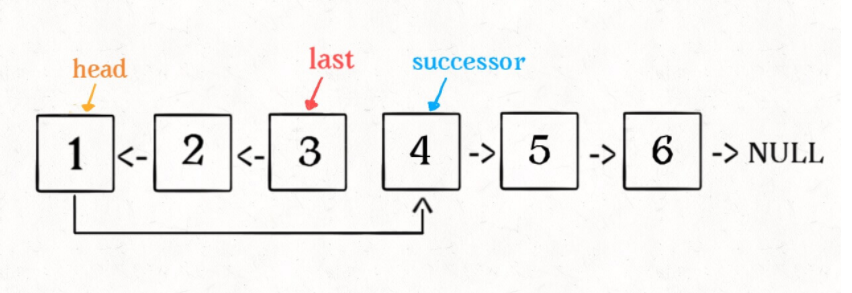
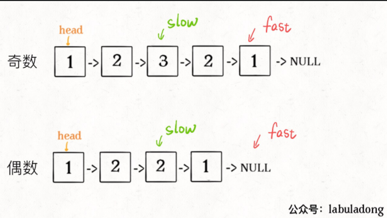

# LeetCode 刷题笔记

@Aiken 2021;

汇总LeetCode刷题以及刷《剑指offer》过程中遇到的一些不会做的题或者启发性很强的题目等等；内容主要以以下几个方面为主：

- 题目-题解-相关注释；
  - 相关难点分析；
- 相关知识点索引
  同时copy到数据结构或者c++的文档中）

## 《Fuck Algorithm》

针对各个专题指向性的去刷一些Leetcode中的题目，通过对这些题目进行分析整合来对巩固各个知识点，这一部分的代码整合到/leecode文件夹中，但是主要可能整合在md中；

- 这里可以顺便把git的内容整理一下，本地的git操作流程
- 最近先把数据结构刷了，变刷变看后面的搜索等等的内容，一部分一部分的往后看
- 第一课中回溯和其他规划的题还没看，后续再看看
- 思考C++中多返回值的设计

### 数据结构的存储方式

[**数据结构的存储方式**](https://labuladong.github.io/algo/%E7%AE%97%E6%B3%95%E6%80%9D%E7%BB%B4%E7%B3%BB%E5%88%97/%E5%AD%A6%E4%B9%A0%E6%95%B0%E6%8D%AE%E7%BB%93%E6%9E%84%E5%92%8C%E7%AE%97%E6%B3%95%E7%9A%84%E9%AB%98%E6%95%88%E6%96%B9%E6%B3%95.html)（物理层面的存储方式）：数组（顺序存储）和链表（链式存储）。
最底层的存储架构上基本上只有这两种实现的方式，更高维的才是：栈、队列、堆、树、图这些高层结构；

而这些实现的高层实现上，分别使用量中架构有啥优缺点：

> 综上，数据结构种类很多，甚至你也可以发明自己的数据结构，但是底层存储无非数组或者链表，**二者的优缺点如下**：
>
> **数组**由于是紧凑连续存储,可以随机访问，通过索引快速找到对应元素，而且相对节约存储空间。但正因为连续存储，内存空间必须一次性分配够，所以说数组如果要扩容，需要重新分配一块更大的空间，再把数据全部复制过去，时间复杂度 O(N)；而且你如果想在数组中间进行插入和删除，每次必须搬移后面的所有数据以保持连续，时间复杂度 O(N)。
>
> **链表**因为元素不连续，而是靠指针指向下一个元素的位置，所以不存在数组的扩容问题；如果知道某一元素的前驱和后驱，操作指针即可删除该元素或者插入新元素，时间复杂度 O(1)。但是正因为存储空间不连续，你无法根据一个索引算出对应元素的地址，所以不能随机访问；而且由于每个元素必须存储指向前后元素位置的指针，会消耗相对更多的储存空间。

### 数据结构的基本操作

所有数据结构的基本操作一般都局限在 **遍历+访问**，更具体一点就是：**增删改查**；

数据结构存在的目的就在于尽可能快的**增删改查**：

遍历的基本操作一般来说也就两种形式：**线性**和**非线性**情况，基本的遍历框架可以总结为

#### 线性遍历：

线性就是 for/while 迭代为代表，经典的就是数组遍历框架；

```c++
void traverse(cosnt int[]& arr){
    for(int i=0;i<arr.length;i++)
        // visit();
}
```

#### 非线性遍历：

链表遍历框架，兼具迭代和递归框架；

```c++
/* 基本的单链表节点 */
class ListNode {
    int val;
    ListNode next;
}

void traverse(ListNode head) {
    for (ListNode p = head; p != null; p = p.next) {
        // 迭代访问 p.val：迭代需要写出我们每个的具体操作
    }
}
// 两种不同的遍历写法👆 👇，具体思路上的区别
void traverse(ListNode head) {
    // 递归访问 head.val
    // 递归是基于我们的n-1假设，只需要实现n-1 到n的转变就行
    traverse(head.next);
}
```

二叉树的情况的话，实际上就是链表的递归情况，然后要针对两侧进行递归就可以了，在多几个分支也是一样的；而也可以拓展成图的遍历，针对图可能出现环的情况就使用flag标记一下就可以了。

```c++
/* 基本的二叉树节点 */
class TreeNode {
    int val;
    TreeNode left, right;
}

void traverse(TreeNode root) {
    // oprtator 前序遍历
    traverse(root.left);
    // oprtator 中序遍历
    traverse(root.right);
    // oprtator 后序遍历
}
```

### 链表刷题

主要还是和二叉树一样，熟悉一个递归实现的问题；

一些总结：双边约束的情况下好像使用迭代写起来比递归好写多了；

**反转链表（206）：**

:stadium:迭代的分析思路：基于n-1的假设，我们可以将n-1已完成的情况，当前在n的情况画出来，或者想象出来来分析怎么解题。

> 1. 注意对head非空的判断要在head next的前面
> 2. 不要临时临时变量，先把题做出来在做简化，（双指针指示法，一个指向前一个一个指向当前一个）

进阶一点的问题：

#### 递归反转链表的一部分（92）

铺垫任务：反转链表的前N个节点

具体的区别：

1. 1 base case 变为 `n == 1`，反转一个元素，就是它本身，同时**要记录后驱节点**。

2. 刚才我们直接把 `head.next` 设置为 null，因为整个链表反转后原来的 `head` 变成了整个链表的最后一个节点。但现在 `head` 节点在递归反转之后不一定是最后一个节点了，所以要记录后驱 `successor`（第 n + 1 个节点），反转之后将 `head` 连接上

   

3. 注意这里tail的设置，理解透

```c++
ListNode successor = null; // 后驱节点

// 反转以 head 为起点的 n 个节点，返回新的头结点
ListNode reverseN(ListNode head, int n) {
    if (n == 1) { 
        // 记录第 n + 1 个节点
        successor = head.next;
        return head;  // 这里也很重要！只有一个的时候return啥。
    }
    // 以 head.next 为起点，需要反转前 n - 1 个节点
    ListNode last = reverseN(head.next, n - 1);

    head.next.next = head;
    // 让反转之后的 head 节点和后面的节点连起来
    head.next = successor;
    return last;
}
```

**最终实现部分：**

:question: 但是这样的方法最终的实现效率并不高有时间的话可以去看看题解中的其他的迭代思想方式；时不时回来刷一刷这两三道题，来加强一下对于递归思想的理解。

```c++
 */
class Solution 
{
private:
    ListNode* last = nullptr;
public:
    ListNode* reverseBetween(ListNode* head, int m, int n) {
        if (m == 1)
        {
            return reverseN(head, n);
        }
        head->next = reverseBetween(head->next, m - 1, n - 1);
        // 这里，return head和递归之间的关系要掌握好，从变换的阈值开始分析，比较传入值和return值就知道了
        return head;
    }
    ListNode* reverseN(ListNode* head, int n)
    {
        if (n == 1)
        {
            last = head->next;
            return head;
        }
        ListNode* tail = reverseN(head->next, n - 1);
        head->next->next = head;
        head->next = last;
        return tail;
    }
};
```

#### 如何k个一组反转链表（25）

使用迭代+递归的方式编写，迭代进行反转，递归进行组合排序（外层架构）,**这种双边约束的好像使用迭代的方式比递归更好写一些**，而且这样的时间复杂度好像甚至更低把。和上面的对比一下就知道了。

```c++
class Solution {
public:
    ListNode* reverseKGroup(ListNode* head, int k) {
        ListNode* start, *end;
        start = end = head;
        for (int i = 0; i<k;i++)
        {
            if(end == nullptr)
                return head;
            end = end->next;
        }
        ListNode* newH = reversek(start,end);
        start->next = reverseKGroup(end,k);
        return newH;
    }
    ListNode* reversek(ListNode* start, ListNode* end)
    {
        ListNode* curr = start; 
        ListNode* prev = nullptr; //最后的赋值再下一行，哪个start.net
        while(curr!=end)
        {
            ListNode* temp = curr;
            curr = curr->next;
            temp->next= prev;
            // curr.next= temp; 多做了一部，我们只做到当前curr指向的点就行
            prev = temp; 
        }
        return prev;
    }
};
```

#### 判断回文链表（234）

判断是不是回文数的话，首先需要考虑两种基本情况：

1. 数值的回文数考虑奇数偶数长度的问题（**中心节点不统一**）；

2. string类型的回文数的情况，考虑的是正着读和反着读是一样的，不考虑中心节点好像；（使用**双指针技巧**，正向和反向遍历，这实际上也算是一种reverse的问题把）

   > 不考虑中心节点实际上是从两侧同时逼近的话，只要在left<right的时候执行判断就可以了，这样的话，无论中心是一个数字还是两个数字都会被考虑进去，所以这种**中心逼近的思想**应该还更好一点

寻找回文数的基本中心思想是：**从中心向两端拓展**（反过来就是递归思想）

而对于链表问题：链表是一个**单向索引的**数据结构，这种情况下怎么使用双指针的办法？

1. 遍历的同时存储一个反转副本，然后判断两个链表是否相同？

2. 使用**二叉树的后序遍历**的思想，也能倒序的遍历链表，来进行回文数判断

   > 实际上就是基本的递归思想把；同时我们知道树结构其实也就是依托于LISTNode的高层实现，每个树的节点都是链表的节点来着。但是这样的方法目前来看算法的效率不是特别的高。

```c++
时间和空间复杂度都是O（n）
    后续需要对这个方法进行优化
使用后续遍历的迭代思想进行的例子;
实现上的核心问题：我们虽然可以通过后序遍历来首先取到链表的tail;
但是我们如何让最底层的取到的也是最前面的head呢？（需要另一一个共有head）;
class Solution {
public:
    ListNode* head;
    bool isPalindrome(ListNode* head) {
        this->head = head;
        return reverseJ(head);
    }
    bool reverseJ(ListNode* tail){
        // 我们虽然可以通过后序遍历来首先取到链表的tail
        // 但是我们如何让最底层的取到的也是最前面的head呢？（需要另一一个共有head）
        if (tail == nullptr)
            return true;
        bool ans = reverseJ(tail->next);
        ans = ans && (this->head->val == tail->val);
        this->head = this->head->next;
        return ans;
    }
};

```

如何优化上面的这个算法，减少这个不必要的入栈的空间复杂度，这就涉及到了如何用两个指针来模拟反向遍历的问题：这是一个特别的算法，我们放到下面一个小专题中来详细讲：

#### 快慢指针技巧优化空间复杂度

双指针技巧1：快慢指针**找到链表的中点**，原理如图所示，

这个方法的时间复杂度是O（n），空间复杂度是O（1）；

Keypoint->找到链表的中点。

```c++
ListNode* slow, *fast;
slow = fast = head;
while (fast != nullptr && fast->next != nullptr) {
    slow = slow->next;
    fast = fast->next->next;
}
if (fast != nullptr)
    slow = slow->next;
// slow 指针现在指向链表中点
```



- 如果fast不是nullptr，说明链表的长度为奇数，slow还需要往后进行一步，现在是卡在中间的地方

  ```c++
  if(fast != nullptr)
  	slow = slow->next;
  ```

- 接下来就不需要多说了把，直接递归进行后续的链表反转，然后正向运行JUDGE就可以了

  ```c++
  class Solution {
  public:
      ListNode* reverseList(ListNode* head) {
          ListNode* prev = nullptr;
          ListNode* curr = head;
          while (curr)
          {
              ListNode* temp = curr;
              curr = curr->next;
              temp->next = prev;
              prev = temp;
          }
          return prev;
      }
  };
  ```

- JUDGE:

  ```c++
  ListNode* left = head;
  ListNode* right = reverse(slow);
  
  while (right != nullptr) {
      if (left->val != right->val)
          return false;
      left = left->next;
      right = right->next;
  }
  return true;
  ```

  

### 二叉树刷题

- 很多二叉树的问题实际上就是上述总结的二叉树遍历的问题，可以套用以上的框架解决。

- 而且二叉树实际上和很多重要的算法都有关系：比如说**快速排序就是二叉树的前序遍历**；**归并排序就是二叉树的后续遍历**。


#### 二叉树中的最大路径和（142）

路径 被定义为一条从树中任意节点出发，沿父节点-子节点连接，达到任意节点的序列。该路径 至少包含一个 节点，且不一定经过根节点。

路径和 是路径中各节点值的总和。

给你一个二叉树的根节点 root ，返回其 最大路径和 。

**解题的思路：**

- 注意区分return和最终结果值的区别
- 由于考虑到节点为negative的情况，这种情况下就需要设定两个值：
  - 一个是经过当前节点的话，最多能得到多少（动态规划，从后往前）
    - 用max来考虑当前节点接不接如（用0来代替）
  - 另一个是最终的最大值
- 对于每个节点
  - return：**这个节点，后面能取得得最大值**；
  - ans：**结合这个节点的左右child**，能取得的最大值？，为什么一定要加入当前节点的值？因为不加入当前节点的值的话，就是看哪个子节点最大了（子节点已经考虑了0的情况，也就是用max做了处理。）
- 这实际上还是递归遍历的框架，最重要的在于问题归纳，怎么对左右节点进行处理和怎么对中间节点进行是否引入的判断；

```c++
//* Definition for a binary tree node.
class Solution {
private:
    int ans = INT_MIN;
public:
     // 好像不需要自己写std
    int maxPathSum(TreeNode* root) {
        helpSum(root);
        return ans;
    }
    int helpSum(TreeNode* root)
    {
        if (root == nullptr)
            return 0;
        // 考虑negative的情况；用0来判断是否要输入
        int rightG = max(helpSum(root->right), 0);
        int leftG = max(helpSum(root->left), 0);
        // 不经过该节点的情况已经在子节点的地方输出了，不需要我自己画蛇添足的在这里进行政府的判断；
        // 从最低层节点开始分析你就知道了，已经包含在ans中了
        int temp = root->val + rightG + leftG;
        ans = max(temp,ans);
        // 最终都是复数的情况？可能还要考虑temp和val哪个更小的问题
        return max(rightG,leftG) + root->val;
    }
};
```

#### 基于前序和中序重建二叉树（105）

和剑指的题目冲突了，06，看书即可；后续和前序的应该关系差不多

基于前序找到中间切分点，然后根据中间接分店找到左子树和右子树的数目，从前序和中序中抠出子树来。

```c++
class Solution 
{
public:
    TreeNode* buildTree(vector<int>& preorder, vector<int>& inorder) 
    {
        // int tempre[preorder.size()];
        // 函数，返回一个迭代器
        return helpbuild(preorder.begin(),preorder.end(),inorder.begin(),inorder.end());
    }
    // 学，给老子学，怎么在c++中实现动态数组的划分传入，如果是python可太爽了；
    TreeNode* helpbuild(vector<int>::iterator preb, vector<int>::iterator prend, \
        vector<int>::iterator inob, vector<int>::iterator inoe)
    {
        if(inob == inoe)
            return nullptr;
        TreeNode* cur = new TreeNode(*preb);
        // 记住这个函数find，返回的是一个迭代器，迭代器本身就是一个指针，指针的+1会随着类型的不同而变化
        auto root = std::find(inob,inoe,*preb);
        cur->left = helpbuild(preb+1,preb+(root-inob)+1,inob,root);
        cur->right = helpbuild(preb+(root-inob)+1,prend,root+1,inoe);

        return cur;
    }
};
```

基于FA中的算法复原一下？等下思想好像是一样的就是一个前序遍历的过程。

#### 基于中序和后序重建二叉树（106）

和上一题基本的实现思想采用了一样的思路，但是这样的方法的空间复杂度好像和网友们查了很多我也不知道具体是为啥，看看fA中间的解法把，以下先post我的思路；

```c++
class Solution {
public:
    TreeNode* buildTree(vector<int>& inorder, vector<int>& postorder) {
        return helpbuild(inorder.begin(),inorder.end(),postorder.begin(),postorder.end());

    }
    TreeNode* helpbuild(vector<int>::iterator ins,vector<int>::iterator ine,
                        vector<int>::iterator pos, vector<int>::iterator poe)
    {
        if(poe == pos)
            return nullptr;
        // 这里要注意的是end是有值的下一项
        // iterator 之间的加减和index之间的加减的关系的转化也要清楚到底是怎么回事
        poe--;
        TreeNode* cur = new TreeNode(*poe);
        auto root = find(ins,ine,*poe);
        cur->left = helpbuild(ins,root,pos,poe-(ine-root-1));
        cur->right = helpbuild(root+1,ine,poe-(ine-root-1),poe);
        return cur;

    }
};
```

下面是[FA的实现思路](https://mp.weixin.qq.com/s?__biz=MzAxODQxMDM0Mw==&mid=2247487270&idx=1&sn=2f7ad74aabc88b53d94012ceccbe51be&chksm=9bd7f12eaca078384733168971147866c140496cb257946f8170f05e46d16099f3eef98d39d9&scene=21#wechat_redirect)：(need to change cpp version)实际上没什么区别，但是就是在++--这块好像确实直接用下标索引会好一点，在找找把。

```c++
TreeNode build(int[] inorder, int inStart, int inEnd,
               int[] postorder, int postStart, int postEnd) {

    if (inStart > inEnd) {
        return null;
    }
    // root 节点对应的值就是后序遍历数组的最后一个元素
    int rootVal = postorder[postEnd];
    // rootVal 在中序遍历数组中的索引
    int index = 0;
    for (int i = inStart; i <= inEnd; i++) {
        if (inorder[i] == rootVal) {
            index = i;
            break;
        }
    }
    // 左子树的节点个数
    int leftSize = index - inStart;
    TreeNode root = new TreeNode(rootVal);
    // 递归构造左右子树
    root.left = build(inorder, inStart, index - 1,
                        postorder, postStart, postStart + leftSize - 1);

    root.right = build(inorder, index + 1, inEnd,
                        postorder, postStart + leftSize, postEnd - 1);
    return root;
}
```


#### 翻转二叉树（226）

这题白送的，都不需要再多说什么。

```c++
class Solution {
public:
    TreeNode* invertTree(TreeNode* root) {
        if(root == nullptr)
            return nullptr;
        TreeNode* Temp = root->right;
        root->right = root-> left;
        root->left = Temp;
        invertTree(root->right);
        invertTree(root->left);
        return root;
    }
};
```

#### 填充二叉树节点的右侧指针（116）

这一题也是比较考虑**迭代和递归思想**的，同时也考研**完全二叉树节点的构造特点**知识（从左到右建立起来，全满的）

**我的解决方法**：每次从最左侧节点开始，给下一层赋予连接，然后通过这样的设定迭代的完成这样的任务。

**需要注意的地方**：几个设置为空的判断，包括对于left为空的判断是需要的。

```c++
class Solution {
public:
    Node* connect(Node* root) 
    {
        if(!root)
            return nullptr;
        else
        {
            Node* temptr = root;
            while(root != nullptr){
                // 这一步特别重要也容易忽略
                if(!root->left)
                    return temptr;
                root->left->next = root->right;
                root->right->next = root->next?root->next->left:nullptr;
                root = root->next;
            }
            connect(temptr->left);
            return temptr;
        }
    }
};
```

**FA写的方法**：没有我写的快，但是其实更好理解一点，他是通过辅助函数把传入的两个节点串起来。但是这样调用的消耗也太大了。

模拟的就是第一个节点的情况，把分开的分开处理，然后跨树的节点相连。

这样其实理解起来还难一点，但是主要是一个**无死角覆盖**的问题，和一个跨树的处理的问题，全部归化成第二到第三层的问题。

```c++
class Solution {
public:
    // 主函数
    Node* connect(Node* root) {
        if (root == nullptr) 
            return nullptr;
        connectTwoNode(root->left, root->right);
        return root;
    }

    // 辅助函数
    void connectTwoNode(Node* node1, Node* node2) {
        if (node1 == nullptr || node2 == nullptr) {
            return;
        }
        /**** 前序遍历位置 ****/
        // 将传入的两个节点连接
        node1->next = node2;

        // 连接相同父节点的两个子节点
        connectTwoNode(node1->left, node1->right);
        connectTwoNode(node2->left, node2->right);
        // 连接跨越父节点的两个子节点
        connectTwoNode(node1->right, node2->left);
    }
};
```

#### 二叉树展开为链表（114）

我自己的解法beat 100 99

要注意的是要全部收敛到右侧，解题思路写在下面的代码中，拜读一下自己。

```c++
class Solution {
public:
    void flatten(TreeNode* root) {
        helpflat(root);
    }
    TreeNode* helpflat(TreeNode* root){
        // 递归的终点以及空值判断
        if(!root)
            return nullptr;
        //n-1假设：flaten后续的节点并变到左侧，同时由于后续的接入需求，我们需要return最后一个有值的节点
        TreeNode* lefte = helpflat(root->left);
        TreeNode* righte = helpflat(root->right);
        //加入最后左右都是0的话，我们就return当前节点而不是下一个节点（因为我们需要最后一个元素的索引），这其实也是终值判断
        if(!lefte && !righte)
            return root;
        // 如果只有右边无序处理，算是已经摊开好了
        else if(righte && !lefte)
        {
        }
        //两边都有或者只有左边的情况下，就是把左边的最后一个的下一个接到当前节点的右侧那一路，然后将改节点转移到右侧，最后将左节点清空。返回尾巴，无论是左边还是右边。
        else
        {
            lefte->right = root->right;
            root->right = root->left;

        }
        root->left = nullptr;
        // 返回尾巴，如果有右侧尾巴的话，他就在最后，否则就是左侧尾巴是最后
        return righte?righte:lefte;
    }
};
```

FA的解法和思想：(实际上基本是差不多的)

```c++
// 定义：将以 root 为根的树拉平为链表
void flatten(TreeNode root) {
    // base case
    if (root == null) return;

    flatten(root.left);
    flatten(root.right);

    /**** 后序遍历位置 ****/
    // 1、左右子树已经被拉平成一条链表
    TreeNode left = root.left;
    TreeNode right = root.right;

    // 2、将左子树作为右子树
    root.left = null;
    root.right = left;

    // 3、将原先的右子树接到当前右子树的末端
    TreeNode p = root;
    while (p.right != null) {
        p = p.right;
    }
    p.right = right;
}
```

#### 构建最大二叉树（654）

这里理解上没啥问题，但是实现上有一些奇怪的问题需要分析，后续解决把

- 一个就是最后那个+1，没有弄的话会导致溢出等很严重的问题
- 第二是lvalue的问题还有一个就是为什么使用iterator在这里不太行，后续修改一下试试。
- 还有一个要注意的就是记得用new关键词来构造新的节点，不然return的那个东西最后本身都不存在了还return个几把。

```c++
// FIXME:为什么在这里使用迭代器的方法会出现很多问题，无法进行实现，正确的写法应该是怎么杨的？
// lvalue来初始化一个node我知道不行，但是为什么会是左值呢。
// class Solution {
// public:
//     TreeNode* constructMaximumBinaryTree(vector<int>& nums) {
//         TreeNode* root = helpbuild(nums.begin(),nums.end());
//         return root;
//     }
//     TreeNode* helpbuild(vector){
//         int max= *begin;
//         for(vector<int>::iterator it=begin; it!=end; it++){
//             if(*it>max)
//                 max = *it;
//         }
//         cout<<max<<endl;
//         TreeNode* inner; 
//         inner->val = max;
//         auto next = find(begin,end,max);
//         inner->left = helpbuild(begin,next);
//         inner->right = helpbuild(next+1,end);
//         return inner;

//     }
// };
class Solution{
public:
    TreeNode* constructMaximumBinaryTree(vector<int>& nums) {
        return helpbuild(nums,0,nums.size());
    }
    TreeNode* helpbuild(vector<int>& nums, int begin, int end){
        if(nums.empty() || begin==end)
            return nullptr;
        int maxindex = -1, maxval = INT_MIN;
        for(int i=begin;i<end;i++){
            if (nums[i]>=maxval)
            {
                maxindex = i;
                maxval = nums[i];
            }
        }
        // inner的生存周期问题
        TreeNode* inner = new TreeNode(maxval);
        inner->left = helpbuild(nums,begin,maxindex);
        // 下面这里没有+1的画，会导致一个机器严重的问题，但是我不知道为啥，是溢出了把，永远无法到达终点？
        inner->right = helpbuild(nums,maxindex+1,end);
        return inner;
    }
};
```

#### :star: 寻找重复的子树（652）

[LINK](https://mp.weixin.qq.com/s?__biz=MzAxODQxMDM0Mw==&mid=2247487527&idx=1&sn=9cf2b0d8608ba26ea7c6a5c9b41d05a1&chksm=9bd7ee2faca0673916bf075539bf6fc3c01f3dcc0b298b3f507047692ef5c850ed9cfe82e4e6&scene=21#wechat_redirect) FA参考链接，

这一题的解题思路还是比较有意思的，解题过程中也出现了比较多的问题，还有一些有待解决的问题需要分析。

- 为什么用**后序遍历这种方式的序列就能用来表征重复的子树**，这一点后序再好好琢磨琢磨；
- unordered_map中的contains为啥不能用
- String的方式来寻找重复子树
- int变量如何转换到string，为啥出现了很多问题，还有网友的解决方法对比
- 现在的时空复杂度结果都不太好到网上找一下更好的解决思路和解决的方案；

下面给出一个基本的解法，后续需要进行优化和补充。

```c++
// TODO:这题可以讨论一下python的解法，应该会更简单一点。
// FIXME：这题目前这样的结果十分的差，后序看看其他方法的改进，但是这题的解题思路还是很不错
#include <unordered_map> 
#include <string>
class Solution {
public:
    unordered_map<string,int> memo;
    vector<TreeNode*> res;
    vector<TreeNode*> findDuplicateSubtrees(TreeNode* root) {
        if(!root)
            return {}; // 这个返回值要记得
        traverse(root);
        return res;
    }
    string traverse(TreeNode* root){
        if(!root)
            return "#";
        string left = traverse(root->left);
        string right = traverse(root->right);
        // 得到一个后序遍历的序列，（但是基于这样的序列怎么判断子树一致呢？）
        // FIXME int到string的转换到底怎么做，好疑惑啊。
        char temp = root->val +'0';
        string resstr = left + "," + right+"," + temp;
        // 压入hashmap,但是普通的压入的话，会导致多个重复的root；
        // 那么如果我们对memo用map管理的话，就只有==1的时候
        // FIXME：为什么contains不能用
        if(memo.count(resstr))
            memo[resstr]++;
        if (memo[resstr]==1)
            res.push_back(root);
        return resstr;
    }
};
```


### 排序算法：

排序算法最少最少也要nlogn （平均和最差）

最终要对各个 排序算法都要写一下，不管是基本框架还是具体实现，找找对应的题，没有的话再说。

#### 复杂度分析汇总

**排序算法一般在最差情况的下时间复杂度为Ω（n log n）;**

**书上P151页的表**到时候重新扫描一下；

前三种Θ（n^2）的算法：这种算法的瓶颈就在于只比较相邻的元素，因此比较和移动只能一步步进行。交换相邻记录称为一次交换

| 排序算法 | 时间复杂度 | 空间复杂度 |
| -------- | ---------- | ---------- |
| 插入排序 |            |            |
| 冒泡排序 |            |            |
| 选择排序 |            |            |

**插入排序：**

一个一个输入后面的空位，然后逐步和前面的已经输入的n-1比，“冒泡”合适的位置，逐个进行比较和swap。

**冒泡排序：**

内层将该轮的最值冒出去，最外层就是冒泡n次就是了。

**选择排序：**

实际上就是冒泡排序的从最小值开始，但是不是每次都交换，而是固定每个内循环只交换一次，就是先找值后交换而已。

---

一些好一点的算法：

#### Shell 排序：缩小增量排序

选择适当的增量序列可以使得Shell排序比其他的排序都更有效率；但是选择这个序列是很难的，一般来说选择（1，4，13..）增量每次÷3。Shell不加证明的认为Θ（n^1.5），确实比前面的三种都要快，当n中等规模的时候，也和下面的那些有的比。

基本思想：利用插入排序的最佳时间代价的特性，试图将待排序序列变成近似有序的，然后再利用插入排序来最后排序；

实现逻辑：把序列分成多个子序列，然后分别对子序列进行排序，最后把子序列组合起来。

#### 快速排序：实际上就是二叉树的前序遍历

快速排序的逻辑是，若要对 `nums[lo..hi]` 进行排序，我们先找一个分界点 `p`，通过交换元素使得 `nums[lo..p-1]` 都小于等于 `nums[p]`，且 `nums[p+1..hi]` 都大于 `nums[p]`，然后递归地去 `nums[lo..p-1]` 和 `nums[p+1..hi]` 中寻找新的分界点，最后整个数组就被排序了。

执行关键在于partiton划分过程，算法效率在于怎么找到划分节点，最差n^2，平均和最佳都是nlogn

```c++
// 代码框架，（不是具体实现）
void sort(int[] nums, int lo, int hi) {
    /****** 前序遍历位置 ******/
    // 通过交换元素构建分界点 p
    int p = partition(nums, lo, hi);
    /************************/

    sort(nums, lo, p - 1);
    sort(nums, p + 1, hi);
}
先构造分界点，然后去左右子数组构造分界点，你看这不就是一个二叉树的前序遍历吗？
```

#### 归并排序：实际上就是二叉树的后序遍历

再说说归并排序的逻辑，若要对 `nums[lo..hi]` 进行排序，我们先对 `nums[lo..mid]` 排序，再对 `nums[mid+1..hi]` 排序，最后把这两个有序的子数组合并，整个数组就排好序了。

归并排序的代码框架如下：

```c++
void sort(int[] nums, int lo, int hi) {
    int mid = (lo + hi) / 2;
    sort(nums, lo, mid);
    sort(nums, mid + 1, hi);

    /****** 后序遍历位置 ******/
    // 合并两个排好序的子数组
    // 逐渐的比较两个sort的最小值就行了，应该算是O（n）把，遍历一遍就好
    merge(nums, lo, mid, hi);
    /************************/
}
```

先对左右子数组排序，然后合并（类似合并有序链表的逻辑），你看这是不是二叉树的后序遍历框架？另外，这不就是传说中的分治算法嘛，不过如此呀。

#### 堆排序：

所有情况都是nlogn.

实现的思想：建堆取中心节点，直至堆空；主要就在于建堆和removefirst；

#### 分配排序和基数排序

看书，上网找描述，书上能理解但是描述不清楚。


## 《剑指offer》

在这一部分里面实际上书上和具体实现是存在一定版本上的差异的，我们可以从书上得到解题的那种基本思路，但是实际上并不一定适用于现在的情况，所以我们其实可以基于现在的实现来结合书上的笔记进行整理。在这个文档中主要集中于现今情况下的解题分析；

### 重要知识点

书上记录一些比较重要的知识点，后续多次复习或者是重新整理；

- [ ] 树的3重遍历（*2 循环+递归）= 6种实现；

- [ ] 红黑树

  

### SIZEOF

Sizeof(Empty Class) = 1 ; 加入构造和析构函数 =1；将析构函数标记为virtual， = 4（32位的机器） =8（64位的机器） （会生成虚函数表，并为该类型的所有实例中添加一个指向虚函数表的指针。） 

也就是说指针在32位上是4字节 在64位上是8字节。

### Singleton

分析书上的C#代码中的代码和我们笔记中的C++情况的异同，然后根据C#中提出的哪些要求来进一步改进C++中的这个单例的实现方式。

```c++
// final version of C++ singleton 
// 不会产生复制构造函数，只会声明一次实例的生成，同时也简化了调用的步骤
public:
	Random(const Random&) = delete;
	
	static Random& Get()
	{
		static Random instance;
		return instance;
	}
	
	static float Float() {return Get().IFloat();}
private:
	float IFloat() {return m_RandomGenerator;}
	Random(){}
	float m_RandomGenerator = o.5f
```

### 重建二叉树

还是一个基于n-1假设完成的递归思想：递归记得要有初始状态，前序/后序 && 中序，实际上前序和后序的变换没有什么差别，只是顺序颠倒了一下，这里需要注意的就是怎么样推导出这样的一个重建过程是比较重要的。

## 《LeetCode》

刷题锻炼手感和了解题目设置和题库；