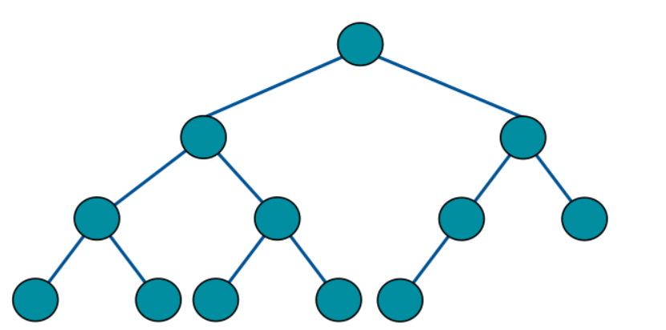
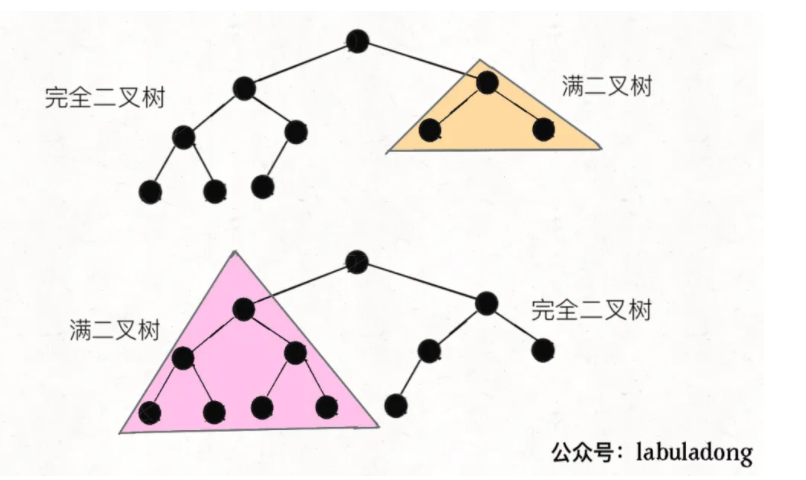
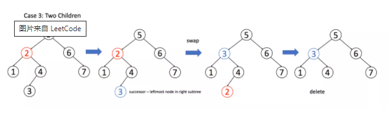
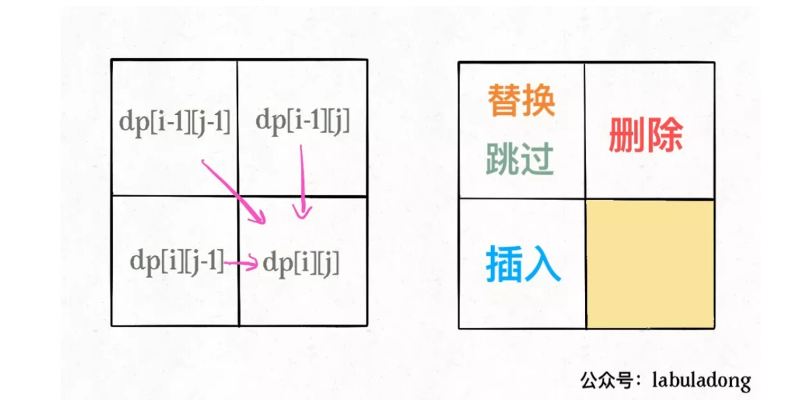
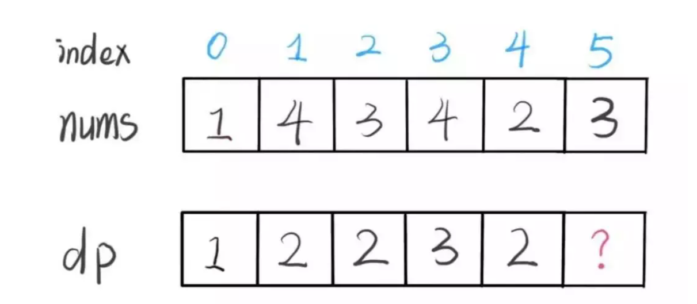
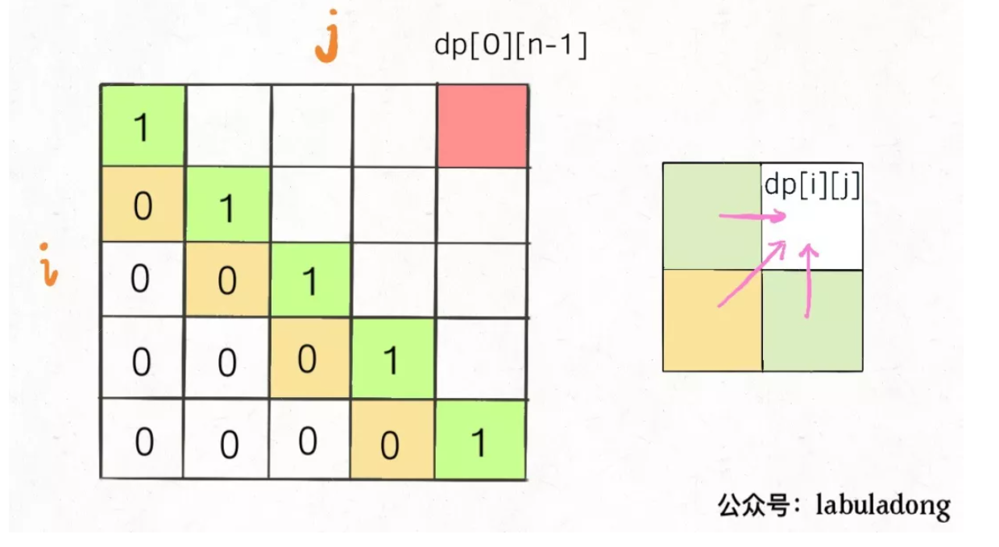
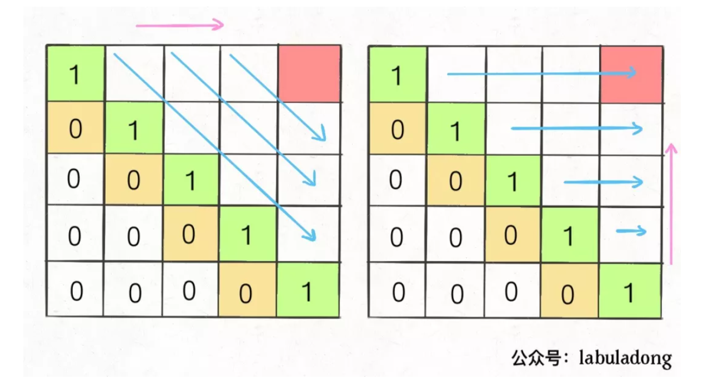
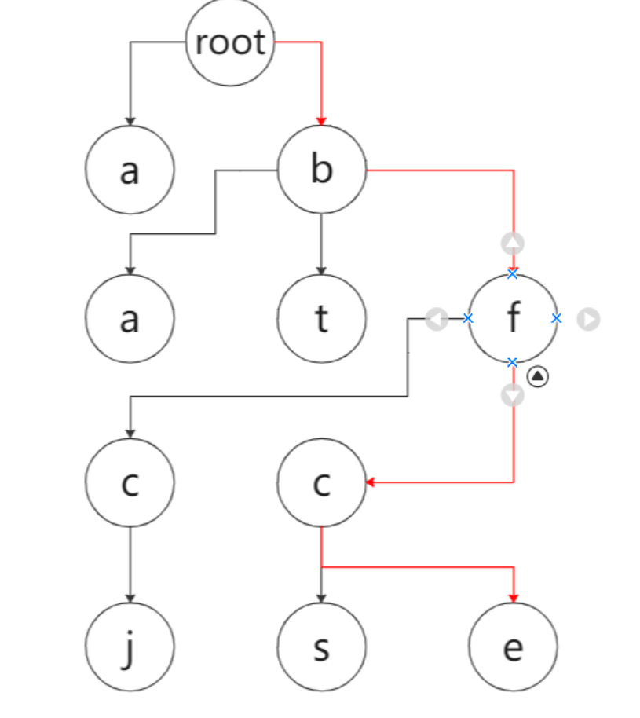
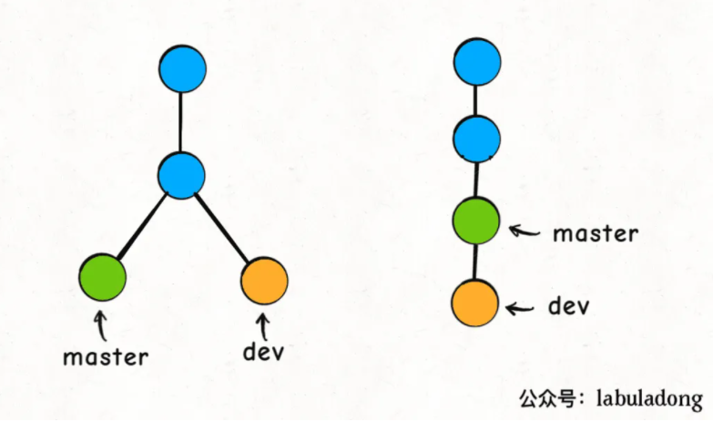

# LeetCode 刷题笔记

@Aiken 2021;

汇总LeetCode刷题以及刷《剑指offer》过程中遇到的一些不会做的题或者启发性很强的题目等等；内容主要以以下几个方面为主：

- 题目-题解-相关注释；
  - 相关难点分析；
- 相关知识点索引
  同时copy到数据结构或者c++的文档中）

## 《Fuck Algorithm》

针对各个专题指向性的去刷一些Leetcode中的题目，通过对这些题目进行分析整合来对巩固各个知识点，这一部分的代码整合到/leecode文件夹中，但是主要可能整合在md中；

- 这里可以顺便把git的内容整理一下，本地的git操作流程
- 最近先把数据结构刷了，变刷变看后面的搜索等等的内容，一部分一部分的往后看
- 第一课中回溯和其他规划的题还没看，后续再看看
- 思考C++中多返回值的设计

### 数据结构的存储方式

[**数据结构的存储方式**](https://labuladong.github.io/algo/%E7%AE%97%E6%B3%95%E6%80%9D%E7%BB%B4%E7%B3%BB%E5%88%97/%E5%AD%A6%E4%B9%A0%E6%95%B0%E6%8D%AE%E7%BB%93%E6%9E%84%E5%92%8C%E7%AE%97%E6%B3%95%E7%9A%84%E9%AB%98%E6%95%88%E6%96%B9%E6%B3%95.html)（物理层面的存储方式）：数组（顺序存储）和链表（链式存储）。
最底层的存储架构上基本上只有这两种实现的方式，更高维的才是：栈、队列、堆、树、图这些高层结构；

而这些实现的高层实现上，分别使用量中架构有啥优缺点：

> 综上，数据结构种类很多，甚至你也可以发明自己的数据结构，但是底层存储无非数组或者链表，**二者的优缺点如下**：
>
> **数组**由于是紧凑连续存储,可以随机访问，通过索引快速找到对应元素，而且相对节约存储空间。但正因为连续存储，内存空间必须一次性分配够，所以说数组如果要扩容，需要重新分配一块更大的空间，再把数据全部复制过去，时间复杂度 O(N)；而且你如果想在数组中间进行插入和删除，每次必须搬移后面的所有数据以保持连续，时间复杂度 O(N)。
>
> **链表**因为元素不连续，而是靠指针指向下一个元素的位置，所以不存在数组的扩容问题；如果知道某一元素的前驱和后驱，操作指针即可删除该元素或者插入新元素，时间复杂度 O(1)。但是正因为存储空间不连续，你无法根据一个索引算出对应元素的地址，所以不能随机访问；而且由于每个元素必须存储指向前后元素位置的指针，会消耗相对更多的储存空间。

### 数据结构的基本操作

所有数据结构的基本操作一般都局限在 **遍历+访问**，更具体一点就是：**增删改查**；

数据结构存在的目的就在于尽可能快的**增删改查**：

遍历的基本操作一般来说也就两种形式：**线性**和**非线性**情况，基本的遍历框架可以总结为

#### 线性遍历：

线性就是 for/while 迭代为代表，经典的就是数组遍历框架；

```c++
void traverse(cosnt int[]& arr){
    for(int i=0;i<arr.length;i++)
        // visit();
}
```

#### 非线性遍历：

链表遍历框架，兼具迭代和递归框架；

```c++
/* 基本的单链表节点 */
class ListNode {
    int val;
    ListNode next;
}

void traverse(ListNode head) {
    for (ListNode p = head; p != null; p = p.next) {
        // 迭代访问 p.val：迭代需要写出我们每个的具体操作
    }
}
// 两种不同的遍历写法👆 👇，具体思路上的区别
void traverse(ListNode head) {
    // 递归访问 head.val
    // 递归是基于我们的n-1假设，只需要实现n-1 到n的转变就行
    traverse(head.next);
}
```

二叉树的情况的话，实际上就是链表的递归情况，然后要针对两侧进行递归就可以了，在多几个分支也是一样的；而也可以拓展成图的遍历，针对图可能出现环的情况就使用flag标记一下就可以了。

```c++
/* 基本的二叉树节点 */
class TreeNode {
    int val;
    TreeNode left, right;
}

void traverse(TreeNode root) {
    // oprtator 前序遍历
    traverse(root.left);
    // oprtator 中序遍历
    traverse(root.right);
    // oprtator 后序遍历
}
```

### 链表刷题

主要还是和二叉树一样，熟悉一个递归实现的问题；

一些总结：双边约束的情况下好像使用迭代写起来比递归好写多了；

**反转链表（206）：**

:stadium:迭代的分析思路：基于n-1的假设，我们可以将n-1已完成的情况，当前在n的情况画出来，或者想象出来来分析怎么解题。

> 1. 注意对head非空的判断要在head next的前面
> 2. 不要临时临时变量，先把题做出来在做简化，（双指针指示法，一个指向前一个一个指向当前一个）

进阶一点的问题：

#### 递归反转链表的一部分（92）

铺垫任务：反转链表的前N个节点

具体的区别：

1. 1 base case 变为 `n == 1`，反转一个元素，就是它本身，同时**要记录后驱节点**。

2. 刚才我们直接把 `head.next` 设置为 null，因为整个链表反转后原来的 `head` 变成了整个链表的最后一个节点。但现在 `head` 节点在递归反转之后不一定是最后一个节点了，所以要记录后驱 `successor`（第 n + 1 个节点），反转之后将 `head` 连接上

   

3. 注意这里tail的设置，理解透

```c++
ListNode successor = null; // 后驱节点

// 反转以 head 为起点的 n 个节点，返回新的头结点
ListNode reverseN(ListNode head, int n) {
    if (n == 1) { 
        // 记录第 n + 1 个节点
        successor = head.next;
        return head;  // 这里也很重要！只有一个的时候return啥。
    }
    // 以 head.next 为起点，需要反转前 n - 1 个节点
    ListNode last = reverseN(head.next, n - 1);

    head.next.next = head;
    // 让反转之后的 head 节点和后面的节点连起来
    head.next = successor;
    return last;
}
```

**最终实现部分：**

:question: 但是这样的方法最终的实现效率并不高有时间的话可以去看看题解中的其他的迭代思想方式；时不时回来刷一刷这两三道题，来加强一下对于递归思想的理解。

```c++
 */
class Solution 
{
private:
    ListNode* last = nullptr;
public:
    ListNode* reverseBetween(ListNode* head, int m, int n) {
        if (m == 1)
        {
            return reverseN(head, n);
        }
        head->next = reverseBetween(head->next, m - 1, n - 1);
        // 这里，return head和递归之间的关系要掌握好，从变换的阈值开始分析，比较传入值和return值就知道了
        return head;
    }
    ListNode* reverseN(ListNode* head, int n)
    {
        if (n == 1)
        {
            last = head->next;
            return head;
        }
        ListNode* tail = reverseN(head->next, n - 1);
        head->next->next = head;
        head->next = last;
        return tail;
    }
};
```

#### 如何k个一组反转链表（25）

使用迭代+递归的方式编写，迭代进行反转，递归进行组合排序（外层架构）,**这种双边约束的好像使用迭代的方式比递归更好写一些**，而且这样的时间复杂度好像甚至更低把。和上面的对比一下就知道了。

```c++
class Solution {
public:
    ListNode* reverseKGroup(ListNode* head, int k) {
        ListNode* start, *end;
        start = end = head;
        for (int i = 0; i<k;i++)
        {
            if(end == nullptr)
                return head;
            end = end->next;
        }
        ListNode* newH = reversek(start,end);
        start->next = reverseKGroup(end,k);
        return newH;
    }
    ListNode* reversek(ListNode* start, ListNode* end)
    {
        ListNode* curr = start; 
        ListNode* prev = nullptr; //最后的赋值再下一行，哪个start.net
        while(curr!=end)
        {
            ListNode* temp = curr;
            curr = curr->next;
            temp->next= prev;
            // curr.next= temp; 多做了一部，我们只做到当前curr指向的点就行
            prev = temp; 
        }
        return prev;
    }
};
```

#### 判断回文链表（234）

判断是不是回文数的话，首先需要考虑两种基本情况：

1. 数值的回文数考虑奇数偶数长度的问题（**中心节点不统一**）；

2. string类型的回文数的情况，考虑的是正着读和反着读是一样的，不考虑中心节点好像；（使用**双指针技巧**，正向和反向遍历，这实际上也算是一种reverse的问题把）

   > 不考虑中心节点实际上是从两侧同时逼近的话，只要在left<right的时候执行判断就可以了，这样的话，无论中心是一个数字还是两个数字都会被考虑进去，所以这种**中心逼近的思想**应该还更好一点

寻找回文数的基本中心思想是：**从中心向两端拓展**（反过来就是递归思想）

而对于链表问题：链表是一个**单向索引的**数据结构，这种情况下怎么使用双指针的办法？

1. 遍历的同时存储一个反转副本，然后判断两个链表是否相同？

2. 使用**二叉树的后序遍历**的思想，也能倒序的遍历链表，来进行回文数判断

   > 实际上就是基本的递归思想把；同时我们知道树结构其实也就是依托于LISTNode的高层实现，每个树的节点都是链表的节点来着。但是这样的方法目前来看算法的效率不是特别的高。

```c++
时间和空间复杂度都是O（n）
    后续需要对这个方法进行优化
使用后续遍历的迭代思想进行的例子;
实现上的核心问题：我们虽然可以通过后序遍历来首先取到链表的tail;
但是我们如何让最底层的取到的也是最前面的head呢？（需要另一一个共有head）;
class Solution {
public:
    ListNode* head;
    bool isPalindrome(ListNode* head) {
        this->head = head;
        return reverseJ(head);
    }
    bool reverseJ(ListNode* tail){
        // 我们虽然可以通过后序遍历来首先取到链表的tail
        // 但是我们如何让最底层的取到的也是最前面的head呢？（需要另一一个共有head）
        if (tail == nullptr)
            return true;
        bool ans = reverseJ(tail->next);
        ans = ans && (this->head->val == tail->val);
        this->head = this->head->next;
        return ans;
    }
};

```

如何优化上面的这个算法，减少这个不必要的入栈的空间复杂度，这就涉及到了如何用两个指针来模拟反向遍历的问题：这是一个特别的算法，我们放到下面一个小专题中来详细讲：

#### 快慢指针技巧优化空间复杂度

双指针技巧1：快慢指针**找到链表的中点**，原理如图所示，

这个方法的时间复杂度是O（n），空间复杂度是O（1）；

Keypoint->找到链表的中点。

```c++
ListNode* slow, *fast;
slow = fast = head;
while (fast != nullptr && fast->next != nullptr) {
    slow = slow->next;
    fast = fast->next->next;
}
if (fast != nullptr)
    slow = slow->next;
// slow 指针现在指向链表中点
```


- 如果fast不是nullptr，说明链表的长度为奇数，slow还需要往后进行一步，现在是卡在中间的地方

  ```c++
  if(fast != nullptr)
  	slow = slow->next;
  ```

- 接下来就不需要多说了把，直接递归进行后续的链表反转，然后正向运行JUDGE就可以了

  ```c++
  class Solution {
  public:
      ListNode* reverseList(ListNode* head) {
          ListNode* prev = nullptr;
          ListNode* curr = head;
          while (curr)
          {
              ListNode* temp = curr;
              curr = curr->next;
              temp->next = prev;
              prev = temp;
          }
          return prev;
      }
  };
  ```

- JUDGE:

  ```c++
  ListNode* left = head;
  ListNode* right = reverse(slow);
  
  while (right != nullptr) {
      if (left->val != right->val)
          return false;
      left = left->next;
      right = right->next;
  }
  return true;
  ```

  

### 二叉树刷题

- 很多二叉树的问题实际上就是上述总结的二叉树遍历的问题，可以套用以上的框架解决。

- 而且二叉树实际上和很多重要的算法都有关系：比如说**快速排序就是二叉树的前序遍历**；**归并排序就是二叉树的后续遍历**。


#### 二叉树中的最大路径和（142）

路径 被定义为一条从树中任意节点出发，沿父节点-子节点连接，达到任意节点的序列。该路径 至少包含一个 节点，且不一定经过根节点。

路径和 是路径中各节点值的总和。

给你一个二叉树的根节点 root ，返回其 最大路径和 。

**解题的思路：**

- 注意区分return和最终结果值的区别
- 由于考虑到节点为negative的情况，这种情况下就需要设定两个值：
  - 一个是经过当前节点的话，最多能得到多少（动态规划，从后往前）
    - 用max来考虑当前节点接不接如（用0来代替）
  - 另一个是最终的最大值
- 对于每个节点
  - return：**这个节点，后面能取得得最大值**；
  - ans：**结合这个节点的左右child**，能取得的最大值？，为什么一定要加入当前节点的值？因为不加入当前节点的值的话，就是看哪个子节点最大了（子节点已经考虑了0的情况，也就是用max做了处理。）
- 这实际上还是递归遍历的框架，最重要的在于问题归纳，怎么对左右节点进行处理和怎么对中间节点进行是否引入的判断；

```c++
//* Definition for a binary tree node.
class Solution {
private:
    int ans = INT_MIN;
public:
     // 好像不需要自己写std
    int maxPathSum(TreeNode* root) {
        helpSum(root);
        return ans;
    }
    int helpSum(TreeNode* root)
    {
        if (root == nullptr)
            return 0;
        // 考虑negative的情况；用0来判断是否要输入
        int rightG = max(helpSum(root->right), 0);
        int leftG = max(helpSum(root->left), 0);
        // 不经过该节点的情况已经在子节点的地方输出了，不需要我自己画蛇添足的在这里进行政府的判断；
        // 从最低层节点开始分析你就知道了，已经包含在ans中了
        int temp = root->val + rightG + leftG;
        ans = max(temp,ans);
        // 最终都是复数的情况？可能还要考虑temp和val哪个更小的问题
        return max(rightG,leftG) + root->val;
    }
};
```

#### 基于前序和中序重建二叉树（105）

和剑指的题目冲突了，06，看书即可；后续和前序的应该关系差不多

基于前序找到中间切分点，然后根据中间接分店找到左子树和右子树的数目，从前序和中序中抠出子树来。

```c++
class Solution 
{
public:
    TreeNode* buildTree(vector<int>& preorder, vector<int>& inorder) 
    {
        // int tempre[preorder.size()];
        // 函数，返回一个迭代器
        return helpbuild(preorder.begin(),preorder.end(),inorder.begin(),inorder.end());
    }
    // 学，给老子学，怎么在c++中实现动态数组的划分传入，如果是python可太爽了；
    TreeNode* helpbuild(vector<int>::iterator preb, vector<int>::iterator prend, \
        vector<int>::iterator inob, vector<int>::iterator inoe)
    {
        if(inob == inoe)
            return nullptr;
        TreeNode* cur = new TreeNode(*preb);
        // 记住这个函数find，返回的是一个迭代器，迭代器本身就是一个指针，指针的+1会随着类型的不同而变化
        auto root = std::find(inob,inoe,*preb);
        cur->left = helpbuild(preb+1,preb+(root-inob)+1,inob,root);
        cur->right = helpbuild(preb+(root-inob)+1,prend,root+1,inoe);

        return cur;
    }
};
```

基于FA中的算法复原一下？等下思想好像是一样的就是一个前序遍历的过程。

#### 基于中序和后序重建二叉树（106）

和上一题基本的实现思想采用了一样的思路，但是这样的方法的空间复杂度好像和网友们查了很多我也不知道具体是为啥，看看fA中间的解法把，以下先post我的思路；

```c++
class Solution {
public:
    TreeNode* buildTree(vector<int>& inorder, vector<int>& postorder) {
        return helpbuild(inorder.begin(),inorder.end(),postorder.begin(),postorder.end());

    }
    TreeNode* helpbuild(vector<int>::iterator ins,vector<int>::iterator ine,
                        vector<int>::iterator pos, vector<int>::iterator poe)
    {
        if(poe == pos)
            return nullptr;
        // 这里要注意的是end是有值的下一项
        // iterator 之间的加减和index之间的加减的关系的转化也要清楚到底是怎么回事
        poe--;
        TreeNode* cur = new TreeNode(*poe);
        auto root = find(ins,ine,*poe);
        cur->left = helpbuild(ins,root,pos,poe-(ine-root-1));
        cur->right = helpbuild(root+1,ine,poe-(ine-root-1),poe);
        return cur;

    }
};
```

下面是[FA的实现思路](https://mp.weixin.qq.com/s?__biz=MzAxODQxMDM0Mw==&mid=2247487270&idx=1&sn=2f7ad74aabc88b53d94012ceccbe51be&chksm=9bd7f12eaca078384733168971147866c140496cb257946f8170f05e46d16099f3eef98d39d9&scene=21#wechat_redirect)：(need to change cpp version)实际上没什么区别，但是就是在++--这块好像确实直接用下标索引会好一点，在找找把。

```c++
TreeNode build(int[] inorder, int inStart, int inEnd,
               int[] postorder, int postStart, int postEnd) {

    if (inStart > inEnd) {
        return null;
    }
    // root 节点对应的值就是后序遍历数组的最后一个元素
    int rootVal = postorder[postEnd];
    // rootVal 在中序遍历数组中的索引
    int index = 0;
    for (int i = inStart; i <= inEnd; i++) {
        if (inorder[i] == rootVal) {
            index = i;
            break;
        }
    }
    // 左子树的节点个数
    int leftSize = index - inStart;
    TreeNode root = new TreeNode(rootVal);
    // 递归构造左右子树
    root.left = build(inorder, inStart, index - 1,
                        postorder, postStart, postStart + leftSize - 1);

    root.right = build(inorder, index + 1, inEnd,
                        postorder, postStart + leftSize, postEnd - 1);
    return root;
}
```


#### 翻转二叉树（226）

这题白送的，都不需要再多说什么。

```c++
class Solution {
public:
    TreeNode* invertTree(TreeNode* root) {
        if(root == nullptr)
            return nullptr;
        TreeNode* Temp = root->right;
        root->right = root-> left;
        root->left = Temp;
        invertTree(root->right);
        invertTree(root->left);
        return root;
    }
};
```

#### 填充二叉树节点的右侧指针（116）

这一题也是比较考虑**迭代和递归思想**的，同时也考研**完全二叉树节点的构造特点**知识（从左到右建立起来，全满的）

**我的解决方法**：每次从最左侧节点开始，给下一层赋予连接，然后通过这样的设定迭代的完成这样的任务。

**需要注意的地方**：几个设置为空的判断，包括对于left为空的判断是需要的。

```c++
class Solution {
public:
    Node* connect(Node* root) 
    {
        if(!root)
            return nullptr;
        else
        {
            Node* temptr = root;
            while(root != nullptr){
                // 这一步特别重要也容易忽略
                if(!root->left)
                    return temptr;
                root->left->next = root->right;
                root->right->next = root->next?root->next->left:nullptr;
                root = root->next;
            }
            connect(temptr->left);
            return temptr;
        }
    }
};
```

**FA写的方法**：没有我写的快，但是其实更好理解一点，他是通过辅助函数把传入的两个节点串起来。但是这样调用的消耗也太大了。

模拟的就是第一个节点的情况，把分开的分开处理，然后跨树的节点相连。

这样其实理解起来还难一点，但是主要是一个**无死角覆盖**的问题，和一个跨树的处理的问题，全部归化成第二到第三层的问题。

```c++
class Solution {
public:
    // 主函数
    Node* connect(Node* root) {
        if (root == nullptr) 
            return nullptr;
        connectTwoNode(root->left, root->right);
        return root;
    }

    // 辅助函数
    void connectTwoNode(Node* node1, Node* node2) {
        if (node1 == nullptr || node2 == nullptr) {
            return;
        }
        /**** 前序遍历位置 ****/
        // 将传入的两个节点连接
        node1->next = node2;

        // 连接相同父节点的两个子节点
        connectTwoNode(node1->left, node1->right);
        connectTwoNode(node2->left, node2->right);
        // 连接跨越父节点的两个子节点
        connectTwoNode(node1->right, node2->left);
    }
};
```

#### 二叉树展开为链表（114）

我自己的解法beat 100 99

要注意的是要全部收敛到右侧，解题思路写在下面的代码中，拜读一下自己。

```c++
class Solution {
public:
    void flatten(TreeNode* root) {
        helpflat(root);
    }
    TreeNode* helpflat(TreeNode* root){
        // 递归的终点以及空值判断
        if(!root)
            return nullptr;
        //n-1假设：flaten后续的节点并变到左侧，同时由于后续的接入需求，我们需要return最后一个有值的节点
        TreeNode* lefte = helpflat(root->left);
        TreeNode* righte = helpflat(root->right);
        //加入最后左右都是0的话，我们就return当前节点而不是下一个节点（因为我们需要最后一个元素的索引），这其实也是终值判断
        if(!lefte && !righte)
            return root;
        // 如果只有右边无序处理，算是已经摊开好了
        else if(righte && !lefte)
        {
        }
        //两边都有或者只有左边的情况下，就是把左边的最后一个的下一个接到当前节点的右侧那一路，然后将改节点转移到右侧，最后将左节点清空。返回尾巴，无论是左边还是右边。
        else
        {
            lefte->right = root->right;
            root->right = root->left;

        }
        root->left = nullptr;
        // 返回尾巴，如果有右侧尾巴的话，他就在最后，否则就是左侧尾巴是最后
        return righte?righte:lefte;
    }
};
```

FA的解法和思想：(实际上基本是差不多的)

```c++
// 定义：将以 root 为根的树拉平为链表
void flatten(TreeNode root) {
    // base case
    if (root == null) return;

    flatten(root.left);
    flatten(root.right);

    /**** 后序遍历位置 ****/
    // 1、左右子树已经被拉平成一条链表
    TreeNode left = root.left;
    TreeNode right = root.right;

    // 2、将左子树作为右子树
    root.left = null;
    root.right = left;

    // 3、将原先的右子树接到当前右子树的末端
    TreeNode p = root;
    while (p.right != null) {
        p = p.right;
    }
    p.right = right;
}
```

#### 构建最大二叉树（654）

这里理解上没啥问题，但是实现上有一些奇怪的问题需要分析，后续解决把

- 一个就是最后那个+1，没有弄的话会导致溢出等很严重的问题
- 第二是lvalue的问题还有一个就是为什么使用iterator在这里不太行，后续修改一下试试。
- 还有一个要注意的就是记得用new关键词来构造新的节点，不然return的那个东西最后本身都不存在了还return个几把。

```c++
// FIXME:为什么在这里使用迭代器的方法会出现很多问题，无法进行实现，正确的写法应该是怎么杨的？
// lvalue来初始化一个node我知道不行，但是为什么会是左值呢。
// class Solution {
// public:
//     TreeNode* constructMaximumBinaryTree(vector<int>& nums) {
//         TreeNode* root = helpbuild(nums.begin(),nums.end());
//         return root;
//     }
//     TreeNode* helpbuild(vector){
//         int max= *begin;
//         for(vector<int>::iterator it=begin; it!=end; it++){
//             if(*it>max)
//                 max = *it;
//         }
//         cout<<max<<endl;
//         TreeNode* inner; 
//         inner->val = max;
//         auto next = find(begin,end,max);
//         inner->left = helpbuild(begin,next);
//         inner->right = helpbuild(next+1,end);
//         return inner;

//     }
// };
class Solution{
public:
    TreeNode* constructMaximumBinaryTree(vector<int>& nums) {
        return helpbuild(nums,0,nums.size());
    }
    TreeNode* helpbuild(vector<int>& nums, int begin, int end){
        if(nums.empty() || begin==end)
            return nullptr;
        int maxindex = -1, maxval = INT_MIN;
        for(int i=begin;i<end;i++){
            if (nums[i]>=maxval)
            {
                maxindex = i;
                maxval = nums[i];
            }
        }
        // inner的生存周期问题
        TreeNode* inner = new TreeNode(maxval);
        inner->left = helpbuild(nums,begin,maxindex);
        // 下面这里没有+1的画，会导致一个机器严重的问题，但是我不知道为啥，是溢出了把，永远无法到达终点？
        inner->right = helpbuild(nums,maxindex+1,end);
        return inner;
    }
};
```

#### :star: 寻找重复的子树（652）

[LINK](https://mp.weixin.qq.com/s?__biz=MzAxODQxMDM0Mw==&mid=2247487527&idx=1&sn=9cf2b0d8608ba26ea7c6a5c9b41d05a1&chksm=9bd7ee2faca0673916bf075539bf6fc3c01f3dcc0b298b3f507047692ef5c850ed9cfe82e4e6&scene=21#wechat_redirect) FA参考链接，

这一题的解题思路还是比较有意思的，解题过程中也出现了比较多的问题，还有一些有待解决的问题需要分析。

- 为什么用**后序遍历这种方式的序列就能用来表征重复的子树**，这一点后序再好好琢磨琢磨；
- unordered_map中的contains为啥不能用
- String的方式来寻找重复子树
- int变量如何转换到string，为啥出现了很多问题，还有网友的解决方法对比
- 现在的时空复杂度结果都不太好到网上找一下更好的解决思路和解决的方案；

下面给出一个基本的解法，后续需要进行优化和补充。

```c++
// TODO:这题可以讨论一下python的解法，应该会更简单一点。
// FIXME：这题目前这样的结果十分的差，后序看看其他方法的改进，但是这题的解题思路还是很不错
#include <unordered_map> 
#include <string>
class Solution {
public:
    unordered_map<string,int> memo;
    vector<TreeNode*> res;
    vector<TreeNode*> findDuplicateSubtrees(TreeNode* root) {
        if(!root)
            return {}; // 这个返回值要记得
        traverse(root);
        return res;
    }
    string traverse(TreeNode* root){
        if(!root)
            return "#";
        string left = traverse(root->left);
        string right = traverse(root->right);
        // 得到一个后序遍历的序列，（但是基于这样的序列怎么判断子树一致呢？）
        // FIXME int到string的转换到底怎么做，好疑惑啊。
        char temp = root->val +'0';
        string resstr = left + "," + right+"," + temp;
        // 压入hashmap,但是普通的压入的话，会导致多个重复的root；
        // 那么如果我们对memo用map管理的话，就只有==1的时候
        // FIXME：为什么contains不能用
        if(memo.count(resstr))
            memo[resstr]++;
        if (memo[resstr]==1)
            res.push_back(root);
        return resstr;
    }
};
```

#### :question: :star:  二叉树的序列化和反序列化（297）

[这题](https://mp.weixin.qq.com/s?__biz=MzAxODQxMDM0Mw==&mid=2247485871&idx=1&sn=bcb24ea8927995b585629a8b9caeed01&chksm=9bd7f7a7aca07eb1b4c330382a4e0b916ef5a82ca48db28908ab16563e28a376b5ca6805bec2&scene=21#wechat_redirect)在解题过程中出现了很多问题和值得探讨的点，**后续一定要进行归纳总结以及二刷。**

**二刷TODO:**

- 层级遍历的思路设计总结
- 各种遍历方式的可行性分析(实现)
- 遍历与数据结构的相对应分析

**问题归纳：**

1. 需要总结一下各种数据类型的空值return方式（也就是空值的表达）

   > string : ""
   >
   > 

2. 相关的各种常见类型之间的转化；

   > string to int : stoi()
   >
   > int to string : to_string()  (需要include)

3. 各个类别中的迭代器实现和类别;

4. 连续append的实现: (`.append().append()`);

5. 切分字符串split方法的实现(思路),以及为什么这里在前序遍历的时候需要选用Queue;

6. 什么类别,什么情况下需要先调用new再执行后续的复制操作(为啥定义的时候不需要,但是这里要new)

7. 有时候append不行但是push_back可以,这是为什么?这个区别是string特有的还是通用的?

8. 编程的format实现,要全部写在类里还是类外.(分析易读性)

**前序遍历的代码实现**

```c++
class Codec {
public:
    // 实际上该问题还是突出一个三种遍历方式的问题；
    // Encodes a tree to a single string.
    string serialize(TreeNode* root) {
        string BTString;
        string SEP = ",";
        string ENDS = "#";
        if(!root){
            BTString.append(ENDS).append(SEP);
            return BTString;
        }
        
        // 前序遍历位置
        // TODO：连续append的表示形式

        BTString.append(to_string(root->val)).append(SEP);
        BTString.append(serialize(root->left)); 
        BTString.append(serialize(root->right)); 
        return BTString;
    }

    // Decodes your encoded data to tree.
    TreeNode* deserialize(string data) {
        // 切分字符串方法 find & substr?
        // 我们在这里需要的是一个先进先出的情况，所以实际上是一个Quene的类别
        // 但是好像实际上for循环也能满足这个问题，但是如果我试图使用递归的话，那我应该还是要用队列
        // 长度不固定的问题
        // FIXME:String的空值的情况
        if(data=="")
            return nullptr;
        // NOTE: 通过循环将布不恒等的数值压入队列
        queue<string> q;
        string Tmpstr;
        for(int i = 0; i<data.length();i++){
            if(data[i]==','){
                q.push(Tmpstr);
                Tmpstr.clear();
            }
            else{
                // FIXME：append就不行但是push_back就可以，为什么？
                Tmpstr.push_back(data[i]);
            }
        }
        return helprebuild(q);
    }
    TreeNode* helprebuild(queue<string>& que);
};
TreeNode* Codec::helprebuild(queue<string>& que)
{
    TreeNode* root;
    // if (que.empty())
    //     return nullptr;
    string str = que.front();
    if(str == "#")
    {
        que.pop();
        return nullptr;
    }
    // FIXME：还没有给这个类别建立一个存储空间
    root = new TreeNode();
    root->val = stoi(str);
    que.pop();
    root->left = helprebuild(que);
    root->right = helprebuild(que);
    return root;
}
```

#### 完全二叉树的节点计算

完全二叉树和满二叉树有很多不同的定义方式，本文中针对的完全二叉树计算是如下的这种情况：

**每一层都是紧凑靠左排列的**



首先这种节点情况进行计算的话，最优的时间复杂度应该是$O(logN * logN)$ ?

首先普通二叉树的话直接就是O（N）遍历就完事了；

如果是全部填满的满完全二叉树架构的话，就直接$O(logN)$指数计算就好了。

那么完全二叉树的话，应该是前两者结合，<u>也就是当左右的深度相同的话，就不需要计算，只需要在左右深度不同的情况下进行遍历的操作</u>就可以了，但是这个思想的实现，对于计算复杂度的实现是相当巧妙的，好好分析一下。

```c++
public int countNodes(TreeNode root) {
    TreeNode l = root, r = root;
    // 记录左、右子树的高度
    int hl = 0, hr = 0;
    while (l != null) {
        l = l.left;
        hl++;
    }
    while (r != null) {
        r = r.right;
        hr++;
    }
    // 如果左右子树的高度相同，则是一棵满二叉树
    if (hl == hr) {
        return (int)Math.pow(2, hl) - 1;
    }
    // 如果左右高度不同，则按照普通二叉树的逻辑计算
    return 1 + countNodes(root.left) + countNodes(root.right);
}
```

**复杂度分析**

**一棵完全二叉树的两棵子树，至少有一棵是满二叉树**：所以不断切分迭代的话，我们就知道每次的while是$O(logN)$ 需要迭代$O(logN)$的深度，所以就是上面分析的复杂度。



#### :star: 二叉树的最近公共祖先（236）二刷

这个[设计思路](https://mp.weixin.qq.com/s?__biz=MzAxODQxMDM0Mw==&mid=2247485561&idx=1&sn=a394ba978283819da1eb34a256f6915b&chksm=9bd7f671aca07f6722f0bc1e946ca771a0a40fd8173cc1227a7e0eabfe4e2fcc57b9ba464547&scene=21#wechat_redirect)还挺有意思 ，虽然代码不长但是思路还比较复杂；可以参考一下这个代码的设计思路，实际上还是逃不脱二叉树的几种框架：

**根据我们需要首先访问的值来决定我们的遍历框架。**

这题首先需要我们找到最底部的值（`后序遍历`），然后一层一层的往外找，然后找到最底层的哪个公共root（再往上肯定就都是公共的了）；

1. 如果只有其中一个值就返回那个值的指针，如果root的两侧包含了两个，就返回root。
2. 由于如果Node1的左右包含了p，q；那么Node的父节点的左右肯定另一侧是无效值，可以用这个来设计内层覆盖外层返回值的逻辑。

```c++
class Solution {
public:
    TreeNode* lowestCommonAncestor(TreeNode* root, TreeNode* p, TreeNode* q) {
        // 用来判断是否两个点都存在在以如今的root所在的树中，如果存在的话就返回True
        // 设计的主要原则：
        // 1. 出现在了后面节点的左边和右边的话，就不可能出现在父节点的左边和右边
        // 2. 再叶节点找到相应的两个指，需要从后面遍历起来，先找到两个节点的位置，然后一级一级的并上来。
        if(!root)
            return nullptr;
        if(root == q || root == p)
            return root;

        TreeNode* left = lowestCommonAncestor(root->left,p,q);
        TreeNode* right = lowestCommonAncestor(root->right,p,q);

        if (left && right)
            return root;
        if (!left && !right)
            return nullptr; 
            
        return left?left:right;
    }
    // bool comexit(TreeNode* root, TreeNode* p, TreeNode* q);
};
```

#### 扁平化嵌套列表迭代器（341）

这题的关键在于辅助空间的建立和相应的（迭代和循环的）嵌套，还有就是理解题目，但是这种简单的实现方式，实际上并不能达到一个比较好的时间和空间复杂度。

**我的解法（初始）：**我的方法也可以改成用栈来实现，原理是一样的。

```c++
class NestedIterator {
private:
    int lens;
    int index;
    vector<int> NestIt; // 关键点在于额外辅助数组的构建，但是是否能够预先建立一个比较长的数组
    // FIXME：通过初始化函数，建立一个比较合适的数组长度，从而减少需要额外分配内存的时间代价。
    // Vector的重新初始化方式。

public:
    // TODO:迭代器的表示形式应该怎么写
    // NOTE：这种题目的阅读逻辑应该怎么分析
    NestedIterator(vector<NestedInteger> &nestedList):index(0) {
        helpBuildVec(nestedList);
    }

    void helpBuildVec(vector<NestedInteger> & nestedList){
        for(int i =0;i<nestedList.size();i++)
        {
            if(nestedList[i].isInteger())
                NestIt.push_back(nestedList[i].getInteger()); // 记得要调用取值的函数
            else
                helpBuildVec(nestedList[i].getList());
        }
        lens = NestIt.size();
    }
    
    int next() {
        return NestIt[index++];
    }
    
    bool hasNext() {
        return index < lens; 
    }
};
```

实际上迭代器应该根据需要来进行数值的导入，没有必要一开始就将全部的数据读取出来，这样的效率在一些特殊的情况下可能是不好的

**改进1：惰性存放**

- **Vector反向迭代** `rbegin` `rend`
- 利用栈，其实用队列然后正向迭代也是可以的
- 初步就是先把外层存进去，在实际调用的时候再解包的方法。

```c++
class NestedIterator {
private:
  stack<NestedInteger> st;
public:
  NestedIterator(vector<NestedInteger> &nestedList) {
    for (auto iter = nestedList.rbegin(); iter != nestedList.rend(); iter++) {
      st.push(*iter);
    }
  }

  int next() {
    auto t = st.top();
    st.pop();
    return t.getInteger();
  }

  bool hasNext() {
    while (!st.empty()) {
      auto cur = st.top();
      if (cur.isInteger()) return true;
      st.pop();
      auto curList = cur.getList();
      for (auto iter = curList.rbegin(); iter != curList.rend(); iter++) {
        st.push(*iter);
      }
    }
    return false;
  }
};
```


### 二叉搜索树

#### BST中的搜索（700）

利用大小的特性进行遍历就好了

```c++
class Solution {
public:
    TreeNode* searchBST(TreeNode* root, int val) {
        if(!root)
            return nullptr;
        if(root->val == val)
            return root;
        if(val > root->val)
            return searchBST(root->right,val);
        if(val < root->val)
            return searchBST(root->left,val);
        return nullptr;
    }
};
```


#### BST第k小的元素（230）

**“从做算法题的角度来看 BST，除了它的定义，还有一个重要的性质：BST 的中序遍历结果是有序的（升序）”**。

上面这个是最关键的一点，同时我们也很容易理解这点，根据BST本身的性质来说，所以这道题实际上很简单，我们只需要进行一个中序遍历就可以完成这样的问题了，然后在后续的位置进行累计。

- 还有就是熟悉迭代到底会从头开始输出还是从尾开始输出，这点逻辑要搞清楚，好像除了前序遍历的话，其他的都是会从尾巴开始的把。
- 文中提到的优化思路，其实是如何将算法优化到（logn），那就需要知道k和一个数是第几的这个关系，这样的话，实际上是需要树本身存放额外信息的（以自己为root的树有多少节点，这样就能分析出来自己顺位，从而和k对比）。
- 红黑树这种改良的自平衡BST，增删查改都是O（logN）的复杂度。（后续掌握）

```c++
class Solution {
private:
    int count = 0;
    int res = INT_MIN;
public:
    int kthSmallest(TreeNode* root, int k) {
        traverr(root,k);
        return res;
    }
    void traverr(TreeNode* root, int k){
        if (!root)
            return;
        traverr(root->left,k);
        count++;
        if(count==k)
            res = root->val;
        traverr(root->right,k);
    }
};
```

#### BST转化为累加树（538，1038）

分析题目，实际上也是一个遍历的问题，由于找的是**比自己大的所有数**

:star: 所以累加的方向：是从**大数累计到小数**，而同时BST的**中序遍历是有序**的，所以我们改变中序遍历的方式，进行一个从大到小的遍历，用一个默认值来进行累计值的统计。

- :question: 为什么NULL的方法会失效
- 由于Int的上限的问题，需要使用long不然会出问题

```c++
// FIXME:为什么使用NULL的方法会失效。
// LONG的使用情景，
// 试着用迭代的方式去写（中序遍历）
class Solution {
public:
    bool isValidBST(TreeNode* root) {
        return helpJudge(root,LONG_MAX,LONG_MIN);
    }
    bool helpJudge(TreeNode* root, long int max,long int min){
        if(!root)
            return true;
        // 这个大于等于等于号不能丢掉。
        if(root->val >= max) return false;
        if(root->val <= min) return false;
        // 根据节点往下迭代的情况，更新最小值和最大值，因为右侧的最小值是不断增长的
        // 而左侧的最大值是在不断的变小的。这一点是这个问题最关键的地方
        return helpJudge(root->right,max,root->val) && helpJudge(root->left,root->val,min);
    }
};
```

#### BST的节点有效性（98）

也就是左侧的子树都要小于中间然后小于右侧的子树，这点，如果简单的对于所有的节点对左右判断的话，没办法维持子树全体的大小关系的特性，所以需要额外的记录一个值来保持这个特性：

1. root的值是左边的最大值，是右边的最小值；
2. 或者从有序规则来统计一个最大最小值来进行判断，（swap==0）

```c++
boolean isValidBST(TreeNode root) {
    return isValidBST(root, null, null);
}

/* 限定以 root 为根的子树节点必须满足 max.val > root.val > min.val */
boolean isValidBST(TreeNode root, TreeNode min, TreeNode max) {
    // base case
    if (root == null) return true;
    // 若 root.val 不符合 max 和 min 的限制，说明不是合法 BST
    if (min != null && root.val <= min.val) return false;
    if (max != null && root.val >= max.val) return false;
    // 限定左子树的最大值是 root.val，右子树的最小值是 root.val
    return isValidBST(root.left, min, root) 
        && isValidBST(root.right, root, max);
}
```

#### BST插入数值（701）

对比判断左右就行了，就是加入了判断的遍历。下面是FA给出的框架

```c++
TreeNode insertIntoBST(TreeNode root, int val) {
    // 找到空位置插入新节点
    if (root == null) return new TreeNode(val);
    // if (root.val == val)
    //     BST 中一般不会插入已存在元素
    if (root.val < val) 
        root.right = insertIntoBST(root.right, val);
    if (root.val > val) 
        root.left = insertIntoBST(root.left, val);
    return root;
}
```

我的解题方法：实际上就是基于遍历的思想，然后在需要的地方执行完操作再往后继续遍历就好了。实际上实现的效果非常的好。

```c++
class Solution {
public:
    TreeNode* insertIntoBST(TreeNode* root, int val) {
        if(!root){
            TreeNode* curr = new TreeNode(val);
            return curr;
        }
        if (val > root->val)
        {
            if (!root->right)
            {
                TreeNode* curr = new TreeNode(val);
                root->right = curr;
                return root;
            }
            insertIntoBST(root->right,val);
        }
        else
        {
            if(!root->left)
            {
                TreeNode* curr = new TreeNode(val);
                root->left = curr;
                return root;
            }
            insertIntoBST(root->left,val);
        }
        return root;
    }
};
```


#### :star: BST删除（450）

先找到，**然后改，**主要是不能破坏BST的数值结构.先写出基本的框架

```c++
TreeNode deleteNode(TreeNode root, int key) {
    if (root.val == key) {
        // 找到啦，进行删除
    } else if (root.val > key) {
        // 去左子树找
        root.left = deleteNode(root.left, key);
    } else if (root.val < key) {
        // 去右子树找
        root.right = deleteNode(root.right, key);
    }
    return root;
}
```

**情况 1**：`A`恰好是末端节点，两个子节点都为空，那么它可以当场去世了。

```c++
if (root.left == null && root.right == null)
    return null;
```

**情况 2**：`A`只有一个非空子节点，那么它要让这个孩子接替自己的位置。

```c++
// 排除了情况 1 之后
if (root.left == null) return root.right;
if (root.right == null) return root.left;
```

**情况 3**：`A`有两个子节点，麻烦了，为了不破坏 BST 的性质，`A`**必须找到左子树中最大的那个节点，或者右子树中最小的那个节点来接替自己。**我们以第二种方式讲解。



```c++
if (root.left != null && root.right != null) {
    // 找到右子树的最小节点
    TreeNode minNode = getMin(root.right);
    // 把 root 改成 minNode
    root.val = minNode.val;
    // 转而去删除 minNode
    root.right = deleteNode(root.right, minNode.val);
}
```

综上所述：但是我们通常不会通过val交换值来交换节点，而是通过链表操作来处理，暂时把框架和思路描写成这样，后续进行修改。

```c++
TreeNode deleteNode(TreeNode root, int key) {
    if (root == null) return null;
    if (root.val == key) {
        // 这两个 if 把情况 1 和 2 都正确处理了
        if (root.left == null) return root.right;
        if (root.right == null) return root.left;
        // 处理情况 3
        TreeNode minNode = getMin(root.right);
        root.val = minNode.val;
        root.right = deleteNode(root.right, minNode.val);
    } else if (root.val > key) {
        root.left = deleteNode(root.left, key);
    } else if (root.val < key) {
        root.right = deleteNode(root.right, key);
    }
    return root;
}

TreeNode getMin(TreeNode node) {
    // BST 最左边的就是最小的
    while (node.left != null) node = node.left;
    return node;
} 
```

**我的解题过程**

遇到的问题：

1. 删除的话不是之前的链表那种用nullptr替代，好像是直接用delete去做的逻辑，这样的话，编写的难度其实就不太一样了，我们可以找一个替代指针来进行删除。
2. 分析清楚总共有几种情况，一些特殊的情况下直接进行一个值的替换可以吗。（不行）
3. 这里有好几种解题思路，主要用的是一个替换的思想，这里后面要重新看看多捋捋。（这些算法实际上都涉及到内存泄露把，就很离谱）
4. 但是还有一个典型的就是只要我们最后return的ptr的树，是我们的目标树来着。这里给出的方法实际上是直接整个把左子树接到右子树的后面去了，如果删除的是中间节点的话，学习一下。

### 动态规划方法

首先是动态规划的基本思路（适用条件）（剑指有提到讲的还挺好）：本质上是一种穷举的搜索方法

1. 求解的是最值问题
2. 最优解可以依赖于子序列的最优解（**最优子结构**）
3. 大问题可以分解为小问题，小问题还有**重叠的**更小的子问题；
4. 从上到下分析问题，从下到上的求解问题（避免重复计算）（需要额外的存储空间）

最关键的点在于正确的状态转移方程。（实际上也就是二叉树中多种遍历之间要执行的那个操作）：

**明确[状态] -> 定义dp动态规划表中的数组或者函数的含义（子最优状态）-》明确选择-》明确base case就是起始状态**

[可以看一下其中的硬币问题](https://mp.weixin.qq.com/s?__biz=MzAxODQxMDM0Mw==&mid=2247484731&idx=1&sn=f1db6dee2c8e70c42240aead9fd224e6&chksm=9bd7fb33aca07225bee0b23a911c30295e0b90f393af75eca377caa4598ffb203549e1768336&scene=21#wechat_redirect) 实际上很多情况下可以使用这样的解题策略：

- Bottom-up （Vector，或者用hashtab之类的D-P table 存储）
- 双指针Bottom-up

其中设计迭代的一些准则：

1. 遍历的过程中需要的状态必须是已经算出来的
2. 遍历的重点是我们要存储结果的那个位置。

存储表和DP-TABLE不是一个意思

TODO:

1. 空间压缩方法

#### :star: 编辑距离（着重用于思路理解）

**解决两个字符串的动态规划问题，一般都是用两个指针`i,j`分别指向两个字符串的最后，然后一步步往前走，缩小问题的规模**

这一题的关键在于，如何将这样的问题抽象成状态转移方程，如何抽象成一个动态的规划问题。[Fuck Algorithm解析](https://mp.weixin.qq.com/s?__biz=MzAxODQxMDM0Mw==&mid=2247484731&idx=3&sn=aa642cbf670feee73e20428775dff0b5&chksm=9bd7fb33aca0722568ab71ead8d23e3a9422515800f0587ff7c6ef93ad45b91b9e9920d8728e&scene=21#wechat_redirect)。

- 后续通过第一串代码和最后的正确代码进行分析，但是这样的方法实际上效率也还不够高
- 我们也可以用new生成普通数组的方式去做，此外，如果我们要存储具体的操作，我们可以定义一个简单的NODE structure去实现这个功能，存放val和opp；
- TODO：空间效率优化：将二维空间压缩成一维的情况分析。

结合之前的硬币问题，我们可以把三种操作当成三种状态转移操作。然后将两个字符串的长度，看成矩阵的两个维度，然后通过状态转移操作进行坐标上的变换，由于我们需要的是最短距离；我们就假设我们的函数是从A->B的最短距离的转移函数；

分析问题的时候**给定**两个确定的case去分析：1.起始状态 2.状态转移；

此外：我们**不要去分析最优**应该是什么样的，**遍历求最值**，就是能做的操作都做，使用动态规划的方式降维而已。



**基本的实现思路如下（需要集成存储思路）** 但是如果这样的反向实现的话，很容易出现栈溢出的方法

```c++
class Solution {
public:
    int minDistance(string word1, string word2) {
        // 实现将word1 变成 word2
        // 首先使用递归的方式实现一下这个问题，然后再用迭代的方式做
        int w2_idx = word2.size()-1;
        int w1_idx = word1.size()-1;
        vector
        return DP(word1,word2,w1_idx,w2_idx);

    }
    int DP(string& s1, string& s2,int w1_idx, int w2_idx){
        // besed case 某一条到零了，要么把多的删除，要么把少的插入，反正步骤都是类似的
        // 记得要编写一个存储表来存储操作。
        if(w2_idx == -1)
            return w1_idx+1;
        if(w1_idx == -1)
            return w2_idx+1;
        // 状态转移
        if(s1[w1_idx]==s2[w2_idx])
            return DP(s1,s2,w1_idx,w2_idx);
        else{
            // 分别是三种情况下的状态转移方程
            return min(DP(s1,s2,w1_idx-1,w2_idx),
                    DP(s1,s2,w1_idx,w2_idx-1),
                    DP(s1,s2,w1_idx-1,w2_idx-1))+1;
        }
        
    }
};
```

:x: 修改过后仍然执行不了因为运行栈溢出了, 后续可以找一下有没有别人用这个思路做的。

```c++
class Solution {
public:
    int minDistance(string word1, string word2) {
        // 实现将word1 变成 word2
        // 首先使用递归的方式实现一下这个问题，然后再用迭代的方式做
        int w2_idx = word2.size();
        int w1_idx = word1.size();
        // 存储表实现：vector 长度初始化学起来(主要需要存储一个空值所以记得后面的index要加1)
        vector<vector<int>> memo(w1_idx+1,vector<int>(w2_idx+1));
        // 初始状态初始化
        for(int i =0; i<memo.size();i++)
            memo[i][0] = i;
        for(int j =0; j<memo[0].size();j++)
            memo[0][j] = j;
        return DP(word1,word2,w1_idx-1,w2_idx-1,memo);

    }
    int DP(string& s1, string& s2,int w1_idx, int w2_idx,vector<vector<int>>& memo){
        // besed case 某一条到零了，要么把多的删除，要么把少的插入，反正步骤都是类似的
        // 记得要编写一个存储表来存储操作。
        if(w1_idx<0)
            w1_idx =0;
        if(w2_idx < 0)
            w2_idx =0;
        if(memo[w1_idx+1][w2_idx+1])
            return memo[w1_idx+1][w2_idx+1];
        // 执行了初始内存以后，这些情况会被存入初始情况表，所以不需要这么操作
        // if(w2_idx == -1)
        //     return w1_idx+1;
        // if(w1_idx == -1)
        //     return w2_idx+1;
        // 状态转移
        if(s1[w1_idx]==s2[w2_idx])
        {
            memo[w1_idx+1][w2_idx+1] = DP(s1,s2,w1_idx-1,w2_idx-1,memo);
            return memo[w1_idx+1][w2_idx+1];
        }
        else{
            // 分别是三种情况下的状态转移方程
            memo[w1_idx+1][w2_idx+1]= DP(s1,s2,w1_idx-1,w2_idx,memo);
            memo[w1_idx+1][w2_idx+1]= min(memo[w1_idx+1][w2_idx+1],DP(s1,s2,w1_idx,w2_idx-1,memo));
            memo[w1_idx+1][w2_idx+1]= min(memo[w1_idx+1][w2_idx+1], DP(s1,s2,w1_idx-1,w2_idx-1,memo));
            memo[w1_idx+1][w2_idx+1]++;
            return memo[w1_idx+1][w2_idx+1];
        }
        
    }
};
```

✔：动态规划的方法实际上还是Bottom-up更好，无论是从空间还是时间上来说 (但是实际上实现效率还是没有提高，为什么呢？)

```c++
class Solution {
public:
    int minDistance(string word1, string word2) {
        // 实现将word1 变成 word2
        // auto w1_it = word1.rbegin();
        // auto w2_it = word2.rbegin();
        // 首先使用递归的方式实现一下这个问题，然后再用迭代的方式做
        int w2_idx = word2.size();
        int w1_idx = word1.size();
        // 存储表实现：vector 长度初始化学起来(主要需要存储一个空值所以记得后面的index要加1)
        vector<vector<int>> memo(w1_idx+1,vector<int>(w2_idx+1,0));
        // 初始状态初始化
        for(int i =0; i<memo.size();i++)
            memo[i][0] = i;
        for(int j =0; j<memo[0].size();j++)
            memo[0][j] = j;
        // 正向迭代 bottom-up
        // 实际上从A-》B的变换和从b——》A的变换是对称的，不用太纠结方向的问题
        for(int i =1;i<memo.size();i++)
        {
            for(int j=1;j<memo[0].size();j++)
            {
                // FIXME：操作是存在象征意义的，所以不是都在最后才+1的
                // memo[i][j] = min(memo[i][j-1],memo[i-1][j]);
                // memo[i][j] = min(memo[i][j],memo[i][j-1]);
                int minv = 500;
                if(word1[i-1] == word2[j-1])
                {
                    minv = memo[i-1][j-1];
                    // memo[i][j] = memo[i-1][j-1];
                }
                // TODO:减少对数组的操作实际上运行时间会减少。
                minv = min(minv,memo[i-1][j-1]+1);
                minv = min(minv,memo[i-1][j]+1);
                memo[i][j] = min(minv,memo[i][j-1]+1);
                // memo[i][j] = min(memo[i][j],memo[i-1][j]+1);
                // memo[i][j] = min(memo[i][j],memo[i-1][j-1]+1);
                // memo[i][j] = min(memo[i][j],memo[i][j-1]+1);
            }
        }
        return memo[w1_idx][w2_idx];
    }
};
```

#### 子序列问题

**关键的解题思想：**

- 一维的DP数组：这种子序列问题（子序列不同于子串），需要的一般都是以i为结尾的情况下，取得的最值，这样才符合我们需要归纳 的条件。

  > ```c++
  > // 基础的算法模板如下
  > int n = array.length;
  > int[] dp = new int[n];
  > 
  > for (int i = 1; i < n; i++) {
  >     for (int j = 0; j < i; j++) {
  >         dp[i] = 最值(dp[i], dp[j] + ...)
  >     }
  > }
  > ```
  >
  > **在子数组`array[0..i]`中，以\**`array[i]`\**结尾的目标子序列（最长递增子序列）的长度是`dp[i]`**。

- 二维的DP数组:这种思路其实用的更多，尤其是涉及到数组，两个字符串这样的问题的情况下，这种思路实际上涵盖了，包含一个字符串和两个字符串的情况

  - ```c++
    int n = arr.length;
    int[][] dp = new dp[n][n];
    
    for (int i = 0; i < n; i++) {
        for (int j = 1; j < n; j++) {
            if (arr[i] == arr[j]) 
                dp[i][j] = dp[i][j] + ...
            else
                dp[i][j] = 最值(...)
        }
    }
    ```

  - **涉及两个字符串/数组时**（比如最长公共子序列），dp 数组的含义如下：

    > **在子数组`arr1[0..i]`和子数组`arr2[0..j]`中，我们要求的子序列（最长公共子序列）长度为`dp[i][j]`**。
    >
    > 可以参考的是编辑距离和最长公共子序列两个文章

  - **只涉及一个字符串/数组时**（比如本文要讲的最长回文子序列），dp 数组的含义如下：

    > **在子数组`array[i..j]`中，我们要求的子序列（最长回文子序列）的长度为`dp[i][j]`**。


##### 最长递增子序列（300）

我的思路（排雷）：

- 首先找到长长度为一的所有子序列，然后从这个子序列的尾巴出发，找到后续的长度+1的子序列

  > 覆盖，清楚，（O(2N)的空间） （O（n^3））太差了，正常动态规划应该怎么去做。
  >
  > 实际上正确的修改能得到二分查找N*logN的最佳时间复杂度的方法。

- 为什么不能用以每个结尾的子串中的最长子序列来做动态规划

  > 因为最大值不可控，而且主要是这个玩意没办法重复利用。还是需要从重复寻找子序列。

###### :star: N*logN的改进二分查找加贪心算法

修改前面的假设的方法：我们要以**当前值作为前面那个最长子序列的结尾（不是一次搜索完，而是只搜索到当前元素）**，然后维护一个长度的结尾值最小的算法。[官方解答](https://leetcode-cn.com/problems/longest-increasing-subsequence/solution/zui-chang-shang-sheng-zi-xu-lie-by-leetcode-soluti/)

**这里要学习一下二分查找的思路理念**

1. 通过一个-1来错开同时并减少多余计算。
2. 用二分查找来找到第一个大于的值的位置（的思想）分析这种情况，从最后的区间开始分析。（我们要找的是第一个比他小的数，所以最后要加一）

```c++
class Solution {
public:
    int lengthOfLIS(vector<int>& nums) {
        // 基于二分查找和贪心的算法
        vector<int>DpT(nums.size()+1,0); // 这里好像没考虑到负数的情况吧,便于比较和加入所以+1
        int lens = 1;
        DpT[lens] = nums[0];
        for(int i=1;i<nums.size();i++)
        {
            if(nums[i]>DpT[lens]){
                DpT[++lens] = nums[i];
            }
            else{
                // 二分查找大型现场。
                int left = 1, cur=0, right = lens;
                while(left <= right){
                    int mid =(left+right)>>1;
                    if(nums[i]>DpT[mid]){
                        // 这里为什么要+1，避免重复搜索同时做种错开吗？
                        left = mid+1;
                        cur = mid;
                    }
                    else{
                        right = mid-1;
                    }
                }
                DpT[cur+1] = nums[i];
            }
        }
        return lens;
    }
};
```

###### **动态规划**

**dp[i] 表示以 nums[i] 这个数结尾的最长递增子序列的长度**

在迭代搜索的过程中，只需要找比当前值更小的前序子序列+1取最大值就行，最终返回值是dp中的最大值，复杂度O(n^2). 



空间复杂度还行，时间复杂度依旧拉跨。如何将算法的复杂度降低到O(n*long(n))

```c++
class Solution {
public:
    int lengthOfLIS(vector<int>& nums) {
        // 建立dptable，每个存放以当前值为结尾的最长子序列长度
        // 在迭代搜索的过程中，只需要找比当前值更小的前序子序列+1取最大值就行
        // 最终返回值是dp中的最大值，复杂度O(n^2)
        vector<int> DPtable(nums.size(),1);
        // bottom-up 循环
        for (int i=1;i<nums.size();i++)
        {
            for(int j =0; j<i;j++)
            {
                if(nums[i]>nums[j])
                    DPtable[i] = max(DPtable[i],DPtable[j]+1);
            }
        }
        // 找到最大值返回
        int res =1;
        for(int& v_dp: DPtable)
        {
            if(v_dp>res)
                res = v_dp;
        }
        return res;
    }
};
```

这里降低到n*logn的方法还比较猎奇。通过新建立堆的方法来实现，但是这种方法为什么的

##### 最长回文子序列（516）

这一题的分析里面主要可以通过上面的假设和绘2维图来辅助分析，考虑到常规情况下的回文判断是对两侧的拓展实现的，如果不是两侧相同的画，两边不可能同时对子串发生回文增益；这句话中就隐含了一个操作和两个状态变换。





代码实现。

```c++
class Solution {
public:
    int longestPalindromeSubseq(string s) {
        // 画那种二维图能够帮助分析是真的，
        // 考虑到我们常规情况下的回文判断是通过两侧拓展实现的
        // 我们在这里也执行增加的两侧相等时进行判断，其他时候借助于状态转移
        // if (s.size()==0) return 0;
        int n = s.size();
        int res = 1;
        // 初始化DP Table 显然子序列的长度应该是大于0的，至少得有一个，所以
        vector<vector<int>> DpTable(n,vector<int>(n,0));
        for (int i=0;i<n;i++)
        {
            DpTable[i][i] =1;
        }
        // NOTE：这里为了确保下面和旁边都有值，需要更改一下迭代的方向
        for(int i=n-2;i>=0;i--)
        {
            for (int j=i+1;j<n;j++)
            {
                // 由于我们给越界值添加了0，所以不用考虑越界的情况
                if(s[i]==s[j])
                    DpTable[i][j]=DpTable[i+1][j-1] + 2;
                else 
                    DpTable[i][j] = max(DpTable[i+1][j],DpTable[i][j-1]);
            }
        }
        return DpTable[0][n-1];
    }
};
// 将很多词调用的size用n表示，同时初始化操作用在构造函数中，此外尽量的减少不必要的操作，还有循环方向不要搞错了。
```

##### 最大子数组和（53）

实际上也是动态规划的问题，每个表存储着**以当前节点为结尾的最大子数组和**，这个思路其实很简单，因为需要是连续的，所以只有两种选择，要么时自身开始，要么和前面合并；那就做一个max就性了，这样的画实际上只需要3个值来做中间变量就可以了。

这可能就是压缩的思路，后需要好好看看怎么压缩的，

```c++
class Solution {
public:
    // O(n^2暴力求解)
    int maxSubArray(vector<int>& nums) {
        // 基本思路，要么和前面的并，要么自己从头开始
        // 只需要三个值来存储就行，
        int maxvalue = nums[0];
        int premax = nums[0];
        int tempvalue = nums[0];
        for (int i = 1;i<nums.size();i++){
            tempvalue = nums[i] + premax;
            if (tempvalue > nums[i])
                premax = tempvalue;
            else
                premax = nums[i];
            if (premax > maxvalue)
                maxvalue = premax;
        }
        return maxvalue;
    }
};
```

##### 最长公共子序列（1143）

这题实际上和编辑距离的思考逻辑有点像，从上面的框架出发，我们很容易考虑到，实际上就是存放到，ij的最最长公共子序列。

那么我在思考的时候出现了一定的盲区（实际上画图很容易考虑到），在这里分析一下：

我认为在状态变化的时候，假如两者不等（i+1，j+1），我们不知道如何去判断从（i,j+1）到（i+1，j+1），同样的另一侧也是，但是这就是我的思考盲区了，画个图可以看出，这样的情况实际上就是另一侧的最有子序列的return，因为如果他们不等，他们是没办法共同产生增益的，也就是一个在末尾的话，另一个就不能在末尾了。所以实际上也是两种转移状态中的max情况。那么就可以开始写了。

```c++
class Solution {
public:
    int longestCommonSubsequence(string text1, string text2) {
        // 分析一下basecase
        // bottom-up 等下写一下递归的框架
        int m = text1.size(), n = text2.size();
        // 我们分析可以知道，我们按照3个方向进行搜索的话，一开始会存在溢出，所以
        // 我们不妨牺牲一点点空间来换取每一步都需要判断的 不必要的运算时间
        vector<vector<int>> dpTable (m+1,vector<int>(n+1,0));
        // TODO: 存储空间压缩
        for (int i = 1;i<=m;i++){
            for(int j = 1;j<=n;j++){
                if(text1[i-1]==text2[j-1])
                    dpTable[i][j] = 1+ dpTable[i-1][j-1];
                else
                    dpTable[i][j] = max(dpTable[i-1][j], dpTable[i][j-1]);
            }
        }
        return dpTable[m][n];
    }
};
// 需要做的还有矩阵压缩没有考虑。写一下递归的框架（时间效益太差了，但是没错）
class Solution {
public:
    int longestCommonSubsequence(string text1, string text2) {
        int m = text1.size(), n = text2.size();
        vector<vector<int>> dpTable (m,vector<int>(n,-1));
        return dp(text1,m-1,text2,n-1,dpTable);
    }
    
    int dp(string s1, int i, string s2, int j, vector<vector<int>>& dpTable ){
        if (i == -1 ||j == -1)
        {
            return 0;
        }
        if(dpTable[i][j] != -1)
            return dpTable[i][j];
        if(s1[i] == s2[j])
            dpTable[i][j] = dp(s1,i-1,s2,j-1,dpTable) +1;
        else
            dpTable[i][j] = max(dp(s1,i,s2,j-1,dpTable),dp(s1,i-1,s2,j,dpTable));
        return dpTable[i][j];
    }
};
```


### 排序算法：

排序算法最少最少也要nlogn （平均和最差）

最终要对各个 排序算法都要写一下，不管是基本框架还是具体实现，找找对应的题，没有的话再说。

```c++
boolean isValidBST(TreeNode root) {
    return isValidBST(root, null, null);
}

/* 限定以 root 为根的子树节点必须满足 max.val > root.val > min.val */
boolean isValidBST(TreeNode root, TreeNode min, TreeNode max) {
    // base case
    if (root == null) return true;
    // 若 root.val 不符合 max 和 min 的限制，说明不是合法 BST
    if (min != null && root.val <= min.val) return false;
    if (max != null && root.val >= max.val) return false;
    // 限定左子树的最大值是 root.val，右子树的最小值是 root.val
    return isValidBST(root.left, min, root) 
        && isValidBST(root.right, root, max);
}
```

#### 复杂度分析汇总

**排序算法一般在最差情况的下时间复杂度为Ω（n log n）;**

**书上P151页的表**到时候重新扫描一下；

前三种Θ（n^2）的算法：这种算法的瓶颈就在于只比较相邻的元素，因此比较和移动只能一步步进行。交换相邻记录称为一次交换

| 排序算法 | 时间复杂度 | 空间复杂度 |
| -------- | ---------- | ---------- |
| 插入排序 |            |            |
| 冒泡排序 |            |            |
| 选择排序 |            |            |

**插入排序：**

一个一个输入后面的空位，然后逐步和前面的已经输入的n-1比，“冒泡”合适的位置，逐个进行比较和swap。

**冒泡排序：**

内层将该轮的最值冒出去，最外层就是冒泡n次就是了。

**选择排序：**

实际上就是冒泡排序的从最小值开始，但是不是每次都交换，而是固定每个内循环只交换一次，就是先找值后交换而已。

---

一些好一点的算法：

#### Shell 排序：缩小增量排序

选择适当的增量序列可以使得Shell排序比其他的排序都更有效率；但是选择这个序列是很难的，一般来说选择（1，4，13..）增量每次÷3。Shell不加证明的认为Θ（n^1.5），确实比前面的三种都要快，当n中等规模的时候，也和下面的那些有的比。

基本思想：利用插入排序的最佳时间代价的特性，试图将待排序序列变成近似有序的，然后再利用插入排序来最后排序；

实现逻辑：把序列分成多个子序列，然后分别对子序列进行排序，最后把子序列组合起来。

#### 快速排序：实际上就是二叉树的前序遍历

快速排序的逻辑是，若要对 `nums[lo..hi]` 进行排序，我们先找一个分界点 `p`，通过交换元素使得 `nums[lo..p-1]` 都小于等于 `nums[p]`，且 `nums[p+1..hi]` 都大于 `nums[p]`，然后递归地去 `nums[lo..p-1]` 和 `nums[p+1..hi]` 中寻找新的分界点，最后整个数组就被排序了。

执行关键在于partiton划分过程，算法效率在于怎么找到划分节点，最差n^2，平均和最佳都是nlogn

```c++
// 代码框架，（不是具体实现）
void sort(int[] nums, int lo, int hi) {
    /****** 前序遍历位置 ******/
    // 通过交换元素构建分界点 p
    int p = partition(nums, lo, hi);
    /************************/

    sort(nums, lo, p - 1);
    sort(nums, p + 1, hi);
}
先构造分界点，然后去左右子数组构造分界点，你看这不就是一个二叉树的前序遍历吗？
```

#### 归并排序：实际上就是二叉树的后序遍历

再说说归并排序的逻辑，若要对 `nums[lo..hi]` 进行排序，我们先对 `nums[lo..mid]` 排序，再对 `nums[mid+1..hi]` 排序，最后把这两个有序的子数组合并，整个数组就排好序了。

归并排序的代码框架如下：

```c++
void sort(int[] nums, int lo, int hi) {
    int mid = (lo + hi) / 2;
    sort(nums, lo, mid);
    sort(nums, mid + 1, hi);

    /****** 后序遍历位置 ******/
    // 合并两个排好序的子数组
    // 逐渐的比较两个sort的最小值就行了，应该算是O（n）把，遍历一遍就好
    merge(nums, lo, mid, hi);
    /************************/
}
```

先对左右子数组排序，然后合并（类似合并有序链表的逻辑），你看这是不是二叉树的后序遍历框架？另外，这不就是传说中的分治算法嘛，不过如此呀。

#### 堆排序：

所有情况都是nlogn.

实现的思想：建堆取中心节点，直至堆空；主要就在于建堆和removefirst；

#### 分配排序和基数排序

看书，上网找描述，书上能理解但是描述不清楚。


## 《剑指offer》

在这一部分里面实际上书上和具体实现是存在一定版本上的差异的，我们可以从书上得到解题的那种基本思路，但是实际上并不一定适用于现在的情况，所以我们其实可以基于现在的实现来结合书上的笔记进行整理。在这个文档中主要集中于现今情况下的解题分析；

### 基本知识点

#### 重要知识点

书上记录一些比较重要的知识点，后续多次复习或者是重新整理；

- [ ] 树的3重遍历（*2 循环+递归）= 6种实现；

- [ ] 红黑树

  

#### SIZEOF

Sizeof(Empty Class) = 1 ; 加入构造和析构函数 =1；将析构函数标记为virtual， = 4（32位的机器） =8（64位的机器） （会生成虚函数表，并为该类型的所有实例中添加一个指向虚函数表的指针。） 

也就是说指针在32位上是4字节 在64位上是8字节。

#### Singleton

分析书上的C#代码中的代码和我们笔记中的C++情况的异同，然后根据C#中提出的哪些要求来进一步改进C++中的这个单例的实现方式。

```c++
// final version of C++ singleton 
// 不会产生复制构造函数，只会声明一次实例的生成，同时也简化了调用的步骤
public:
	Random(const Random&) = delete;
	
	static Random& Get()
	{
		static Random instance;
		return instance;
	}
	
	static float Float() {return Get().IFloat();}
private:
	float IFloat() {return m_RandomGenerator;}
	Random(){}
	float m_RandomGenerator = o.5f
```

### 数据结构

#### 重建二叉树

还是一个基于n-1假设完成的递归思想：递归记得要有初始状态，前序/后序 && 中序，实际上前序和后序的变换没有什么差别，只是顺序颠倒了一下，这里需要注意的就是怎么样推导出这样的一个重建过程是比较重要的。

### 算法和数据操作

对重要的算法理念进行整理和分析，便于后续对这些方法进行复习的时候有个脉络。

1. 递归和循环的思想
2. 查找和排序的思想（这里需要对排序的算法进行进一步的整理）
3. 回溯法
4. 动态规划与贪婪算法
5. 位运算

#### 递归和循环：斐波那契数列

相关的分析还有一些重要的点：

1. 迭代由于大量的重复项，所以回导致算法的时间和计算复杂度急剧上升（这个问题应该在各类递归过程中分析，是否会导致递归爆炸栈溢出的问题）
2. 第二个问题在于，int等各个类型的取值范围，需要注意最大能取到哪个数字，从而进行规划
3. **取余的操作应该在哪一步执行**，在计算加和的中间就需要执行取余，实际上就是一个移位操作把，把溢出值移位移掉。（是否能够使用移位的手法来进行处理。）
4. 青蛙跳台阶要记得初始情况是不同的记得分析一下就可以了。

```c++
class Solution {
public:
    int fib(int n) {
        // type 1 stupid answer : 大量重复计算问题的发生
        int prea = 0;
        int preb = 1;
        if (n < 2)
            return n > 0 ? n : 0;
        for (int i = 0; i < n - 1; i++)
        {
            int temp = preb;
            preb += prea;
            // FIXME：需要注意的事情在于这个取余是要在中间执行的。
            preb = preb % (int)(1e9 + 7);
            prea = temp;
        }
        return preb;
    }
};
```

#### 查找和排序：旋转数组的最小数字（11）

解题思路：遍历到第一个比前数小的数，就直接break，有一个想法就是对第一个数进行特殊的判断，但是对于这种大部分都是旋转的情况，这个判断带来的收益远小于负面影响，所以还是不做额外判断。

```c++
100% 99.81%
class Solution {
public:
    int minArray(vector<int>& numbers) {
        if(numbers[0]<numbers[numbers.size()-1])
            return numbers[0];
        for (int i=1; i<numbers.size();i++)
        {
            if(numbers[i]<numbers[i-1])
                return numbers[i];
        }
        return numbers[0];
    }
};
```

#### 回溯法：矩阵中的路径（12）

这一题我的解题思路实际上还是基于递归的解法，虽然需要四个方向，但是通常情况下，由于false就会退出，实际上复杂度并不会增加太多，但是这个解法的效率还是太低了。具体的解决思路如下。但是这题好像代表的一种新的算法，后续要看一下。

- **越界的两种情况的判断顺序**
- **'\0'的情况**

```c++
34 42
class Solution {
public:
    bool exist(vector<vector<char>>& board, string word) {
        // 实现的问题：判断的就是相应的邻格中有没有相应的元素
        // 怎么判断是否重复，切换成一个无表示的值？NULL行不行？
        // 总结一下：第一步find，第二部search（4 blocks），第三步替换成NULL，第四步移动格子。
        // find start (但是这样有个问题就是起始节点不是单一的，有可能有重复的起始节点。)
        int s_index = 0, s_jndex = 0;
        bool res = false;
        for(int i=0;i<board.size();i++){
            for (int j=0;j<board[i].size();j++){
                if (board[i][j] == word[0]){
                    s_index = i; s_jndex=j;
                    res = helpsearch(board, word, i,j,0);
                    if(res)
                        return true;
                    // board[i][j] = NULL; //只能临时控制，不然会导致后续出问题
                }
            }
        }
        return false;
    }
    bool helpsearch(vector<vector<char>>& board,string word, int idex, int jdex, int kdex){
        // 前面的方法遍历所有可能的起始点，但是这样的话，修改重复数组就完蛋了（用迭代的方法来实现临时的赋值）
        // 迭代搜索
        // 这个顺序要在下面的越界判断之前。
        if(kdex == word.size())
            return true;
            
        if(idex<0 || idex>=board.size() || jdex<0 || jdex >=board[0].size())
            return false;
        
        bool res = false;

        if (board[idex][jdex] == word[kdex]){
            //
            board[idex][jdex] = '\0';
            // 四种情况这里要体现一下，但是如果用递归的方式写入四个节点的话，好像复杂度有点问题
            
            bool temp = helpsearch(board, word, idex+1, jdex, kdex+1) || helpsearch(board, word, idex-1, jdex, kdex+1)\
                 || helpsearch(board, word, idex, jdex-1, kdex+1) || helpsearch(board, word, idex, jdex+1, kdex+1);
            
            res = true && temp;
            
            board[idex][jdex] = word[kdex];
        }
        return res;
    }
};
```

网站里有个一样的思路，时间和空间复杂度差不多，但是可以看一下是怎么简化代码的。

```c++
class Solution {
public:
    bool exist(vector<vector<char>>& board, string word) {
        rows = board.size();
        cols = board[0].size();
        for(int i = 0; i < rows; i++) {
            for(int j = 0; j < cols; j++) {
                if(dfs(board, word, i, j, 0)) return true;
            }
        }
        return false;
    }
private:
    int rows, cols;
    bool dfs(vector<vector<char>>& board, string word, int i, int j, int k) {
        if(i >= rows || i < 0 || j >= cols || j < 0 || board[i][j] != word[k]) return false;
        if(k == word.size() - 1) return true;
        board[i][j] = '\0';
        bool res = dfs(board, word, i + 1, j, k + 1) || dfs(board, word, i - 1, j, k + 1) || 
                      dfs(board, word, i, j + 1, k + 1) || dfs(board, word, i , j - 1, k + 1);
        board[i][j] = word[k];
        return res;
    }
};

```

**《回溯法》这个方法的思想比较重要，这边上图，实际上效果时间：87 61**是目前最好的但是我觉得还是不太行。

深度每增加一层，即说明匹配到了一个新的字符。使用迭代器指向word.begin()，深度每增加一层，令迭代器向前移动一个位置。如果该层找不到可行的路径，回溯到父节点，深度减小，迭代器也要后退一个位置，如果在搜索的过程中迭代器指向了word.end()，说明找到了可行路径，返回true，搜索结束。如果搜索了整个解空间树也没有找到可行路径，说明没有可行路径，返回false，搜索结束。



```c++
class Solution {
public:
bool findpath(const vector<vector<char>>& board, const string& word, vector<bool>& visited, int row, int column, string::iterator& itr)
{
	if (itr == word.end())  //到达字符末尾，匹配成功
		return true;
	if (row < 0 || row >= board.size() || column < 0 || column >= board[0].size())  //如果坐标不在矩阵范围内
		return false;  //返回false
	bool haspath = false;  //标记子节点是否含有下一个字符
	int columns = board[0].size();  //矩阵的列数
		//cout << row << " " << column << " " << *itr << endl;	//大家可以使用cout来查看每一步访问节点的位置，便于理解
	if (!visited[row * columns + column] && board[row][column] == *itr)  //当前位置未被访问，且当前位置可以和字符串匹配上
	{

		++itr;  //迭代器后移一个字符
		visited[row * columns + column] = true;  //标记为以访问，防止该节点的子节点再将该节点加入其子节点
		haspath = findpath(board, word, visited, row, column - 1, itr)  //左边是否有路径
			|| findpath(board, word, visited, row, column + 1, itr)   //右边是否有路径
			|| findpath(board, word, visited, row - 1, column, itr)   //上边是否有路径
			|| findpath(board, word, visited, row + 1, column, itr);  //下边是否有路径
		if (!haspath)  //如果子节点没有路径，则说明从当前节点不可能找到路径，回溯
		{
			--itr;  //迭代器回退
			visited[row * columns + column] = false;  //将该节点标记为未访问，方便其他节点再进行访问
		}
	}
	return haspath;  //返回结果
}

bool exist(vector<vector<char>>& board, string& word)
{
	if (!word.size())  //所给的word为空
		return true;
	//获得矩阵的行列数
	unsigned int rows = board.size(), columns = board[0].size();
	for (int i = 0; i < rows; ++i)
		for (int j = 0; j < columns; ++j)
		{
			if (board[i][j] == word[0])  //找到可行节点位置
			{
				auto itr = word.begin();
				vector<bool> visited(rows * columns, false);  //标记节点是否被访问
				if (findpath(board, word, visited, i, j, itr))  //从该节点出发寻找到了路径
					return true;
			}
		}
	return false;  //所有可能的路径都找了也没到找，返回false
}
};

```

#### 回溯法：机器人的行走路线（13）

问题：这题首先特别重要的一定要理解正确题目的意思，我首先就把题目搞错了，K指的并不是行走的步数，实际上只是一个相应的约束条件，理论上是制定了k但是机器人可以走无数步这样的情况。

1. DFS、BFS
2. 师兄说的循环数组我得想一下是为什么是，或者看下书。

```c++
class Solution
{
private:
	int subsum(int x)
	{
		// NOTE:这个写法要注意对for循环有一个好的理解，知道到底是象征什么意思。还有第一项空置的含义
		int res = 0;
		for (; x; x /= 10)
		{
			res += x % 10;
		}
		return res;
	}
public:
	int movingCount(int m, int n, int k)
	{
		// 整理思路重新出发
		//NOTE:定义vector的初始化长度，防止vector队内存的动态再分配来影响运行时间
		// (length, value)
		if (!k)
			return 1;
		vector<vector<bool>> visited(m, vector<bool>(n, 0));
		// 起始点初始化
		int ans = 1;
		visited[0][0] = 1;
		// 循环递推,中间需要嵌入是否满足条件的判断。
		for (int i = 0; i < m; i++)
		{
			for (int j = 0; j < n; j++)
			{
				// NOTE:排除边界和不可访问点。当已经访问过的时候直接,但是实际上能不能用跳出的处理呢
				if (i == 0 && j == 0 || subsum(i) + subsum(j) > k) continue;
				// 排除不可达的情况，由于我们是前向遍历，我们只需要考虑他的前一个或者上一个能到达，才行。
				// 这个理论可以好好的分析一下。这样的话，实际上还是有切断的处理的把。（前一个和上一个都就直接换行之类的？）
				if (i - 1 >= 0 && visited[i - 1][j]) {
					visited[i][j] = true;
					ans += 1;

				}
				else if (j - 1 >= 0 && visited[i][j - 1]) {
					visited[i][j] = true;
					ans += 1;
				}
				else
					continue;
			}
		}
		return ans;

	}
};
```

#### 动态规划与贪婪算法：剪绳子v1.v2(14/15)

**动态规划的基本解法**：将问题归化成更小的存在最优情况的子问题。

在解答问题的时候我们会发现一些重要的点：

- 初始的启动量怎么界定？（因为不是每一步都要迭代到底的，所以会出现一些特殊的情况）

  > 将问题归化到最底层，我们会发现有一些长度如果切分了，相应对乘积的贡献会小于不切分本身的贡献，这种值就是初始的启动量，他们不切分是最好的，在这道题中的体现就是0,1,2,3,4(特殊分界点，切分与否是一致的，)

- 初始的特殊情况直接输出

- 时间空间复杂度分析：从算法中很容易知道是n^2/2

我的算法实现（存在问题已解答）：

```c++
int cuttingRope(int n)
{
    // 这里是特殊的一些情况，
    if(n<2)
        return 0;
    else if(n == 2)
        return 1;
    else if (n==3)
        return 2;
    // 每一段的长度都需要是整数。
    // 初始化结果矩阵:要记得index和绳子的长度有加一的关系,先修改成直接对应的关系好了
    // FIXME: 有一点重要的在于，我们不是每一步都要迭代到底，切割本身就是一种分别情况。
    // TODO：这个初始值设置怎么界定？
    vector<int> maxarray(n+1, 0);
    maxarray[0] = 0;
    maxarray[1] = 1;
    maxarray[2] = 2;
    maxarray[3] = 3;
    // bottom-up的循环
    for (int i = 4; i <= n; i++)
    {
        int maxres = 1;
        // 每个数值的全部情况,由于是bottom-up的动态规划，不用担心下面迭代上来的情况没有值
        for (int j = 1; j <= i / 2; j++)
        {
            int tmp = maxarray[j]*maxarray[i=j];
            if(tmp >maxarray[i]){
                maxarray[i] = tmp;
            }
        }
    }
    return maxarray[n];

}
```

**使用贪婪的解法来解决这个问题**

从上面的分析我们知道，我们最好是将每一段都切分到2、3，4的情况，这样的话，能节省计算量

```c++
但是我们发现这样的算法的时间效率并没有变高，这是因为这个多重判断的时间复杂度的问题吗，不应该啊。
int cuttingRope(int n)
{
    if(n <= 3)  return n-1;
    int times;
    if (n%3==1)
    {
        times = n/3 -1;
        return pow(3,times)*4;
    }
    else if(n%3==2)
    {
        times = n/3;
        return pow(3,times)*2;
    }

    times = n/3;
    return pow(3,times);

}
而通过循环减的方法，我们发现时间复杂度突然小了很多，这是为啥，这是因为在普遍size的情况下，执行了过多的判断吗？
所以最终选用的方法还是下面这种把？
int cuttingRope(int n) {
    if(n <= 3)  return n-1;
    int res = 1;
    while(n > 4)
    {
        n    = n - 3;           //尽可能地多剪长度为3的绳子
        res  = res * 3;         
    }
    return res * n;
}
改进判断过多的情况：
int cuttingRope(int n)
{
if(n <= 3)  return n-1;
int times = n/3;
int remain = n-3*times;
if(remain == 1)
    return pow(3,times-1)*4;
return pow(3,times)* remain?pow(3,times)*remain:pow(3,times);
}
```

#### 位运算：二进制中的1的个数

在这里需要掌握所有二进制运算的基本概念，与或非以及移位操作，还有异或操作；

知道要掌握啥就可以了具体的接替思想的话后续看书就可以，实现代码如下。算法的时间效率貌似和网友还有一定的差距后续再慢慢看吧，我觉得这样已经差不多了，主要在于思想上的。

```c++
int hammingWeight(uint32_t n){
    // 三种写法，实际上1-2是一类，所以写两种就好了。
    // uint32_t i = 1;
    // int count = 0;
    // while(i){
    //     if (n&i)
    //         count++;
    //     i = i<<1; // 别忘了这个赋值
    // }
    // return count;

    // method 3 
    unsigned int count = 0;
    while(n){
        n = n & (n-1);
        ++count;
    }
    return count;
}
```

### 高质量的代码

#### 代码的完整性：数值的整数次方

这一题有一些特别需要注意的点：

- 当指数小于1的情况，（在这种情况下底数为0的情况）
- 使用指数的方法（2分）实现快速的指数计算
- -INTMIN的问题，因为0占了一位，所以int下界无法直接去abs，需要进行一个类型转换再进行取负

```c++
class Solution {
public:
    double myPow(double x, int n) {
        // FIXME：当指数小于等于0的时候
        // FIXME：当上述情况的时候底数为0的情况
        if(!x)
            return 0;
        else if(!n || x==1.0)
            return 1;
        else if (n<0){
            // 转化为正指数来做
            double tmpx = 1.0/x;
            // FIXME: INT_MIN 因为有个占位，所以取个反可能会越界，所以这里一定要是比int长的变量，而且不能在这里直接取反
            // 需要等到变换类型以后再取反
            unsigned int absExp = (unsigned int)(n);
            return normalPow(tmpx,-absExp);
        }
        else{
            return normalPow(x,n);
        }
        
    }
    double normalPow(double x, unsigned int n)
    {
        // 这是最简单的写法，但是实际上我们可以利用乘方的性质；
        // TODO: 可以通过指数型的来缩减计算量。（看看有没有必要把）
        // 有的，不考虑的话时间限制太离谱了。
        if(n == 1)
            return x;
        if(n == 0)
            return 0;
        
        double res = normalPow(x,n>>2);
        res *= res;
        if (1&n)
            res = res * x;
        return res;
    }
};
```

拓展一个网友的写法，虽然效果没有我的好，但是还是权当作一个参考

```c++
class Solution {
public:
    double myPow(double x, int n) {
        if(x == 1 || n == 0) return 1;
        double ans = 1;
        long num = n;
        if(n < 0){
            num = -num;
            x = 1/x;
        }
        while(num){ // 主要是这里的解题思路有点那什么意思
            if(num & 1) ans *= x;
            x *= x;
            num >>= 1;
        }
        return ans;
    }
};
```


## 《LeetCode》

刷题锻炼手感和了解题目设置和题库；

### 经典类型题（后续归纳）


## 顺带GIT知识扩充（后续迁移）

### 基本的workflow

#### 最长回文子串（了解一下马拉车）（5）

关键点都在代码块里 [cankao](https://mp.weixin.qq.com/s?__biz=MzAxODQxMDM0Mw==&mid=2247484471&idx=1&sn=7c26d04a1f035770920d31377a1ebd42&chksm=9bd7fa3faca07329189e9e8b51e1a665166946b66b8e8978299ba96d5f2c0d3eafa7db08b681&scene=21#wechat_redirect)

```c++
class Solution {
public:
    string longestPalindrome(string s) {
        // 这题实际上也能用动态规划来解答，但是这题的动态规划效果一般
        // TODO：我们也可以用马拉车算法解决学习一下
        // 我们python中写的是什么玩意，我有点没看懂，后面再看看是怎么做的,我觉得可以不用看，思路太傻逼了。但是可以分析测试样例。
        //使用简单的递归思想用双指针的方式来解决奇偶不同的情况
        string res;
        for(int i=0;i<s.size();i++)
        {
            string S1 = findPalindrome(s,i,i);
            string S2 = findPalindrome(s,i,i+1);
            res = res.size()>S1.size()?res:S1;
            res = res.size()>S2.size()?res:S2;
        }
        return res;
    }
    string findPalindrome(const string& s, int l, int r)
    {
        while(l>=0 && r<s.size() && s[l]==s[r])
        {
            l--;r++;
        }
        // substr 参数是起始点和长度
        return s.substr(l+1,r-1-l);
    }
};
```


### 使用的一些KeyPoint


#### 用rebased 代替merge：

其实就是merge对分支的处理比较不友好，可能需要我们进行手动的删除，而rebased就是直接进行重构，具体的操作如下：

> **首先，找到这两条分支的最近公共祖先`LCA`，然后从`master`节点开始，重演`LCA`到`dev`几个`commit`的修改**，如果这些修改和`LCA`到`master`的`commit`有冲突，就会提示你手动解决冲突，最后的结果就是把`dev`的分支完全接到`master`上面。



